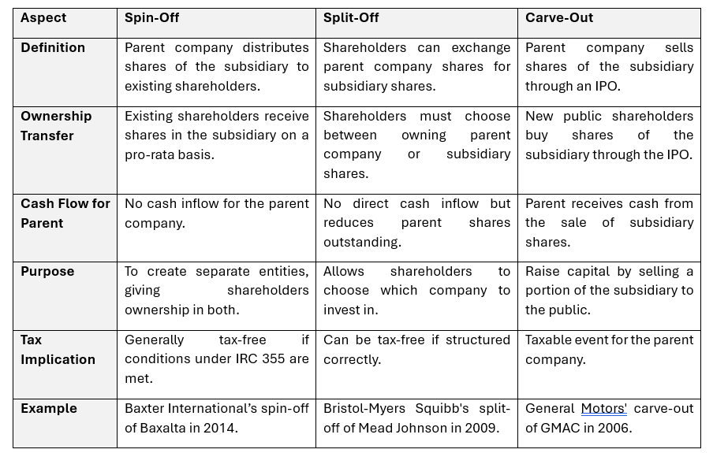

## Table of Contents

## What is a spin-off?

A spin-off is when a new show, movie, or product is made from an existing one. It uses characters, places, or ideas from the original to create something new. For example, a popular TV show might have a spin-off that focuses on a side character's adventures.

Spin-offs are common in TV shows and movies. They give fans more stories to enjoy and can help keep a franchise popular. Sometimes, spin-offs become very successful and even more popular than the original.

## What is a split-off?

A split-off is a kind of business move where a company separates one of its parts into a new, independent company. The original company gives its shareholders the chance to trade their shares in the original company for shares in the new company. This way, the shareholders can choose if they want to keep their shares in the original company or switch to the new one.

Split-offs can help a company focus better on its main business by getting rid of parts that don't fit well with the rest. It can also make the new company more valuable because it can grow on its own, without being held back by the original company. This can be good for both the original company and the new one, as well as for the shareholders who get to decide what they want to do with their investments.

## What is a carve-out?

A carve-out is when a big company takes a smaller part of its business and makes it into a separate company. This new company can then do its own thing, like getting money from investors or maybe even being sold to someone else. The big company keeps some control over the new company, often by owning most of its shares.

Carve-outs can help the big company focus better on what it does best, and the new company can grow faster because it's not held back by the bigger one. It's like letting a little plant grow on its own instead of staying in the shadow of a big tree. This can make both companies more valuable and can be good for the people who own shares in the big company.

## How does a spin-off differ from a split-off?

A spin-off and a split-off are two ways a company can separate a part of its business into a new company, but they work differently. In a spin-off, the parent company gives its shareholders shares in the new company for free, based on how many shares they already own in the parent company. This means shareholders automatically get shares in the new company without giving up any of their shares in the original company. The goal is to let the new company grow on its own while still being connected to the parent company.

In contrast, a split-off involves shareholders choosing to exchange their shares in the parent company for shares in the new company. This means shareholders have to decide if they want to keep their shares in the original company or trade them for shares in the new one. The main difference is the choice: with a spin-off, shareholders get new shares without giving anything up, but with a split-off, they have to give up their old shares to get new ones. Both methods help the parent company focus on its main business and can make the new company more valuable.

## What are the key differences between a carve-out and a spin-off?

A carve-out and a spin-off are ways a big company can separate a part of its business into a new company, but they work differently. In a carve-out, the big company keeps some control over the new company by owning most of its shares. The new company can get money from other investors or be sold, but it's still linked to the big company. The big company decides to do a carve-out to let the new company grow faster while still keeping some control.

In a spin-off, the big company gives its shareholders shares in the new company for free, based on how many shares they already own in the big company. The shareholders don't have to give up any of their old shares to get the new ones. The goal of a spin-off is to let the new company grow on its own, but it's not connected to the big company anymore. The main difference is that in a carve-out, the big company keeps control, while in a spin-off, the new company is completely separate.

## How does a split-off differ from a carve-out?

A split-off and a carve-out are ways a big company can separate a part of its business into a new company, but they work differently. In a split-off, the big company lets its shareholders trade their shares in the big company for shares in the new company. This means shareholders have to choose if they want to keep their shares in the big company or switch them for shares in the new one. The goal is to let the new company grow on its own, but shareholders have to decide what to do with their shares.

In a carve-out, the big company keeps some control over the new company by owning most of its shares. The new company can get money from other investors or be sold, but it's still linked to the big company. The big company decides to do a carve-out to let the new company grow faster while still keeping some control. The main difference is that in a split-off, shareholders make a choice and the new company is more separate, while in a carve-out, the big company keeps control and the new company stays connected.

## What are the financial implications of a spin-off for the parent company?

When a big company does a spin-off, it can help the company focus better on what it does best. By letting go of a part of the business that doesn't fit well, the big company can save money and use its resources more wisely. This can make the big company more valuable because it's not spending money on things that aren't helping it grow. Also, when the new company does well on its own, it can make the big company look good to investors, which might make its stock price go up.

On the other hand, doing a spin-off can cost the big company some money right away. It has to pay for things like setting up the new company and making sure it can work on its own. This can be expensive and might make the big company's profits go down for a while. But if the new company does well, it can be worth it in the end. The big company has to think carefully about these costs and benefits before deciding to do a spin-off.

## What are the tax considerations for a split-off?

When a company does a split-off, it's important to think about taxes. If the split-off is done the right way, it can be tax-free for both the company and the shareholders. This means the company doesn't have to pay taxes on the split-off, and the shareholders don't have to pay taxes when they trade their old shares for new ones. To make sure it's tax-free, the company has to follow certain rules set by the tax laws. These rules can be tricky, so the company usually needs to talk to tax experts to make sure everything is done right.

But if the split-off isn't done correctly, it can lead to big tax bills. If the company doesn't follow the tax rules, it might have to pay taxes on the value of the new company. And the shareholders might have to pay taxes on the value of the shares they get in the new company. This can make the split-off a lot more expensive and less appealing. So, it's really important for the company to plan carefully and get good advice to avoid any surprise tax costs.

## How does a carve-out affect the parent company's financial statements?

When a big company does a carve-out, it can change how its financial statements look. The big company still owns most of the new company's shares, so it has to show the new company's numbers in its own financial statements. This means the big company's balance sheet will still include the new company's assets and debts. The big company's income statement will also include the new company's earnings and costs, but they might be shown separately to make it clear how much the new company is adding to the big company's overall numbers.

Doing a carve-out can also lead to some one-time costs on the big company's financial statements. These costs can come from setting up the new company and getting it ready to work on its own. These expenses might make the big company's profits look smaller for a while. But if the new company does well and brings in money from other investors, it can help the big company's financial statements look better in the long run. The big company has to think carefully about these costs and benefits when deciding to do a carve-out.

## What strategic reasons might a company have for choosing a spin-off over a split-off or carve-out?

A company might choose a spin-off over a split-off or carve-out because it wants to completely separate a part of its business. By doing a spin-off, the company gives its shareholders free shares in the new company without them having to give up any of their old shares. This means the new company can grow on its own without any ties to the big company. The big company can then focus better on what it does best, which can make it more valuable. Also, if the new company does well, it can make the big company look good to investors, which might make its stock price go up.

Another reason a company might choose a spin-off is to avoid the costs and control that come with a carve-out or split-off. In a carve-out, the big company keeps control over the new company by owning most of its shares, which can be expensive and complicated. In a split-off, shareholders have to choose to trade their old shares for new ones, which can be risky if the new company doesn't do well. A spin-off is simpler and can be less costly because it doesn't involve these extra steps. The big company can let the new company go its own way, which can be good for both companies in the long run.

## How do shareholders' rights and ownership change in each of these corporate restructuring methods?

In a spin-off, shareholders get new shares in the new company for free, based on how many shares they already own in the big company. They don't have to give up any of their old shares. This means they own part of both the big company and the new company. The new company is completely separate, so shareholders can't vote on things for the new company through the big company anymore. They have to vote on things for the new company on their own.

In a split-off, shareholders have to choose if they want to trade their shares in the big company for shares in the new company. If they trade, they give up their old shares and get new ones. This means they stop owning part of the big company and start owning part of the new company instead. The new company is also separate, so shareholders can only vote on things for the new company if they traded their old shares for new ones.

In a carve-out, the big company keeps most of the shares in the new company, so it still has control. Shareholders don't get any new shares right away. But if the new company gets money from other investors or is sold, shareholders might get some of that money. The big company's shareholders can still vote on things for the big company, and they might be able to vote on things for the new company if they buy shares in it later.

## What are some real-world examples of successful spin-offs, split-offs, and carve-outs, and what were the outcomes?

A famous spin-off example is when eBay spun off PayPal in 2015. Before the spin-off, eBay owned PayPal and used it for payments on its site. But eBay thought PayPal could do better on its own. So, eBay gave its shareholders free shares in PayPal. After the spin-off, PayPal grew a lot and became very valuable. It made it easier for people to pay for things online, not just on eBay. This made both eBay and PayPal more successful.

A well-known split-off happened when Kraft Foods split off its snack business into Mondelez International in 2012. Shareholders could trade their Kraft shares for Mondelez shares. This let Kraft focus on its grocery business, while Mondelez could grow its snack business around the world. Both companies did well after the split-off. Mondelez became a big player in the snack market, and Kraft could focus on making its grocery products even better.

An example of a carve-out is when General Motors carved out its self-driving car unit, Cruise, in 2018. GM kept most of the shares in Cruise but let it get money from other investors too. This helped Cruise grow faster and work on new technology. GM still had control over Cruise, but the carve-out made it easier for Cruise to get the money it needed to develop self-driving cars. This was good for both GM and Cruise, as they could both focus on what they do best.

## References & Further Reading

[1]: ["Spin-off or Carve-out? How to Choose the Best Option"](https://fastercapital.com/content/Spin-off--Carveout-or-Spin-off--Which-Path-is-Right-for-Your-Business.html) Harvard Business Review, June 2019.

[2]: Schipper, K., & Smith, A. (1986). ["A Comparison of Equity Carve‐outs and Seasoned Equity Offerings: Share Price Effects and Corporate Restructuring"](https://www.sciencedirect.com/science/article/pii/0304405X8690053X). Journal of Financial Economics.

[3]: ["The Art of Spin-Offs: Why Companies are Breaking Up"](https://www.bloomberg.com/news/articles/2023-11-27/corporate-spinoffs-why-and-how-conglomerates-break-up) Forbes, June 2016.

[4]: Miller, M. H., & Modigliani, F. (1958). ["The Cost of Capital, Corporation Finance and the Theory of Investment"](https://www.aeaweb.org/aer/top20/48.3.261-297.pdf). The American Economic Review.

[5]: Kirchmaier, T. (2003). ["The Performance Effects of European Demergers"](https://papers.ssrn.com/sol3/papers.cfm?abstract_id=432000). Centre for Economic Performance, LSE.

[6]: ["Corporate Spin-offs and Carve-outs"](https://www.investopedia.com/articles/investing/090715/comparing-spinoffs-splitoffs-and-carveouts.asp) by Philip R. Force, University of Chicago Booth School of Business.

[7]: Hite, G. L., & Owers, J. E. (1983). ["Security Price Reactions Around Corporate Spin-off Announcements"](https://www.sciencedirect.com/science/article/pii/0304405X83900429). Journal of Financial Economics.