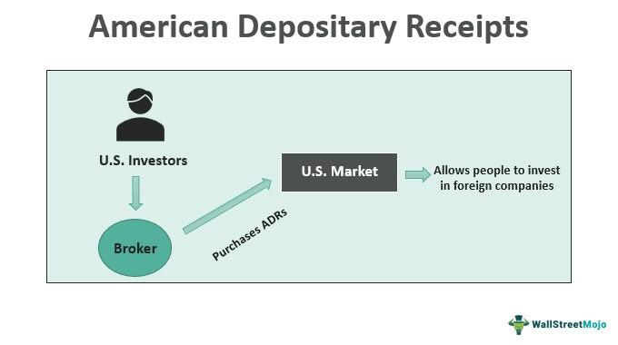

In the rapidly evolving financial markets, understanding the tools and mechanisms available to traders is crucial. As global finance becomes more interconnected, traders and investors need to navigate a complex array of financial instruments and technologies to optimize their strategies. Among the pivotal components in this landscape are American Depositary Receipts (ADRs) and American Depositary Shares (ADSs), which significantly facilitate international equity trading. ADRs enable investors in the United States to invest in foreign companies without dealing with foreign exchanges, while ADSs represent the underlying shares that ADRs convert into on the U.S. exchange.

Furthermore, with the rise of technology, algorithmic trading, commonly known as algo trading, has become an integral component of the financial market landscape. This technique involves using computer algorithms to execute trades at speeds and frequencies impossible for human traders. By utilizing predefined instructions based on variables such as time, price, and volume, algo trading enhances the efficiency and reduces transaction costs associated with trading.



This article aims to elucidate the differences and connections between ADRs, ADSs, and the dynamic role of algorithmic trading. By understanding these elements, traders and investors can gain a more comprehensive view of how they contribute to shaping modern trading environments. Through careful examination, we will explore how the integration of these components can influence liquidity, market access, and risk management in global trading, providing a platform for informed decision-making and strategic investment.

## Table of Contents

## Defining ADR and ADS

An American Depositary Receipt (ADR) is a financial instrument allowing U.S. investors to invest in foreign companies without dealing with the complexities of international trading. ADRs represent shares of a foreign company, but these are traded on American financial markets, specifically on major exchanges like the New York Stock Exchange (NYSE) and NASDAQ. The primary advantage for investors is the ability to purchase and sell these securities in U.S. dollars, simplifying transactions by avoiding foreign currency exchanges and the regulatory challenges of foreign markets.

The foundational component of ADRs is the American Depositary Share (ADS). ADSs are the actual shares held by a depositary bank that issues the ADR. When a foreign company decides to list its shares on a U.S. exchange, it typically works with a depositary bank to issue ADSs. Each ADR corresponds to a specific number of ADSs, which represent the underlying foreign shares. This relationship can be expressed in various ratios; for example, one ADR might represent one, several, or even a fraction of a foreign share, depending on the specific arrangement.

The issuance process begins when a foreign company deposits its shares with a depositary bank. In return, the bank issues ADRs, which are then made available for trading on U.S. markets. Thus, while ADRs trade similarly to domestic stocks, the underlying asset they represent is an ADS.

Key advantages of ADRs and ADSs include enhanced [liquidity](/wiki/liquidity-risk-premium) and accessibility to foreign equity markets. American investors gain exposure to foreign markets while enjoying the protection and regulation of U.S. financial laws. Moreover, the dividends paid by the foreign company are converted and distributed to ADR holders in U.S. dollars by the depositary bank, further simplifying earnings for investors.

Understanding ADRs and ADSs is essential for investors looking to diversify their portfolios internationally without directly dealing in foreign exchanges. The instruments not only bridge the gap between global markets but also offer investors a streamlined path to tap into global growth opportunities through their local market platforms.

## The Importance of ADR and ADS in Global Trading

ADRs (American Depositary Receipts) are pivotal in providing American investors with opportunities to invest in foreign companies without dealing with the complexities and costs associated with direct foreign market investments. By representing shares in foreign corporations, ADRs simplify the process by eliminating foreign transaction costs and the need for currency conversions. This feature makes ADRs and their underlying shares, American Depositary Shares (ADSs), a popular choice for investors seeking to diversify their portfolios internationally.

Diversification is a critical investment strategy, and ADRs offer a straightforward means to achieve this by providing access to international equity markets. They enable investors to broaden their investment base beyond domestic borders, capitalizing on growth opportunities in various countries and sectors. This diversification can potentially mitigate risks associated with domestic market [volatility](/wiki/volatility-trading-strategies), as global markets often do not move in tandem.

In the context of global trading, ADRs and ADSs are instrumental in enhancing market liquidity and accessibility. By being listed on U.S. exchanges, ADRs introduce a broader and more diverse pool of investors to foreign securities, thereby increasing the trading [volume](/wiki/volume-trading-strategy) and liquidity of these instruments. This integration into the U.S. equity market infrastructure allows for smoother trading processes and elevates the visibility of foreign companies among U.S. investors.

Moreover, ADRs and ADSs offer a significant advantage in managing foreign exchange risks. Investing in international stocks directly exposes investors to currency fluctuations. However, ADRs can be denominated in U.S. dollars, alleviating concerns about exchange rate volatility. This characteristic not only simplifies the investment process but also provides a level of financial stability and predictability for American investors.

The role of ADRs and ADSs in global trading extends to their impact on the globalization of financial markets. By facilitating cross-border investments, these instruments contribute to the interconnectedness of global capital markets. They lower the barriers for foreign companies seeking capital from U.S. investors and provide U.S. investors with a convenient mechanism to gain international exposure. This dynamic fosters a more integrated global financial environment, encouraging the flow of capital and promoting economic growth across countries.

In conclusion, ADRs and ADSs significantly impact the globalization of financial markets. They simplify foreign investments, enhance portfolio diversification, provide greater liquidity and market access, and mitigate foreign exchange risks. As financial markets continue to evolve, these instruments will likely remain essential in linking investors with global opportunities, reinforcing the interconnected nature of modern capital markets.

 to Algo Trading

Algorithmic trading, often abbreviated as algo trading, involves the execution of trading strategies through computer algorithms without human intervention. These algorithms are designed to perform trades based on a set of predetermined criteria, such as timing, price, and volume, ensuring that trading is conducted with precision and speed.

In this system, algorithms can process vast amounts of market data and execute trades at speeds and frequencies that are impossible for human traders. This is particularly beneficial as it allows market participants to capitalize on even the most fleeting market opportunities. For example, high-frequency trading ([HFT](/wiki/high-frequency-trading-strategies)), a subset of [algorithmic trading](/wiki/algorithmic-trading), exploits small price discrepancies occurring over fractions of a second.

The backbone of algo trading is its reliance on pre-programmed instructions that define trade execution parameters. These can be simple, triggering a buy or sell order when a stock reaches a particular price. Alternatively, they can be sophisticated, integrating advanced concepts such as moving averages, market trends, and complex statistical models.

The impact of algorithmic trading on financial markets is substantial. It enhances market liquidity and drastically reduces transaction costs. By minimizing human error and emotional bias, algo trading ensures that trades are executed optimally based on data-driven insights.

Moreover, modern algo trading strategies increasingly incorporate elements of [artificial intelligence](/wiki/ai-artificial-intelligence) (AI) and [machine learning](/wiki/machine-learning) (ML). These technologies enable the algorithms to not only follow predetermined rules but also adapt and optimize themselves based on new data. For instance, [reinforcement learning](/wiki/reinforcement-learning), a branch of machine learning, can be used to continuously improve trading strategies by learning from their performance over time.

In Python, a simple algorithmic trading script might look like this:

```python
import pandas as pd

# Load historical market data
data = pd.read_csv('stock_data.csv')

# Define a simple moving average strategy
short_window = 40
long_window = 100

# Calculate moving averages
data['Short_MA'] = data['Close'].rolling(window=short_window, min_periods=1).mean()
data['Long_MA'] = data['Close'].rolling(window=long_window, min_periods=1).mean()

# Generate signal for buy or sell
data['Signal'] = 0
data['Signal'][short_window:] = np.where(data['Short_MA'][short_window:] > data['Long_MA'][short_window:], 1, 0)

# Positions
data['Position'] = data['Signal'].diff()

# Trading signals: Buy when short MA crosses above long MA; Sell otherwise
buy_signals = data[data['Position'] == 1]
sell_signals = data[data['Position'] == -1]

print("Buy Signals:\n", buy_signals[['Date', 'Close']])
print("Sell Signals:\n", sell_signals[['Date', 'Close']])
```

This sample Python script reads historical stock data, calculates two moving averages, and generates trading signals when one average crosses over the other. Although simplistic, this example demonstrates the algorithmic approach to executing trades based on quantitative analysis. 

As algorithmic trading continues to evolve with advancements in computational power and data analytics, its influence on the global trading landscape is poised to grow. It offers the promise of not only executing trades with unmatched efficiency but also uncovering nuanced insights that drive more informed investment decisions.

## Combining ADR, ADS and Algorithmic Trading

The integration of American Depositary Receipts (ADRs) and American Depositary Shares (ADSs) with algorithmic trading platforms significantly enhances international trading operations. Algorithmic trading, which utilizes computer algorithms to execute trades at high speed and accuracy, can substantially improve the liquidity and efficiency of trading ADRs and ADSs on international markets. Through automation, trading of ADRs and ADSs, which represent equity interests in foreign companies, becomes more streamlined and responsive to market dynamics.

Algorithmic trading systems excel at identifying [arbitrage](/wiki/arbitrage) opportunities, situations where price discrepancies between markets can be exploited for profit. Such opportunities may arise when ADRs are traded on U.S. exchanges while their underlying ADSs are being traded in foreign markets. Automated systems can swiftly execute trades to capitalize on these discrepancies, considering the continuously changing foreign exchange rates and market conditions. This capability allows traders to achieve more competitive pricing and mitigate the risks associated with currency exchange fluctuations.

Additionally, algorithmic trading strategies are adept at optimizing trades by analyzing vast and complex datasets that could otherwise be overwhelming for human traders. These strategies employ advanced statistical models and machine learning techniques to detect trading patterns and predict market movements. For instance, machine learning algorithms can study historical data of ADR and ADS prices, volume, and other indicators to develop predictive signals that guide trading decisions.

In high-frequency trading (HFT) contexts, algorithmic strategies might involve thousands of transactions executed within milliseconds, leveraging the speed of computation to outperform traditional trading methods. As such, traders using these systems can take advantage of increased market efficiency and reduced transaction costs, which are particularly beneficial given the large volumes associated with ADRs and ADSs.

Combining ADRs, ADSs, and algorithmic trading fosters a sophisticated trading ecosystem where global financial markets become more interconnected. The automated systems enhance market transparency, allowing traders to react promptly to market changes, optimize their portfolios across different time zones, and ultimately achieve better returns on their investments. By harnessing these technologies, traders can navigate the complexities of international equities with greater precision and confidence.

## Challenges and Considerations

Algorithmic trading has significantly transformed the financial markets by offering numerous advantages, including increased efficiency and reduced transaction costs. However, it also introduces challenges that require careful consideration by investors and market participants.

One prominent challenge is the potential for increased market volatility. Algorithmic trading systems, especially those employing high-frequency strategies, can execute large volumes of trades in fractions of a second. This rapid execution can lead to sudden market shifts, especially if multiple algorithms respond to the same market signals simultaneously. The infamous "Flash Crash" of May 6, 2010, is a historical example where algorithmic trading contributed to a dramatic and rapid market plunge, highlighting the susceptibility to extreme volatility.[^1]

Technical risks are inherent in algorithmic trading systems. These include potential software bugs, system outages, and network failures. Algorithms rely on real-time data and continuous connectivity to function effectively. Any disruption in data feeds or connectivity may lead to erroneous trades or missed opportunities, impacting financial performance. Additionally, the complexity of algorithms, particularly those utilizing machine learning or artificial intelligence, can make them difficult to monitor and debug.

Regulatory concerns are paramount in algorithmic trading due to the potential for market manipulation. Regulators worldwide have recognized the need for stringent oversight to ensure fair trading practices. Issues such as spoofing—where deceptive orders are placed to influence stock prices—highlight the need for robust regulatory frameworks. In the United States, the Securities and Exchange Commission (SEC) and Commodity Futures Trading Commission (CFTC) have implemented measures to mitigate these risks, requiring detailed audit trails and imposing penalties for manipulative practices.[^2]

For those trading ADRs and ADSs, understanding their nuances is essential in effectively using them within algorithmic strategies. ADRs and ADSs represent foreign equities, and their trading can be influenced by various factors, including exchange rates, foreign market conditions, and geopolitical events. These instruments offer diversification benefits but also require a nuanced approach to manage associated risks effectively. Implementing algorithmic trading strategies in this context necessitates comprehensive market data analysis and risk management protocols to leverage the advantages of ADRs and ADSs without falling prey to their complexities.

To address these challenges, traders and investors can employ various strategies. Robust risk management frameworks and continuous monitoring of algorithmic systems are crucial in mitigating technical risks. Backtesting algorithms extensively under various market conditions can help identify potential pitfalls and optimize performance. Collaboration with regulators to maintain compliance and ensure transparency in trading activities is also essential. By understanding these challenges and implementing effective strategies, market participants can harness the benefits of algorithmic trading while minimizing associated risks.

---

[^1]: Kirilenko, A. A., Kyle, A. S., Samadi, M., & Tuzun, T. (2017). The Flash Crash: High‐Frequency Trading in an Electronic Market. *The Journal of Finance*, 72(3), 967-998.
[^2]: Securities and Exchange Commission (SEC). (2018). SEC Brings First Charges in Its New Initiative to Combat Market Manipulation Scheme. https://www.sec.gov/news/press-release/2018-74

## Conclusion

The financial markets continue to grow more interconnected, with instruments such as ADRs (American Depositary Receipts) and ADSs (American Depositary Shares) playing pivotal roles alongside the advancements in algorithmic trading techniques. Understanding the distinct functionalities of ADRs and ADSs enables investors to effectively engage in international equities without the complexities and costs associated with foreign transactions. These instruments facilitate greater market access and diversification, which are essential components of a robust investment strategy.

Algorithmic trading, with its data-driven approach, has transformed the trading landscape by enhancing efficiency and reducing transaction costs. Through algorithms, traders can harness vast amounts of data to make informed decisions, often executing trades at speeds impossible for human traders. This capability allows for the identification and exploitation of arbitrage opportunities, further enhancing portfolio returns. Additionally, algorithmic trading can optimize the execution of trades involving ADRs and ADSs by managing the intricacies of market movements and foreign exchange risks.

Incorporating knowledge of ADRs, ADSs, and the mechanics of algorithmic trading is crucial for investors aiming to navigate the complexities of the global market. This article emphasizes the significance of these tools, their interactions, and their potential to shape future trading environments. By staying informed about such mechanisms, traders can devise strategies that maximize returns while effectively managing associated risks. We strongly encourage both new and seasoned investors to integrate these considerations into their trading strategies to capitalize on the dynamic opportunities present in today's financial markets.

## References & Further Reading

[1]: Kirilenko, A. A., Kyle, A. S., Samadi, M., & Tuzun, T. (2017). ["The Flash Crash: High‐Frequency Trading in an Electronic Market."](https://onlinelibrary.wiley.com/doi/abs/10.1111/jofi.12498) The Journal of Finance, 72(3), 967-998.

[2]: Securities and Exchange Commission (SEC). (2018). ["SEC Brings First Charges in Its New Initiative to Combat Market Manipulation Scheme."](https://onlinelibrary.wiley.com/doi/pdf/10.1111/1475-679X.12585)

[3]: ["Advances in Financial Machine Learning"](https://www.amazon.com/Advances-Financial-Machine-Learning-Marcos/dp/1119482089) by Marcos Lopez de Prado

[4]: ["Evidence-Based Technical Analysis: Applying the Scientific Method and Statistical Inference to Trading Signals"](https://www.amazon.com/Evidence-Based-Technical-Analysis-Scientific-Statistical/dp/0470008741) by David Aronson

[5]: ["Machine Learning for Algorithmic Trading: Predictive Models to Extract Signals from Market and Alternative Data for Systematic Trading Strategies with Python, 2nd Edition"](https://www.amazon.com/Machine-Learning-Algorithmic-Trading-alternative/dp/1839217715) by Stefan Jansen

[6]: ["Quantitative Trading: How to Build Your Own Algorithmic Trading Business"](https://github.com/LucindaYa/quant-resources/blob/master/Quantitative%20Trading%20How%20to%20Build%20Your%20Own%20Algorithmic%20Trading%20Business.pdf) by Ernest P. Chan