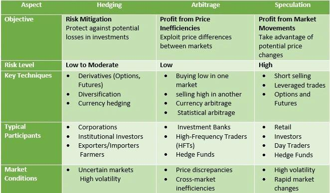

## Table of Contents

## What is arbitrage?

Arbitrage is a way to make money by buying something in one place where it's cheaper and selling it in another place where it's more expensive. People who do this are called arbitrageurs. They look for differences in prices of the same thing in different markets. For example, if a toy costs $10 in one store and $15 in another, an arbitrageur can buy the toy for $10 and sell it for $15, making a profit of $5.

Arbitrage can happen in many different markets, not just with physical items. It can also happen with stocks, currencies, and even cryptocurrencies. The idea is always the same: find a price difference and use it to make money. But arbitrage can be risky because prices can change quickly, and sometimes the costs of buying and selling can eat into the profit. Still, many people and companies use arbitrage as a way to earn money.

## What is hedging?

Hedging is like buying insurance for your investments. It's a way to protect yourself from losing money if things don't go the way you expect. Imagine you own a farm and you're worried that the price of your crops might go down before you can sell them. You can use hedging to make sure you still get a good price, even if the market changes. You do this by making another deal that will pay you if the price of your crops falls.

People use hedging in many different markets, like stocks, currencies, and commodities. For example, if you own a lot of stock in a company and you're worried the stock price might go down, you can hedge by buying something called a "put option." This gives you the right to sell your stock at a certain price, even if the market price drops lower. Hedging can be a smart way to manage risk, but it can also be complicated and sometimes expensive, so it's important to understand it well before you start using it.

## How do arbitrage and hedging differ in their basic objectives?

Arbitrage and hedging have different main goals. Arbitrage is all about making money by taking advantage of price differences in different markets. Imagine you find a toy that costs less in one store than in another. You buy it cheap and sell it for more somewhere else. That's [arbitrage](/wiki/arbitrage). The goal is to make a profit from these price differences, and it usually involves quick buying and selling.

Hedging, on the other hand, is about protecting your money from risk. It's like buying insurance for your investments. If you own something and you're worried its value might go down, you can use hedging to make sure you don't lose too much money. For example, if you own a farm and you're worried the price of your crops might fall, you can make another deal that will pay you if the price does drop. The main goal of hedging is to reduce risk, not to make a profit, though sometimes it can do that too.

## Can you explain arbitrage with a simple example?

Imagine you find out that a popular toy is being sold for $10 at Store A, but the same toy is being sold for $15 at Store B. You decide to buy the toy at Store A for $10. Then, you go to Store B and sell the toy for $15. By doing this, you make a profit of $5 per toy. This is an example of arbitrage. You are taking advantage of the difference in prices between the two stores to make money.

Arbitrage isn't just for toys; it can be used with many things like stocks or currencies. For example, if you see that a stock is cheaper on one stock exchange than another, you can buy it at the lower price and sell it at the higher price. The key to arbitrage is finding these price differences and acting quickly before they disappear. It's a way to make money without taking a lot of risk, as long as you can buy and sell fast enough.

## Can you provide a basic example of hedging?

Imagine you own a farm and you grow wheat. You're worried that the price of wheat might go down before you can sell your crop. To protect yourself, you decide to use hedging. You make a deal with someone else where they agree to buy your wheat at a set price, no matter what happens to the market price. This way, if the price of wheat falls, you're still guaranteed to get the set price for your wheat. That's hedging – it's like buying insurance to protect against a drop in prices.

For example, let's say the current price of wheat is $5 per bushel, but you're worried it might drop to $4. You find someone who agrees to buy your wheat at $5 per bushel in the future. If the price does drop to $4, you still get $5 because of your deal. But if the price goes up to $6, you'll only get $5 from your deal, and you might miss out on the extra money. Hedging helps you avoid big losses, but it can also mean you don't get to enjoy big gains if prices go up.

## What are the key financial instruments used in arbitrage?

Arbitrage involves using different financial instruments to take advantage of price differences. One common instrument is stocks. If the same stock is trading at different prices on different stock exchanges, an arbitrageur can buy the stock where it's cheaper and sell it where it's more expensive. Another popular instrument is currencies. For example, if the exchange rate between the US dollar and the Euro is different in New York and London, someone can buy dollars in New York and sell them in London to make a profit.

Another key instrument used in arbitrage is bonds. If a bond is selling for less in one market than another, arbitrageurs can buy the bond at the lower price and sell it at the higher price. Futures and options are also used in arbitrage. Futures are agreements to buy or sell something at a future date, and options give the right to buy or sell at a set price. If the prices of these futures or options are different in different markets, arbitrageurs can make money by buying low and selling high. These instruments help arbitrageurs find and exploit price differences to make a profit.

## What types of financial instruments are commonly used for hedging?

Hedging often uses different financial instruments to help people protect their money from risk. One common instrument is futures contracts. These are agreements to buy or sell something at a set price on a future date. For example, if you're a farmer worried about the price of your crops falling, you can use a futures contract to lock in a good price now, even if the market price drops later. Another instrument used for hedging is options. Options give you the right, but not the obligation, to buy or sell something at a certain price. If you own stock and you're worried the price might go down, you can buy a put option to sell your stock at a set price, protecting you from a big loss.

Other instruments used for hedging include swaps and forwards. Swaps are agreements to exchange cash flows or other financial instruments. For example, you might use an [interest rate](/wiki/interest-rate-trading-strategies) swap to protect against changes in interest rates. Forwards are similar to futures but are customized agreements between two parties. They can be used to hedge against price changes in currencies, commodities, or other assets. These instruments help people and businesses manage risk by providing a way to protect against unexpected changes in prices or rates.

## How does risk management differ between arbitrage and hedging?

Arbitrage and hedging have different ways of managing risk. In arbitrage, the goal is to make money by buying something cheap and selling it for more. The risk here is mostly about timing and costs. If prices change too quickly, or if it costs too much to buy and sell, you might not make any money. But if you can act fast and keep costs low, arbitrage can be a way to make money without taking a lot of risk. It's like finding a bargain and selling it for a profit, but you have to be quick.

Hedging, on the other hand, is all about protecting your money from risk. It's like buying insurance for your investments. If you're worried about losing money because prices might go down, you can use hedging to make sure you don't lose too much. The main risk in hedging is that it can be complicated and sometimes expensive. You might pay for protection and then not need it if prices go up instead of down. But if prices do fall, hedging can save you from big losses. It's a way to play it safe, even if it means missing out on big gains.

## What are the potential profits and losses associated with arbitrage?

Arbitrage is all about making money by finding things that are cheaper in one place and selling them for more in another place. If you're good at it and can act quickly, you can make a nice profit. For example, if you buy a toy for $10 and sell it for $15, you make $5. The profit comes from the difference in prices, and the more you can do this, the more money you can make. The key is to find these price differences and act before they go away.

But arbitrage also comes with some risks. One big risk is that prices can change fast. If you buy something and the price drops before you can sell it, you might lose money instead of making a profit. Another risk is the cost of buying and selling. If it costs you a lot to move the toy from one store to another, or if there are fees for buying and selling stocks, these costs can eat into your profit. So, while arbitrage can be a way to make money with less risk than other investments, you still need to be careful and quick to make sure you come out ahead.

## How do the potential profits and losses of hedging compare to arbitrage?

Hedging is different from arbitrage when it comes to making money and losing it. With hedging, the main goal is not to make a big profit, but to protect what you already have. For example, if you're a farmer and you use hedging to lock in a good price for your crops, you might not make extra money if prices go up, but you won't lose a lot if prices go down. The profit from hedging is usually small, and it's more about avoiding big losses. The downside is that hedging can be expensive, like paying for insurance, and if the thing you're worried about doesn't happen, you might end up spending money for nothing.

Arbitrage, on the other hand, is all about making money by finding things that are cheaper in one place and selling them for more in another place. If you can find these price differences and act quickly, you can make a nice profit. For example, if you buy a toy for $10 and sell it for $15, you make $5. The profit comes from the difference in prices. But arbitrage also has risks. If prices change fast, or if it costs a lot to buy and sell, you might not make any money or even lose some. So while arbitrage can be a way to make money with less risk than other investments, you still need to be careful and quick.

## What are the advanced strategies involved in arbitrage?

Advanced arbitrage strategies go beyond just buying low and selling high. One common strategy is called [statistical arbitrage](/wiki/statistical-arbitrage), where traders use math and computer programs to find small price differences in stocks or other things. They look at lots of data to find patterns and then make many trades at once to make a little bit of money from each one. It's like finding tiny bargains all over the place and adding them up to make a bigger profit. This strategy needs a lot of computer power and quick trading, so it's often used by big companies with lots of resources.

Another advanced strategy is called triangular arbitrage, which is often used in the currency markets. Imagine you have three different currencies, like the US dollar, the Euro, and the British pound. If the exchange rates between these currencies don't line up perfectly, you can make money by trading them in a circle. For example, you might turn dollars into Euros, then Euros into pounds, and then pounds back into dollars, making a small profit each time. This strategy requires fast trading and careful watching of exchange rates, but it can be a way to make money from small differences in the market.

## How can advanced hedging techniques be applied in complex financial scenarios?

Advanced hedging techniques can be really helpful in complex financial situations. One way to do this is by using options strategies like straddles and strangles. Imagine you own a company that makes a lot of money from oil prices. If you're worried that oil prices might go crazy up or down, you can use a straddle. This means you buy both a call option, which lets you buy oil at a set price if it goes up, and a put option, which lets you sell oil at a set price if it goes down. This way, no matter which way the price moves, you're protected. It's like having insurance for both good and bad times.

Another advanced hedging technique is dynamic hedging, which is often used by big investors and companies. Dynamic hedging means you keep changing your hedges as the market changes. For example, if you own a lot of stocks and you're worried about the market going down, you might start by buying some put options. But if the market starts to drop, you might buy more put options or sell some of your stocks to protect yourself even more. It's like constantly adjusting your insurance policy to make sure you're always covered, no matter what happens. This can be tricky and needs a lot of watching and quick decisions, but it can help a lot in really unpredictable markets.

## References & Further Reading

[1]: ["Advances in Financial Machine Learning"](https://www.amazon.com/Advances-Financial-Machine-Learning-Marcos/dp/1119482089) by Marcos Lopez de Prado

[2]: ["Evidence-Based Technical Analysis: Applying the Scientific Method and Statistical Inference to Trading Signals"](https://www.amazon.com/Evidence-Based-Technical-Analysis-Scientific-Statistical/dp/0470008741) by David Aronson

[3]: ["Machine Learning for Algorithmic Trading"](https://github.com/stefan-jansen/machine-learning-for-trading) by Stefan Jansen

[4]: ["Quantitative Trading: How to Build Your Own Algorithmic Trading Business"](https://www.amazon.com/Quantitative-Trading-Build-Algorithmic-Business/dp/1119800064) by Ernest P. Chan

[5]: Pojarliev, M., & Levich, R. M. (2010). ["Are All Currency Managers Equal?"](https://www.academia.edu/118349936/Are_All_Currency_Managers_Equal) The Journal of Portfolio Management, 35(4), 55-63.  

[6]: Avellaneda, M., & Lee, J. H. (2010). ["Statistical Arbitrage in the U.S. Equities Market"](https://papers.ssrn.com/sol3/papers.cfm?abstract_id=1153505) Quantitative Finance, 10(5), 559-574. 

[7]: Aldridge, I. (2010). ["High-Frequency Trading: A Practical Guide to Algorithmic Strategies and Trading Systems."](https://www.ahmetbeyefendi.com/wp-content/uploads/2020/07/High-Frequency-Trading-Irene-Aldridge.pdf)Wiley.