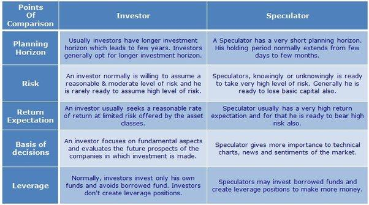

In the ever-evolving world of finance, arbitrage, speculation, and algorithmic trading represent key strategies for investors looking to maximize their returns. Arbitrage involves capitalizing on price discrepancies across different markets, offering opportunities for profit with limited risk. This strategy is notably used when prices of identical or similar financial instruments differ across markets, which can be exploited for profit until the prices converge. Speculation, on the other hand, is a high-risk strategy based on predictions and assumptions about future market movements. It involves purchasing or selling assets with the expectation of significant price changes, and is driven more by market sentiment and volatility than by the inherent value of an asset.

Algorithmic trading harnesses the power of technology to execute trades with precision and speed, often utilizing both arbitrage and speculation strategies. By employing sophisticated algorithms and data analysis, this method can manage large volumes of trades, identify patterns, and execute transactions with minimal human intervention. This efficiency and speed can give traders a competitive edge in financial markets where timing and precise movements are crucial.



This article explores how these three strategies intersect and the roles they play in the financial markets. By understanding the unique characteristics and interplay of arbitrage, speculation, and algorithmic trading, investors can better navigate the complexities of modern finance and potentially optimize their investment strategies.

## Table of Contents

## Understanding Arbitrage

Arbitrage is a financial strategy that exploits price discrepancies of the same asset across different markets to achieve profit with minimal risk. This concept hinges on the fundamental notion that if the same asset is priced differently in separate markets, then there exists an opportunity to buy low in one market and sell high in another, thereby locking in a risk-free profit. 

Primarily utilized by large institutional investors, arbitrage requires significant capital and sophisticated systems to identify and act upon fleeting opportunities. Institutional investors, endowed with the necessary resources, are well-positioned to leverage these opportunities because they can invest substantial sums and capitalize on smaller price discrepancies that might be insignificant to individual investors.

There are several key methods of arbitrage employed in financial markets:

1. **Spatial Arbitrage** involves purchasing and selling the same asset in different physical or geographical markets where the price of the asset differs due to factors like transportation costs, tariffs, or legal disparities. For instance, if a stock is traded on both the New York Stock Exchange (NYSE) and the London Stock Exchange (LSE) at different prices, arbitrageurs could buy the stock on the cheaper exchange and sell on the more expensive one, assuming that transaction costs and currency exchange risks are accounted for and favorable.

2. **Statistical Arbitrage** utilizes quantitative techniques and historical data to detect deviations from expected statistical patterns in the pricing of securities. This method often involves pairs trading, where two historically correlated stocks are traded simultaneously: the overvalued stock is shorted, while the undervalued one is bought, betting on the eventual reversion to the mean of their price relationship.

3. **Merger Arbitrage** is a strategy employed when a company announces a merger or acquisition. Typically, the stock price of the target company rises as the expected value of the merger is reflected in its stock price. Arbitrageurs purchase stock in the target company and simultaneously short the stock of the acquiring company if they believe that the acquisition will proceed as planned, profiting from the spread between the trading price and the acquisition price.

The advancement of technology has been pivotal in transforming [arbitrage](/wiki/arbitrage) strategies. Computing power and sophisticated algorithms have significantly increased the speed and frequency with which these price discrepancies are identified and exploited. Algorithms can monitor multiple markets simultaneously and execute trades rapidly, often in milliseconds, well before human traders can react.

For instance, a simple Python script utilizing libraries such as `pandas` for data handling and `numpy` for numerical calculations, paired with APIs to gather real-time market data, can be employed to identify and exploit arbitrage opportunities systematically. Such applications require precise tuning and continuous monitoring to capitalize on minimal price differences while ensuring that transaction costs do not exceed the potential gains.

Overall, arbitrage remains a cornerstone strategy in finance, facilitating market efficiency by aligning asset prices across markets. Nevertheless, the complexity and competitive nature of modern financial systems demand a high level of expertise and technological capability to successfully implement arbitrage strategies.

## Exploring Speculation

Speculation involves the buying and selling of assets based on predictions concerning their future prices, carrying a significant level of risk. This strategy is rooted in the anticipation of market movements and, consequently, can result in high rewards or notable losses. Speculators are essential participants in financial markets as they provide [liquidity](/wiki/liquidity-risk-premium), which facilitates the smooth buying and selling of assets. By actively engaging in trades, speculators help to reflect the collective assessment of asset prices, thereby contributing to price discovery.

While arbitrage opportunities often require substantial capital to exploit small price discrepancies profitably, speculation can be carried out with a relatively small initial investment. This accessibility makes it a popular choice among individual investors who are willing to accept higher risks for potentially higher returns. Speculation spans various asset classes, including stocks, commodities, and currencies, making it a versatile strategy adaptable to diverse market environments.

In stock markets, for example, speculators might buy shares in anticipation of future price increases or short sell if they predict a decline. In commodities markets, such as those for oil, gold, or agricultural products, the ability to predict supply and demand dynamics can offer speculative profit opportunities. In currency markets, speculation might involve betting against currency appreciation or depreciation, taking into account factors like interest rates and geopolitical events.

Speculation operates under the premise that markets are sometimes inefficient and that security prices do not always reflect their true value. By forecasting future events and acting on these insights, speculators provide the market with vital information. This activity leads to a more efficient allocation of resources, as it encourages the movement of capital into sectors poised for growth or transformation. However, speculation also introduces risks, including the potential for market [volatility](/wiki/volatility-trading-strategies) and systemic risk if speculative bubbles occur. These risks necessitate careful analysis and robust risk management strategies by investors.

## The Role of Algorithmic Trading

Algorithmic trading involves the use of computer programs and algorithms to execute trades based on pre-defined criteria with remarkable speed and precision. This innovative approach to trading capitalizes on the computational power of modern technology to process vast volumes of data and make split-second trading decisions that would be impossible for human traders to replicate.

The primary advantage of [algorithmic trading](/wiki/algorithmic-trading) lies in its ability to capture fleeting arbitrage opportunities and improve the execution of speculative trades. By analyzing price discrepancies across different markets or assets, these algorithms can quickly identify and exploit chances to buy low and sell high, often before such opportunities are corrected by the market. The specific programming behind these trades allows for the seamless integration of multiple data sources and trading strategies, which can enhance profitability and reduce risk.

One key facet of algorithmic trading is its capability to analyze large volumes of data to recognize patterns and correlations. For instance, using statistical models and [machine learning](/wiki/machine-learning) techniques, algorithms can discern price movement patterns and other market dynamics that human traders may overlook. This analytical edge is particularly beneficial in volatile or highly liquid markets, where rapid decisions are crucial.

High-frequency trading ([HFT](/wiki/high-frequency-trading-strategies)) is a prominent subset of algorithmic trading. HFT employs algorithms to execute a high [volume](/wiki/volume-trading-strategy) of trades in extremely short timeframes, often measured in microseconds. This strategy takes advantage of minimal price differences and seeks to earn small profits on each trade, which can accumulate substantially over many transactions. The rise of HFT has significantly impacted financial markets, contributing to increased liquidity and narrower bid-ask spreads, yet it also raises concerns about market stability and fairness.

In sum, algorithmic trading is a profound evolution in trading practices, leveraging technology to execute complex trading strategies more efficiently and effectively than ever before. Despite its benefits, the intricacies of algorithmic trading demand robust risk management and regulatory consideration to mitigate potential pitfalls and maximize its positive impact on financial markets.

## Arbitrage vs. Speculation in Algorithmic Trading

Algorithmic trading embodies the synthesis of arbitrage and speculation strategies, aiming to leverage the strengths of each approach for optimal financial returns. Through the use of sophisticated algorithms, traders can efficiently identify and capitalize on fleeting market inefficiencies and price differences, a hallmark of arbitrage. These strategies depend on the algorithm's ability to execute trades at high speeds, ensuring that any arbitrage opportunities are captured before market corrections occur. 

For instance, consider a scenario where a stock is listed on two different exchanges with a minor price discrepancy. An algorithmic trader could buy the stock on the lower-priced exchange and simultaneously sell it on the higher-priced exchange, profiting from the price differential. The margin for profit, however small, can be substantial when executed at a [high frequency](/wiki/high-frequency-trading).

On the speculative side, these algorithms utilize complex mathematical models and machine learning techniques to anticipate future market trends and price movements. The efficacy of speculative algorithms lies in their ability to process vast amounts of data, identifying patterns that human traders might overlook. Such predictive models might include time-series analysis, regression models, or even neural networks that assess historical data to forecast future prices.

Python, with its extensive libraries such as NumPy for numerical computations and Pandas for data manipulation, allows the development of these speculative algorithms with flexibility and precision:

```python
import numpy as np
import pandas as pd
from sklearn.linear_model import LinearRegression

# Simulate historical price data
date_range = pd.date_range(start='1/1/2022', periods=100, freq='D')
price_data = np.random.rand(100) * 10 + 100  # random prices around 100
data = pd.DataFrame({'Date': date_range, 'Price': price_data})

# Convert dates to ordinal form for regression model
data['Date_Ordinal'] = pd.to_datetime(data['Date']).map(lambda date: date.toordinal())

# Fit a linear regression model to predict future prices
X = data['Date_Ordinal'].values.reshape(-1, 1)
y = data['Price'].values
model = LinearRegression().fit(X, y)

# Predict price for a future date
future_date = pd.Timestamp('2022-04-15').toordinal()
predicted_price = model.predict(np.array([[future_date]]))[0]

print(f"Predicted Price on 2022-04-15: {predicted_price}")
```

Integrating both arbitrage and speculation within algorithmic trading not only enhances risk management but also promotes efficient capital utilization. This dual strategy approach allows for a balanced trade-off between the low-risk, steady returns from arbitrage and the higher risk, potentially higher rewards from speculation. By distributing risk across various strategies and asset classes, traders can achieve more stable financial performance in varying market conditions.

## Benefits and Risks of Algorithmic Trading in Finance

Algorithmic trading, a cornerstone of modern financial markets, leverages technology to execute trades with unmatched speed and precision. This technological advantage offers significant benefits and entails certain risks that must be carefully managed.

One of the primary benefits of algorithmic trading is its contribution to market efficiency. By narrowing bid-ask spreads, algorithms help ensure that prices more accurately reflect available market information. This narrowing occurs because algorithms can quickly respond to new data, adjusting prices faster than human traders. For instance, algorithms can instantly execute arbitrage strategies, removing discrepancies in asset prices across different markets and contributing to price convergence.

Furthermore, algorithmic trading provides traders with increased speed and precision, substantially reducing transaction costs and minimizing the potential for human error. Algorithmic systems can process vast amounts of market data in real-time, identifying and capitalizing on trading opportunities that may be invisible to human traders. This capability enables traders to execute a high volume of transactions efficiently, maximizing profits while maintaining low costs.

However, algorithmic trading also introduces specific risks, primarily due to the complexity of the algorithms used. Model risk is inherent in these systems, as faulty algorithms can lead to significant trading errors and financial losses. This risk necessitates vigilant monitoring and continuous updating of algorithms to ensure their effectiveness and reliability. Furthermore, algorithms must be robust against unexpected market conditions to prevent large-scale disruptions, such as those witnessed during flash crashes.

Regulatory oversight and ethical considerations are crucial to managing the risks associated with algorithmic trading. Concerns often arise regarding market manipulation and the equitable access to trading opportunities. High-frequency trading firms, in particular, may engage in practices that disadvantage other market participants, such as frontrunning or spoofing. Therefore, regulators must establish and enforce rules that promote transparent and fair trading practices, ensuring that all participants have a level playing field.

In conclusion, while algorithmic trading enhances market efficiency and provides significant operational advantages, it also presents challenges that require careful management. By balancing these benefits and risks, the financial industry can harness the full potential of algorithmic trading to foster more resilient and equitable markets.

## Conclusion

Arbitrage, speculation, and algorithmic trading form critical pillars of modern finance, each playing a vital role in shaping market dynamics and enhancing efficiency. Arbitrage is a strategy that focuses on exploiting low-risk opportunities by capitalizing on price discrepancies across different markets. It provides investors the chance to gain profits without substantial exposure to market volatility. This contrasts with speculation, which inherently involves higher risks due to its reliance on forecasts and assumptions regarding future market movements. The potential for significant rewards acts as the main attraction for speculators, who are essential in providing liquidity and contributing to price discovery in financial markets.

Algorithmic trading stands at the intersection of arbitrage and speculation, leveraging technological advancements to trade assets with unmatched speed and accuracy. By employing sophisticated algorithms, traders can swiftly navigate markets, identifying and capitalizing on fleeting opportunities that might be invisible to human traders. These algorithms can incorporate both arbitrage and speculative techniques, allowing for diversified risk management and optimal capital deployment.

As the financial landscape continues to evolve, these strategies are set to adapt alongside technological progress, fostering innovation and heightening competition within global markets. The continuous integration of cutting-edge technologies promises to refine these trading methods, ensuring their relevance and effectiveness in the ever-shifting world of finance.

## References & Further Reading

[1]: Bergstra, J., Bardenet, R., Bengio, Y., & Kégl, B. (2011). ["Algorithms for Hyper-Parameter Optimization."](https://dl.acm.org/doi/10.5555/2986459.2986743) Advances in Neural Information Processing Systems 24.

[2]: ["Advances in Financial Machine Learning"](https://www.amazon.com/Advances-Financial-Machine-Learning-Marcos/dp/1119482089) by Marcos Lopez de Prado

[3]: ["Evidence-Based Technical Analysis: Applying the Scientific Method and Statistical Inference to Trading Signals"](https://www.amazon.com/Evidence-Based-Technical-Analysis-Scientific-Statistical/dp/0470008741) by David Aronson

[4]: ["Machine Learning for Algorithmic Trading"](https://github.com/stefan-jansen/machine-learning-for-trading) by Stefan Jansen

[5]: ["Quantitative Trading: How to Build Your Own Algorithmic Trading Business"](https://www.amazon.com/Quantitative-Trading-Build-Algorithmic-Business/dp/1119800064) by Ernest P. Chan