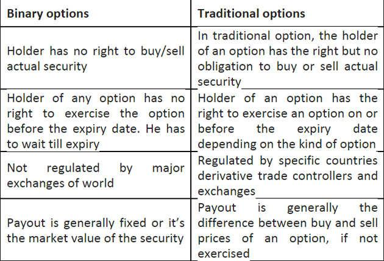

## Table of Contents

## What are binary options?

Binary options are a type of financial trading where you predict if the price of something, like a stock or currency, will go up or down in a certain time. If you guess right, you get a fixed amount of money. If you guess wrong, you lose the money you bet. It's called "binary" because there are only two possible outcomes: you win or you lose.

These options are popular because they are simple and can offer quick returns. However, they can also be very risky. Many people lose money because it's hard to predict the market correctly every time. It's important to understand the risks and maybe even get advice from a financial expert before starting to trade binary options.

## What is day trading?

Day trading is when people buy and sell things like stocks or currencies within the same day. They do this to try to make quick profits from small changes in price. Day traders watch the market closely all day and make many trades. They need to be good at understanding charts and numbers, and they often use computers to help them decide when to buy or sell.

It's a risky way to make money because the prices can go up or down very quickly. Day traders can lose a lot of money if they make the wrong choices. That's why it's important for them to learn a lot about trading and to be careful. Some people make a living from [day trading](/wiki/day-trading-spy), but it's hard work and not everyone is successful at it.

## How do binary options work?

Binary options are a type of trading where you guess if the price of something, like a stock or a currency, will go up or down within a certain time. You choose an asset, decide if you think its price will be higher or lower when the time is up, and then you place your bet. If you're right, you get a fixed amount of money. If you're wrong, you lose the money you bet. It's called "binary" because there are only two results: you win or you lose.

These options can seem easy because you just have to guess up or down, but they are very risky. The markets can be hard to predict, and even small changes can make you lose money. It's important to know a lot about the market before you start trading binary options. Many people lose money because they don't understand the risks or they make guesses without enough information.

## How does day trading work?

Day trading is when people buy and sell things like stocks or currencies within the same day. They do this to make quick money from small changes in price. Day traders watch the market all day and make many trades. They use computers and special tools to help them decide when to buy or sell. It's all about trying to make a profit before the end of the day.

This kind of trading can be very risky. The prices can change quickly, and if day traders guess wrong, they can lose a lot of money. That's why it's important for them to learn a lot about trading and to be very careful. Some people make a living from day trading, but it's hard work and not everyone is successful at it. It takes a lot of practice and understanding of the market to do well.

## What are the main differences between binary options and day trading?

Binary options and day trading are both ways to try to make money from the financial markets, but they work differently. In binary options, you bet on whether the price of something will go up or down by a certain time. If you guess right, you get a fixed amount of money. If you guess wrong, you lose the money you bet. It's simple because there are only two outcomes: win or lose. Day trading, on the other hand, involves buying and selling assets like stocks or currencies within the same day. Day traders aim to make money from small price changes throughout the day. They make many trades and need to watch the market closely.

The main difference is how you make money. With binary options, you're betting on a specific outcome at a set time. It's like a game where you win or lose based on one guess. Day trading is more about making many small trades and trying to profit from the ups and downs of the market throughout the day. It requires more active involvement and can be more complex. Both methods are risky, but binary options might be simpler to understand while day trading might offer more chances to make money if you're good at it.

## What are the risks associated with binary options?

Binary options can be very risky. The main risk is that you can lose all the money you bet if your guess about the price going up or down is wrong. It's like a coin toss where you only win if you guess right. Because the market can be hard to predict, even people who know a lot about trading can lose money. It's easy to get tempted by the idea of quick money, but the truth is, many people end up losing more than they win.

Another risk is that some binary options platforms might not be honest. They might not follow the rules or they might trick people into losing money. It's important to check if a platform is safe and legal before you start trading. Also, binary options can be addictive because they seem so simple. People might keep betting even when they are losing, hoping to win back their money. This can lead to big losses and financial problems.

## What are the risks associated with day trading?

Day trading can be very risky. One big risk is that you can lose a lot of money quickly. The prices of stocks or currencies can change fast, and if you guess wrong, you could lose all the money you put into a trade. It's hard to predict the market correctly all the time, even for people who know a lot about trading. Because day traders make many trades in one day, the chances of losing money can add up fast.

Another risk is that day trading can be stressful and time-consuming. You have to watch the market all day and make quick decisions. This can be tiring and might affect your health or other parts of your life. Also, day trading needs a lot of money to start. You need enough money to cover losses and keep trading. If you don't have enough, you might have to stop trading before you have a chance to make money back.

## What kind of market knowledge is required for binary options?

For binary options, you need to know a bit about the markets you're trading in. This means understanding what can make the price of a stock or currency go up or down. You should know about things like news events, economic reports, and how people feel about the market. For example, if a company is about to release a new product, that might make its stock price go up. Or if a country's economy is doing badly, its currency might go down.

It's also helpful to know how to read charts and use tools that help you see trends. These tools can give you clues about where prices might be headed. But remember, even with all this knowledge, it's still hard to predict the market perfectly. So, it's good to keep learning and stay updated on what's happening in the world that could affect your trades.

## What kind of market knowledge is required for day trading?

For day trading, you need to know a lot about the markets you are trading in. This means understanding what can make the price of stocks or currencies go up or down quickly. You should know about things like news events, economic reports, and how people feel about the market. For example, if a company announces good earnings, its stock price might go up. Or if there's bad news about the economy, the prices of many stocks might go down. Day traders also need to know how to use charts and special tools to see trends and patterns in the market. These tools help you make quick decisions about when to buy or sell.

Day trading also requires understanding how to manage your money. You need to know how much money you can risk on each trade without losing too much. This is called risk management. You also need to know about different trading strategies that can help you make money. Some people use computers and special software to help them trade faster and better. But even with all this knowledge, day trading can be hard because the market can change quickly and unexpectedly. So, it's important to keep learning and stay updated on what's happening in the world that could affect your trades.

## How do the profit potentials compare between binary options and day trading?

Binary options can offer big profits quickly if you guess right. If you bet $100 and you're right, you might get back $175 or more. That's a 75% profit in just a few minutes or hours. But the problem is, it's hard to guess right every time. If you're wrong, you lose all your $100. So, the profit potential is high, but so is the risk. Over time, many people end up losing more money than they make because it's like gambling.

Day trading can also make you a lot of money, but it's different. Instead of betting on one guess, you make many small trades in one day. If you're good at it, you can make a little money on each trade, and those small profits can add up. For example, if you make 10 trades and make $10 on each one, that's $100 profit in one day. But day trading is hard work and takes a lot of time. You need to watch the market all day and be good at understanding charts and numbers. The profit potential is there, but it's not easy, and you can also lose money if you guess wrong on your trades.

## What are the regulatory considerations for binary options?

Binary options are watched closely by people who make rules for money and trading. In some places, like the United States, the rules are strict. The group that makes these rules, called the Commodity Futures Trading Commission (CFTC) and the Securities and Exchange Commission (SEC), say that only certain kinds of binary options can be traded. They also say that the places where you can trade binary options need to follow special rules to make sure they are fair and safe. If a place doesn't follow these rules, it might be breaking the law.

In other countries, the rules can be different. Some places have their own groups that watch over binary options and make sure they are safe for people to use. But there are also places where the rules are not as strong, and this can be risky. It's important to check the rules in your country and make sure the place where you want to trade binary options is allowed to do business there. This helps keep your money safe and makes sure you are not tricked by people who might not follow the rules.

## What are the regulatory considerations for day trading?

Day trading is watched by groups that make rules about money and trading. In the United States, the main groups are the Securities and Exchange Commission (SEC) and the Financial Industry Regulatory Authority (FINRA). These groups make rules to keep day trading fair and safe. For example, they say that people who want to day trade need to have a certain amount of money in their account. This is called the "Pattern Day Trader" rule, and it's meant to make sure people don't lose too much money too quickly.

In other countries, the rules for day trading can be different. Each country has its own groups that watch over trading and make sure it's done the right way. These groups might have rules about how much money you need to start day trading, what kind of information you need to know, and how to keep your money safe. It's important to know the rules in your country and make sure you follow them. This helps keep your trading fair and protects you from getting into trouble.

## References & Further Reading

[1]: Bergstra, J., Bardenet, R., Bengio, Y., & Kégl, B. (2011). ["Algorithms for Hyper-Parameter Optimization."](https://dl.acm.org/doi/10.5555/2986459.2986743) Advances in Neural Information Processing Systems 24.

[2]: ["Advances in Financial Machine Learning"](https://www.amazon.com/Advances-Financial-Machine-Learning-Marcos/dp/1119482089) by Marcos Lopez de Prado

[3]: Aronson, D. (2007). ["Evidence-Based Technical Analysis: Applying the Scientific Method and Statistical Inference to Trading Signals."](https://www.amazon.com/Evidence-Based-Technical-Analysis-Scientific-Statistical/dp/0470008741) John Wiley & Sons.

[4]: Jansen, S. (2018). ["Machine Learning for Algorithmic Trading."](https://github.com/stefan-jansen/machine-learning-for-trading) Packt Publishing.

[5]: Chan, E. P. (2008). ["Quantitative Trading: How to Build Your Own Algorithmic Trading Business."](https://github.com/ftvision/quant_trading_echan_book) John Wiley & Sons. 

[6]: Taleb, N. N. (2007). ["The Black Swan: The Impact of the Highly Improbable."](https://archive.org/details/10.1.1.695.4305) Random House.

[7]: Hull, J. C. (2014). ["Options, Futures, and Other Derivatives."](https://elibrary.pearson.de/book/99.150005/9781292410623) Pearson.