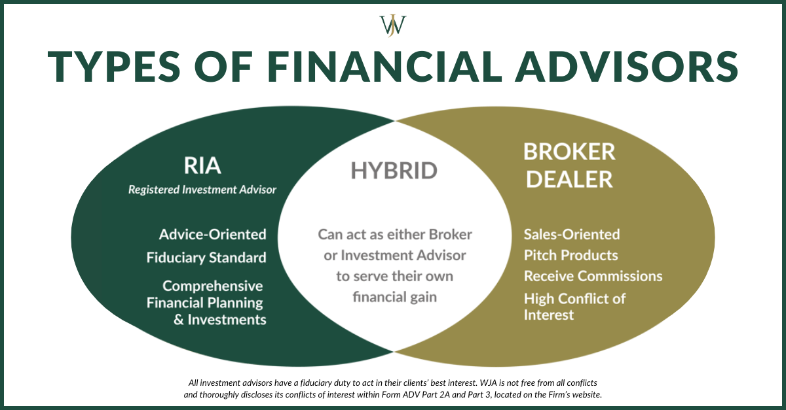

## Table of Contents

## What is a broker-dealer?

A broker-dealer is a financial firm or individual that acts as both a broker and a dealer. As a broker, they help customers buy and sell securities like stocks and bonds. They earn money by charging a fee or commission for their services. As a dealer, they buy and sell securities for their own account, making a profit from the difference between the buying and selling prices.

Broker-dealers play an important role in the financial markets. They help connect buyers and sellers, making it easier for people to invest in securities. They also have to follow strict rules and regulations set by government agencies to protect investors and ensure fair trading practices. This means they must act honestly and in the best interest of their clients.

## What is a registered investment adviser (RIA)?

A registered investment adviser (RIA) is a company or person that gives advice about investing money. They help people figure out where to put their money to grow it over time. RIAs are registered with the Securities and Exchange Commission (SEC) or state securities authorities. This means they follow rules to make sure they are giving good advice and looking out for their clients' best interests.

RIAs work with clients to understand their financial goals and create a plan to reach those goals. They might suggest different types of investments like stocks, bonds, or mutual funds. Unlike some other financial professionals, RIAs have a fiduciary duty. This means they must always put their clients' interests first and give advice that is best for the client, not just what might make them more money.

## How do broker-dealers make money?

Broker-dealers make money in two main ways. First, they earn money by acting as brokers. When they help customers buy or sell stocks, bonds, or other securities, they charge a fee or commission for their service. This fee is usually a small percentage of the total value of the trade. So, the more trades they help with, the more money they make from these fees.

Second, broker-dealers also make money by acting as dealers. This means they buy and sell securities for their own accounts. They try to buy securities at a lower price and then sell them at a higher price. The difference between the buying and selling price is called the "spread," and that's how they make a profit. By doing this, broker-dealers can make money even when they are not directly helping customers with trades.

## How do registered investment advisers make money?

Registered investment advisers (RIAs) make money by charging their clients fees for the advice they give. These fees can be based on a percentage of the assets they manage for the client. For example, if an RIA manages $100,000 for a client and charges a 1% fee, they would earn $1,000 a year. This way, the more money they manage, the more they can earn.

Some RIAs also charge a flat fee, which is the same amount no matter how much money they are managing. This could be a yearly fee or an hourly rate for their time. The type of fee an RIA charges depends on what they agree with their client. Either way, RIAs are paid for helping their clients make smart choices about where to invest their money.

## What are the primary services offered by broker-dealers?

Broker-dealers help people buy and sell stocks, bonds, and other types of investments. They act like a middleman between buyers and sellers, making it easier for people to trade. When someone wants to buy or sell a security, they can go to a broker-dealer who will find someone on the other side of the trade. For this service, broker-dealers charge a fee or commission, which is usually a small percentage of the total value of the trade.

In addition to helping with trades, broker-dealers also buy and sell securities for their own accounts. This means they can make money by buying low and selling high. They keep an eye on the market to find good deals and make profits from the difference between their buying and selling prices. This is another way broker-dealers make money, aside from the fees they charge for helping their customers trade.

## What are the primary services offered by registered investment advisers?

Registered investment advisers help people make smart choices about where to put their money. They look at what a person wants to achieve with their money, like saving for retirement or buying a house. Then, they make a plan and suggest different types of investments like stocks, bonds, or mutual funds. They keep an eye on these investments and change the plan if needed to make sure it still fits the person's goals.

RIAs also give advice on other money matters, like how much to save, how to manage debt, and planning for the future. They work closely with their clients to understand their needs and help them reach their financial goals. By doing this, RIAs make sure their clients' money is working as hard as it can to grow over time.

## What kind of regulatory oversight do broker-dealers face?

Broker-dealers have to follow strict rules set by the government to make sure they are doing things the right way. The main group that watches over them is the Securities and Exchange Commission (SEC). The SEC makes sure that broker-dealers follow the laws that protect people who invest money. Another group that keeps an eye on them is the Financial Industry Regulatory Authority (FINRA). FINRA checks that broker-dealers are being honest and fair when they help people buy and sell stocks and other investments.

These rules are important because they help keep the markets safe and fair for everyone. Broker-dealers have to keep good records of all their trades and be ready to show them if asked. They also need to make sure they are not giving out false information or doing anything that could hurt their clients. If a broker-dealer breaks these rules, they can get in big trouble, like having to pay fines or even losing their license to work in the industry.

## What kind of regulatory oversight do registered investment advisers face?

Registered investment advisers (RIAs) have to follow rules set by the government to make sure they are doing a good job and not cheating people. The main group that watches over them is the Securities and Exchange Commission (SEC). The SEC checks that RIAs are giving honest advice and looking out for their clients' best interests. If an RIA is smaller, they might be watched by state securities regulators instead of the SEC. These rules are there to protect people who use RIAs to help them with their money.

RIAs have to register with the SEC or their state, depending on how much money they manage. They need to fill out forms and give information about their business. They also have to follow rules about how they give advice, how they handle their clients' money, and how they keep records. If an RIA breaks these rules, they can get in trouble, like having to pay fines or even losing their license to work as an adviser. This helps make sure that RIAs are always working to help their clients in the best way possible.

## How does the fiduciary duty differ between broker-dealers and RIAs?

A fiduciary duty means you have to put someone else's interests first. For registered investment advisers (RIAs), this duty is very important. RIAs have to always give advice that is best for their clients. They can't suggest something just because it might make them more money. This rule helps make sure that RIAs are always working hard to help their clients reach their money goals.

Broker-dealers, on the other hand, do not always have this same strict fiduciary duty. They can give advice that is good for their clients, but it's okay if it also helps them make more money. This is called a "suitability standard." It means that the advice has to be okay for the client, but it doesn't have to be the very best option. Because of this, people working with broker-dealers need to understand that the advice might not always be the best choice for them, but it should still be okay.

## Can a firm be both a broker-dealer and a registered investment adviser?

Yes, a firm can be both a broker-dealer and a registered investment adviser. This means they can help people buy and sell stocks and other investments, while also giving advice on where to put their money to grow it over time. When a firm does both, they have to follow the rules for both jobs. This can be a good thing for people who want all their money help in one place.

Being both a broker-dealer and an RIA can be tricky because the rules are different. As a broker-dealer, they need to make sure their advice is okay for the client, but it doesn't have to be the very best choice. But as an RIA, they have to give the best advice possible and always put the client's interests first. So, firms that do both have to be careful to follow the right rules for each part of their job.

## What are the educational and examination requirements for professionals at broker-dealers versus RIAs?

Professionals at broker-dealers usually need to pass certain exams to show they know what they're doing. The main exam is the Series 7, which tests their knowledge about stocks, bonds, and other investments. They might also need to pass the Series 63 or Series 66, which are about state laws and rules. These exams make sure that people working at broker-dealers understand the rules and can help their clients buy and sell investments the right way.

For registered investment advisers, the rules can be a bit different. RIAs often need to pass the Series 65 exam, which checks their knowledge about giving investment advice. Some RIAs might also take the Series 66 exam, which covers both investment advice and state laws. These exams help make sure that RIAs can give good advice and always put their clients' interests first.

## How do the conflicts of interest typically differ between broker-dealers and registered investment advisers?

Broker-dealers can have conflicts of interest because they make money in different ways. When they act as brokers, they earn fees for helping people buy and sell stocks. But when they act as dealers, they buy and sell stocks for themselves, trying to make a profit. This can create a conflict because what's good for the broker-dealer might not be the best for the client. For example, they might push a client to trade more often to earn more fees, even if it's not the best choice for the client's money.

Registered investment advisers, on the other hand, have to follow a strict rule called the fiduciary duty. This means they must always put their clients' interests first. Even though RIAs make money by charging fees based on the amount of money they manage, they can't suggest investments just to make more money for themselves. Their main goal is to help their clients reach their money goals. This reduces conflicts of interest because RIAs are legally required to give the best advice possible, not just advice that benefits them.

## References & Further Reading

[1]: U.S. Securities and Exchange Commission (SEC). ["Fast Answers: Brokers."](https://www.sec.gov/)

[2]: Financial Industry Regulatory Authority (FINRA). ["Broker-Dealer Registration."](https://www.finra.org/registration-exams-ce/broker-dealers)

[3]: Srinivas, V. (2021). ["Algorithmic Trading: Winning Strategies and Their Rationale."](https://www.wiley.com/en-us/Algorithmic+Trading%3A+Winning+Strategies+and+Their+Rationale-p-9781118460146) Wiley.

[4]: Lopez de Prado, M. (2018). ["Advances in Financial Machine Learning."](https://www.amazon.com/Advances-Financial-Machine-Learning-Marcos/dp/1119482089) Wiley.

[5]: Aronson, D. R. (2006). ["Evidence-Based Technical Analysis: Applying the Scientific Method and Statistical Inference to Trading Signals."](https://www.amazon.com/Evidence-Based-Technical-Analysis-Scientific-Statistical/dp/0470008741) Wiley.