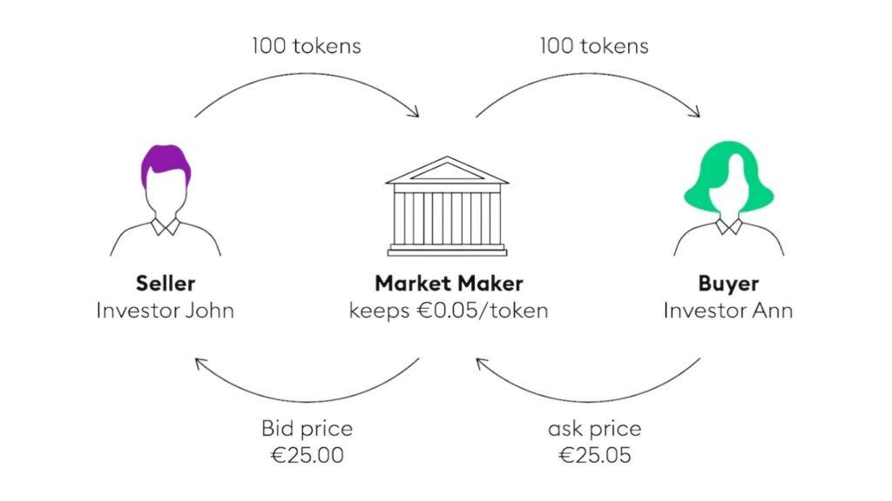

In the rapid and dynamic world of financial markets, understanding the key players and mechanisms is essential for any investor or trader. This article explores the critical roles of market makers, brokers, and algorithmic trading within financial markets. Market makers are entities that provide liquidity by being ready to buy and sell assets at any time, thus facilitating smooth operations and stability in trading. Brokers act as intermediaries between buyers and sellers, executing trades on behalf of their clients while ensuring compliance with legal and financial standards. Algorithmic trading, on the other hand, leverages technology to execute trading strategies automatically and with precision, enhancing efficiency and expanding trading capabilities.

These entities function both individually and collectively to ensure the efficient allocation of financial resources, vital attributes of effective markets such as liquidity, transparency, and fair pricing. The landscape of financial markets is continuously evolving with the integration of advanced technology, impacting how trades occur and strategies are developed. The similarities and differences between market makers and brokers highlight their unique positions within financial markets. Meanwhile, the burgeoning impact of algorithmic trading showcases a transformative shift in market operations, with technology playing a crucial role in improving market efficiency and stability.

Through this examination, we aim to highlight the importance of these players and technologies in shaping the contemporary financial markets, ultimately providing a comprehensive understanding to enable more informed investment and trading decisions.

## Table of Contents

## Understanding Financial Markets

Financial markets serve as essential platforms where buyers and sellers engage in the exchange of financial securities, commodities, and other fungible assets. These markets play a pivotal role in the economy by facilitating the efficient allocation of resources. Through financial markets, individuals and entities with surplus funds can provide capital to those in need, fostering investment and economic growth.

The primary types of financial markets include stock markets, bond markets, commodities markets, foreign exchange markets, and derivatives markets. Stock markets are venues for buying and selling shares of publicly listed companies, while bond markets involve the issuance and trading of debt securities. Commodities markets deal with physical goods such as metals, oil, and agricultural products. Foreign exchange markets enable the trading of currencies, and derivatives markets include instruments like options and futures contracts, which derive their value from underlying assets.

Effective financial markets are characterized by liquidity, transparency, and fair pricing. Liquidity indicates the ease with which assets can be bought or sold without causing significant price changes, allowing for smoother transactions and reduced market volatility. Transparency ensures all market participants have access to relevant information, promoting informed decision-making and market integrity. Fair pricing is crucial in reflecting the true value of assets, helping maintain investor confidence and market efficiency.

An example of the importance of [liquidity](/wiki/liquidity-risk-premium) can be seen in the bid-ask spread. The bid price is the highest price a buyer is willing to pay for an asset, while the ask price is the lowest price a seller is willing to accept. A narrow bid-ask spread typically signifies a liquid market, where the cost of trading is low, and price discovery mechanisms function effectively.

The efficient operation of financial markets depends on a complex infrastructure of technological and regulatory frameworks. Advanced technologies facilitate fast and secure transactions, while regulatory bodies ensure that markets operate fairly and transparently, safeguarding the interests of all participants. As these markets continue to evolve, they adapt to new financial instruments and technologies, which enhances their capability to support economic growth and stability.

## The Role of Market Makers

Market makers are essential participants in financial markets, ensuring liquidity by continuously being ready to buy and sell securities. This readiness allows other traders to enter and [exit](/wiki/exit-strategy) positions smoothly and rapidly, providing an efficient trading environment. Market makers play a vital role by standing ready to quote both buy (bid) and sell (ask) prices for the securities they handle, thereby creating a liquid market where trades can be executed quickly without significant price changes.

The core function of market makers involves maintaining a large inventory of the securities they trade. This substantial inventory ensures they can meet the demands of buyers and sellers at almost any time, thus minimizing the chances of market disruption due to a lack of available securities. By continuously updating bid and ask prices based on market conditions, market makers ensure that price discovery in the financial markets remains efficient.

Market makers generate profits primarily from the bid-ask spread, which is the difference between the prices at which they are willing to buy and sell a security. This spread compensates them for the risks associated with holding these securities, including price fluctuations and the potential costs of maintaining their inventory. The bid-ask spread must be wide enough to cover these risks but narrow enough to ensure competitive pricing that attracts trading [volume](/wiki/volume-trading-strategy). 

The bid-ask spread can be mathematically represented as:

$$
\text{Spread} = \text{Ask Price} - \text{Bid Price}
$$

Algorithmic strategies and advanced trading models often assist market makers in adjusting their quotes to reflect current market conditions, thereby optimizing their inventory and minimizing exposure to adverse price movements. As technology and data analytics continue to evolve, the role of market makers is increasingly intertwined with algorithmic tools, making their operations more efficient and responsive to dynamic markets.

## Brokers: The Intermediaries

Brokers serve as essential intermediaries in financial markets, playing a pivotal role in facilitating transactions between buyers and sellers. Their primary function involves executing trades on behalf of their clients, a task that demands both precision and compliance with legal regulations. Brokers are typically registered and regulated entities to ensure they meet stringent legal and financial standards, which are put in place to protect investors and maintain market integrity.

Brokers can be broadly categorized into two main types: full-service brokers and discount brokers. Full-service brokers offer a comprehensive range of services, including personalized financial advice, portfolio management, and access to a wide array of financial products. They cater to clients who may require more in-depth assistance in managing their investments and are willing to pay higher fees for these services. On the other hand, discount brokers focus primarily on trade execution and provide limited services at a lower cost, appealing to more self-directed investors who prefer to manage their own portfolios.

The primary revenue stream for brokers traditionally comes from commissions charged on trades executed for clients. These commissions can vary based on the volume of trades, the type of securities traded, and the level of service provided by the broker. In addition to commissions, some brokers engage in proprietary trading. This involves using the firm's own funds to trade financial instruments to generate additional revenue. While proprietary trading can be profitable, it also poses potential conflicts of interest and regulatory challenges that brokers must carefully navigate.

The advent of technology and the increasing trend towards [algorithmic trading](/wiki/algorithmic-trading) have further influenced the brokerage industry. Technological advancements have enabled brokers to offer faster and more efficient trade execution, reducing costs and enhancing client satisfaction. However, these changes also require brokers to invest in advanced trading platforms and cybersecurity measures to protect sensitive client data and ensure seamless operations.

In summary, brokers act as crucial conduits in financial markets, providing a bridge between investors and the exchanges where trades occur. Their ability to adapt to regulatory requirements and technological changes remains vital to their continued success and the overall health of the financial markets.

## Algorithmic Trading: The Future of Market Operations

Algorithmic trading employs sophisticated algorithms, enabling the automation of trading strategies with precision and speed that surpass human capabilities. This trading method capitalizes on its ability to swiftly execute orders, making it a dominant force in major financial markets due to its inherent speed, accuracy, and efficiency, especially when dealing with substantial trade volumes.

A core strength of algorithmic trading lies in its capacity to quickly capture market opportunities. By analyzing vast datasets in milliseconds, algorithms can identify patterns and execute trades based on predetermined criteria without human intervention. This functionality allows algorithmic systems to operate non-stop, 24/7, without succumbing to fatigue, presenting a distinct advantage over traditional trading methods.

The structure of an algorithmic trading system often involves several components: data acquisition, signal generation, risk management, and order execution. Data acquisition incorporates real-time financial data, while signal generation utilizes statistical models to predict price movements. Risk management ensures the portfolio's exposure remains within set limits, and order execution interfaces directly with trading platforms to place trades automatically.

Despite its numerous advantages, algorithmic trading carries inherent risks. Market manipulation is one such concern, where algorithms could be programmed with ulterior motives, unsettling market integrity. Additionally, flash crashes, characterized by the sudden and severe drop in security prices, can be exacerbated by the rapid pace of algorithmic trading. An example is the May 6, 2010, Flash Crash, where the Dow Jones Industrial Average plummeted nearly 1,000 points in minutes, driven in part by automated trading systems. 

To mitigate these risks, regulators and market participants stress the importance of robust risk management frameworks and transparency in algorithmic trading strategies. Organizations like the Securities and Exchange Commission (SEC) continue to develop rules to ensure a fair trading environment. Moreover, advancements in technology and data analytics can aid in monitoring and managing the systemic impact of large-scale algorithmic trades.

In conclusion, algorithmic trading represents the future of market operations, bringing advantages that would be impossible with human-only trading; however, it necessitates stringent oversight and innovative technological solutions to counteract its potential drawbacks.

## Comparing Market Makers and Brokers

Market makers and brokers perform distinct yet complementary roles in financial markets, each essential for facilitating efficient trade execution and market stability.

Market makers play a vital role by providing liquidity, which is crucial for the normal functioning of markets. They continuously offer buy (bid) and sell (ask) prices for a specific security, ready to execute trades on their own account. This willingness to buy and sell enhances market liquidity, ensuring that investors can execute trades promptly without causing significant price movements. Market makers earn their profits through the bid-ask spread, the difference between the price at which they are willing to buy a security and the price at which they are willing to sell it. This spread compensates market makers for the risk they assume by holding inventory and the capital tied up in these positions.

Brokers, in contrast, serve as intermediaries between buyers and sellers. They execute trades on behalf of their clients without necessarily providing liquidity themselves. Brokers typically earn a commission or fee for their services, which may include trade execution, market analysis, and providing investment advice. Unlike market makers, brokers do not trade securities for their own accounts and are not exposed to the same level of trading risk.

Though their roles differ significantly, market makers and brokers are integral to ensuring a smooth operation in financial markets. Market makers facilitate rapid trade execution by maintaining a liquid market, thereby reducing transaction costs and price [volatility](/wiki/volatility-trading-strategies). Brokers, for their part, serve to connect market participants, offering a conduit through which client trades are executed efficiently. Both market makers and brokers help to maintain market stability, albeit through different mechanisms—market makers by providing liquidity and brokers by ensuring that buyers and sellers can connect seamlessly.

In summary, while market makers and brokers have distinct functions, their combined efforts contribute to the efficient and stable operation of financial markets, each addressing different aspects of the trading process to ensure that market participants can transact with confidence.

## Integrating Algo Trading with Market Makers and Brokers

Algorithmic trading plays a significant role in enhancing the efficiency and speed of market operations for both market makers and brokers. By automating complex trading strategies and tasks, algorithmic systems allow these entities to process vast amounts of data quickly and execute trades with high precision.

Market makers, whose primary responsibility is to provide liquidity and ensure a smooth trading environment, utilize algorithms to update quotes in real-time and manage the inherent risks of holding large inventories of securities. The rapid adjustments facilitated by algorithmic systems enable market makers to respond to market conditions instantaneously, optimizing their inventory and minimizing potential losses due to price shifts. Algorithms also allow for statistical [arbitrage](/wiki/arbitrage) and other sophisticated strategies that can capitalize on small price discrepancies, further stabilizing the markets they operate in.

For brokers, who serve as intermediaries executing trades on behalf of clients, algorithms streamline the trade execution process, ensuring orders are carried out with minimal delay and at the best possible prices. This automation significantly reduces human error, enhancing reliability and client trust. Brokers benefit from algorithmic systems that can handle high-frequency trade execution and client service operations. Algorithms can analyze market conditions and client portfolios to recommend optimal trade strategies, offering a competitive advantage to brokers in the financial ecosystem.

The integration of algorithms also reduces operational costs for both market makers and brokers by decreasing the dependency on labor-intensive processes. With fewer manual interventions required, firms can allocate resources more effectively and focus on strategic decision-making. Moreover, algorithms facilitate advanced data analytics, enabling firms to gain insights into market trends and client behaviors, fostering informed decision-making and fostering innovation in trade execution strategies.

In conclusion, algorithmic trading stands as a transformative force for market makers and brokers, enhancing their ability to operate efficiently and effectively in fast-paced financial markets. The incorporation of sophisticated algorithms not only streamlines operations but also optimizes decision-making processes, placing these entities at the forefront of the evolving landscape of global finance.

## Special Considerations and Challenges

Market makers, brokers, and algorithmic trading each contribute significantly to the intricate ecosystem of modern financial markets, but they also encounter challenges that can impact their effectiveness and stability. These challenges primarily include regulatory changes, technological disruptions, and potential conflicts of interest.

Regulatory changes are a core concern as they directly affect how these entities operate. Financial markets are subject to strict oversight to ensure fairness, transparency, and stability. Regulatory bodies, such as the U.S. Securities and Exchange Commission (SEC) and the Financial Conduct Authority (FCA) in the UK, continuously update their frameworks to adapt to new market conditions and innovations. For instance, the MiFID II regulations in Europe have imposed comprehensive requirements on algorithmic trading, demanding high-frequency traders to disclose their algorithms for inspection and adhere to stringent risk controls [1].

Technological disruptions pose another significant challenge. The rapid evolution of technology can both enhance and destabilize market operations. Market makers and brokers must constantly upgrade their systems to keep pace with advancements in trading technologies, cybersecurity threats, and data management. The transition to advanced trading platforms, including those that incorporate [machine learning](/wiki/machine-learning) and [artificial intelligence](/wiki/ai-artificial-intelligence), requires substantial investment and technical expertise.

Conflicts of interest are particularly relevant when market makers also operate as brokers. In such cases, there might be temptations to prioritize proprietary trading interests over clients' needs. To mitigate these risks, clear regulatory frameworks are essential to distinguish and govern the dual roles, ensuring that fair conduct and fiduciary responsibilities are maintained [2].

The rise of algorithmic trading necessitates robust systems to handle market anomalies, such as flash crashes, which can result from automated trades executing in large volumes within milliseconds. Flash crashes, like the one that occurred in May 2010, highlighted the need for improved safety nets within trading systems to prevent cascading effects due to erroneous trades [3]. Enhancing cybersecurity measures is also critical, as reliance on digital infrastructures increases the vulnerability to cyber attacks, which could compromise market integrity.

Overall, while market makers, brokers, and algorithmic trading significantly enhance market efficiency, they must navigate these challenges to ensure sustainable growth and the continued trust of investors.

References:
1. "Markets in Financial Instruments Directive (MiFID II)" - European Commission.
2. "The Role and Regulation of Market Makers" - Financial Regulation and Compliance Reports.
3. "The Flash Crash: Lessons Learned" - U.S. Securities and Exchange Commission Report, 2010.

## Conclusion

Market makers, brokers, and algorithmic trading are integral to the financial markets' infrastructure, each contributing uniquely to market dynamics. Market makers ensure liquidity, which is essential for the continuous operation of markets. They constantly offer buy and sell prices, thus allowing traders to enter and exit positions with ease. This role not only stabilizes market prices but also enhances overall market efficiency.

Brokers act as the connecting intermediaries between market participants, executing trades on behalf of clients. By providing access to markets and facilitating transactions, brokers ensure that client trades are executed at competitive prices, which in turn aids in price discovery and market transparency.

Algorithmic trading, powered by advanced computer algorithms, contributes to market efficiency by executing trades at speeds and accuracies far beyond human capabilities. Algorithms analyze large datasets to make informed trading decisions, which can improve liquidity and reduce market costs. However, algorithmic trading also introduces challenges, such as the potential for market manipulation and flash crashes, underscoring the need for robust regulatory oversight and technological safeguards.

Understanding the operations, advantages, and risks associated with these market participants allows investors and traders to make better-informed decisions. As technology continues to progress, we can expect further evolution in market mechanisms, leading to enhanced market structures. This ongoing development presents opportunities and challenges, indicating that the global financial landscape will keep evolving in response to technological innovations.

## References & Further Reading

[1]: "Markets in Financial Instruments Directive (MiFID II)" - European Commission.

[2]: "The Role and Regulation of Market Makers" - Financial Regulation and Compliance Reports.

[3]: "The Flash Crash: Lessons Learned" - U.S. Securities and Exchange Commission Report, 2010.

[4]: [Bergstra, J., Bardenet, R., Bengio, Y., & Kégl, B. (2011). "Algorithms for Hyper-Parameter Optimization."](https://dl.acm.org/doi/10.5555/2986459.2986743) Advances in Neural Information Processing Systems 24.

[5]: ["Advances in Financial Machine Learning"](https://www.amazon.com/Advances-Financial-Machine-Learning-Marcos/dp/1119482089) by Marcos Lopez de Prado

[6]: ["Evidence-Based Technical Analysis: Applying the Scientific Method and Statistical Inference to Trading Signals"](https://books.google.com/books/about/Evidence_Based_Technical_Analysis.html?id=jbD47VkOHAEC) by David Aronson

[7]: ["Quantitative Trading: How to Build Your Own Algorithmic Trading Business"](https://www.amazon.com/Quantitative-Trading-Build-Algorithmic-Business/dp/1119800064) by Ernest P. Chan

[8]: ["Machine Learning for Algorithmic Trading"](https://github.com/stefan-jansen/machine-learning-for-trading) by Stefan Jansen