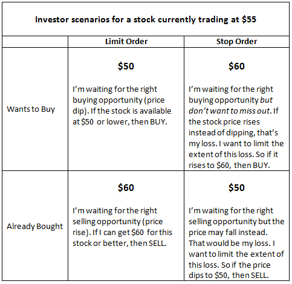

## Table of Contents

## What is a buy limit order?

A buy limit order is a type of order you can place with a broker to buy a stock at a specific price or lower. When you set a buy limit order, you are telling the broker that you want to buy the stock, but only if it reaches or falls below the price you've set. This can be useful if you think the stock's price will drop to a certain level before it goes up again.

For example, if a stock is currently trading at $50 and you believe it will drop to $45 before rising, you can set a buy limit order at $45. If the stock's price reaches $45 or lower, your order will be executed, and you will buy the stock at that price or better. However, if the stock never drops to $45, your order will not be filled, and you won't buy the stock. This type of order helps you control the price you pay and can be a good strategy for managing risk.

## What is a stop order?

A stop order, also called a stop-loss order, is a type of order you can place with a broker to buy or sell a stock once it reaches a certain price. It is designed to limit your loss or protect your profit on a stock. For example, if you own a stock that is currently trading at $50 and you want to sell it if the price drops to $45, you can set a stop order at $45. Once the stock hits $45 or lower, your stop order turns into a market order, and the stock is sold at the next available price.

Stop orders can be useful for managing risk, but they don't guarantee the price at which your order will be filled. This is because once the stop price is reached, the order becomes a market order, and the stock could be sold at a price lower than your stop price, especially in a fast-moving market. It's important to understand this when using stop orders to make sure they fit with your overall investment strategy.

## How does a buy limit order work?

A buy limit order is a way to tell your broker that you want to buy a stock, but only if it reaches a certain price or lower. For example, if a stock is trading at $50 and you think it will drop to $45 before going up again, you can set a buy limit order at $45. This means your order will only be filled if the stock's price hits $45 or goes even lower.

Using a buy limit order can help you buy a stock at a better price than it's currently trading at. However, there's a risk that the stock might never reach your limit price, and your order won't be filled. If the stock keeps going up without dropping to your set price, you won't buy the stock at all. This type of order is useful for people who want to control the price they pay and are willing to wait for the right moment to buy.

## How does a stop order work?

A stop order is a way to tell your broker to buy or sell a stock when it reaches a certain price. It's like setting a safety net for your investment. For example, if you own a stock that's trading at $50 and you want to sell it if the price drops to $45, you can set a stop order at $45. When the stock hits $45 or goes lower, your stop order turns into a market order, and the stock is sold at the next available price.

Stop orders are useful for managing risk because they can help you limit your losses or protect your profits. But there's a catch: once your stop price is reached, your order becomes a market order, and the price you get might be different from your stop price. This is especially true in fast-moving markets where prices can change quickly. So, while stop orders can help you manage your investments, it's important to understand how they work and what the risks are.

## When should you use a buy limit order?

You should use a buy limit order when you want to buy a stock at a lower price than it's currently trading at. For example, if a stock is trading at $50 and you think it will drop to $45 before going up again, you can set a buy limit order at $45. This way, your order will only be filled if the stock reaches $45 or lower, helping you get a better price.

However, there's a risk that the stock might never reach your limit price, and your order won't be filled. If the stock keeps going up without dropping to your set price, you won't buy the stock at all. So, buy limit orders are good for people who want to control the price they pay and are willing to wait for the right moment to buy.

## When should you use a stop order?

You should use a stop order when you want to protect your investment from big losses or lock in profits. For example, if you own a stock that's trading at $50 and you want to sell it if the price drops to $45, you can set a stop order at $45. This way, if the stock hits $45 or goes lower, your order turns into a market order, and the stock is sold at the next available price. This helps you limit your losses if the stock's price keeps falling.

But remember, a stop order doesn't guarantee you'll sell at exactly your stop price. Once the stop price is reached, your order becomes a market order, and the price you get might be different, especially in fast-moving markets. So, stop orders are useful for managing risk, but it's important to understand they might not always work exactly as you expect.

## What are the key differences between a buy limit order and a stop order?

A buy limit order and a stop order are two different types of orders you can use when trading stocks. A buy limit order is used when you want to buy a stock at a price lower than it's currently trading at. For example, if a stock is at $50 and you think it will drop to $45, you can set a buy limit order at $45. Your order will only be filled if the stock reaches $45 or goes lower. This helps you buy the stock at a better price, but there's a risk the stock might never drop to your set price, and you won't buy it at all.

On the other hand, a stop order is used to sell a stock if it reaches a certain price, helping you limit losses or protect profits. For instance, if you own a stock at $50 and want to sell if it drops to $45, you can set a stop order at $45. When the stock hits $45 or goes lower, your stop order turns into a market order, and the stock is sold at the next available price. Unlike a buy limit order, a stop order doesn't guarantee the exact price you'll sell at, as the final sale price can be different, especially in fast-moving markets.

In summary, a buy limit order is about buying at a lower price and waiting for the right moment, while a stop order is about selling to protect your investment from big losses or to lock in profits. Both orders help manage your trading strategy, but they work in different ways and [carry](/wiki/carry-trading) different risks.

## Can you explain the potential risks associated with buy limit orders?

Using a buy limit order can be risky because there's no guarantee that the stock will ever reach the price you set. For example, if you want to buy a stock that's trading at $50 and you set a buy limit order at $45, the stock might never drop to $45. If the stock keeps going up or stays above $45, your order won't be filled, and you won't buy the stock at all. This means you could miss out on a good investment if the stock keeps going up without you.

Another risk is that even if your buy limit order is filled, the stock's price might keep dropping after you buy it. If you set a buy limit order at $45 and the stock drops to $45 and you buy it, the stock could then keep falling to $40 or lower. This means you might end up buying the stock at a higher price than it's worth if it keeps going down. So, while buy limit orders can help you buy at a better price, they come with the risk of missing out on the stock or buying it at a price that might not be the best in the long run.

## What are the risks of using stop orders?

Using stop orders can be risky because they don't guarantee you'll sell at the exact price you set. For example, if you set a stop order to sell a stock at $45 and the stock drops to $45, your order turns into a market order. This means the stock might be sold at a price lower than $45, especially if the market is moving fast. So, you could end up selling your stock for less than you wanted.

Another risk is that stop orders can be triggered by short-term price changes that don't reflect the stock's overall trend. If the stock price briefly drops to your stop price and then goes back up, your order might be filled at a lower price than you expected. This can happen during times of high market [volatility](/wiki/volatility-trading-strategies), where prices can swing a lot in a short time. So, while stop orders can help protect your investment, they can also lead to selling at a bad time if the market is unpredictable.

## How do market conditions affect the effectiveness of buy limit and stop orders?

Market conditions can really change how well buy limit and stop orders work. For buy limit orders, if the market is calm and the stock's price moves slowly, your order has a good chance of being filled at the price you want. But if the market is very up and down, the stock might skip right over your limit price without stopping. This means you might miss out on buying the stock if it keeps going up without hitting your price.

For stop orders, market conditions can also make a big difference. In a calm market, a stop order can help you sell your stock at a price close to what you set. But in a fast-moving or volatile market, your stop order might turn into a market order and get filled at a much lower price than you wanted. This is because the stock's price can drop quickly, and your order might be filled before the price has a chance to come back up. So, understanding the market's mood is important when using these orders.

## What advanced strategies involve using both buy limit and stop orders?

One advanced strategy that uses both buy limit and stop orders is called a "bracket order." This is when you buy a stock at a certain price using a buy limit order, and at the same time, you set a stop order to sell the stock if it drops to a lower price. You also set another order to sell the stock if it goes up to a higher price. This way, you can control your risk and also make a profit if the stock goes up. For example, if you buy a stock at $50, you might set a stop order at $45 to limit your loss and another order at $55 to take your profit if the stock goes up.

Another strategy is called "scaling in and out." This means you use buy limit orders to buy a stock at different prices as it goes down, and then you use stop orders to sell the stock at different prices as it goes up. For example, if a stock is at $50, you might set buy limit orders at $48, $46, and $44. If the stock drops to these prices, you'll buy more of it. Then, you might set stop orders at $52, $54, and $56 to sell the stock as it goes up. This way, you can buy low and sell high, making the most of the stock's price movements.

## How can algorithmic trading systems utilize buy limit and stop orders to optimize trading?

Algorithmic trading systems can use buy limit and stop orders to make trading better by setting rules that help the computer buy and sell stocks at the right times. For example, the system can be told to watch a stock's price and use a buy limit order to buy the stock if it drops to a certain price. This way, the computer can buy the stock at a good price without a person having to watch the market all the time. The system can also use stop orders to sell the stock if it starts to go down too much, helping to limit losses and protect the money invested.

Another way [algorithmic trading](/wiki/algorithmic-trading) systems can use these orders is by setting up strategies like bracket orders. In a bracket order, the system buys a stock at a set price using a buy limit order and then sets a stop order to sell the stock if it drops to a lower price. At the same time, it can set another order to sell the stock if it goes up to a higher price. This helps the system make money if the stock goes up and also protects against big losses if the stock goes down. By using these orders together, the system can make smart decisions quickly and help traders get the best results from their investments.

## What are Buy Limit Orders and how can they be explored?

Buy limit orders are fundamental tools in trading, allowing traders to set a predefined price to purchase assets. A buy limit order specifies a maximum price at which a trader is willing to buy a security, which ensures that the purchase will only occur if the asset's market price reaches the specified limit price or better. This order type is particularly useful in scenarios where traders anticipate a decline in the asset's price to a favorable level before initiating a purchase. The function of a buy limit order can be expressed as:

$$
\text{Execute Buy Order if } \text{Market Price} \leq \text{Limit Price}\]

This mechanism allows traders to acquire assets at their chosen price level, eliminating the need for constant market monitoring and enabling automatic order execution once the desired conditions are met.

Buy limit orders are beneficial in various trading scenarios. One primary advantage is in volatile markets where prices fluctuate rapidly. Traders can place buy limit orders to capitalize on brief price dips without the need to keep a continuous watch on market movements. Additionally, these orders are advantageous for those employing a value investing strategy, as they enable purchases at perceived undervalued price points, thereby potentially increasing profit margins. Moreover, using buy limit orders can help in systematic investment approaches, allowing traders to automate their buying decisions based on pre-defined criteria.

Despite their advantages, buy limit orders present certain drawbacks and considerations. One potential limitation is that the order may not be executed if the specified limit price is not reached during the trading period. This can result in missed opportunities if the market price never matches the desired purchase level before an upward trend occurs. Furthermore, in highly volatile markets, the asset's price might drop to the limit price, execute the order, and then continue to fall, resulting in an initial loss. It's crucial for traders to set realistic limit prices to balance the risk of non-execution against potential unfavorable price movements. 

In summary, while buy limit orders are powerful tools for achieving targeted entry points in asset purchasing, they require strategic planning and market insight to effectively mitigate risks associated with non-execution and adverse price trends.

## References & Further Reading

[1]: ["Advances in Financial Machine Learning"](https://www.amazon.com/Advances-Financial-Machine-Learning-Marcos/dp/1119482089) by Marcos Lopez de Prado

[2]: ["Evidence-Based Technical Analysis: Applying the Scientific Method and Statistical Inference to Trading Signals"](https://www.amazon.com/Evidence-Based-Technical-Analysis-Scientific-Statistical/dp/0470008741) by David Aronson

[3]: ["Machine Learning for Algorithmic Trading"](https://github.com/stefan-jansen/machine-learning-for-trading) by Stefan Jansen

[4]: ["Quantitative Trading: How to Build Your Own Algorithmic Trading Business"](https://www.amazon.com/Quantitative-Trading-Build-Algorithmic-Business/dp/1119800064) by Ernest P. Chan

[5]: Bergstra, J., Bardenet, R., Bengio, Y., & Kégl, B. (2011). ["Algorithms for Hyper-Parameter Optimization."](https://dl.acm.org/doi/10.5555/2986459.2986743) Advances in Neural Information Processing Systems 24.