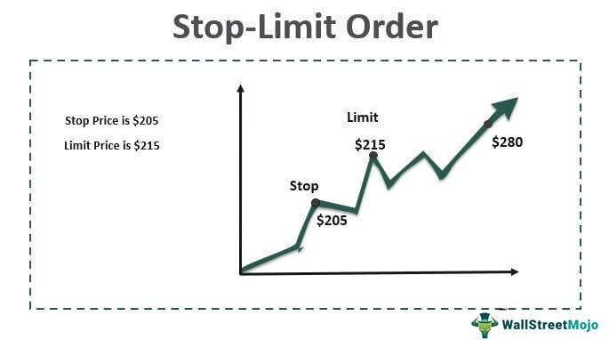

Trading orders are essential components of financial markets, allowing traders to execute transactions with precision and strategic intent. Among the various types of trading orders, stop orders and buy limit orders stand out due to their impactful roles in managing trades and risks. Additionally, the rise of algorithmic trading has transformed how these orders are employed, enhancing efficiency and execution speed.

Stop orders are designed to limit an investor's loss or to ensure a certain level of profit by triggering a market order once a predefined price point is reached. They serve as crucial tools for risk management, enabling traders to mitigate potential losses in volatile market conditions. Buy limit orders, on the other hand, allow traders to purchase a security at a specified price or better, facilitating entry at advantageous price levels.



The integration of these order types in algorithmic trading systems has marked a significant evolution in trading strategies. Algorithms utilize predefined rules and instructions to automatically execute trades, incorporating stop and limit orders to optimize outcomes. This automation reduces human error and capitalizes on market opportunities in real-time, accommodating traders' strategies that would be challenging to perform manually.

Understanding the mechanics and applications of stop orders, buy limit orders, and their utilization in algorithmic trading is paramount for any trader aiming to navigate today's complex markets. This article aims to educate readers on these trading orders and elucidate their strategic implementation in algorithmic trading environments. By mastering these concepts, traders can better position themselves to achieve their financial objectives effectively and efficiently.

## Table of Contents

## Understanding Stop Orders

Stop orders are an essential tool for traders, designed to automatically sell or buy an asset once it reaches a specified price. They serve as a safeguard in trading, helping to protect investments and manage risk. The primary purpose of stop orders is to enable traders to act swiftly in response to market movements without constantly monitoring prices. This feature can be particularly valuable in fast-paced and volatile markets where prices can change rapidly.

### Types of Stop Orders

1. **Stop-Loss Orders**: This is perhaps the most commonly used stop order in trading. A stop-loss order is placed to sell a security when it hits a predetermined price, known as the stop price. The aim is to minimize a trader's loss on a position in the security. For example, if a trader owns shares of a stock currently valued at $50 and sets a stop-loss order at $45, the shares will be sold automatically if the price drops to $45, thereby preventing further losses.

2. **Stop-Limit Orders**: This order type combines the features of a stop-loss order and a limit order. A stop-limit order is activated when a security reaches a stop price. However, instead of executing at the current market price (as with a regular stop order), it converts to a limit order that will only execute at a specified limit price or better. This allows traders to control the price at which their stop order will execute. However, while this limits potentially unfavorable executions, it risks not being executed at all if the price does not reach the desired level.

### Examples of Risk Mitigation with Stop Orders

Stop orders are often deployed to lock in profits or curtail losses. For instance, a trader who purchased a stock at $100 could set a stop-loss order at $95, safeguarding against excessive loss should the market turn unfavorable. Conversely, the trader might use a trailing stop order, which adjusts as the market price moves favorably, to capture more potential profit while still offering a downside limit.

### Benefits in Volatile Market Conditions

In volatile market conditions, stop orders can significantly aid risk management. Markets are inherently unpredictable, and sudden fluctuations can lead to substantial financial loss without the right protective mechanisms. By setting predefined [exit](/wiki/exit-strategy) points, stop orders allow traders to prevent emotion-driven decisions during sharp market swings. This automation of the decision-making process leads to a disciplined approach to trading, ensuring that trades occur as per the trader's strategic intent irrespective of market tumult.

To summarize, stop orders—particularly stop-loss and stop-limit orders—are indispensable tools that help traders mitigate risk and make disciplined trading decisions. By automating trade execution based on conditions set in advance, these orders assist in managing uncertainty, especially amid volatile market environments.

## Exploring Buy Limit Orders

Buy limit orders are fundamental tools in trading, allowing traders to set a predefined price to purchase assets. A buy limit order specifies a maximum price at which a trader is willing to buy a security, which ensures that the purchase will only occur if the asset's market price reaches the specified limit price or better. This order type is particularly useful in scenarios where traders anticipate a decline in the asset's price to a favorable level before initiating a purchase. The function of a buy limit order can be expressed as:

$$
\text{Execute Buy Order if } \text{Market Price} \leq \text{Limit Price}\]

This mechanism allows traders to acquire assets at their chosen price level, eliminating the need for constant market monitoring and enabling automatic order execution once the desired conditions are met.

Buy limit orders are beneficial in various trading scenarios. One primary advantage is in volatile markets where prices fluctuate rapidly. Traders can place buy limit orders to capitalize on brief price dips without the need to keep a continuous watch on market movements. Additionally, these orders are advantageous for those employing a value investing strategy, as they enable purchases at perceived undervalued price points, thereby potentially increasing profit margins. Moreover, using buy limit orders can help in systematic investment approaches, allowing traders to automate their buying decisions based on pre-defined criteria.

Despite their advantages, buy limit orders present certain drawbacks and considerations. One potential limitation is that the order may not be executed if the specified limit price is not reached during the trading period. This can result in missed opportunities if the market price never matches the desired purchase level before an upward trend occurs. Furthermore, in highly volatile markets, the asset's price might drop to the limit price, execute the order, and then continue to fall, resulting in an initial loss. It's crucial for traders to set realistic limit prices to balance the risk of non-execution against potential unfavorable price movements. 

In summary, while buy limit orders are powerful tools for achieving targeted entry points in asset purchasing, they require strategic planning and market insight to effectively mitigate risks associated with non-execution and adverse price trends.

## The Role of Trading Orders in Algo Trading

Algorithmic trading, often referred to as algo trading, is the process of executing orders using automated and pre-programmed trading instructions. These systems utilize complex algorithms that consider multiple variables such as timing, price, and [volume](/wiki/volume-trading-strategy) to determine optimal trading decisions. The reliance on pre-set orders is fundamental in [algorithmic trading](/wiki/algorithmic-trading), as they allow for the automation of trade executions without direct human intervention, enabling rapid responses to market conditions.

Stop and limit orders are commonly integrated into algorithmic trading strategies to ensure systematic trade executions. Stop orders, which are activated when a specific price level is reached, are particularly useful in risk management by capping potential losses or locking in profits. On the other hand, limit orders are used to buy or sell an asset at a pre-determined price or better, ensuring that trades are executed within the trader's specified price limits, thereby safeguarding against adverse market price movements.

Various algorithms incorporate these order types to enhance trading outcomes. For example, a simple moving average crossover algorithm might use stop-loss orders to exit a trade when the price moves unfavorably beyond a certain threshold. Likewise, a mean reversion strategy might place buy limit orders at specific intervals to accumulate assets when prices are perceived to be below their intrinsic value, aiming to capitalize on subsequent price corrections.

The advantages of using automated systems in trading are manifold. They offer the benefit of executing trades at optimal speeds, which is particularly valuable in high-frequency trading where market conditions can change in milliseconds. Automation eliminates emotional biases that might influence human traders, ensuring that trading decisions are made objectively based on pre-defined criteria. Furthermore, these systems allow for the simultaneous management of multiple trading accounts or strategies, enhancing operational efficiency.

In conclusion, the integration of trading orders like stop and limit within algorithmic trading offers significant advantages in both profitability and risk management. By leveraging the speed and precision of automated trading systems, traders can better navigate the complexities of modern financial markets.

## Advantages and Disadvantages of Using Stop and Buy Limit Orders

Stop and buy limit orders are essential tools in a trader's toolkit, offering distinct advantages and carrying certain risks. Understanding their benefits and limitations allows traders to leverage these orders effectively and make informed decisions.

### Key Benefits

1. **Risk Management**: Stop orders, particularly stop-loss orders, act as an insurance policy against excessive losses by automatically executing a sell action once a stock hits a pre-defined price. For instance, if a trader sets a stop-loss at 5% below the purchase price, the order ensures losses are capped at that level, protecting the trader from further downside.

2. **Cost Efficiency**: Buy limit orders enable traders to purchase securities at or below a designated price. This ensures traders do not overpay, providing a cost-effective method for entering trades. For example, a trader wanting to buy shares only when they fall to $50 or less can set a buy limit order, which only triggers when the market meets this condition.

3. **Precision**: Both stop and buy limit orders provide precision in trade execution. They permit traders to set specific entry and exit points, reducing emotional decision-making and enabling systematic investment strategies.

4. **Time-Saving**: These orders function autonomously once set, meaning traders do not need to continuously monitor the markets, granting them the freedom to focus on other tasks or investments.

### Risks and Limitations

1. **Market Volatility**: In highly volatile markets, stop orders can be triggered by short-term price fluctuations, resulting in premature executions. This phenomenon, known as a "stop-run", can lead to unanticipated sales and missed opportunities if the price rebounds swiftly after hitting the stop price.

2. **Partial Fills**: Buy limit orders may only be partially executed if there isn't enough liquidity at the specified price point. This partial execution leaves traders with incomplete positions, potentially disrupting trading strategies.

3. **Slippage**: For stop orders, especially during market openings or after major news releases, slippage can occur, meaning the execution price might be less favorable than the set stop price due to rapid market movements.

4. **Missed Opportunities**: With buy limit orders, there is a risk that the market may approach the specified price but not hit it, resulting in missed opportunities if the price then rises away from the limit.

### Mitigating Risks

1. **Setting Appropriate Levels**: Determine stop-loss and buy limit levels using technical analysis or volatility measures to reduce the chance of premature executions. For example, setting a stop-loss slightly below a historical support level may prevent unwarranted triggers.

2. **Using Trailing Stops**: Employ trailing stops that adjust with favorable market movements to secure profits while still protecting against downside risk. For instance, a trailing stop might maintain a 5% distance from the highest achieved price after purchase.

3. **Regular Review**: Continuously reassess market conditions and adjust order settings as needed based on new data or changes in volatility.

4. **Diversification**: Spread the use of stop and buy limit orders across different asset classes and markets to diversify exposure.

### Strategies for Optimizing Order Placements

1. **Incremental Order Placement**: Instead of a single large buy limit order, use smaller orders staggered at different price levels to increase the likelihood of full execution during fluctuating prices.

2. **Combining Orders with Algorithms**: Utilize algorithmic trading solutions to dynamically adjust stop and limit orders in real-time based on market conditions. For instance, an algorithm could modify order levels using a moving average crossover strategy.

3. **Monitoring Liquidity**: Choose periods of high market liquidity to increase the probability of complete order execution and reduce slippage. This strategy is particularly effective for large trades in less liquid markets.

By carefully considering the benefits and addressing the inherent risks, traders can effectively incorporate stop and buy limit orders into their trading strategies, optimizing their market interactions and enhancing their overall performance.

## Practical Tips for Implementing Trading Orders

Implementing trading orders effectively requires careful strategy and an understanding of market dynamics. Here are some practical tips for traders looking to incorporate stop and buy limit orders into their trading strategies:

1. **Monitoring Market Conditions**: Successful traders keep a vigilant eye on market conditions, which can fluctuate rapidly. By tracking economic indicators, news releases, and technical analysis patterns, traders can adjust their order placements to optimize entry and exit points. For instance, if a trader sets a buy limit order, they should be aware of support levels and potential breakout scenarios to refine the placement of their order.

2. **Adjusting Order Placements**: As market conditions change, it is crucial to revisit and, if necessary, adjust stop and buy limit orders. For example, if a trader has set a stop-loss order, and the market exhibits increased volatility, they may wish to widen the stop distance to prevent premature execution due to temporary price swings. This flexibility helps in mitigating loss while capturing potential profits.

3. **Choosing the Right Brokerage Platform**: The choice of a brokerage platform can significantly influence the execution of stop and buy limit orders. Traders should consider platforms that offer robust charting tools, real-time data feeds, and a high degree of reliability in executing trades. Platforms like Interactive Brokers or TD Ameritrade provide comprehensive features that cater to both novice and experienced traders.

4. **Expert Insights**: Leveraging insights from experts can enhance a trader's strategy. For example, Paul Tudor Jones, a renowned trader, emphasizes the importance of discipline in order placement: "Where you want to be is always in control, never wishing, always trading." This underscores the necessity of having a clear plan and sticking to it, avoiding emotional decision-making.

5. **Algorithmic Assistance**: Implementing algorithmic strategies can automate the process of monitoring and adjusting orders. Using Python, traders can write scripts that utilize libraries like `pandas` and `NumPy` to analyze data trends. For instance:

   ```python
   import pandas as pd

   # Example of a simple moving average strategy
   def calculate_sma(data, window):
       return data.rolling(window=window).mean()

   data = pd.read_csv('market_data.csv')
   data['SMA_50'] = calculate_sma(data['Close'], 50)
   data['SMA_200'] = calculate_sma(data['Close'], 200)

   buy_signals = data[(data['SMA_50'] > data['SMA_200'])]

   print(buy_signals)
   ```

   This script calculates a 50-day and 200-day simple moving average and identifies buy signals where the short-term moving average crosses above the long-term average.

By integrating these practical tips, traders can enhance their ability to implement stop and buy limit orders strategically, potentially increasing their chances of achieving more favorable trading outcomes.

## Conclusion

Understanding trading orders is crucial for both manual and algorithmic trading, as it empowers traders to strategically manage risk and maximize potential gains. Stop and buy limit orders offer significant benefits. Stop orders provide a safety net by automatically triggering asset sales when prices hit predetermined thresholds, thus aiding in risk management. For instance, a stop-loss order can prevent further losses by selling an asset once its price falls to a certain level. Buy limit orders, on the other hand, allow traders to capitalize on purchasing opportunities at more favorable price points, thus optimizing entry strategies.

Traders should align their use of these orders with their individual goals and strategies. Evaluating market conditions and understanding personal risk tolerance will guide effective implementation. Stop and buy limit orders should be integrated into a broader trading strategy to achieve specific financial objectives.

To further enhance trading proficiency, it is advisable for traders to invest in education and utilize available tools and resources. Staying informed through courses, webinars, and market analysis software can provide critical insights and an edge in decision-making processes. Continuous learning and adaptation are key to navigating the complexities of financial markets successfully.

## References & Further Reading

[1]: ["Advances in Financial Machine Learning"](https://www.amazon.com/Advances-Financial-Machine-Learning-Marcos/dp/1119482089) by Marcos Lopez de Prado

[2]: ["Evidence-Based Technical Analysis: Applying the Scientific Method and Statistical Inference to Trading Signals"](https://www.amazon.com/Evidence-Based-Technical-Analysis-Scientific-Statistical/dp/0470008741) by David Aronson

[3]: ["Machine Learning for Algorithmic Trading"](https://github.com/stefan-jansen/machine-learning-for-trading) by Stefan Jansen

[4]: ["Quantitative Trading: How to Build Your Own Algorithmic Trading Business"](https://www.amazon.com/Quantitative-Trading-Build-Algorithmic-Business/dp/1119800064) by Ernest P. Chan

[5]: Bergstra, J., Bardenet, R., Bengio, Y., & Kégl, B. (2011). ["Algorithms for Hyper-Parameter Optimization."](https://dl.acm.org/doi/10.5555/2986459.2986743) Advances in Neural Information Processing Systems 24.