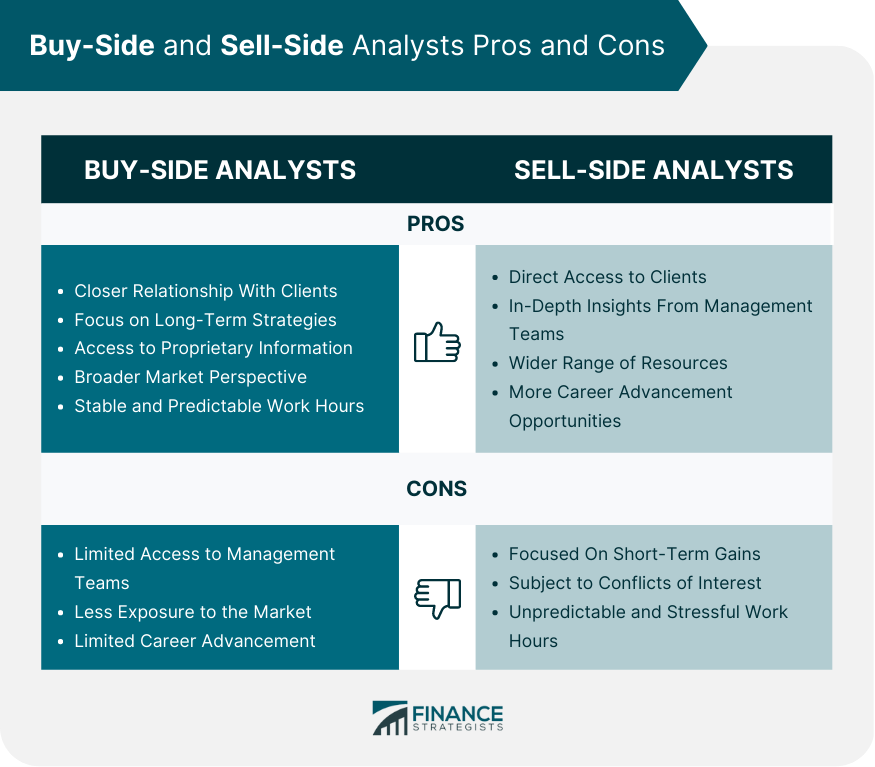

## Table of Contents

## What is a buy-side analyst?

A buy-side analyst works for companies that buy investments, like mutual funds or pension funds. Their main job is to research and find good investments for their company. They look at different companies and decide which ones are good to buy. They use a lot of data and reports to make these decisions.

Buy-side analysts are different from sell-side analysts. Sell-side analysts work for banks or brokerages and give advice to anyone who wants to buy or sell stocks. Buy-side analysts only focus on what's best for their own company. They keep their research private and use it to help their company make smart investment choices.

## What is a sell-side analyst?

A sell-side analyst works for banks, brokerages, or investment firms. Their job is to study different companies and give advice to people who might want to buy or sell stocks. They write reports and make recommendations about whether a stock is a good buy, a good sell, or should be held. These reports are shared with the public, so anyone can read them and use the information to make their own investment decisions.

Sell-side analysts are different from buy-side analysts. While buy-side analysts work to find the best investments for their own company, sell-side analysts help a wide range of clients. Their goal is to help people make smart choices about buying and selling stocks. They often appear on TV or in the news to share their insights, making their role very public and influential in the financial world.

## What are the primary roles of buy-side analysts?

Buy-side analysts work for companies that buy investments, like mutual funds or pension funds. Their main job is to find good investments for their company. They do a lot of research on different companies to see which ones are worth buying. They look at financial reports, market trends, and other data to make smart choices. Their goal is to help their company make money by [picking](/wiki/asset-class-picking) the best investments.

Buy-side analysts keep their research private. They don't share it with the public like sell-side analysts do. Instead, they use their findings to help their own company decide where to put their money. This means they focus only on what's best for their company, not on giving advice to everyone. Their work is very important because it helps their company grow and make more money.

## What are the primary roles of sell-side analysts?

Sell-side analysts work for banks, brokerages, or investment firms. Their main job is to study companies and give advice to people who want to buy or sell stocks. They write detailed reports about different companies, looking at their financial health, market trends, and other important information. They then make recommendations, saying whether a stock is a good buy, a good sell, or should be held. These reports are shared with the public, so anyone can read them and use the information to make their own investment choices.

Sell-side analysts are different from buy-side analysts because they help a wide range of clients, not just their own company. They aim to provide valuable insights that help people make smart decisions about buying and selling stocks. Because their work is public, sell-side analysts often appear on TV or in the news to share their views. This makes their role very influential in the financial world, as they guide many investors with their recommendations.

## How do buy-side and sell-side analysts interact with each other?

Buy-side and sell-side analysts interact in a way that helps both of them do their jobs better. Sell-side analysts share their research reports with buy-side analysts. These reports give buy-side analysts a lot of useful information about different companies. Buy-side analysts use this information to help them decide which investments are good for their own company. They might also call sell-side analysts to ask more questions or get more details about a company they are interested in.

Even though buy-side analysts use the reports from sell-side analysts, they don't just follow what the reports say. Buy-side analysts do their own research too. They might agree with what the sell-side analysts say, or they might have different ideas. Sometimes, buy-side analysts will share their own views with sell-side analysts, which can help the sell-side analysts improve their future reports. This back-and-forth helps both types of analysts make better investment decisions.

## What are the typical employers of buy-side analysts?

Buy-side analysts work for companies that buy investments. These companies are called institutional investors. Some typical employers of buy-side analysts are mutual funds, pension funds, hedge funds, and private equity firms. These organizations manage large amounts of money and need analysts to help them decide where to invest it.

Mutual funds and pension funds are common employers. They collect money from many people and use it to buy stocks, bonds, and other investments. Buy-side analysts at these firms research different companies to find the best investments for their funds. Hedge funds and private equity firms also hire buy-side analysts. These firms often take bigger risks to try to make more money. The analysts help them find good investment opportunities that fit their strategy.

## What are the typical employers of sell-side analysts?

Sell-side analysts work for companies that help people buy and sell stocks. These companies are usually banks, brokerages, and investment firms. Banks like Goldman Sachs or Morgan Stanley hire sell-side analysts to study companies and write reports about them. Brokerages, such as Charles Schwab or Fidelity, also employ sell-side analysts to give advice to their clients on what stocks to buy or sell.

Investment firms, like those that manage large amounts of money for rich people or big organizations, also have sell-side analysts. These analysts help the firm's clients make smart choices about their investments. The main job of sell-side analysts is to share their research with the public, so anyone can use it to decide if they want to buy or sell a stock.

## How do the compensation structures differ between buy-side and sell-side analysts?

Buy-side analysts usually get paid based on how well their company does. They might get a base salary and then bonuses if the investments they pick do well. The bonuses can be a big part of their pay. Since buy-side analysts work to make money for their own company, their pay often goes up if the company makes more money. This means their pay can be different each year, depending on how their investments do.

Sell-side analysts, on the other hand, often get paid based on how much business their reports bring in. They get a base salary too, but their bonuses might come from how many people use their research to make trades. If a lot of people read their reports and then buy or sell stocks because of them, the sell-side analyst might get a bigger bonus. Their pay can also change each year, but it depends more on how useful their reports are to others, not just how well the stocks they recommend do.

## What are the key skills required for a buy-side analyst?

A buy-side analyst needs to be good at understanding numbers and financial reports. They look at a lot of data to decide which companies are good investments. This means they need to know about things like balance sheets, income statements, and cash flow. They also need to be able to use computer programs to help them analyze this data. Being good at math and understanding how businesses work are important skills for a buy-side analyst.

Besides numbers, a buy-side analyst also needs to be good at talking to people and writing reports. They work with other people in their company to explain why they think a certain investment is good. They need to be able to explain complicated ideas in a way that others can understand. Being curious and always wanting to learn more about different companies and markets is also a big part of the job. This helps them stay on top of what's happening and make smart investment choices.

## What are the key skills required for a sell-side analyst?

A sell-side analyst needs to be good at understanding and analyzing financial data. They look at numbers like balance sheets, income statements, and cash flow to figure out if a company is doing well. They also need to be good with computer programs that help them analyze this data. Being good at math and understanding how businesses work are important skills for a sell-side analyst. They need to be able to see trends and predict how companies will do in the future.

Besides numbers, a sell-side analyst needs to be good at writing and talking to people. They write reports that a lot of people read, so their writing needs to be clear and easy to understand. They also talk to clients and sometimes go on TV or in the news to share their ideas. Being able to explain complicated things in a simple way is a big part of their job. They also need to be curious and always want to learn more about different companies and markets. This helps them keep their reports up-to-date and useful for others.

## How do the career paths of buy-side and sell-side analysts typically differ?

Buy-side analysts often start their careers in entry-level roles at mutual funds, pension funds, hedge funds, or private equity firms. They might begin as junior analysts, working their way up by showing they can pick good investments. Over time, they can become senior analysts or portfolio managers, where they manage more money and make bigger decisions. The career path for a buy-side analyst is usually more focused on the performance of their investments. If their choices help the company make a lot of money, they can move up quickly. But if their investments don't do well, it might be harder to advance.

Sell-side analysts usually start at banks, brokerages, or investment firms. They might begin as junior analysts and work their way up by writing good reports and giving helpful advice. As they gain experience, they can become senior analysts or move into roles like equity research director, where they lead a team of analysts. The career path for a sell-side analyst often depends on how useful their research is to clients. If a lot of people read and use their reports, they can move up faster. They might also switch to different roles within their company or even move to the buy-side if they want to focus on picking investments for a specific company.

## What are the potential conflicts of interest for sell-side analysts that do not typically affect buy-side analysts?

Sell-side analysts sometimes face conflicts of interest that buy-side analysts usually don't have. One big issue is that sell-side analysts work for banks or brokerages that also do business with the companies they write about. If a bank wants to keep a good relationship with a company, the analyst might feel pressured to write a positive report about that company, even if the company isn't doing that well. This can make their advice less honest and fair.

Another problem is that sell-side analysts often get paid based on how much trading their reports cause. If a lot of people read their report and then buy or sell the stock, the analyst might get a bigger bonus. This can make them want to write reports that will make people trade, even if it's not the best advice. Buy-side analysts don't have these issues because they work for their own company and focus on making good investment choices, not on pleasing other companies or causing trades.

## References & Further Reading

[1]: Bodie, Z., Kane, A., & Marcus, A. J. (2014). ["Investments (10th Edition)"](https://www.amazon.com/Investments-10th-Zvi-Bodie/dp/0077861671). McGraw-Hill Education.

[2]: Fabozzi, F. J., Focardi, S. M., & Kolm, P. N. (2010). ["Quantitative Equity Investing: Techniques and Strategies"](https://www.semanticscholar.org/paper/Quantitative-Equity-Investing%3A-Techniques-and-Fabozzi-Focardi/1c49a2a53919f7e65cb96f16691b8ff726fd3cd7). John Wiley & Sons.

[3]: Murphy, J. J. (1999). ["Technical Analysis of the Financial Markets: A Comprehensive Guide to Trading Methods and Applications"](https://archive.org/details/technicalanalysi0000murp). New York Institute of Finance.

[4]: Lopez de Prado, M. (2018). ["Advances in Financial Machine Learning"](https://www.amazon.com/Advances-Financial-Machine-Learning-Marcos/dp/1119482089). Wiley.

[5]: Chan, E. P. (2009). ["Quantitative Trading: How to Build Your Own Algorithmic Trading Business"](https://github.com/ftvision/quant_trading_echan_book). Wiley. 

[6]: Jansen, S. (2020). ["Machine Learning for Algorithmic Trading"](https://github.com/stefan-jansen/machine-learning-for-trading). Packt Publishing.