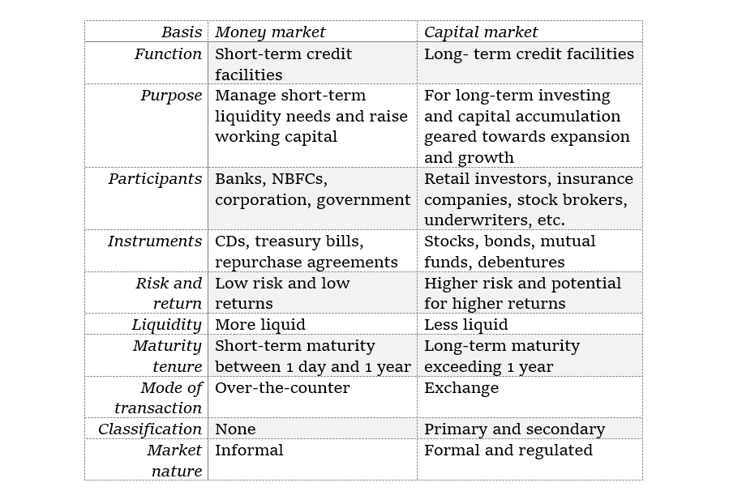

## Table of Contents

## What is a capital market?

A capital market is a place where people and businesses can buy and sell financial products like stocks and bonds. It helps companies raise money by selling shares of their company to investors. This money can be used to grow the business, start new projects, or pay off debts. Investors, on the other hand, can buy these shares hoping to make a profit if the company does well.

Capital markets include stock markets, where stocks are traded, and bond markets, where bonds are bought and sold. These markets are important because they help money move from people who have extra to those who need it to start or grow businesses. They also help set prices for financial products based on what people think they are worth, which can help the economy run smoothly.

## What is a stock market?

A stock market is a place where people buy and sell pieces of companies, called stocks or shares. When you buy a stock, you own a small part of that company. Companies sell these stocks to raise money for things like growing their business or starting new projects. People buy stocks because they think the company will do well and the value of the stock will go up, so they can sell it later for more money.

Stock markets are important because they help companies get the money they need to grow. They also let people invest their money and possibly make more money. The stock market has a big board that shows the prices of stocks, which change all the time based on what people think the companies are worth. This can help the economy because it shows how people feel about businesses and the future.

## How do capital markets and stock markets differ in their primary functions?

Capital markets and stock markets both help companies get money, but they do it in different ways. A capital market is a bigger idea that includes all the places where long-term money is raised and traded. This includes not just stocks, but also bonds and other financial products. The main job of a capital market is to help match people who have extra money with companies or governments that need money for big projects or to grow their business.

A stock market is a specific part of the capital market. Its main job is to let people buy and sell stocks, which are pieces of a company. When a company wants to raise money, it can sell these pieces to people who want to invest. The stock market is where these pieces are traded every day, with prices going up and down based on what people think the company is worth. So, while the capital market includes many ways to raise money, the stock market focuses just on trading stocks.

## Can you explain the types of securities traded in capital markets?

In capital markets, you can find different types of securities that companies and governments use to raise money. The main types are stocks and bonds. Stocks are pieces of a company that people can buy. When you own a stock, you own a small part of that company. Companies sell stocks to get money for things like growing their business or starting new projects. People buy stocks hoping that the company will do well and the stock price will go up, so they can sell it later for more money.

Bonds are another type of security traded in capital markets. When you buy a bond, you are lending money to a company or a government. In return, they promise to pay you back the money you lent them, plus some extra money called interest, over a certain period of time. Bonds are seen as safer than stocks because they give you regular interest payments and you get your money back at the end. Companies and governments use bonds to borrow money for big projects or to pay off other debts.

Besides stocks and bonds, there are other securities like mutual funds and exchange-traded funds (ETFs). Mutual funds pool money from many investors to buy a mix of stocks, bonds, or other securities. ETFs are similar but are traded on stock exchanges like individual stocks. These funds help people invest in a wide range of securities without having to pick each one themselves. They can be a good way to spread out risk and still get a chance to make money.

## What kinds of financial instruments are typically found in stock markets?

In stock markets, the main financial instruments you'll find are stocks. Stocks are pieces of a company that people can buy and sell. When you buy a stock, you own a small part of that company. Companies sell stocks to raise money for things like growing their business or starting new projects. People buy stocks because they hope the company will do well, and the price of the stock will go up so they can sell it later for more money.

Another type of financial instrument you might find in stock markets is exchange-traded funds (ETFs). ETFs are like a basket of different stocks or other assets that you can buy and sell on the stock market, just like a single stock. They help people invest in a wide range of companies or assets without having to buy each one separately. This can be a good way to spread out risk and still have a chance to make money.

Stock markets also sometimes include other instruments like stock options, which give you the right to buy or sell a stock at a certain price in the future. These are more complex and usually used by people who know a lot about the market. But for most people, the focus in stock markets is on buying and selling stocks and ETFs.

## How do the participants in capital markets differ from those in stock markets?

Participants in capital markets include a wide range of people and organizations. This includes investors who have money to lend or invest, like individuals, banks, and big funds. It also includes companies and governments that need money for big projects or to grow their business. They raise money by selling stocks, bonds, and other financial products. So, the participants in capital markets are very diverse, from everyday people saving for the future to big organizations managing large amounts of money.

In stock markets, the participants are more focused. The main players are individual investors who buy and sell stocks hoping to make a profit, and companies that sell their stocks to raise money. Stock markets also have big investors like mutual funds and pension funds that buy a lot of stocks. Brokers and traders help make the buying and selling happen smoothly. So, while capital markets include all these players plus bond issuers and other types of investors, stock markets are mostly about trading stocks between investors and companies.

## What role do government regulations play in capital markets versus stock markets?

Government regulations are important for both capital markets and stock markets. They help make sure that everyone plays fair and that the markets work well. In capital markets, which include stocks, bonds, and other financial products, the government makes rules to protect investors and keep the markets stable. These rules might say how companies can sell their stocks or bonds, what information they need to share with the public, and how much money they can borrow. This helps prevent big problems and keeps people's trust in the markets.

In stock markets, which are a part of capital markets, the government also has specific rules to make sure trading is fair and open. These rules might include how stocks can be bought and sold, how much information companies need to give about their business, and how to stop people from cheating or using secret information. The government watches over the stock market to make sure everyone follows the rules. This helps keep the stock market a safe place for people to invest their money.

## How does the liquidity of capital markets compare to that of stock markets?

Liquidity means how easy it is to buy or sell something without affecting its price too much. In capital markets, which include stocks, bonds, and other financial products, [liquidity](/wiki/liquidity-risk-premium) can vary a lot. Stocks are usually very liquid because they are traded a lot every day in stock markets. But bonds and other financial products might not be traded as often, so they can be less liquid. This means it might take longer to sell them, and the price might change more when you do.

In stock markets, liquidity is generally high because so many people and big funds are buying and selling stocks all the time. This makes it easy for you to buy or sell stocks quickly without the price changing much. The high liquidity in stock markets is one reason why many people choose to invest in stocks. They know they can get their money out fast if they need to. So, while capital markets as a whole can have parts that are less liquid, stock markets are usually very liquid.

## What are the main sources of funding in capital markets and how do they compare to stock markets?

The main sources of funding in capital markets are stocks and bonds. When companies or governments need money, they can sell stocks to people who want to invest in their business. This gives the company money to grow or start new projects. Bonds are another way to get money. When you buy a bond, you're lending money to a company or government. They promise to pay you back with interest over time. Capital markets also include other ways to raise money, like mutual funds and exchange-traded funds (ETFs), which let people invest in a mix of stocks and bonds.

In stock markets, the main source of funding is stocks. Companies sell pieces of their business to investors who hope the company will do well and the stock price will go up. Stock markets are a big part of capital markets, but they focus only on trading stocks. This means that while capital markets offer a variety of ways to raise money, stock markets are all about stocks. Both help companies get the money they need, but stock markets are more specialized and focused on one type of funding.

## How do the risk profiles of investments in capital markets differ from those in stock markets?

Investments in capital markets include stocks, bonds, and other financial products. Each of these has a different level of risk. Stocks are often seen as riskier because their value can go up and down a lot based on how the company is doing. If the company does well, the stock price might go up, and you can make money. But if the company does poorly, the stock price might drop, and you could lose money. Bonds are usually seen as less risky because they give you regular interest payments and you get your money back at the end. But even bonds can lose value if the company or government that issued them runs into trouble.

In stock markets, the focus is just on stocks, so the risk profile is more straightforward. Stocks are generally riskier than bonds because their prices can change a lot every day. When you buy a stock, you're betting that the company will do well, but there's no guarantee. This means you could make a lot of money if the stock price goes up, but you could also lose money if it goes down. Stock markets let you buy and sell stocks quickly, which can help manage risk, but it doesn't change the fact that stocks are riskier than many other investments in capital markets.

## Can you discuss the impact of economic cycles on capital markets versus stock markets?

Economic cycles, which are the ups and downs in the economy, affect both capital markets and stock markets. In capital markets, which include stocks, bonds, and other financial products, economic cycles can change how much money companies and governments can raise. When the economy is doing well, companies might find it easier to sell stocks and bonds because people feel good about investing. They might think the company will grow and make more money. But when the economy is doing badly, it can be harder for companies to raise money because people are more worried about losing their money. Bonds might still be seen as safer, but even they can be affected if people think the company or government might have trouble paying back the money.

In stock markets, which are a part of capital markets, the impact of economic cycles can be more direct and dramatic. When the economy is growing, stock prices often go up because people think companies will make more money. This can lead to a bull market, where stock prices keep rising. But when the economy slows down or goes into a recession, stock prices can fall a lot. This can lead to a bear market, where stock prices keep dropping. People might sell their stocks because they're worried about losing money, which can make stock prices go down even more. So, while both capital markets and stock markets are affected by economic cycles, stock markets can see bigger and quicker changes in stock prices.

## What advanced strategies can investors use to navigate both capital and stock markets effectively?

Investors can use advanced strategies to do well in both capital and stock markets. One strategy is called diversification, which means spreading your money across different types of investments, like stocks, bonds, and other financial products. This can help lower your risk because if one investment does badly, the others might do well and balance it out. Another strategy is called asset allocation, where you decide how much of your money to put into different kinds of investments based on your goals and how much risk you're willing to take. This can help you make the most of your money while still being safe. You can also use a strategy called dollar-cost averaging, where you invest a set amount of money at regular times, no matter what the market is doing. This can help you buy more when prices are low and less when prices are high, which can lead to better results over time.

Another advanced strategy is to use technical analysis, which is looking at past price movements and patterns to guess what might happen next in the market. This can help you decide when to buy or sell stocks. Fundamental analysis is another strategy, where you look at a company's financial health, like its earnings and debts, to decide if its stock is a good buy. Some investors also use hedging, which means buying something that will go up in value if your other investments go down. This can help protect your money from big losses. By combining these strategies, investors can navigate both capital and stock markets more effectively, making smarter choices about where to put their money.

## References & Further Reading

[1]: Harris, L. (2003). ["Trading and Exchanges: Market Microstructure for Practitioners."](https://www.amazon.com/Trading-Exchanges-Market-Microstructure-Practitioners/dp/0195144708) Oxford University Press.

[2]: Aldridge, I. (2013). ["High-Frequency Trading: A Practical Guide to Algorithmic Strategies and Trading Systems."](https://www.amazon.com/High-Frequency-Trading-Practical-Algorithmic-Strategies/dp/1118343506) Wiley Trading.

[3]: Hasbrouck, J. (2007). ["Empirical Market Microstructure: The Institutions, Economics, and Econometrics of Securities Trading."](https://archive.org/details/empiricalmarketm0000hasb) Oxford University Press.

[4]: Johnson, B. (2010). ["Algorithmic Trading & DMA: An Introduction to Direct Access Trading Strategies."](https://archive.org/details/algorithmictradi0000john) 4Myeloma Press.

[5]: Engle, R. F., & Lange, J. (2001). ["Predicting VNET: Trading volume using number of trades, number of limits and number of cancellations."](https://journals.sagepub.com/doi/abs/10.1177/17470218241300115) Journal of Financial Markets, 4(2), 113-142.