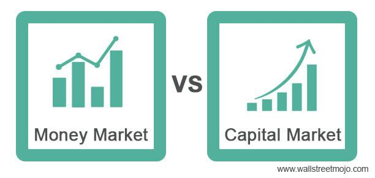

In the complex world of finance, various markets facilitate different types of trades, each serving a distinct purpose. Among these markets, the stock market and the broader capital market play pivotal roles. The stock market is a specific marketplace where shares of publicly held companies are issued and traded, providing a platform for businesses to raise capital by offering ownership stakes to investors. Participants, including individual traders, institutional investors, and market makers, interact within this system to benefit from price fluctuations and dividends.

In contrast, capital markets encompass a wider range of financial securities such as stocks, bonds, and derivatives. This market is essential for long-term funding, allowing entities like governments and corporations to secure the capital needed for growth and operations. It includes primary markets, where new issues are sold, and secondary markets, which enable the buying and selling of existing securities.



A crucial element influencing these financial spheres is algorithmic trading, often referred to as algo trading. This technology-driven approach employs complex algorithms to automate trading processes, enhancing the efficiency and speed of financial transactions. Understanding the distinctions between stock markets and capital markets, along with the role of algo trading, is vital for investors aiming to navigate these intricate systems. This article explores these markets and examines how algorithmic trading significantly impacts trade execution, market liquidity, and overall financial dynamics.

## Table of Contents

## Understanding Stock Markets and Capital Markets

Stock markets are platforms where shares of publicly held companies are issued and traded. These exchanges provide a venue for buying and selling ownership stakes in businesses, offering liquidity and transparency for investors. Prominent examples include the New York Stock Exchange (NYSE) and the Nasdaq, which function as regulated auction markets where transactions are facilitated through brokers. Stock markets are characterized by their focus on equity trading, a form of security that represents ownership in a corporation and entitles the holder to a portion of the company's profits through dividends and/or capital gains.

Capital markets, in contrast, are broader in scope and encompass a variety of financial instruments beyond equities. They include stocks, bonds, derivatives, and other securities, offering a comprehensive range of investment opportunities. Capital markets are vital for channeling savings and investments between suppliers of capital, such as individual and institutional investors, and users of capital, like businesses, governments, and other entities. They function through two main components: primary markets and secondary markets. In primary markets, new securities are issued and sold to investors, providing companies with capital. Secondary markets, on the other hand, are venues where existing securities are traded among investors, offering liquidity and price discovery.

The unique characteristics of stock and capital markets are shaped by their distinct functions and roles within the financial ecosystem. Stock markets are pivotal in enabling companies to raise funds by issuing new shares and in providing investors with access to equity investments. Capital markets serve a more extensive role, facilitating the trading of a wide array of financial instruments, thus fostering economic growth and stability. By efficiently allocating resources, these markets enable individuals and organizations to manage risk, diversify investment portfolios, and achieve financial goals.

## Key Differences Between Stock Markets and Capital Markets

Stock markets and capital markets are both integral components of the financial system, but they serve distinct purposes and involve different participants and securities.

**Stock Markets as a Subset of Capital Markets**

Stock markets, such as the New York Stock Exchange (NYSE) and the Nasdaq, are specific platforms where shares of publicly traded companies are bought and sold. These markets are a subset of the broader capital markets which encompass a variety of financial instruments. Stock markets specifically focus on equity trading, dealing primarily in stocks—pieces of ownership in a company.

**Capital Markets: A Broader Spectrum**

Capital markets include stock markets but extend beyond them to involve the trading of various other financial securities. This includes bonds, derivatives (such as options and futures), and fixed-income securities. The primary aim of capital markets is to channel surplus financial resources from savers to entities that require capital.

**Types of Securities Traded**

1. **Stock Markets**: The primary securities traded are equities (stocks) which represent ownership stakes in a corporation. Investors purchase shares in anticipation of earning dividends or realizing capital gains.

2. **Capital Markets**: Besides stocks, capital markets deal in:

   - **Bonds**: Debt securities representing loans made by investors to borrowers, typically corporate or governmental entities.
   - **Derivatives**: Financial contracts whose value is derived from underlying assets like stocks, bonds, commodities, etc.
   - **Other Instruments**: Including mutual funds, exchange-traded funds (ETFs), and securitized products like mortgage-backed securities (MBS).

**Participants Involved**

- **Stock Market Participants**: Primarily individual and institutional investors, including retail investors, hedge funds, pension funds, and mutual funds. These participants focus on buying and selling company stocks to achieve growth and liquidity goals.

- **Capital Market Participants**: A more diverse array of entities floods the capital markets, including corporations seeking to raise capital, governments issuing bonds, investment banks facilitating trades, and hedge funds engaging in complex financial strategies using derivatives.

**Markets Differences Summary**

While stock markets focus exclusively on the equities segment of the capital markets, capital markets provide a platform for a broader range of securities. The differentiation primarily lies in the scope and variety of available financial instruments. Understanding these distinctions helps investors and policymakers effectively navigate financial landscapes, aligning their objectives with appropriate market activities.

## The Role of Algo Trading in Modern Financial Markets

Algorithmic trading, commonly known as algo trading, utilizes computer algorithms to automate the process of trade execution, fundamentally transforming the way trades occur in stock and capital markets. Algorithms, which are sets of rules designed to solve problems or perform tasks, are employed to execute trading orders at speeds and frequencies that a human trader cannot achieve. This form of trading relies heavily on mathematical models and complex formulas to make high-speed trading decisions.

In stock markets, algo trading has revolutionized trading by facilitating rapid execution of orders and optimizing trading strategies. It allows for large volumes of shares to be traded swiftly without the immediate involvement of human decision-making, reducing the potential for errors due to emotional biases. Algorithms can analyze multiple market variables simultaneously, such as price, [volume](/wiki/volume-trading-strategy), and market conditions, to decide the optimal time and speed to execute trades. This increases market efficiency by ensuring that trades occur at the best possible prices and with minimal delays.

The capital markets, which include a broader array of financial instruments such as bonds and derivatives in addition to stocks, also benefit from algo trading. In these markets, algorithms are used to price complex securities, manage risk, and provide [liquidity](/wiki/liquidity-risk-premium) by matching buy and sell orders across global trading platforms. The use of high-frequency trading ([HFT](/wiki/high-frequency-trading-strategies)), a subset of algo trading, is particularly prevalent in capital markets. HFT can involve thousands of trades per second, facilitating liquidity and narrower spreads between bid and ask prices.

However, while algo trading offers efficiency and speed, it also carries potential risks. One of the key risks is increased market [volatility](/wiki/volatility-trading-strategies), as the sheer speed and volume of transactions can lead to significant price fluctuations in short periods. Another concern is the risk of technical failures or glitches, as seen in incidents like the 2010 Flash Crash, where a malfunctioning algorithm caused a sudden and dramatic drop in stock prices, erasing nearly $1 trillion in market value temporarily.

Despite these challenges, algo trading remains a crucial component of modern financial markets due to its advantages in trade efficiency and market liquidity. It is essential for market participants to continually monitor and refine their algorithms, taking into account regulatory frameworks and risk management strategies, to mitigate potential downsides associated with its use. Understanding and leveraging algo trading effectively can provide significant competitive advantages, driving informed decision-making and enhancing overall market productivity.

## Advantages of Algorithmic Trading

Algorithmic trading, commonly referred to as algo trading, brings a plethora of advantages to the modern financial landscape. One of its most significant benefits is the reduction of transaction costs. By automating the trade execution process, [algorithmic trading](/wiki/algorithmic-trading) minimizes the need for manual intervention, thus decreasing the chance of errors and allowing trades to be executed at optimal prices. This efficiency is crucial for large-volume trades, where even minor discrepancies in execution prices can result in substantial cost differences.

Algo trading also plays a crucial role in reducing emotional biases that often accompany human trading. Traders are sometimes susceptible to cognitive biases, such as overconfidence or panic selling, which can lead to suboptimal trading decisions. Algorithms trade based on pre-set criteria, ensuring consistent decision-making free from human emotions. This consistency not only improves trading outcomes but also helps maintain discipline in dynamic market conditions.

Precision in trade execution is another notable advantage of algorithmic trading. Algorithms can be programmed to enter and [exit](/wiki/exit-strategy) trades at precise moments, taking advantage of minute price variations that might be imperceptible to human traders. Such precision is particularly beneficial in high-frequency trading environments, where success hinges on exploiting small discrepancies across numerous transactions executed in fractions of a second.

Case studies illustrate the profound impact of algorithmic trading on market liquidity and efficiency. For example, during periods of heightened market activity or volatility, algorithms can continue to provide liquidity when traditional market makers may step back, thus stabilizing prices and preventing extreme volatility. In the Flash Crash of May 2010, despite initial contributions to volatility, algorithmic traders ultimately helped restore order once conditions stabilized, demonstrating their dual role as both contributors to and mitigators of market fluctuations.

Algorithmic trading enhances market liquidity by enabling continuous market participation. Algorithms can execute a large number of small trades, which cumulatively contribute to market depth and liquidity. This continuous flow of buy and sell orders benefits all market participants by narrowing bid-ask spreads and facilitating smoother price adjustments.

Pricing accuracy also benefits from algo trading through mechanisms like statistical [arbitrage](/wiki/arbitrage), where algorithms exploit price discrepancies between related instruments across different markets. Such trades help align prices more closely with underlying values, improving the accuracy and efficiency of market pricing mechanisms.

In conclusion, the deployment of algorithmic trading offers significant advantages, including cost efficiency, emotional neutrality, and execution precision. By bolstering liquidity and refining pricing mechanisms, algorithmic trading stands as not only a tool for traders seeking competitive advantage but also as a stabilizing force in fast-paced global financial markets.

## Potential Risks and Challenges of Algorithmic Trading

Algorithmic trading, while offering numerous benefits, also presents a set of significant challenges, particularly in terms of market volatility and technical risks. The rapid execution speeds and large volumes associated with algorithmic trading can exacerbate market fluctuations, contributing to increased volatility. One of the fundamental problems is the potential for algorithms to engage in self-reinforcing and destabilizing feedback loops, where rapid buying or selling triggers further automated responses, leading to significant short-term price swings.

High-frequency trading (HFT), a subset of algorithmic trading, has been scrutinized for its role in such market dynamics. HFT strategies operate on very short time frames, often executing trades in fractions of a second. While this can enhance liquidity under stable conditions, it also poses risks during market stress, as witnessed during flash crashes where prices drop precipitously before quickly recovering.

To mitigate these risks, regulatory bodies have implemented various measures. These include circuit breakers, which temporarily halt trading in individual stocks or broader markets when extreme volatility is detected. This pause allows human intervention and assessment to stabilize the markets before automated trading resumes. Additionally, some exchanges have adopted stricter requirements for pre-trade risk assessments to prevent erroneous trades caused by malfunctioning algorithms.

Moreover, algorithms themselves can occasionally malfunction or encounter glitches due to coding errors or unexpected market conditions, leading to substantial financial losses. To mitigate these risks, firms often implement robust testing and validation processes before deploying trading algorithms, along with real-time monitoring systems to detect and address any anomalies quickly.

Regulatory responses to high-frequency trading also include enhanced reporting and transparency requirements. In some jurisdictions, firms engaging in HFT are required to register and disclose detailed information about their trading strategies and executed trades. This transparency aims to provide regulators with the information necessary to monitor and manage the systemic risks HFT may pose.

In addition to regulatory frameworks, exchanges and trading platforms have introduced several safeguards to maintain stable market conditions. These include liquidity thresholds, which ensure a minimum level of liquidity is maintained in the market, and latency floors, which introduce a slight delay in order execution to prevent ultra-fast trades from gaining unfair advantages.

Overall, while algorithmic trading's efficiency and benefits are undeniable, its associated risks necessitate a combination of regulatory oversight and technological safeguards to ensure market stability. As financial markets continue to evolve with technological advancements, ongoing vigilance and adaptation of regulations and safeguards are crucial to manage these challenges effectively.

## Choosing the Right Approach for Traders and Investors

When deciding between automated and algorithmic trading approaches, traders and investors should first assess their trading goals, risk tolerance, and available resources. Automated trading involves using pre-set rules or signals to execute trades automatically, while algorithmic trading, or algo trading, employs advanced algorithms for executing complex strategies at high speed.

To develop robust trading strategies that combine traditional and algorithmic techniques, traders should consider integrating both fundamental and technical analysis. Fundamental analysis focuses on evaluating a company's financial health and economic indicators, while technical analysis uses historical price data and patterns. A blended strategy can be more resilient by incorporating diverse perspectives, reducing reliance on any single approach.

For instance, traders can use [machine learning](/wiki/machine-learning) algorithms to enhance the predictive power of their strategies. Python libraries such as pandas, NumPy, and scikit-learn offer tools for data analysis and modeling, allowing traders to backtest strategies and optimize performance. Here's a simple example of utilizing Python to backtest a moving average crossover strategy:

```python
import pandas as pd
import numpy as np

# Load historical price data into a pandas DataFrame
data = pd.read_csv('price_data.csv', parse_dates=True, index_col='Date')

# Calculate moving averages
data['SMA_50'] = data['Close'].rolling(window=50).mean()
data['SMA_200'] = data['Close'].rolling(window=200).mean()

# Define signals
data['Signal'] = np.where(data['SMA_50'] > data['SMA_200'], 1, 0)

# Calculate returns
data['Returns'] = data['Close'].pct_change()
data['Strategy_Returns'] = data['Signal'].shift(1) * data['Returns']

# Evaluate performance
cumulative_returns = (1 + data['Strategy_Returns']).cumprod()[-1]
print(f"Cumulative Strategy Returns: {cumulative_returns:.2f}")
```

Selecting appropriate trading platforms and tools is crucial for implementing and managing these strategies. Consider platforms that provide real-time data feeds, extensive analytical features, and robust security protocols. Platforms like MetaTrader, QuantConnect, and [Interactive Brokers](/wiki/interactive-brokers-api) cater to different trading needs, from casual investors to professional traders. Additionally, ensure a platform's compatibility with various programming languages and APIs to allow seamless integration of custom algorithms and models.

Risk management is another key aspect of choosing the right trading approach. Implement measures such as setting stop-loss orders, diversifying portfolios, and continuously monitoring market conditions to mitigate potential risks. Tools that support risk analytics and provide insights into portfolio performance can enhance decision-making and strategy adjustments.

Ultimately, the choice between automated and algorithmic trading should align with an individual's objectives and capabilities. Combining traditional insights with advanced technologies can offer a balanced approach to navigating modern financial markets, enabling traders to capitalize on opportunities while minimizing risks. Continuous learning and adaptation to new tools and methodologies will be indispensable as financial markets evolve with technological advancements.

## Conclusion

In conclusion, distinguishing between stock markets and capital markets is fundamental for investors aiming to make informed decisions. Stock markets, as specialized venues for trading equity securities, facilitate the buying and selling of company shares, offering investors opportunities for ownership and profit from corporate growth. Meanwhile, capital markets present a more comprehensive platform that includes the trading of a variety of financial instruments such as bonds and derivatives, alongside stocks. Recognizing these distinctions is crucial for tailoring investment strategies according to risk tolerance and financial goals.

The critical role of algorithmic trading within these markets cannot be overstated. Algorithmic trading, through the use of sophisticated algorithms, enhances the efficiency and speed of trade execution. It holds the potential to lower transaction costs and remove human biases, thereby making trading more precise and market operations more liquid. However, it is essential to acknowledge the accompanying challenges, such as increased volatility and systemic risks linked to high-frequency trading.

As financial markets continue to evolve with technological advancements, investors and traders must commit to continuous learning and adaptation. Understanding the ongoing developments in algo trading and market dynamics will equip market participants to navigate the complexities of the finance world more effectively. Therefore, staying informed and updating investment strategies in line with technological progress will be imperative for achieving desired financial outcomes.

## References & Further Reading

[1]: Harris, L. (2003). ["Trading and Exchanges: Market Microstructure for Practitioners."](https://www.amazon.com/Trading-Exchanges-Market-Microstructure-Practitioners/dp/0195144708) Oxford University Press.

[2]: Aldridge, I. (2013). ["High-Frequency Trading: A Practical Guide to Algorithmic Strategies and Trading Systems."](https://www.amazon.com/High-Frequency-Trading-Practical-Algorithmic-Strategies/dp/1118343506) Wiley Trading.

[3]: Hasbrouck, J. (2007). ["Empirical Market Microstructure: The Institutions, Economics, and Econometrics of Securities Trading."](https://archive.org/details/empiricalmarketm0000hasb) Oxford University Press.

[4]: Johnson, B. (2010). ["Algorithmic Trading & DMA: An Introduction to Direct Access Trading Strategies."](https://archive.org/details/algorithmictradi0000john) 4Myeloma Press.

[5]: Engle, R. F., & Lange, J. (2001). ["Predicting VNET: Trading volume using number of trades, number of limits and number of cancellations."](https://journals.sagepub.com/doi/abs/10.1177/17470218241300115) Journal of Financial Markets, 4(2), 113-142.