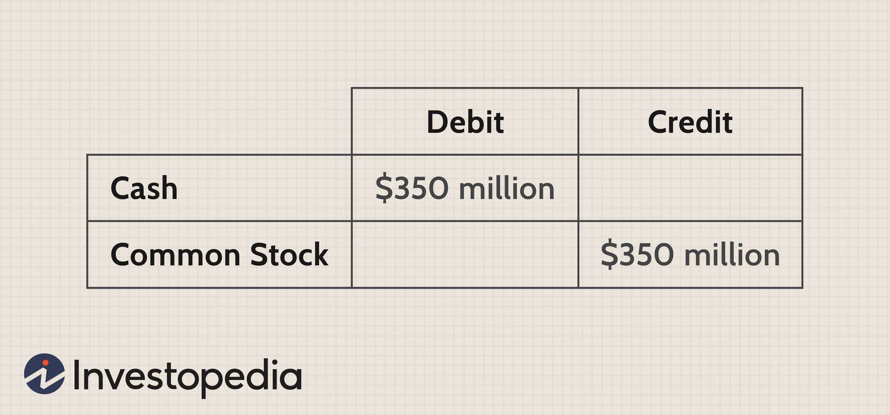

In the fast-evolving world of finance, acquiring a comprehensive understanding of various types of stocks and trading methodologies is crucial for investors aiming to maximize their investment returns. Stocks can be broadly categorized into capital stock and treasury stock, each having distinct characteristics and implications for investors and companies alike. Capital stock encompasses the total shares that a company is authorized to issue, which includes both common and preferred shares as specified in the corporate charter. On the other hand, treasury stock consists of shares that the company holds in its treasury, typically acquired through buybacks.

Investors should be aware of the differences between these stock types, as capital stock generally confers voting rights and may provide dividends to shareholders, thereby representing true equity ownership in a company. In contrast, treasury stock does not offer such privileges as it is owned by the company itself and is essentially dormant in terms of voting and dividend rights. The decision for a company to buy back shares, thus increasing its treasury stock, or to issue more shares, thereby expanding its capital stock, can have significant strategic implications, reflecting on financial ratios and affecting shareholder value.



Furthermore, in an age where technological advancements are rapidly reshaping the financial landscape, understanding algorithmic trading is equally imperative. Algorithmic trading employs computer algorithms to execute trades based on predefined criteria such as price points, volume thresholds, and timing, allowing for swift and precise trade execution. This trading methodology is engineered to minimize human error and emotional biases that might otherwise occur during manual trading processes.

This article seeks to explore the nuances of capital stock, treasury stock, and algorithmic trading, furnishing investors with the insights needed to refine their investment strategies. By clarifying these concepts, we aim to enhance your decision-making processes and potentially improve financial outcomes in your investment pursuits.

## Table of Contents

## Capital Stock vs. Treasury Stock: The Basics

Capital stock represents the aggregate number of shares that a company is authorized to issue, as mandated by its corporate charter. This encompasses both common and preferred shares. Common shares typically confer voting rights to shareholders, allowing them to have a say in corporate decisions, such as electing the board of directors or approving significant corporate policies. Additionally, common shareholders may also receive dividends, which are typically distributed from the company’s profits. Preferred shares, although usually devoid of voting rights, offer a fixed dividend, providing a steady income stream to shareholders, and they have a higher claim on assets in the event of liquidation.

Conversely, treasury stock refers to shares that the company has repurchased from the marketplace and holds within its own treasury. These shares are considered issued but not outstanding, and they do not possess voting rights or the ability to earn dividends. Treasury stocks are often the result of stock buybacks, wherein a company repurchases its own shares to reduce the number of outstanding shares in the public domain. This can be part of a strategy to increase the value of remaining shares, as a reduced supply can lead to higher share prices if demand remains constant or increases. Buybacks can also be employed to consolidate corporate control by reducing the number of shares available to external investors.

The fundamental distinction between capital stock and treasury stock lies in their purpose and function within the company. While capital stock facilitates the raising of capital and entitles shareholders to certain rights and potential earnings, treasury stock serves more as an instrument for financial management and strategic control, forfeiting ordinary shareholder rights.

## Key Differences Between Capital Stock and Treasury Stock

Capital stock and treasury stock are two distinct components of a company's equity, serving different roles and possessing varied characteristics. Understanding these differences is crucial for interpreting a company's financial standing and investment strategies.

**Equity Ownership vs. Non-Voting Shares**

Capital stock represents the equity ownership in a company. It includes shares that are initially issued to investors, providing them with rights to dividends and voting privileges at shareholder meetings. Depending on the structure, capital stock might comprise common shares, which typically offer voting rights, and preferred shares, which may offer preferential dividend payments but may have limited or no voting rights.

In contrast, treasury stock refers to shares that a company has repurchased and holds in its own treasury. These shares are effectively taken out of circulation and do not confer voting rights or the entitlement to dividends. As such, treasury stock cannot be considered as part of equity ownership by external investors; instead, it is stock owned by the issuing company itself.

**Impact on Financial Ratios**

One of the primary differences between capital stock and treasury stock lies in their influence on financial ratios. Capital stock, as recorded on the company's balance sheet, directly contributes to the equity section, impacting metrics like earnings per share (EPS). EPS is calculated as:

$$
\text{EPS} = \frac{\text{Net Income} - \text{Preferred Dividends}}{\text{Weighted Average Shares Outstanding}}
$$

Since treasury stock is subtracted from the total outstanding shares when calculating the weighted average shares outstanding, it can increase the EPS by reducing the share count denominator. However, treasury stock itself does not directly impact other ratios like debt-to-equity, as it is a reduction in total equity.

**Strategic Financial Actions**

Companies may increase their capital stock by issuing new shares to raise capital. This is often done to fund new projects, pay down debt, or acquire other businesses. Issuing additional shares can dilute existing shareholders' equity but provides the company with fresh capital.

On the other hand, purchasing treasury stock—commonly known as a stock buyback—serves different strategic purposes. Companies might buy back shares to consolidate ownership, potentially reducing dilution, or to boost the market price of remaining shares. Treasury stock transactions signal to the market that the company believes its shares are undervalued.

In summary, capital stock denotes the total equity ownership available to investors, inclusive of rights to dividends and governance participation, while treasury stock consists of shares reacquired by the issuing company, devoid of voting and dividend rights. The strategic use of either can significantly influence a company's financial dynamics and investor relations.

## What is Algorithmic Trading?

Algorithmic trading, often referred to as algo trading, involves the use of complex algorithms to automate the trading process by executing orders based on predefined sets of rules. These rules consider multiple factors, such as price, [volume](/wiki/volume-trading-strategy), and timing, enabling a systematic and strategic approach to buying and selling financial instruments.

The core advantage of [algorithmic trading](/wiki/algorithmic-trading) lies in its ability to execute trades at high speeds. Algorithms can analyze data and react to market changes in a fraction of a second, far beyond the capabilities of human traders. This speed is crucial in utilizing short-term opportunities that are often invisible to human eye and judgment.

Furthermore, algo trading significantly reduces human errors and emotional influences during trading. Psychological factors such as fear and greed, which can lead to irrational trading decisions, are eliminated as algorithms strictly follow their programmed instructions without deviation. This leads to more consistent and objective trading outcomes.

For instance, an example of a basic algorithmic strategy could be:

```python
# Python pseudo-code for a simple moving average crossover strategy
def moving_average(prices, window_size):
    return sum(prices[-window_size:]) / window_size

def algorithmic_trading(prices, short_window, long_window):
    short_ma = moving_average(prices, short_window)
    long_ma = moving_average(prices, long_window)

    if short_ma > long_ma:
        return "Buy"
    elif short_ma < long_ma:
        return "Sell"
    else:
        return "Hold"
```

This code snippet illustrates a simple moving average crossover strategy, where the algorithm recommends buying or selling an asset based on the relationship between short-term and long-term moving averages.

Thus, algo trading not only optimizes execution efficiency but also provides an analytical framework by which traders can minimize risks and enhance returns.

## Types and Applications of Algorithmic Trading

Algorithmic trading, also known as algo trading, encompasses various strategy types that leverage computer algorithms to execute trades based on established criteria such as price movements, trading volumes, and specific time frames. Here we will discuss some prevalent algo trading strategies, namely trend-following strategies, [arbitrage](/wiki/arbitrage) opportunities, and market-making strategies, and explore their applications across different financial markets.

### Trend-Following Strategies

Trend-following is one of the most common algorithmic trading methods. This strategy involves analyzing historical data to identify market trends, using these trends to guide trading decisions. Algorithms in trend-following trading identify upward or downward patterns and execute trades to capitalize on these movements. This approach often uses technical indicators like moving averages and the relative strength index (RSI) to predict future movements. A simple example is a moving average crossover strategy, where the algo trades when a short-term moving average crosses above or below a long-term moving average.

### Arbitrage Opportunities

Arbitrage strategies involve profiting from price discrepancies across different markets or instruments. With algorithmic trading, traders can rapidly execute trades to exploit these differences before the market corrects itself. This could include cross-exchange arbitrage, where a security is bought on one exchange and simultaneously sold on another at a higher price. The complexity of these algorithms can be enhanced by incorporating statistical methods to find less obvious price divergences, known as [statistical arbitrage](/wiki/statistical-arbitrage) or pairs trading, where mispriced securities correct back towards each other over time.

### Market-Making Strategies

Market-making strategies involve providing [liquidity](/wiki/liquidity-risk-premium) to the market by simultaneously quoting bid and ask prices for a trading instrument to earn the bid-ask spread. Algorithmic trading is particularly suited to [market making](/wiki/market-making) because it can manage the continuous flow of order information and react within milliseconds to market changes, adjusting quotes in real-time to stay competitive and manage inventory risk. This strategy is fundamental to maintaining liquidity and reducing transaction costs for traders.

### Applications in Financial Markets

Algo trading is widely applied in various financial markets and instruments, including equities, [forex](/wiki/forex-system), options, and futures. In equities, algorithms can manage large volumes of stocks and engage in both high-frequency and long-term investment strategies. In the forex market, algo trading capitalizes on minor pricing inefficiencies across multiple currency exchanges. Options trading utilizes algorithms for complex strategies, like delta-neutral approaches, which manage risk across various dimensions. In futures markets, algo trading can execute swift trades in response to news events or economic indicators.

Portfolio management also benefits substantially from algo trading, where sophisticated algorithms manage rebalancing and risk while optimizing returns according to a specified strategy or investor preference. Algorithms ensure that portfolios maintain their target allocations, even amidst volatile market conditions, enhancing the precision and timing of trades.

In summary, the diverse strategies and widespread applications of algorithmic trading contribute substantially to market efficiency, liquidity, and the optimization of trading processes across various financial instruments and markets.

## Benefits and Challenges of Algorithmic Trading

Algorithmic trading, commonly known as algo trading, offers numerous advantages that make it an essential tool in modern financial markets. One of its main benefits is speed. Algorithms can execute trades within milliseconds, exploiting brief market inefficiencies that a human trader might miss. This ability to process large volumes of data and execute trades at high speed contributes significantly to market liquidity and price discovery.

Efficiency is another critical advantage of algo trading. By automating trading processes, algo trading minimizes human errors and operates continuously without fatigue. This constant operation ensures optimal trading opportunities are captured at all times, even outside regular market hours.

Eliminating emotional biases is a distinctive benefit of algorithmic trading. Human traders are susceptible to psychological factors, such as fear and greed, which can lead to irrational decision-making. Algorithms, however, execute trades based on pre-defined rules devoid of emotional influences, ensuring consistent and objective trading outcomes.

Backtesting capabilities are intrinsic to effective algorithmic trading strategies. Traders can test their strategies against historical data to determine their viability under different market conditions. This process allows for the refinement and optimization of trading algorithms before deploying them in live markets, thereby reducing risk.

Despite these benefits, algorithmic trading presents several challenges. Technical failures pose a significant risk. Algorithms depend on complex technical infrastructure, including robust internet connections and reliable data feeds. A failure in any of these components can lead to substantial financial losses. Therefore, building redundant and fault-tolerant systems is crucial for minimizing such risks.

Another challenge is overfitting to historical data. While [backtesting](/wiki/backtesting) is valuable, there is a danger of developing algorithms that perform exceptionally well on historical data but fail to adapt to future market conditions. This problem often arises from over-optimization, where the algorithm becomes tailored to past data imperfections, reducing its robustness in live trading.

Lastly, the high infrastructure costs associated with algorithmic trading can be a barrier to entry for smaller firms or individual traders. Implementing high-frequency trading systems requires significant investments in technology and data analytics, which may not be feasible for everyone.

In conclusion, while algorithmic trading provides substantial benefits in terms of speed, efficiency, and objectivity, and offers backtesting to refine strategies, it also demands careful consideration of technical vulnerabilities, the risk of overfitting, and significant infrastructure expenses. These factors play a critical role in determining the success and applicability of algorithmic trading strategies.

## Conclusion

Understanding the distinctions between capital stock and treasury stock, along with the intricacies of algorithmic trading, can substantially impact investment strategies. Recognizing that capital stock reflects equity ownership with associated rights and benefits, while treasury stock represents shares a company has repurchased and now holds without voting rights or dividends, is essential for investors seeking control and financial optimization.

Algorithmic trading further enhances investment strategies by offering precision and speed, characteristics particularly crucial in today's fast-paced financial markets. By leveraging algorithmic trading, investors can conduct trades based on predefined criteria, thereby reducing the influence of emotional biases that frequently affect manual trading processes. This approach not only facilitates high-frequency trading but also provides the ability to backtest strategies against historical data to refine and optimize financial outcomes.

For investors, mastering these concepts is not merely academic. It equips them with the analytical and strategic tools necessary for informed decision-making, enabling them to navigate complex financial landscapes more effectively. Understanding these elements can lead to more robust portfolio management and, ultimately, improved financial results.

## References & Further Reading

[1]: ["The Intelligent Investor: The Definitive Book on Value Investing"](https://www.amazon.com/Intelligent-Investor-Definitive-Investing-Essentials/dp/0060555661) by Benjamin Graham

[2]: ["Common Stocks and Uncommon Profits"](https://www.amazon.com/Common-Stocks-Uncommon-Profits-Writings/dp/0471445509) by Philip A. Fisher

[3]: ["Advances in Financial Machine Learning"](https://www.amazon.com/Advances-Financial-Machine-Learning-Marcos/dp/1119482089) by Marcos Lopez de Prado

[4]: ["Quantitative Trading: How to Build Your Own Algorithmic Trading Business"](https://www.amazon.com/Quantitative-Trading-Build-Algorithmic-Business/dp/1119800064) by Ernest P. Chan

[5]: ["Options, Futures, and Other Derivatives"](https://www.amazon.com/Options-Futures-Other-Derivatives-9th/dp/0133456315) by John C. Hull

[6]: ["Machine Learning for Algorithmic Trading"](https://github.com/stefan-jansen/machine-learning-for-trading) by Stefan Jansen

[7]: ["Trading and Exchanges: Market Microstructure for Practitioners"](https://www.amazon.com/Trading-Exchanges-Market-Microstructure-Practitioners/dp/0195144708) by Larry Harris

[8]: Howe, J. S., & Lin, J. C. (1992). ["Why companies issue seasoned equity: Evidence from deli equity rights offerings."](https://scholar.google.com/citations?user=aMx2mI8AAAAJ&hl=en) The Journal of Portfolio Management, 8(1), 19-23.