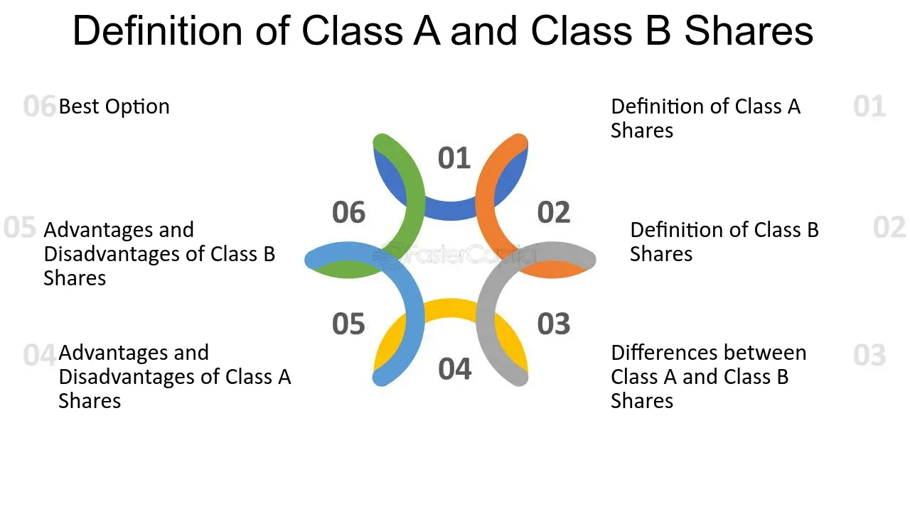

## Table of Contents

## What are Class A shares?

Class A shares are a type of stock that companies issue. They usually give the people who own them more voting power than other types of shares. This means that if you own Class A shares, you have a bigger say in how the company is run. Companies might issue Class A shares to keep control in the hands of certain people, like the founders or key investors.

Sometimes, Class A shares also come with other benefits. For example, they might offer higher dividends, which are payments the company makes to its shareholders. This makes them attractive to investors who want both more control and more money from their investment. However, not all companies use Class A shares in the same way, so it's important to check the specifics of each company's stock structure.

## What are Class B shares?

Class B shares are another type of stock that companies can issue. They usually come with fewer voting rights than Class A shares. This means that if you own Class B shares, you have less say in how the company makes decisions. Companies might issue Class B shares to raise money without giving up too much control. This can be good for the company because it keeps the power with the people who started it or with key investors.

Sometimes, Class B shares are cheaper than Class A shares. This can make them more attractive to smaller investors who want to buy into the company but can't afford the more expensive Class A shares. However, because Class B shares often have fewer benefits, like lower or no voting rights, they might not be as appealing to investors who want to have a say in the company's direction. It's important for investors to understand the differences between Class A and Class B shares before they decide which to buy.

## How do the voting rights differ between Class A and Class B shares?

Class A shares usually give their owners more voting power than Class B shares. If you own Class A shares, you get more votes for each share you own. This means you have a bigger say in how the company makes decisions, like choosing who sits on the board of directors or approving big changes to the company.

On the other hand, Class B shares come with fewer voting rights. If you own Class B shares, you get fewer votes for each share. This means you have less influence over the company's decisions. Companies might use Class B shares to raise money without giving up too much control to new investors.

## What are the typical differences in dividend payments between Class A and Class B shares?

The differences in dividend payments between Class A and Class B shares can vary depending on the company. Sometimes, Class A shares offer higher dividends than Class B shares. This is because Class A shares are often seen as more valuable, and companies might want to reward those shareholders with bigger payouts. For example, if a company decides to pay a dividend, Class A shareholders might get $1 per share, while Class B shareholders might only get $0.50 per share.

However, not all companies follow this pattern. Some companies might pay the same dividend to both Class A and Class B shareholders. This means that no matter which type of share you own, you'll get the same amount of money per share. It's important for investors to check the specific dividend policies of a company before buying its shares, as these policies can affect the overall return on their investment.

## How does the price per share usually compare between Class A and Class B shares?

The price per share for Class A and Class B shares can be different. Usually, Class A shares are more expensive than Class B shares. This is because Class A shares often come with more voting rights and sometimes higher dividends, which makes them more valuable to investors who want a bigger say in the company and more money from their investment.

However, the price difference isn't always the same for every company. Some companies might set the price of Class A and Class B shares closer to each other, especially if they want to make it easier for smaller investors to buy into the company. It's a good idea for investors to look at the specific prices and benefits of both types of shares before deciding which ones to buy.

## Can Class A shares be converted into Class B shares, and vice versa?

Whether Class A shares can be converted into Class B shares, and vice versa, depends on the company's rules. Some companies allow shareholders to convert their shares from one class to another. This means if you have Class A shares, you might be able to change them into Class B shares, or if you have Class B shares, you might be able to change them into Class A shares. This can be useful if you want to switch between having more voting power and having cheaper shares.

However, not all companies allow this kind of conversion. Some companies have strict rules that keep Class A and Class B shares separate. If a company doesn't allow conversion, then you're stuck with the type of shares you bought. It's important to read the company's rules and talk to a financial advisor to understand if you can convert your shares and what the benefits and drawbacks might be.

## What are the implications of owning Class A versus Class B shares for long-term investment?

Owning Class A shares for long-term investment can be good if you want more control over the company. These shares usually give you more votes, so you can help decide important things like who runs the company or big changes it makes. Sometimes, Class A shares also pay higher dividends, which means you get more money back from your investment over time. But, Class A shares are often more expensive, so you need to think about if the extra cost is worth the benefits you get.

On the other hand, Class B shares might be better if you're looking to invest without spending as much money. These shares are usually cheaper, which can be good if you want to buy more shares with less money. But, Class B shares come with fewer votes, so you won't have as much say in the company's decisions. Also, the dividends might be lower or the same as Class A shares, so you need to decide if the lower price is worth having less control and possibly less money back.

In the end, choosing between Class A and Class B shares for long-term investment depends on what you want. If having a say in the company and possibly getting more dividends is important to you, Class A shares might be the better choice. But if you want to spend less money and are okay with less control, Class B shares could be the way to go. Always look at the specific details of the company's shares before you decide.

## How do Class A and Class B shares impact corporate governance?

Class A and Class B shares can affect how a company is run. Class A shares usually give their owners more votes. This means people with Class A shares can have a bigger say in choosing the company's leaders and making important decisions. Companies might use Class A shares to keep control with the founders or key investors. This can help the company stick to its original goals and vision.

On the other hand, Class B shares have fewer votes. This means people with Class B shares don't get as much say in the company's decisions. Companies might issue Class B shares to raise money without giving up too much control. This can be good for the company but might make some investors feel left out of important decisions. So, the type of shares a company issues can shape how it's governed and who has the power to make changes.

## What are the tax considerations for investors holding Class A versus Class B shares?

The tax considerations for investors holding Class A and Class B shares can be similar because both types of shares represent ownership in the same company. When a company pays dividends, whether you own Class A or Class B shares, you will have to pay taxes on those dividends. The tax rate on dividends depends on your income and the tax laws in your country. So, if a company pays the same dividend to both Class A and Class B shareholders, the tax you pay will be the same for both types of shares.

However, if Class A shares pay higher dividends than Class B shares, you might end up paying more in taxes if you own Class A shares. This is because you'll have more dividend income to report on your taxes. Also, if you sell your shares and make a profit, you'll have to pay capital gains tax on that profit. The tax rate for capital gains can depend on how long you held the shares before selling them. So, whether you own Class A or Class B shares, you need to think about these tax rules when planning your investments.

## How might the market liquidity differ between Class A and Class B shares?

Market [liquidity](/wiki/liquidity-risk-premium) can be different for Class A and Class B shares. Liquidity means how easy it is to buy or sell shares without affecting their price too much. Usually, Class A shares might be less liquid than Class B shares because they are often held by people who want to keep control of the company, like founders or big investors. These people might not want to sell their shares often, so there are fewer Class A shares being traded.

On the other hand, Class B shares might be more liquid because they are often cheaper and more people can afford to buy them. More people trading Class B shares means there's usually a bigger market for them. This can make it easier for you to sell your Class B shares quickly if you need to. So, if you care about being able to buy or sell shares easily, you might want to think about the liquidity of Class A and Class B shares before you invest.

## What are the strategic reasons a company might issue both Class A and Class B shares?

A company might issue both Class A and Class B shares to keep control in the hands of certain people, like the founders or key investors, while still raising money from the public. By giving Class A shares more voting power, the company can make sure that the people who started it or who have a big stake in it can still make important decisions. This helps the company stick to its original goals and vision, even as it grows and brings in more investors.

At the same time, issuing Class B shares lets the company raise money without giving up too much control. Class B shares are often cheaper, so more people can afford to buy them. This can attract a wider range of investors who want to own part of the company but don't need as much say in how it's run. By using both types of shares, the company can balance the need for money with the desire to keep control in the right hands.

## How do Class A and Class B shares affect the control dynamics within a company?

Class A and Class B shares can change who has the most power in a company. Class A shares usually give more votes to the people who own them. This means that if you have Class A shares, you can help decide big things like who runs the company or what big changes it makes. Companies might use Class A shares to keep control with the people who started the company or with important investors. This helps make sure the company stays true to what it was meant to do.

On the other hand, Class B shares give fewer votes to their owners. This means that if you have Class B shares, you don't get to help make as many decisions. Companies might issue Class B shares to get more money without letting new investors take over. This can help the company grow without losing its original direction. So, the type of shares a company issues can really change who has the power to make choices and how the company is run.

## What are the differences between algorithmic trading and class share differences?

Algorithmic trading harnesses computational power to identify trading opportunities, often exploiting inefficiencies such as the price differences and [volatility](/wiki/volatility-trading-strategies) between Class A and Class B shares. These differences arise due to distinct characteristics associated with each share class, such as varying voting rights and market perceptions. Algorithmic trading strategies, such as pairs trading and statistical [arbitrage](/wiki/arbitrage), leverage these disparities to generate potential profits.

Pairs trading involves the simultaneous buying and selling of two related securities to profit from the relative changes in their prices. When applied to Class A and Class B shares, an algorithm identifies abnormal deviations between their price ratios. If the prices diverge from their historically observed ratio, the algorithm might buy the undervalued share and short the overvalued one, anticipating a reversion to the mean. Such a strategy assumes that the shares will revert to their average pricing relationship over time.

Statistical arbitrage extends this concept by utilizing more sophisticated mathematical models and data analysis. This approach typically involves determining a statistical relationship between multiple pairs of shares and identifying price anomalies that exceed expected volatility thresholds. A simplified model might employ a z-score to quantify the deviation from normal price differences between Class A and Class B shares:

$$

Z = \frac{(P_A - P_B) - \mu}{\sigma} 
$$

where $P_A$ and $P_B$ represent the prices of Class A and Class B shares, $\mu$ is the mean price difference, and $\sigma$ denotes the standard deviation. A significant z-score may trigger buy or sell actions within the algorithm.

Understanding the intricate dynamics of share classes is essential for developing informed trading algorithms. Companies issuing multiple classes of shares often maintain different control mechanisms and market strategies, which in turn influence their pricing structures. This knowledge is crucial for making accurate predictions and executing trades that exploit these structural differences effectively. As [algorithmic trading](/wiki/algorithmic-trading) continues to evolve, the ability to leverage class share differences remains a valuable tool for traders seeking to optimize returns.

## References & Further Reading

[1]: ["Common Stock Classification and Corporate Power"](https://www.investopedia.com/terms/c/commonstock.asp) by Adolf A. Berle and Gardiner C. Means. The Quarterly Journal of Economics, 1932.

[2]: ["Dual-Class Share Structures in the U.S."](https://www.investopedia.com/terms/d/dualclassstock.asp) by Council of Institutional Investors, Harvard Law School Forum on Corporate Governance.

[3]: ["Algorithmic Trading and DMA: An Introduction to Direct Access Trading Strategies"](https://www.semanticscholar.org/paper/Algorithmic-trading-%26-DMA-%3A-an-introduction-to-Johnson/aa5de1ab883d5e23b6651faa7c1807586d688e4b) by Barry Johnson.

[4]: ["Optimal Enterprise Risk Trading"](https://www.jstor.org/stable/26483867) by David Durrett. IEEE Transactions on Automatic Control, 2012.

[5]: ["Mechanisms of Market Efficiency"](https://www.semanticscholar.org/paper/The-Mechanisms-of-Market-Efficiency-Twenty-Years-Gilson-Kraakman/75bd1bece0ef33ee080eef3190c4c0dbebd2ef91) by Sanford J. Grossman and Joseph E. Stiglitz, The American Economic Review, 1980.