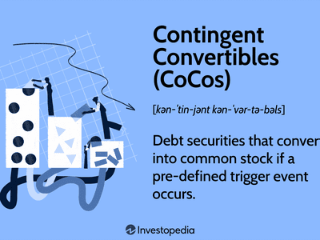

This article explores the landscape of bond valuation, focusing on both traditional and convertible bonds. Traditional bonds, often seen as the backbone of the fixed-income market, provide investors with predictable income streams through periodic interest payments, known as coupons, and the return of principal at maturity. Convertible bonds, on the other hand, offer a unique hybrid structure that combines aspects of debt and equity, allowing investors to convert bonds into a predetermined number of shares, thus integrating both fixed-income security and potential equity upside.

In recent years, the inclusion of algorithmic trading has significantly enhanced the efficiency of bond markets. Algorithmic trading employs sophisticated technologies to execute trades based on predefined strategies, offering improved precision, speed, and risk management. This technological evolution has transformed traditional trading paradigms, leading to increased market liquidity and more efficient pricing mechanisms.

By understanding the distinct characteristics and valuation techniques of traditional and convertible bonds, investors can be better prepared to navigate the complexities of modern financial markets. The methodologies for valuing these bonds involve analyzing future cash flows and applying appropriate discount rates, with convertible bonds requiring additional considerations due to their equity-linked features. As technology continues to advance, integrating these innovations with traditional bond valuation models becomes vital for developing robust investment strategies. This discussion aims to illuminate the intersection of modern financial technology and time-honored investment concepts, providing a comprehensive framework for investors seeking to optimize their bond portfolios in an ever-evolving market landscape.

## Table of Contents

## Understanding Traditional Bonds

Traditional bonds are a fundamental component of the fixed-income market, representing debt instruments issued by entities such as governments, municipalities, or corporations. Investors typically purchase these bonds to receive periodic interest payments, known as coupons, and the return of the bond's face value upon maturity. 

### Bond Structure: Coupons, Maturity, and Face Value

The basic structure of traditional bonds encompasses three main components:

1. **Coupons**: Bonds usually offer investors fixed coupon payments at regular intervals, often annually or semi-annually. These payments are calculated as a percentage of the bond’s face value, known as the coupon rate. For example, a bond with a face value of $1,000 and a coupon rate of 5% would pay $50 annually in interest.

2. **Maturity**: This refers to the time period over which the bond issuer is obligated to repay the bondholder the face value of the bond. Maturity can range from short-term (less than three years) to long-term (more than ten years).

3. **Face Value (Par Value)**: The face value is the principal amount of the bond that is paid back to the bondholder at the time of maturity. While bonds are generally issued at face value, market conditions can cause the price of a bond to fluctuate, trading at a premium or discount before maturity.

### Impact of Interest Rates and Economic Conditions

The valuation of traditional bonds is intricately linked to prevailing interest rates and broader economic conditions. Interest rates have an inverse relationship with bond prices: when interest rates rise, bond prices tend to fall and vice versa. This is because as new bonds are issued at higher rates, existing bonds with lower rates become less attractive, reducing their market value. The formula for bond price $P$ can be expressed as:

$$

P = \sum_{t=1}^{T} \frac{C}{(1 + r)^t} + \frac{F}{(1 + r)^T} 
$$

where $C$ is the annual coupon payment, $r$ is the discount rate (reflecting prevailing interest rates), $F$ is the face value, and $T$ is the time to maturity.

Economic conditions, such as inflation, GDP growth, and fiscal policies, also play crucial roles. High inflation typically leads to higher interest rates, which can decrease bond prices. Economic growth can affect credit risk perceptions, influencing bond yields and pricing.

### Credit Risk and Market Volatility

Credit risk refers to the possibility that a bond issuer may fail to meet its obligations, including the payment of interest or the principal amount at maturity. Bonds issued by entities with higher credit risk typically offer higher yields to compensate investors for the added risk. Credit ratings provided by agencies such as Moody's, Standard & Poor's, and Fitch help investors assess credit risk.

Market [volatility](/wiki/volatility-trading-strategies) can also affect bond values, as changes in economic indicators, political events, or shifts in investor sentiment can lead to price fluctuations. While traditional bonds are often considered safer investments than equities due to their fixed interest payments, they are still subject to market risks that can influence their value and yield.

In summary, traditional bonds are a staple of fixed-income portfolios, deeply influenced by underlying economic conditions, interest rates, and issuer creditworthiness. Understanding these aspects is crucial for investors seeking stable returns amid potential market fluctuations.

## Convertible Bonds: A Hybrid Instrument

Convertible bonds are innovative financial instruments that provide investors with the option to convert their bond holdings into a predetermined number of company shares, thereby bridging the gap between debt and equity markets. This unique characteristic offers both potential for growth and risk mitigation, making convertible bonds a versatile component of any investment strategy.

The key components that define the structure of convertible bonds include the conversion ratio, conversion price, and conversion premium. The conversion ratio dictates the number of shares a bondholder will receive upon conversion. It is calculated as:

$$
\text{Conversion Ratio} = \frac{\text{Par Value of Bond}}{\text{Conversion Price}}
$$

The conversion price is the predetermined price at which the bond can be converted into shares. Meanwhile, the conversion premium represents the excess amount that investors effectively pay above the current stock price for the option to convert, providing a buffer and reducing immediate dilution of value. It can be calculated using the formula:

$$
\text{Conversion Premium} = \left( \frac{\text{Conversion Price} - \text{Current Share Price}}{\text{Current Share Price}} \right) \times 100\%
$$

Convertible bonds offer several benefits such as lower interest costs compared to traditional debt and potential upside from equity appreciation. These instruments also reduce investor risk; in bearish market conditions, investors can hold the bond until maturity, while in bullish markets, they may convert their bonds to capitalize on rising stock prices.

Nevertheless, convertible bonds also [carry](/wiki/carry-trading) risks and complexities. Traditional bonds provide predictable cash flows, while the value of convertible bonds is more complex due to the equity-linked option, which introduces market volatility and the challenge of predicting future equity prices. The valuation of convertible bonds often employs option pricing models to account for this complexity, incorporating variables such as stock volatility, interest rates, and time to maturity.

Overall, when comparing convertible and traditional bonds, investors must weigh the stability of steady interest returns against the potential for higher but less predictable returns. Understanding these dynamics is crucial for selecting the right bond type to match an investor's risk tolerance and market outlook.

## The Role of Valuation in Bond Investments

Valuation plays a crucial role in assessing both traditional and convertible bonds, as it determines their fair market value, which influences investment decisions and portfolio management. Traditional bonds typically provide fixed interest payments over a specified term, and their valuation is primarily focused on forecasting future cash flows and applying appropriate discount rates. In contrast, convertible bonds present additional complexities due to their hybrid nature, allowing conversion into equity under certain conditions.

### Key Valuation Models

For traditional bonds, the valuation is often done using the Present Value (PV) of future cash flows. The formula for a bond's price $P$ is given by:

$$

P = \sum_{t=1}^{T} \frac{C}{(1 + r)^t} + \frac{F}{(1 + r)^T} 
$$

where:
- $C$ is the annual coupon payment,
- $F$ is the face value of the bond,
- $r$ is the discount rate,
- $T$ is the total number of periods until maturity.

This approach considers the time value of money, where future cash flows are discounted back to their present value based on an appropriate discount rate, often reflecting prevailing interest rates and the issuer's credit risk.

Convertible bonds, however, require additional valuation methodologies considering both their debt and equity components. A common approach is to separate and value each component using options pricing models like the Black-Scholes model or binomial models, which assess the equity conversion feature.

### Valuation Complexity

The complexity in valuing convertible bonds arises from their option-like feature, which allows for conversion into a predetermined number of shares. This flexibility makes the valuation more dynamic, requiring sophisticated models that capture the volatility and market conditions affecting the underlying equity. This introduces parameters such as stock price volatility, dividend yields, and the likelihood of conversion.

For instance, the valuation might involve calculating the bond floor (minimum value as a bond without conversion rights) and the conversion value (value if converted immediately), with the convertible bond price typically being the higher of the two.

### Challenges and Strategies

One of the significant challenges in valuing convertible bonds is predicting future equity conversion prices. Market conditions, including stock volatility and [interest rate](/wiki/interest-rate-trading-strategies) changes, can significantly impact conversion scenarios. Investors often use stochastic models, simulating various paths for stock prices to estimate potential conversion outcomes, thereby aiding in understanding the comparative advantage or risk in holding these instruments.

Strategies such as Delta hedging, which maintains a neutral position on the underlying stock, can be employed to manage risks inherent in holding convertible bonds. This involves dynamically adjusting the portfolio as market conditions change to offset potential losses or gains from the equity conversion feature.

In conclusion, while traditional bond valuation is relatively straightforward, involving assessment of fixed future cash flows, convertible bond valuation encompasses a multifaceted approach, considering both bond and equity market dynamics. Understanding these differences and the challenges associated with predicting future equity values is essential for investors aiming to optimize their bond investment strategies.

## Algorithmic Trading in Bond Markets

Algorithmic trading is a sophisticated method of executing trades using pre-programmed instructions that consider variables such as timing, price, and [volume](/wiki/volume-trading-strategy). In the bond markets, this approach offers several advantages, including enhanced speed, precision, and risk management.

One significant benefit of [algorithmic trading](/wiki/algorithmic-trading) in bond markets is its speed. Algorithms can process data and execute trades much faster than human traders. This capability allows investors to capitalize on small price discrepancies that would otherwise be missed. It also mitigates the risk of slippage—the difference between the expected price of a trade and the actual price—by executing orders quickly in rapidly moving markets.

Precision is another crucial advantage. Algorithms follow strictly defined criteria, ensuring trades align precisely with investment strategies. This precision reduces the likelihood of human errors that can occur in manual trading, providing consistency and reliability in execution.

Risk management is enhanced through sophisticated algorithms that can be programmed to adjust strategies based on market conditions. For example, an algorithm can be set to [exit](/wiki/exit-strategy) a position if volatility exceeds a certain threshold, thus limiting potential losses. This dynamic adjustment capability helps in maintaining optimal risk-reward ratios.

Algorithmic trading also impacts market [liquidity](/wiki/liquidity-risk-premium) and pricing efficiency. By facilitating a higher volume of trades and providing continuous market participation, algorithms contribute to increased liquidity. This increased liquidity tends to narrow bid-ask spreads, enhancing pricing efficiency. As a result, more accurate price discovery is achieved, benefitting all market participants.

In terms of real-world applications, algorithmic trading is increasingly being employed by institutional investors and hedge funds to execute large orders in the bond markets without significantly impacting prices. These algorithms can segment large orders into smaller, manageable parts, executing them over time to minimize market impact. Moreover, the growing relevance of [machine learning](/wiki/machine-learning) and [artificial intelligence](/wiki/ai-artificial-intelligence) in these algorithms is paving the way for adaptive trading strategies that can learn and adjust from past market data.

As algorithmic trading continues to evolve, its role in bond markets is expected to expand. The integration of big data analytics and real-time market data feeds is further enhancing the effectiveness of these strategies, allowing traders to respond instantaneously to market events. This technological advancement underscores the need for continuous adaptation and learning by market participants to fully leverage the benefits of algorithmic trading in bond markets.

## Traditional vs. Convertible Bond Trading Strategies

The trading strategies applied to traditional and convertible bonds differ significantly, primarily due to their distinct characteristics and risk-return profiles. Traditional bonds, being fixed-income securities, offer stable periodic returns and are commonly perceived as less risky. In contrast, convertible bonds provide the added option to convert the bond into a predetermined number of shares, making them hybrid instruments that exhibit characteristics of both debt and equity. This section explores these trading strategies, comparing their risk-return profiles and the impact of market trends.

### Trading Strategies for Traditional Bonds

Traditional bond trading strategies generally revolve around interest rate speculation, credit analysis, and duration management. Investors may use strategies such as:

1. **Laddering**: This involves purchasing bonds with different maturities to manage reinvestment risk and create a consistent income stream. As shorter-term bonds mature, funds are reinvested in longer-term securities, mitigating interest rate risk.

2. **Barbell Strategy**: In this approach, investors allocate investments in short-term and long-term bonds, avoiding medium-term maturities. This strategy aims to capture the high yields of long-term bonds while maintaining the liquidity and reduced volatility of short-term bonds.

3. **Bullet Strategy**: Investors focus on bonds that mature at the same time, allowing them to capture yields offered in specific periods. This strategy aligns with anticipated interest rate movements or future cash needs.

### Trading Strategies for Convertible Bonds

Convertible bonds offer unique opportunities due to their dual nature. Strategies often incorporate both fixed-income and equity market analysis:

1. **Convertible Arbitrage**: This strategy exploits the pricing inefficiencies between the convertible bond and the underlying stock. A common approach involves buying the convertible bond while simultaneously shorting the stock, seeking to profit from the bond's conversion option.

2. **Credit Spread Trading**: Convertible bonds are sensitive to changes in credit spreads. Traders can speculate on widening or narrowing spreads between convertible bond yields and comparable traditional bond yields.

3. **Delta Hedging**: Given the equity component, delta hedging involves adjusting a portfolio’s position in the underlying stock to remain market-neutral. This approach requires continuous rebalancing to ensure the delta, or sensitivity to stock price changes, is neutralized.

### Comparative Risk-Return Profiles

Traditional bonds typically exhibit lower risk with moderate returns, influenced primarily by interest rate changes and issuer credit risk. Convertible bonds, however, have higher risk due to their equity features, but they can offer superior returns if the underlying stock performs well. This variability attracts investors seeking a blend of income and potential capital appreciation.

### Market Trends and Investor Decisions

Market trends significantly influence strategies for both bond types. In a rising interest rate environment, traditional bonds are generally less appealing due to potential declines in value, making convertible bonds an attractive alternative because of their equity upside potential. On the other hand, in a low-volatility market, traditional bonds might become more favorable as they provide steady returns.

### Successful Case Studies

1. **The 2008 Financial Crisis**: During the crisis, many investors shifted towards high-quality government bonds for safety. This shift emphasized the effectiveness of laddering and barbell strategies to mitigate risk.

2. **Tesla's Convertible Bonds**: Investors who employed convertible arbitrage on Tesla's 2014 convertible bond issue witnessed significant returns. As Tesla's stock price surged, these bonds appreciated significantly, highlighting the potential of convertible bonds in a volatile equity market.

Traditional and convertible bond trading strategies offer distinct advantages and cater to varying investor objectives. Traditional bond strategies focus on interest rate and credit risk management, while convertible bond strategies leverage the equity component for potentially higher returns. Understanding these nuances enables investors to craft informed strategies aligned with market conditions and personal risk tolerance.

## Conclusion

In conclusion, the exploration of traditional and convertible bond valuations highlights the critical role these instruments play in the financial markets. Traditional bonds, characterized by their fixed-income structure, are pivotal in offering predictable returns and portfolio stability. Meanwhile, convertible bonds provide a unique hybrid exposure, blending fixed-income attributes with equity-like potential, making them attractive to investors seeking both income and growth. Understanding the nuances of these bond types is essential for investors aiming to devise comprehensive and resilient investment strategies.

The ongoing evolution of bond trading, particularly with the advent of algorithmic trading, represents a significant shift in how these assets are bought and sold. Algorithmic trading enhances market liquidity and pricing efficiency, allowing investors to execute transactions rapidly and with precision. Its adoption is likely to increase, driven by technological advancements that refine algorithmic models and expand their applicability within bond markets. This shift underscores the necessity for market participants to not only grasp the fundamentals of bond valuation but also to remain agile, adapting to technological changes that reshape the trading landscape.

As financial markets continue to evolve, a commitment to continuous learning and adaptation becomes paramount. Technological innovations and economic shifts demand that investors stay informed and proactive in their investment approaches. Engaging with updated knowledge, exploring new valuation techniques, and being open to emerging trading strategies will equip investors to navigate complexities in an ever-changing market environment. This adaptive mindset is vital to harnessing the full potential of both traditional and convertible bonds in future investment landscapes.

## References & Further Reading

[1]: ["Fixed Income Securities: Tools for Today’s Markets"](https://www.amazon.com/Fixed-Income-Securities-Markets-Finance/dp/1119835550) by Bruce Tuckman and Angel Serrat.

[2]: ["Convertible Securities: A Complete Guide to Investment and Corporate Financing Strategies"](https://www.amazon.com/Convertible-Securities-Investment-Corporate-Strategies/dp/1260462900) by Tracy V. Maitland and Thomas C. Noddings.

[3]: ["Options, Futures, and Other Derivatives"](https://www.amazon.com/Options-Futures-Other-Derivatives-10th/dp/013447208X) by John C. Hull.

[4]: ["Algorithmic Trading and DMA: An Introduction to Direct Access Trading Strategies"](https://www.amazon.com/Algorithmic-Trading-DMA-introduction-strategies/dp/0956399207) by Barry Johnson.

[5]: ["Advanced Bond Portfolio Management: Best Practices in Modeling and Strategies"](https://archive.org/details/advancedbondport0000unse) by Frank J. Fabozzi, Lionel Martellini, and Philippe Priaulet.