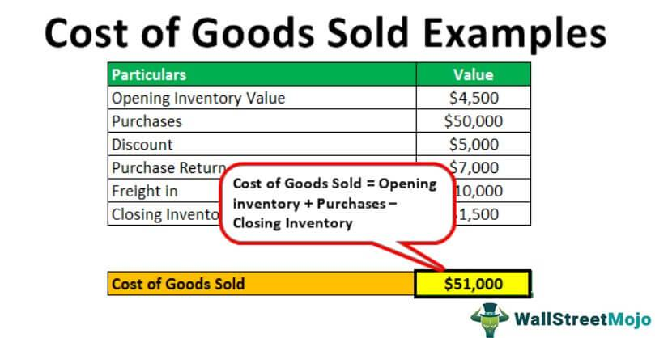

In the rapidly evolving world of finance and business, understanding the concepts of Cost of Goods Sold (COGS), cost of sales, and algorithmic trading is crucial for optimizing profitability and efficiency. These terms play a significant role in financial accounting, influencing how businesses and investors make strategic decisions.

Cost of Goods Sold refers to the direct costs associated with the production of goods sold by a company. These costs typically include expenses for raw materials and direct labor, while excluding indirect expenses such as sales and distribution. COGS is a critical component of the income statement, as it is used to calculate the gross profit: 



$$
\text{Gross Profit} = \text{Revenue} - \text{COGS}
$$

This metric is essential for precise financial reporting and aids in assessing a company's profitability.

While similar to COGS, the cost of sales is a broader measure that includes all costs linked to the production of goods or services sold, factoring in indirect expenses like distribution. This metric becomes particularly relevant for service-based industries where tangible products may not be predominant. Recognizing the distinction between COGS and cost of sales is vital for businesses to accurately evaluate their financial performance and health.

Algorithmic trading, on the other hand, involves using sophisticated automated systems that execute trades based on predefined rules and market conditions. By incorporating financial metrics such as COGS and cost of sales into trading algorithms, traders can enhance their decision-making capabilities and uncover new efficiencies. This integration can refine profitability analysis, helping firms maintain a competitive edge in the trading landscape.

This article seeks to demystify these financial concepts, exploring their definitions, applications, and impacts. It will also examine the role these concepts play in algorithmic trading strategies, highlighting their significance in crafting effective pricing strategies and ensuring sustainable business growth.

## Table of Contents

## Understanding Cost of Goods Sold (COGS)

Cost of Goods Sold (COGS) represents the direct costs specifically associated with the production of goods that a company sells. This financial metric is pivotal in determining the profitability of a company, as it directly impacts the gross profit calculation on the income statement. The core components of COGS include expenses related to raw materials and labor directly linked to the manufacturing process. It's important to note that COGS excludes indirect costs such as sales, distribution, and overhead expenses.

Mathematically, COGS can be calculated using the following formula:

$$
\text{COGS} = \text{Beginning Inventory} + \text{Purchases during the period} - \text{Ending Inventory}
$$

Correct calculation of COGS is essential for accurate financial reporting. When COGS is subtracted from total revenue, it yields the gross profit, which serves as a critical indicator of a company's financial performance. A lower COGS can result in a higher gross profit margin, assuming revenue remains constant, which can signal efficient production processes and cost management.

Precise calculation and management of COGS are crucial for profitability analysis. Businesses must ensure the accuracy of inventory records and cost allocations to represent their financial health faithfully. This accuracy allows businesses to make informed decisions about pricing, production, and resource allocation. Moreover, incorrect COGS calculations can lead to distorted financial statements, misleading stakeholders about the financial standing of the company.

## Cost of Sales: A Broader Perspective

Cost of sales is a comprehensive metric that includes all costs associated with the production and delivery of goods or services that a company sells. This concept expands upon the scope of the Cost of Goods Sold (COGS) by incorporating indirect costs, such as sales and distribution expenses, alongside direct costs like raw materials and labor. This broader perspective is particularly pertinent in service-based industries, where the distinction between tangible products and services becomes less clear.

For service-based industries, tangible products may not exist, making the distinction between COGS and the cost of sales significant. Businesses such as consulting, IT services, and financial advisories often incur substantial indirect costs, including salaries of service personnel, software development costs, and overheads. These contributions to the total cost structure are critical for accurately reflecting the expense and efficiency of service delivery.

Understanding the differences between COGS and the cost of sales is crucial for businesses to assess their financial health accurately. While COGS generally accounts for the direct costs linked to inventory and manufacturing, the cost of sales provides a broader view by capturing all necessary expenditures to generate a sale, including those incurred after production. This differentiation helps in calculating gross margins more precisely, thereby allowing companies to identify potential areas for cost savings and operational improvements.

For instance, consider a software company. The COGS might include expenses directly related to the development of software – such as developer salaries and server costs. However, the cost of sales would expand to include marketing expenses, customer support, and distribution costs. This comprehensive view ensures that all elements impacting profitability are considered, providing business executives with a robust tool for strategic financial analysis. 

By assessing the cost of sales, companies can better strategize their pricing, manage their budgets more effectively, and understand the comprehensive impact of their operational costs on overall profitability. It empowers them to identify trends in spending and sales, adjust resource allocation, and improve their financial reporting's accuracy and reliability. Understanding and managing the cost of sales is an essential step for businesses seeking to advance their financial performance and sustainability.

## When to Use COGS vs. Cost of Sales

In the business sector, selecting between Cost of Goods Sold (COGS) and cost of sales is crucial for accurate financial reporting and strategic decision-making. The distinction rests largely on the nature of the business operations and the kind of transactions or outputs involved.

COGS is predominantly relevant for manufacturing and goods-producing firms. These companies incur direct costs linked to the production of tangible products. The COGS calculation typically involves summing up costs for raw materials, labor, and any other expenses directly connected to manufacturing products. For instance, if a company manufactures furniture, the COGS would include the wood, metal, labor, and the machinery costs directly associated with building the furniture. Accurate computation of COGS ensures precise understanding of gross profit, which is calculated as:

$$
\text{Gross Profit} = \text{Revenue} - \text{COGS}
$$

In contrast, the cost of sales encompasses a broader spectrum of expenditures and is more suitable for service-based companies or those dealing with intangible products. This metric includes not only the direct production costs but also indirect costs such as distribution and marketing. For service-oriented businesses, such as consulting firms, the cost of sales could cover salaries of consultants, office rental, utilities, and travel expenses directly tied to delivering services.

The decision between COGS and cost of sales is largely informed by the type of goods or services sold by the business. For a traditional manufacturing company, COGS provides a more tailored insight into direct production costs. However, for a consultancy or a software service provider, cost of sales offers a comprehensive perspective on the total expenditure associated with service delivery.

Utilizing either metric, businesses can pinpoint inefficiencies and explore opportunities for cost optimization. For instance, a manufacturing firm can analyze COGS to reduce material expenses or improve labor efficiency. Similarly, a service-based enterprise can leverage the cost of sales metric to streamline operational processes or enhance service delivery.

Therefore, understanding when to apply COGS or cost of sales is essential for achieving cost efficiency and identifying areas for operational improvement. Balancing these metrics with overall business strategy ensures better financial health and competitive advantage.

## Relevance in Algorithmic Trading

Algorithmic trading utilizes automated systems to execute trades based on predefined rules, which often incorporate a variety of market and financial variables. One of the key financial metrics that can be integrated into these algorithms is the Cost of Goods Sold (COGS) and, more broadly, the cost of sales. By considering these costs, trading strategies can be more comprehensive in their analysis of profitability.

The inclusion of COGS and cost of sales into trading algorithms allows investors and traders to evaluate the profitability of companies with higher precision. For instance, a firm's gross profit, calculated by subtracting COGS from total revenue, can serve as an indicator of financial health and operational efficiency. Algorithmic trading systems, by integrating such financial metrics, can identify profit margins which aid in determining the intrinsic value of a stock.

To illustrate, consider a basic algorithm that incorporates COGS:

```python
def calculate_gross_profit(revenue, cogs):
    return revenue - cogs

def trading_signal(revenue, cogs, threshold_margin):
    gross_profit = calculate_gross_profit(revenue, cogs)
    profit_margin = gross_profit / revenue
    if profit_margin > threshold_margin:
        return "Buy"
    else:
        return "Sell"
```

In this example, the algorithm calculates the gross profit and subsequent profit margin based on revenue and COGS. If the profit margin exceeds a predetermined threshold, the algorithm signals a purchase, anticipating higher future profitability.

Optimization of cost structures via [algorithmic trading](/wiki/algorithmic-trading) strategies also enhances market competitiveness. By minimizing COGS, a company can increase its gross profit margin, enabling competitive pricing strategies and greater market share. Trading algorithms can [factor](/wiki/factor-investing) these improvements into their evaluation processes, identifying companies that are optimizing their costs and, consequently, may offer higher returns on investment.

In summary, the integration of COGS and cost of sales into algorithmic trading systems refines the assessment of profitability. By accounting for these costs, algorithms can provide more insightful trading signals and enhance decision-making processes in the competitive trading environment.

## Impact on Profitability and Pricing Strategies

COGS (Cost of Goods Sold) and cost of sales are pivotal metrics that directly influence a company's gross profit, thereby impacting profitability and pricing strategies. Gross profit is determined by subtracting COGS from total revenue, providing insight into the core profitability of a business's primary activities. The formula for gross profit is:

$$
\text{Gross Profit} = \text{Revenue} - \text{COGS}
$$

Accurate management and reporting of these costs are essential in shaping effective pricing strategies that can fortify a business's market position. By minimizing COGS and cost of sales, companies can increase their gross profit margin, allowing for more competitive pricing without sacrificing profitability. This balance is crucial in industries where price sensitivity is high and competition is fierce.

Efficient cost management requires businesses to frequently assess both direct and indirect costs associated with product or service provisioning. For instance, in manufacturing, reducing waste or securing more cost-effective suppliers can lower COGS, leading to potential price reductions or increased profit margins. In service-based industries, optimizing processes to cut service delivery costs can also have a substantial impact.

Regular review and recalibration of COGS and cost of sales ensure alignment with broader financial objectives, such as maintaining desired profit margins or achieving specified growth targets. Companies must leverage these evaluations to fine-tune pricing strategies in response to market dynamics, cost variations, or changes in consumer demand. This proactive approach can safeguard and enhance a company's competitive edge, enabling it to adapt pricing models that reflect both value and market conditions.

In summary, managing COGS and cost of sales is a strategic exercise with profound implications for a business's pricing strategy and profitability. By keeping these costs in check and aligned with overarching financial goals, businesses can sustain growth and remain agile in competitive markets.

## Conclusion

Understanding and accurately calculating Cost of Goods Sold (COGS) and cost of sales is fundamental for businesses aiming to maximize profitability. These financial metrics provide essential insights into the direct and indirect costs associated with producing and selling goods or services, which are pivotal in assessing overall financial performance.

Precise calculation of COGS involves identifying the direct costs attributable to the production process, such as raw materials and direct labor. In contrast, the cost of sales extends this assessment by incorporating indirect costs, thereby offering a comprehensive view of the total expenditures involved in delivering a product or service to market. This nuanced understanding aids businesses in pinpointing inefficiencies and optimizing their cost structures.

Beyond their role in internal accounting, COGS and cost of sales are valuable tools for enhancing algorithmic trading strategies. Incorporating these metrics into trading algorithms can provide a deeper understanding of cost efficiencies and profit margins, allowing for more informed decision-making. By aligning cost structures with trading strategies, businesses can improve their competitive edge in dynamic financial markets.

Moreover, by leveraging insights from COGS and cost of sales, businesses can better align their production costs with their sales strategies. This alignment is instrumental in developing pricing strategies that are not only competitive but also sustainable. Regularly reviewing and analyzing these financial metrics ensures that businesses remain adaptable to changing market conditions and can continue to grow profitably.

Overall, the disciplined application of COGS and cost of sales in financial reporting and strategy formulation is essential for sustainable business success. It empowers organizations to achieve a delicate balance between managing costs and maximizing revenues, thereby facilitating robust and long-term growth.

## References & Further Reading

[1]: Bergstra, J., Bardenet, R., Bengio, Y., & Kégl, B. (2011). ["Algorithms for Hyper-Parameter Optimization."](https://papers.nips.cc/paper/4443-algorithms-for-hyper-parameter-optimization) Advances in Neural Information Processing Systems 24.

[2]: ["Advances in Financial Machine Learning"](https://www.amazon.com/Advances-Financial-Machine-Learning-Marcos/dp/1119482089) by Marcos Lopez de Prado

[3]: ["Evidence-Based Technical Analysis: Applying the Scientific Method and Statistical Inference to Trading Signals"](https://www.amazon.com/Evidence-Based-Technical-Analysis-Scientific-Statistical/dp/0470008741) by David Aronson

[4]: ["Machine Learning for Algorithmic Trading"](https://github.com/stefan-jansen/machine-learning-for-trading) by Stefan Jansen

[5]: ["Quantitative Trading: How to Build Your Own Algorithmic Trading Business"](https://www.amazon.com/Quantitative-Trading-Build-Algorithmic-Business/dp/1119800064) by Ernest P. Chan