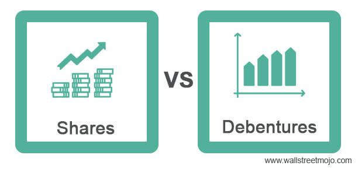

The financial landscape offers a plethora of instruments for investors to diversify their portfolios, prominently featuring debentures and debenture stocks. Each serves distinct roles and introduces varying levels of risk and return. Debentures, traditionally unsecured debt instruments, provide investors with predictable income through fixed interest payments without the backing of collateral, inherently posing higher risk. In contrast, debenture stocks operate similarly to equities, often including dividend entitlements and exhibiting characteristics between traditional equity and debt securities.

Algorithmic trading introduces a sophisticated dimension to financial markets, optimizing investment strategies and enhancing performance. Through complex algorithms and data-driven decisions, it offers the potential to elevate trading efficiency and accuracy, particularly in markets dealing with debentures. As such, understanding the nuances of how these financial instruments function, alongside the integration of technology-driven trading methodologies, is crucial for modern investors seeking robust portfolio diversification.



This article explores these dynamics, examining the structural and functional differences between debenture stocks and regular debentures, as well as the transformative impact of algorithmic trading in optimizing investment outcomes.

## Table of Contents

## Understanding Debenture Stocks and Regular Debentures

Debenture stocks and regular debentures represent important classes of financial instruments that serve distinct purposes in an investor’s portfolio. Understanding their definitions and structural differences is crucial for investors aiming to mitigate risks while enhancing returns.

**Debenture Stocks**

Debenture stocks can be viewed as a hybrid instrument that possesses both debt and equity characteristics. They are essentially a form of loan agreement issued by corporations, where the capital lent by investors is repayable at a predetermined interest rate. Although debenture stocks function similarly to traditional bonds, they differ in structure as they may not be backed by any collateral. Similar to preferred stock, debenture stocks often entitle investors to receive dividends at fixed intervals. This characteristic aligns them more closely with equity securities, thereby enhancing potential yield. Debenture stocks are listed on stock exchanges, which provides liquidity advantages and allows investors to trade them like regular equity shares.

One of the main advantages of debenture stocks lies in their flexibility and potential to generate higher returns compared to fixed-income instruments due to their exposure to market-based dividends. However, this exposure also introduces additional risk, as returns depend largely on the issuer's performance and market conditions. The absence of collateral backing means that debenture stockholders rank below secured creditors in claims of company liquidation, which may affect their risk profile.

**Regular Debentures**

In contrast, regular debentures are debt instruments that signify a form of unsecured loan which investors provide to an entity, typically a corporation. Unlike debenture stocks, regular debentures are primarily debt-driven and do not have the equity-like component of dividend payments. Holders of debentures earn consistent income through fixed interest payments at predetermined intervals, making them attractive to risk-averse investors seeking predictable cash flows. 

The foremost advantage of regular debentures is their straightforward nature, offering a stable and dependable income stream while minimizing the [volatility](/wiki/volatility-trading-strategies) associated with equity markets. However, since these instruments are typically unsecured, investors face a higher risk of default. In the event of a company’s insolvency, debenture holders are considered unsecured creditors and are paid after secured creditors but before equity holders.

In summary, the differentiation between debenture stocks and regular debentures lies in their structure and risk-return profiles: debenture stocks provide equity-like features with potential dividend benefits, while regular debentures offer the predictability of debt instruments with fixed interest payments but lack collateral security. Understanding these distinctions can help investors craft more nuanced strategies that align with their risk tolerance and investment objectives.

## Key Features of Debenture Stocks

Debenture stocks, while sharing some similarities with both equity and debt instruments, hold a unique position in the financial landscape. Their structure entitles holders to regular dividend payments at fixed intervals, an aspect that aligns them closely with preferred stocks rather than common stocks. Unlike bonds or traditional debentures, debenture stocks do not partake in the principal repayment schedule typical of debt instruments. Instead, their holders benefit financially from periodic earnings as long as the issuing entity remains solvent and profitable.

Contrary to bonds, debenture stocks are not secured by specific collateral; they are, therefore, considered unsecured investments. This lack of collateral security implies that in the event of a company's liquidation, debenture stockholders rank lower in the creditor hierarchy compared to secured debt holders. Nevertheless, the regular dividend payouts offer a hybrid nature combining the regular income feature of debt securities with some of the capital appreciation potential similar to equity.

The non-backed nature of debenture stocks raises inherent risks similar to owning unsecured bonds. However, their functioning akin to preferred stocks provides a layer of relative security, as companies are often compelled to maintain dividend payments to maintain trust with investors and uphold share value. The firm's commitment to upholding these payments sometimes offers an economic cushion, provided the financial stability of the issuing corporate entity is assured.

The role of debenture stocks in investment portfolios is a balancing act, providing investors with a steady income stream alongside relative stability compared to common equities. Yet, they [carry](/wiki/carry-trading) less risk than common stocks, as dividends are prioritized over common stock dividends and often must be paid before any dividend is payable to common shareholders. Additionally, debenture stocks do not have voting rights, aligning them more with debt than equity in terms of corporate governance influence.

In summary, the unique characteristics of debenture stocks make them a valuable component for investors seeking income reliability without the high risk of common equities or the security demands of traditional bonds. Their non-collateralized nature requires careful consideration of the issuing company’s financial health, but their income-generating potential offers a balanced approach to portfolio diversification.

## Regular Debentures: Structure and Risk

Regular debentures are financial instruments that represent unsecured loans extended by investors to companies. These instruments do not have collateral backing, which differentiates them from secured debt offerings. This means that in the event of the issuer's liquidation or bankruptcy, holders of regular debentures would not have priority claims on the company’s assets to recoup their investment. This unsecured nature poses specific risks to investors, primarily linked to the financial health and creditworthiness of the issuing entity. 

The main risk [factor](/wiki/factor-investing) associated with regular debentures is the credit risk, which is the risk of default by the issuer. Since these debentures lack collateral, the investor’s return is heavily dependent on the issuer’s ability to meet its financial obligations. If the company faces financial difficulties and defaults on its debt, debenture holders may not recover their principal investment. Additionally, regular debentures are subjected to [interest rate](/wiki/interest-rate-trading-strategies) risks. Any increase in prevailing interest rates might cause the market value of existing debentures to fall, as newer issues might offer higher yields than older, lower-yielding debentures.

Despite these risks, regular debentures do offer certain benefits. One of the primary advantages is the predictability of income through fixed interest payments. These interest payments, often referred to as coupon payments, typically occur at fixed intervals and provide a steady revenue stream to investors. The fixed income characteristic of debentures positions them as comparatively stable and predictable investments, especially when issued by companies with a robust credit rating. Furthermore, debentures usually offer higher yields compared to secured debt instruments, serving as compensation for the elevated risk profile associated with the lack of collateral security. 

Investors considering debentures must carefully evaluate the issuing company’s credit rating, financial statements, and overall market conditions. These assessments are crucial for understanding the potential return versus the inherent risk of investing in unsecured debt.

## The Role of Algorithmic Trading in Debentures

Algorithmic trading, also known as algo trading, represents a significant advancement in financial markets. This involves using computer programs to execute trades at speeds and frequencies that are impossible for human traders. Algorithms rely on predefined sets of rules, statistical models, and historical data to determine the optimal timing, price, and quantity for trades. In the context of debentures, these algorithms improve the efficiency and accuracy of trading by minimizing human errors and biases and by quickly responding to market changes.

One of the primary benefits of [algorithmic trading](/wiki/algorithmic-trading) in debenture markets is the enhanced efficiency in executing trades. Algorithms can process vast amounts of market data in real-time, allowing traders to capitalize on opportunities that might be fleeting. This capability is particularly valuable for trading debentures, whose prices can be affected by a variety of factors, including interest rates, company performance, and macroeconomic conditions. By continuously monitoring these variables, algorithms can execute trades at optimal prices, ensuring that investors achieve the best possible return on investment.

Accuracy in trading is another key advantage provided by algorithmic systems. With the ability to analyze large data sets using complex models, algorithms can identify patterns and trends that may not be visible to human traders. This analytical power enables precise decision-making, reducing the likelihood of trading mistakes. For instance, algorithms can be programmed to adjust trading strategies in response to changes in market volatility or [liquidity](/wiki/liquidity-risk-premium), ensuring trades are executed in accordance with predefined risk parameters.

High-frequency trading ([HFT](/wiki/high-frequency-trading-strategies)) is a prominent algorithmic strategy utilized in debenture markets. HFT involves executing a large number of orders at extremely high speeds, often in fractions of a second. This strategy is effective in capturing small price changes and can be highly profitable thanks to the [volume](/wiki/volume-trading-strategy) and speed of trades. However, HFT requires sophisticated technology and infrastructure to minimize latency – the delay between a market signal and a trading response – ensuring that algorithms can respond almost instantaneously to market fluctuations.

Another notable strategy is statistical [arbitrage](/wiki/arbitrage), which exploits price differentials that might exist between debenture securities. By developing models that predict price convergence between related securities, traders can apply statistical methods to identify mispriced debentures and execute trades that capitalize on the anticipated price movements. This strategy requires a deep understanding of market dynamics and the implementation of robust risk management practices to handle any unforeseen price movements that do not adhere to historical patterns.

Algorithmic trading further encompasses techniques such as [momentum](/wiki/momentum) trading, where algorithms identify securities showing upward or downward price trends and carry out trades in the direction of those trends. This strategy often relies on indicators like moving averages and relative strength indices, which can be easily automated to trigger trades when certain conditions are met.

In summary, algorithmic trading optimizes the trading of debentures by leveraging technology to improve both the efficiency and accuracy of market transactions. Through strategies like high-frequency trading and [statistical arbitrage](/wiki/statistical-arbitrage), investors can take advantage of momentary market inefficiencies and achieve superior results. While these advanced techniques offer substantial benefits, they also demand a sophisticated understanding of both financial markets and technological systems to manage associated risks effectively.

## Integrating Algorithmic Trading with Debenture Investments

Algorithmic trading, often referred to as algo trading, enhances debenture investment strategies by leveraging technology to achieve greater efficiency and precision in executing trades. By utilizing mathematical models and automated systems, investors can capitalize on market opportunities with improved accuracy and reduced human error. Unlike traditional manual methods, algorithmic systems can process vast amounts of data quickly, analyze market conditions in real-time, and execute orders at optimal prices.

### Benefits of Integrating Algorithmic Systems

1. **Speed and Precision**: Algorithmic trading systems are capable of executing trades at lightning speed. This rapid execution is crucial in markets where price movements occur within fractions of a second. Algorithms can ensure that investors transact at the most favorable prices, reducing the impact of market volatility.

2. **Enhanced Market Analysis**: By continuously monitoring various market indicators, algorithms can identify patterns and trends that might be invisible to human traders. This feature allows for creating complex trading strategies that can operate under specific market scenarios, maximizing returns while minimizing risk.

3. **Data-Driven Decisions**: Algorithms can incorporate a wide array of data points into their decision-making process. The use of statistical models and machine learning techniques can enhance the adaptability and precision of trading strategies, allowing for more informed investment decisions.

### Potential Risks and Strategies for Risk Mitigation

While algorithmic trading offers numerous advantages, it also carries certain risks, particularly the potential for over-reliance. Systems can malfunction or react unexpectedly to unforeseen market events, leading to significant losses.

1. **Systematic Errors and Bugs**: Technical issues such as software bugs or hardware failures can disrupt trading activities. Implementing rigorous testing and maintaining backup systems are crucial strategies for mitigating these risks.

2. **Market Volatility**: Algorithms react to market conditions, and unexpected volatility can lead to rapid, large-scale movements that exacerbate losses. Setting clear boundaries for trading activities and building in fail-safes can help manage these risks.

3. **Regulatory Risks**: The regulatory environment for algorithmic trading is continually evolving. Systems must adapt to comply with these regulations to avoid penalties. Regular audits and compliance checks are recommended to ensure adherence to legal requirements.

### Python Example

Here's an example of a simple trading strategy using Python and basic libraries:

```python
import pandas as pd
import numpy as np

# Assume 'data' is a DataFrame with historical debenture prices
def simple_moving_average_strategy(data, window=15):
    data['SMA'] = data['Price'].rolling(window=window).mean()
    buy_signals = []
    sell_signals = []

    for current_price, sma in zip(data['Price'], data['SMA']):
        if current_price > sma:
            buy_signals.append(current_price)
            sell_signals.append(np.nan)
        else:
            buy_signals.append(np.nan)
            sell_signals.append(current_price)

    data['Buy Signals'] = buy_signals
    data['Sell Signals'] = sell_signals

    return data

historical_data = pd.DataFrame({'Price': [100, 101, 102, 104, 103, 105, 106, 108, 107, 110]})
strategy_results = simple_moving_average_strategy(historical_data)
print(strategy_results)
```

This code demonstrates a simple moving average strategy for debenture prices, generating buy and sell signals based on price movements relative to the moving average. Such models can be expanded and integrated into more advanced algorithmic trading systems.

In summary, integrating algorithmic trading with debenture investments provides the potential to significantly enhance investment performance through speed, precision, and comprehensive market analysis. However, it is essential to balance these benefits with risk management strategies to mitigate potential downsides.

## Advantages and Challenges of Combining Debentures with Algo Trading

The integration of algorithmic trading into debenture investments has opened avenues for optimizing returns through advanced data analysis and rapid execution. Algorithmic trading employs computer algorithms to scrutinize market data, perform trades, and manage investment portfolios with precision unattainable through manual trading. When applied to debentures, these algorithms can identify market inefficiencies, exploit arbitrage opportunities, and offer investors refined strategies to enhance their returns.

### Data-Driven Trading Decisions

The primary benefit of combining debentures with algorithmic trading lies in the data-driven nature of these algorithms. Algorithms can process vast datasets, identifying trends and executing orders faster than human capabilities. This speed is crucial for taking advantage of fleeting opportunities in volatile markets. By analyzing historical data and real-time market feeds, algorithms can recognize patterns and predict market movements, leading to informed trading decisions that optimize investment portfolios.

In addition, algorithmic trading systems implement strategies such as high-frequency trading and statistical arbitrage to achieve higher liquidity and lower transaction costs. For example, statistical arbitrage algorithms might evaluate a debenture's current price against its historical average, executing trades when discrepancies exceed a predefined threshold. 

### Challenges of Market Volatility

Despite these advantages, algorithmic trading brings challenges, particularly in the context of market volatility. Algorithms are as good as the data they are fed; during periods of sudden market shifts, the reliability of data-driven decisions can be compromised. This volatility can lead to erroneous trades, exacerbating losses rather than mitigating them.

Moreover, algorithm-driven trading increases systemic risks due to the interconnectivity of financial systems, potentially leading to phenomena such as flash crashes. This underscores the importance of robust risk management protocols and the necessity for continuous monitoring and updating of algorithms to mitigate unforeseen adverse behaviors in turbulent markets.

### Balancing Technology and Investment Wisdom

While algorithms enhance trading efficiencies, maintaining a balance between technological solutions and traditional investment insights is pivotal. Human oversight remains essential to navigate nuances that machines might not fully comprehend, such as qualitative changes in a company's strategic direction or shifts in macroeconomic policies. 

An ideal strategy leverages algorithmic prowess for routine, quantitative tasks while employing human expertise for strategic decision-making and risk assessment. In doing so, investors can capitalize on the benefits of algorithmic trading while safeguarding against its limitations.

By combining debentures with algorithmic trading, investors stand to gain from the precision and speed of technology while staying grounded in traditional investment strategies. This synergy allows for agile investment approaches that adjust quickly to evolving market conditions while aligning with long-term financial goals.

## Conclusion

The integration of debenture stocks, regular debentures, and algorithmic trading presents a formidable combination for enhancing investment portfolios. Debenture stocks offer investors the opportunity for fixed dividend payments without the obligation of collateral backing, presenting a risk-reward balance similar to that of preferred stocks. Meanwhile, regular debentures provide a straightforward debt instrument that can deliver predictable income through fixed interest payments despite their unsecured status, which introduces a degree of risk.

Algorithmic trading has revolutionized the approach to trading these instruments by optimizing performance with precision and speed. Algorithms have enhanced the efficiency of trading debentures by incorporating strategies such as high-frequency trading, enabling investors to execute trades swiftly and with greater accuracy. This intersection of technology and financial instruments has given rise to sophisticated investment strategies that leverage algorithmic systems to achieve higher returns and improve market analysis.

However, integrating technology in debenture investments is not without risks. The over-reliance on algorithmic trading can introduce volatility and systemic risk if not properly managed. Therefore, investors must balance the advantages of algorithmic efficiency with the foundational principles of sound investment strategies. It is crucial to employ risk mitigation strategies to safeguard against the potential pitfalls of algorithm-dominated trades.

In conclusion, the synthesis of debenture stocks, regular debentures, and algorithmic trading provides a strategic advantage for investors seeking diversification and adaptability in their financial strategies. By understanding the mechanisms and risks involved, investors can harness these methodologies to build robust portfolios, optimizing returns while navigating market challenges. As the financial landscape continues to evolve with technology, the ability to adapt and integrate these innovations becomes increasingly valuable. Investors are encouraged to consider these dynamic strategies for comprehensive portfolio management and risk-adjusted growth.

## References & Further Reading

1. **Books**:
   - *"Fixed Income Securities: Tools for Today's Markets"* by Bruce Tuckman and Angel Serrat. This book provides insights into various fixed-income assets, including debentures, and the role of algorithmic strategies in the securities market.
   - *"Algorithmic Trading: Winning Strategies and Their Rationale"* by Ernie Chan. It explores how algorithmic strategies are developed and applied in trading, offering practical insights for incorporating algorithms into investment approaches.

2. **Articles and Journals**:
   - "Understanding Debentures and Their Role in Corporate Finance," available on Investopedia. This article breaks down the basics of debentures and their relevance in investment portfolios. [Investopedia Debentures](https://www.investopedia.com/terms/d/debenture.asp)
   - "The Impact of Algorithmic Trading on the Financial Markets" from the Journal of Financial Markets. This paper analyzes the effects and implications of algorithmic trading on market dynamics.

3. **Web Resources**:
   - The [Securities and Exchange Commission (SEC)](https://www.sec.gov) offers a comprehensive overview of trading mechanisms and regulations involving debentures and stocks.
   - QuantInsti's blog section provides a wealth of information and tutorials on algorithmic trading techniques and tools: [QuantInsti Blog](https://blog.quantinsti.com).

4. **Online Courses**:
   - Coursera offers a course titled "Machine Learning in Trading." This course covers algorithmic trading strategies and their application in real-world markets: [Machine Learning in Trading on Coursera](https://www.coursera.org/learn/machine-learning-trading)
   - EDx provides a course on "Algorithmic Trading and Stocks," detailing how algorithms are used to analyze and execute trading strategies: [Algorithmic Trading and Stocks on edX](https://www.edx.org/course/algorithmic-trading-and-stocks).

5. **Research Papers**:
   - "High-Frequency Trading: A Bibliography of Research" available on SSRN. This bibliography includes various research papers that critically assess the role of high-frequency trading in financial markets: [SSRN High-Frequency Trading Bibliography](https://papers.ssrn.com/sol3/papers.cfm?abstract_id=2235962)

These resources offer a thorough exploration of debentures, debenture stocks, and the impact of algorithmic trading, providing readers with a foundational understanding as well as advanced insights for further study.

