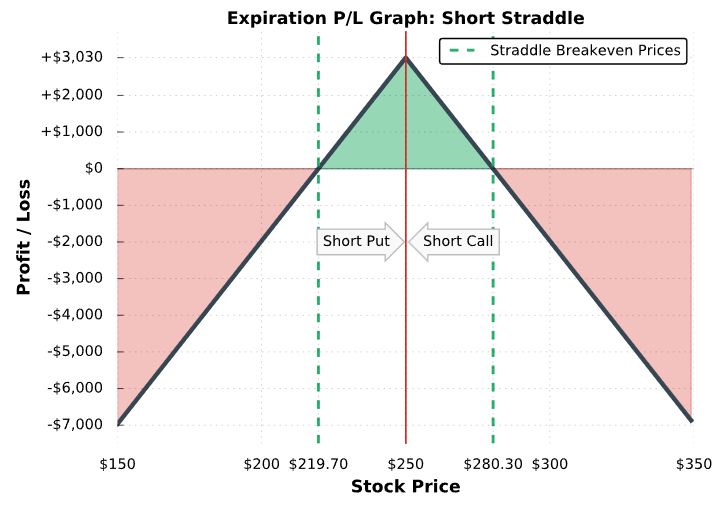

## Table of Contents

## What is hedging in finance?

Hedging in finance is like buying insurance for your investments. It's a strategy that investors use to reduce the risk of losing money. When you hedge, you take a position in a related security, like a stock or a commodity, to offset potential losses in another investment. For example, if you own a stock that you think might go down in value, you can hedge by buying an option that will increase in value if the stock goes down.

Hedging can be useful, but it's not perfect. It can help protect against big losses, but it also means you might not make as much money if your original investment does well. Hedging can be complicated and sometimes expensive, so it's important to understand it well before you start using it. It's a bit like wearing a seatbelt in a car; it can save you from a bad crash, but it won't stop you from feeling the bumps along the way.

## What is Delta hedging?

Delta hedging is a way to reduce the risk of losing money when you're trading options. It's like trying to keep your balance on a seesaw. When you buy or sell options, their value can change a lot because of the price of the stock they're based on. Delta hedging helps you stay balanced by making sure that if the stock price moves, the gains or losses from your options and the stock cancel each other out.

To do delta hedging, you need to know the 'delta' of an option, which tells you how much the option's price will change if the stock price changes by $1. If you have an option with a delta of 0.5, that means the option's price will go up or down by $0.50 for every $1 move in the stock price. By buying or selling the right amount of the stock, you can make sure that any change in the stock price doesn't hurt your overall position too much. It's like constantly adjusting your seat on the seesaw to stay level, no matter how the other side moves.

## What is Beta hedging?

Beta hedging is a way to lower the risk of losing money when you invest in the stock market. It's like trying to protect your whole investment portfolio from big swings in the market. Beta is a number that shows how much a stock or a portfolio moves compared to the overall market. If a stock has a beta of 1, it moves just like the market. If it's more than 1, it moves more than the market, and if it's less than 1, it moves less. By using beta hedging, you can balance out your investments so that they don't go up and down as much as the market does.

To do beta hedging, you might buy or sell investments that have a different beta than your main portfolio. For example, if your portfolio has a high beta and you want to make it less risky, you could buy investments with a lower beta or even a negative beta. This way, when the market goes down, the lower beta investments won't lose as much value, or might even go up, helping to protect your overall portfolio. It's like adding weights to one side of a scale to keep it balanced, no matter how the other side moves.

## How does Delta hedging work?

Delta hedging is a way to reduce the risk of losing money when you trade options. It's like trying to keep your balance on a seesaw. When you buy or sell options, their value can change a lot because of the price of the stock they're based on. Delta hedging helps you stay balanced by making sure that if the stock price moves, the gains or losses from your options and the stock cancel each other out. To do delta hedging, you need to know the 'delta' of an option, which tells you how much the option's price will change if the stock price changes by $1.

If you have an option with a delta of 0.5, that means the option's price will go up or down by $0.50 for every $1 move in the stock price. By buying or selling the right amount of the stock, you can make sure that any change in the stock price doesn't hurt your overall position too much. It's like constantly adjusting your seat on the seesaw to stay level, no matter how the other side moves. Delta hedging isn't perfect and can be tricky to keep up with, but it's a useful tool for managing risk in options trading.

## How does Beta hedging work?

Beta hedging is a way to make your investments less risky by balancing them out with the ups and downs of the whole stock market. Beta is a number that shows how much a stock or a portfolio moves compared to the market. If a stock has a beta of 1, it moves just like the market. If it's more than 1, it moves more than the market, and if it's less than 1, it moves less. By using beta hedging, you can adjust your investments so they don't go up and down as much as the market does.

To do beta hedging, you might buy or sell investments that have a different beta than your main portfolio. For example, if your portfolio has a high beta and you want to make it less risky, you could buy investments with a lower beta or even a negative beta. This way, when the market goes down, the lower beta investments won't lose as much value, or might even go up, helping to protect your overall portfolio. It's like adding weights to one side of a scale to keep it balanced, no matter how the other side moves.

## What are the primary goals of Delta hedging?

The main goal of delta hedging is to reduce the risk of losing money when you trade options. When you buy or sell options, their value can change a lot because of the price of the stock they're based on. Delta hedging helps you stay balanced by making sure that if the stock price moves, the gains or losses from your options and the stock cancel each other out. This way, you can protect yourself from big losses if the stock price goes down.

Another goal of delta hedging is to keep your investment stable. By constantly adjusting your position based on the delta of the options, you can make sure that your overall investment doesn't swing too much with the stock price. It's like trying to keep your balance on a seesaw, making small adjustments to stay level no matter how the other side moves. This can be helpful for traders who want to manage their risk and keep their investments steady.

## What are the primary goals of Beta hedging?

The main goal of beta hedging is to make your whole investment portfolio less risky by balancing it out with the ups and downs of the stock market. Beta is a number that shows how much a stock or a portfolio moves compared to the market. If your portfolio has a high beta, it means it moves a lot with the market. By using beta hedging, you can add investments with a lower or even negative beta to your portfolio. This helps to reduce the overall risk because when the market goes down, these lower beta investments won't lose as much value, or might even go up, helping to protect your money.

Another goal of beta hedging is to keep your investments stable. When you balance your portfolio with different beta values, you're trying to make sure it doesn't swing too much with the market. It's like adding weights to one side of a scale to keep it balanced, no matter how the other side moves. This can be helpful for investors who want to manage their risk and keep their investments steady over time.

## In what types of investments is Delta hedging commonly used?

Delta hedging is often used in options trading. Options are contracts that give you the right to buy or sell a stock at a certain price. When you trade options, their value can change a lot because of the price of the stock they're based on. Delta hedging helps you manage this risk by balancing out the gains or losses from your options with the stock itself. If you own an option, you can buy or sell the right amount of the stock to make sure that any change in the stock price doesn't hurt your overall position too much.

Delta hedging is also used by people who trade other kinds of derivatives, like futures contracts. Futures are agreements to buy or sell something at a future date for a set price. Just like with options, the value of futures can change a lot because of the price of the thing they're based on. By using delta hedging, traders can reduce the risk of losing money if the price of the underlying asset moves in an unexpected way. This helps them keep their investments more stable and manage their risk better.

## In what types of investments is Beta hedging commonly used?

Beta hedging is commonly used in managing stock portfolios. When you have a lot of different stocks, you want to make sure your whole portfolio doesn't go up and down too much with the market. Beta is a number that tells you how much a stock or a portfolio moves compared to the market. By adding stocks or other investments with a lower or negative beta to your portfolio, you can balance it out. This way, if the market goes down, the lower beta investments won't lose as much value, or might even go up, helping to protect your overall investment.

Beta hedging is also used by investors who want to keep their investments steady over time. For example, if you have a portfolio that's mostly made up of high-beta stocks, which move a lot with the market, you might want to add some low-beta stocks or bonds to balance it out. This can help reduce the risk of big losses if the market takes a downturn. It's like adding weights to one side of a scale to keep it balanced, no matter how the other side moves.

## What are the key differences between Delta and Beta hedging?

Delta hedging and beta hedging are two different ways to reduce the risk of losing money when you invest. Delta hedging is mainly used when you trade options, which are contracts that give you the right to buy or sell a stock at a certain price. It helps you balance out the gains or losses from your options with the stock itself. If you own an option, you can buy or sell the right amount of the stock to make sure that any change in the stock price doesn't hurt your overall position too much. Delta hedging is like trying to keep your balance on a seesaw, making small adjustments to stay level no matter how the other side moves.

Beta hedging, on the other hand, is used to manage the risk of your whole investment portfolio. It's about balancing your investments with the ups and downs of the stock market. Beta is a number that shows how much a stock or a portfolio moves compared to the market. If your portfolio has a high beta, it means it moves a lot with the market. By adding investments with a lower or even negative beta, you can reduce the overall risk because when the market goes down, these lower beta investments won't lose as much value, or might even go up. Beta hedging is like adding weights to one side of a scale to keep it balanced, no matter how the other side moves.

## How do Delta and Beta hedging strategies impact portfolio risk management?

Delta hedging helps manage risk when you trade options. Options are like bets on whether a stock will go up or down. When you use delta hedging, you try to balance out the risk by buying or selling the stock that the option is based on. This way, if the stock price moves, the gains or losses from your options and the stock can cancel each other out. It's like trying to keep your balance on a seesaw. By doing this, you can protect yourself from big losses if the stock price goes down. Delta hedging is useful for people who trade options and want to keep their investments stable.

Beta hedging is about managing the risk of your whole investment portfolio. It's like trying to keep your portfolio from swinging too much with the stock market. Beta is a number that shows how much your investments move compared to the market. If your portfolio has a high beta, it means it moves a lot with the market. By adding investments with a lower or even negative beta, you can balance it out. This way, if the market goes down, the lower beta investments won't lose as much value, or might even go up, helping to protect your overall investment. Beta hedging is helpful for investors who want to keep their investments steady over time.

## What advanced techniques can be used to optimize Delta and Beta hedging in volatile markets?

In volatile markets, one advanced technique to optimize Delta hedging is to use dynamic hedging. This means you keep adjusting your position in the stock as the market moves. If the stock price changes a lot, you might need to buy or sell more of the stock to keep your options balanced. Another technique is to use options with different expiration dates. By mixing short-term and long-term options, you can better manage the risk because the delta of an option changes over time. It's like using different tools to keep your seesaw level, no matter how much it moves.

For Beta hedging, one way to optimize it in volatile markets is to use sector-specific ETFs or index funds. These can have different betas than the overall market, so you can use them to balance out your portfolio. If the market is going up and down a lot, you might want to add ETFs that focus on sectors that are less affected by the market swings. Another technique is to use leverage or inverse ETFs. These can help you adjust your portfolio's beta more quickly. It's like using special weights to keep your scale balanced, even when the market is jumping around a lot.

## What is Exploring Delta Hedging?

Delta hedging is a technique predominantly utilized in options trading to manage directional risk. The core objective of delta hedging is to achieve delta neutrality, which allows traders to minimize risk arising from movements in the underlying asset's price.

Delta ($\Delta$) is a key measure that expresses the sensitivity of an option's price relative to a one-unit change in the price of its underlying asset. Mathematically, it can be defined as:

$$
\Delta = \frac{\partial V}{\partial S}
$$

where $V$ is the option's price, and $S$ is the price of the underlying asset. Delta values range between -1 and +1 for puts and calls, respectively. A delta of +40, for instance, implies that for every $1 increase in the underlying asset's price, the option's price is expected to increase by $0.40.

In practice, delta hedging involves adjusting holdings in the underlying asset to offset the delta of the options in the portfolio. For example, if a trader holds an Apple call option with a delta of +0.40, they can neutralize this risk by short-selling 40 shares of Apple stock (assuming each option covers 100 shares), creating a delta-neutral position. This means the portfolio is unaffected by small changes in Apple's stock price, allowing the investor to direct their focus on other risk factors, such as [volatility](/wiki/volatility-trading-strategies).

Delta neutrality is advantageous because it enables traders to profit from anticipated changes in volatility without having to predict market direction. By regularly rebalancing the portfolio to maintain delta neutrality, investors can potentially capitalize on volatility fluctuations. Advanced [algorithmic trading](/wiki/algorithmic-trading) systems have further refined delta hedging processes, allowing real-time calculation and execution of trades to swiftly adapt to market shifts. This precise management of delta risk is essential for optimizing returns and mitigating unintended exposures in options trading portfolios.

## What are Advanced Hedging Techniques?

Advanced hedging techniques such as gamma and vega hedging extend beyond basic beta and delta hedging strategies, offering traders enhanced tools for risk management in the options market. Gamma hedging addresses the second derivative of the options pricing model, known as gamma, which measures the rate of change of delta with respect to changes in the underlying asset's price. By managing gamma, traders can protect against large, sudden movements in the asset price, ensuring that their delta hedging strategy remains effective even during volatile market conditions. 

The gamma of an option can be calculated using the formula:

$$
\Gamma = \frac{\partial \Delta}{\partial S} = \frac{\partial^2 C}{\partial S^2}
$$

where:
- $\Delta$ is the delta of the option
- $S$ is the current price of the underlying asset
- $C$ is the option's price

Gamma hedging involves frequently adjusting the delta position to maintain a hedged state as the underlying asset price fluctuates. This approach is particularly beneficial in maintaining portfolio stability when the market is highly volatile.

Vega hedging, on the other hand, focuses on managing the volatility risk of an option position. Vega measures the sensitivity of the option's price to changes in the implied volatility of the underlying asset. It is crucial for traders who base their strategies on market volatility rather than directional movement. Vega can be calculated with the formula:

$$
V = \frac{\partial C}{\partial \sigma}
$$

where $\sigma$ is the implied volatility of the underlying asset. By implementing vega hedging, traders can mitigate the impact of volatility fluctuations on option prices, allowing for more precise control over their investment outcomes.

When combined, gamma and vega hedging strategies enable traders to manage a broader spectrum of risks associated with options trading. The integration of these techniques requires sophisticated algorithms that can process real-time market data, calculate necessary adjustments, and execute trades swiftly. Python, with its robust libraries such as NumPy and Pandas, is often used to develop these algorithms. Here is a simple example of how one might set up a basic gamma hedge using Python:

```python
import numpy as np

# Hypothetical delta and gamma of a portfolio
delta_portfolio = 100
gamma_portfolio = 10

# Change in the underlying asset price
price_change = 2

# Calculate gamma effect on delta
adjusted_delta = delta_portfolio + gamma_portfolio * price_change

print(f"Adjusted Delta: {adjusted_delta}")
```

Sophisticated trading platforms and algorithmic models utilize similar calculations, albeit on a much larger scale and with more complex inputs, to ensure real-time adaptability to market changes.

Incorporating gamma and vega hedging within a broader risk management framework enhances the ability to tackle diverse and complex risk factors in options trading, reinforcing portfolio resilience. As technology progresses, the role of algorithms in optimizing these advanced strategies will continue to expand, providing traders with improved precision and efficacy in their hedging techniques.

## References & Further Reading

[1]: Hull, J. C. (2018). ["Options, Futures, and Other Derivatives"](https://www.semanticscholar.org/paper/Options%2C-Futures%2C-and-Other-Derivatives-Hull/89bdee500c8623864fc9eb7a471546aa713acc44). Pearson Education.

[2]: Black, F., & Scholes, M. (1973). ["The Pricing of Options and Corporate Liabilities."](https://www.cs.princeton.edu/courses/archive/fall09/cos323/papers/black_scholes73.pdf) Journal of Political Economy, 81(3), 637-654.

[3]: Haug, E. G. (2007). ["The Complete Guide to Option Pricing Formulas"](https://www.amazon.com/Complete-Guide-Option-Pricing-Formulas/dp/0786312408). McGraw-Hill.

[4]: Wilmott, P. (2006). ["Paul Wilmott Introduces Quantitative Finance"](https://www.amazon.com/Paul-Wilmott-Introduces-Quantitative-Finance/dp/0470319585). Wiley.

[5]: Shin, S.-H., & Park, K.-S. (2006). ["Advanced Hedging Techniques for Option Portfolios."](https://scholar.google.com/citations?user=1Ss0liAAAAAJ) Journal of Futures Markets, 26(5), 429-454.

[6]: Bangia, A., Diebold, F. X., Kronimus, A., Schagen, C., & Schuermann, T. (2002). ["Theta hedging with regime shifts."](http://www.ssc.upenn.edu/~fdiebold/papers/paper37/bds.pdf) Quantitative Finance, 2(4), 227-237.

[7]: Brandimarte, P. (2018). ["Numerical Methods in Finance and Economics: A MATLAB-Based Introduction"](https://onlinelibrary.wiley.com/doi/book/10.1002/0470080493). Wiley.