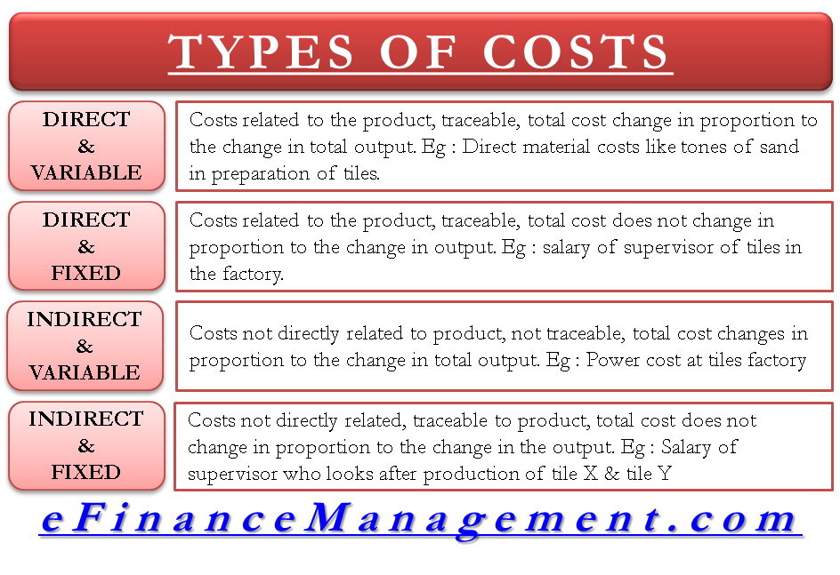

## Table of Contents

## What are direct costs?

Direct costs are expenses that can be directly linked to the production of a specific product or service. These costs are easy to trace and include things like raw materials and labor used in making the product. For example, if a company makes shoes, the leather used to make the shoes and the wages paid to the workers who stitch them together are direct costs.

Understanding direct costs is important for businesses because it helps them figure out the true cost of making their products. By knowing these costs, a company can set the right price for their products to make sure they cover all expenses and make a profit. Direct costs are different from indirect costs, which are harder to link to a specific product, like the rent for the factory where the shoes are made.

## What are variable costs?

Variable costs are expenses that change depending on how much a business produces or sells. If a company makes more products, its variable costs go up. If it makes fewer products, these costs go down. For example, the cost of raw materials like fabric for a clothing company would be a variable cost because the more clothes they make, the more fabric they need.

These costs are important for businesses to understand because they directly affect the profit a company makes. When a business knows its variable costs, it can better plan how much to produce and at what price to sell its products. This helps the business make sure it can cover these costs and still make money. Variable costs are different from fixed costs, which stay the same no matter how much a company produces.

## How do direct costs differ from variable costs?

Direct costs are costs that you can easily link to making a specific product or service. For example, if you're making a cake, the flour and eggs you use are direct costs because they go straight into the cake. Direct costs can be things like raw materials and the wages of workers who make the product. They help a business figure out how much it costs to make each item.

Variable costs are costs that change based on how much you make or sell. If you make more cakes, you'll need more flour and eggs, so your variable costs go up. If you make fewer cakes, you'll need less, and your variable costs go down. Variable costs are important because they help a business know how changes in production affect their expenses.

While direct costs are often variable, not all variable costs are direct. For example, the cost of electricity to run machines might go up and down with production, making it a variable cost, but it's not a direct cost because it's not used only for making one specific product. Understanding both direct and variable costs helps businesses set prices and plan production to make sure they can cover their costs and make a profit.

## Can you provide examples of direct costs?

Direct costs are the costs you can easily link to making a specific product. For example, if you make a pizza, the dough, sauce, and cheese you use are direct costs. These are things that go straight into making the pizza. Another example is if you make a chair, the wood and nails you use are direct costs. They are used only for making the chair.

In a business, direct costs can also include the wages of workers who make the product. If you have people working on the pizza assembly line, their wages are a direct cost because they are working directly on making the pizzas. Similarly, if you have carpenters building chairs, their wages are a direct cost because they are directly involved in making the chairs. Understanding these costs helps businesses know how much it costs to make each item.

## Can you provide examples of variable costs?

Variable costs are costs that change depending on how much a business makes or sells. For example, if a bakery makes more cakes, it will need more flour and eggs. The cost of flour and eggs will go up because the bakery uses more of them. If the bakery makes fewer cakes, it will need less flour and eggs, so the cost goes down. These costs are called variable because they vary with the amount of production.

Another example of variable costs is the cost of electricity for machines. If a factory makes more toys, the machines will run longer, using more electricity. This makes the electricity cost go up. If the factory makes fewer toys, the machines won't run as long, and the electricity cost will go down. Understanding variable costs helps businesses plan how much to make and sell to cover these costs and make a profit.

## Are all direct costs variable costs?

Not all direct costs are variable costs. Direct costs are the costs you can easily link to making a specific product. For example, if you make a cake, the flour and eggs you use are direct costs because they go straight into the cake. But these direct costs can be variable or fixed. Variable costs change depending on how much you make. If you make more cakes, you'll need more flour and eggs, so these costs go up. If you make fewer cakes, you'll need less, and these costs go down.

Some direct costs can be fixed costs, meaning they stay the same no matter how much you make. For example, if you pay a chef a fixed salary to make cakes, that salary is a direct cost because the chef is working directly on making the cakes. But it's also a fixed cost because it doesn't change with the number of cakes made. So, while many direct costs are variable, like the cost of ingredients, some can be fixed, like certain labor costs.

## Are all variable costs direct costs?

No, not all variable costs are direct costs. Variable costs are costs that change depending on how much a business makes or sells. For example, if a bakery makes more cakes, it will need more flour and eggs, so the cost of these items goes up. These costs are variable because they vary with the amount of production.

Direct costs are costs you can easily link to making a specific product. For example, the flour and eggs used in making a cake are direct costs because they go straight into the cake. But some variable costs, like the cost of electricity to run machines, are not direct costs. The electricity cost might go up and down with production, but it's not used only for making one specific product. So, while some variable costs are direct, not all of them are.

## How do direct and variable costs impact pricing strategies?

Direct costs help businesses set prices by showing how much it costs to make each product. If a company knows it spends $5 on materials and labor to make a toy, it needs to charge more than $5 to cover those costs and make a profit. By understanding direct costs, a business can set a price that covers what it spends and still makes money. If the direct costs go up, the business might need to raise its prices to keep making a profit.

Variable costs also affect pricing because they change with how much a business makes or sells. If a bakery needs more flour and eggs to make more cakes, its costs go up. To cover these higher costs, the bakery might need to raise the price of its cakes. But if it can make more cakes without spending much more, it might keep the price the same and sell more cakes to make more profit. Knowing how variable costs change helps a business decide if it should change its prices or make more products to cover costs and make money.

## How do businesses account for direct and variable costs in financial statements?

Businesses account for direct and variable costs in their financial statements by including them in the cost of goods sold (COGS) section of the income statement. The COGS shows how much it costs to make the products that were sold during a period. Direct costs, like the raw materials and labor used to make a product, are part of this. If a company makes toys, the plastic and wages of workers who make the toys are direct costs and are included in COGS. Variable costs, which change with how much a business makes, are also included in COGS if they are directly related to production, like the cost of electricity to run machines.

In the income statement, businesses subtract the COGS from their total revenue to find out their gross profit. This helps them see how much money they make after covering the costs of making their products. If direct or variable costs go up, the COGS will be higher, which can lower the gross profit. By keeping track of these costs, businesses can see if they need to change their prices or find ways to make things cheaper to keep making a profit. Understanding these costs helps businesses make better decisions about how to run their company.

## What role do direct and variable costs play in budgeting and forecasting?

Direct and variable costs are important for businesses when they make budgets and forecasts. A budget is a plan that shows how much money a business expects to spend and earn. When a business knows its direct costs, like the cost of materials and labor to make a product, it can plan how much money it needs to spend on making things. Variable costs, which change depending on how much a business makes, also help with budgeting. If a business plans to make more products, it knows it will need more materials and might need to spend more on things like electricity. This helps the business set a budget that covers all its costs.

Forecasting is about guessing what will happen in the future, like how much a business will sell or spend. Direct costs help with forecasting because they show how much it costs to make each product. If a business thinks it will sell more products, it can forecast higher direct costs. Variable costs are also important for forecasting because they change with how much a business makes. If a business expects to make more products, it can forecast higher variable costs. By understanding both direct and variable costs, a business can make better guesses about the future and plan its spending and earning to make sure it can cover all its costs and make a profit.

## How do changes in production volume affect direct and variable costs?

When a business makes more products, its direct costs and variable costs usually go up. Direct costs are the costs that you can easily link to making a specific product, like the materials and labor used. If a bakery decides to bake more cakes, it will need more flour and eggs, which are direct costs. The wages of the workers who bake the cakes are also direct costs. As the bakery makes more cakes, these direct costs increase because it uses more materials and pays more in labor.

Variable costs are costs that change depending on how much a business makes or sells. They include things like the cost of materials and sometimes the cost of electricity to run machines. If the bakery bakes more cakes, it will use more electricity to run the ovens, so the electricity cost goes up. This makes the variable costs higher. When a business makes fewer products, both direct and variable costs go down because it uses fewer materials and less electricity. Understanding how changes in production volume affect these costs helps businesses plan how much to make and set prices to cover their costs and make a profit.

## What advanced strategies can businesses use to manage and optimize direct and variable costs?

Businesses can use advanced strategies to manage and optimize their direct and variable costs by focusing on efficiency and technology. One way to do this is by using lean manufacturing techniques. These techniques help businesses make products with less waste, which can lower the cost of materials and labor. For example, a car maker might find ways to use less metal and fewer workers to make a car. Another strategy is to use automation and technology, like robots and machines, to make things faster and with fewer mistakes. This can save on labor costs and make the production process more efficient. Businesses can also use data analysis to see where they can save money. By looking at data, they can find out which materials cost too much or where they might be wasting money, and then make changes to lower their costs.

Another advanced strategy is to negotiate better deals with suppliers. If a business can get materials at a lower price, its direct costs will go down. This can be done by buying in bulk or finding new suppliers who offer better prices. Businesses can also use just-in-time inventory systems, where they only order materials when they need them. This helps them save money on storage and reduces the risk of having too much stock that might go to waste. Finally, businesses can use flexible pricing strategies. By changing prices based on how much it costs to make things, they can make sure they cover their costs and still make a profit. This means if the cost of materials goes up, they might need to raise their prices, but if costs go down, they could lower prices to sell more products.

## How can costing methods be applied in algorithmic trading?

Integrating variable and absorption costing methods into algorithmic trading systems offers significant advantages in managing costs and enhancing profitability. By leveraging these traditional cost accounting principles, trading algorithms can be designed to account for cost fluctuations and provide a clearer picture of financial performance.

Variable costing focuses on costs that change with the volume of trading activities, such as transaction fees, exchange fees, and variable infrastructure costs like computational resources during high-frequency trading. By incorporating variable costs into trading algorithms, traders can adjust their strategies in response to changing market conditions, potentially enhancing their profitability. This dynamic cost analysis can be executed as:

$$
\text{Profit} = \text{Revenue} - (\text{Variable Costs} + \text{Fixed Costs})
$$

Absorption costing, on the other hand, includes both variable and fixed costs in calculating the cost of trading. This approach might allocate a portion of fixed costs—such as software development, data feeds, and equipment depreciation—to individual trades. Incorporating absorption costing provides a more comprehensive understanding of the cost structure, which is beneficial for long-term strategic planning and external financial reporting. The cost per trade can be expressed as:

$$
\text{Cost per Trade} = \left( \frac{\text{Total Fixed Costs + Total Variable Costs}}{\text{Number of Trades}} \right)
$$

Cost insights gained from these methodologies play an instrumental role in refining trading strategies. For instance, an algorithm could dynamically adjust its trading volume or execution times based on real-time cost data, aligning its operations with current market conditions and organizational financial targets. 

Examples of algorithms leveraging cost data include adaptive trading models that utilize real-time analysis of cost inputs to make decisions on whether to enter or [exit](/wiki/exit-strategy) the market. Python scripts could automate these adjustments, assessing variables such as average transaction costs and using libraries like NumPy to facilitate complex calculations:

```python
import numpy as np

def calculate_profit(revenue, variable_costs, fixed_costs):
    return revenue - (variable_costs + fixed_costs)

def adaptive_trade_decision(current_market_conditions, cost_per_trade):
    if current_market_conditions['transaction_cost'] < cost_per_trade:
        return "Enter Trade"
    else:
        return "Hold"

# Example usage
revenue = 10000
variable_costs = 3000
fixed_costs = 2000
current_market_conditions = {'transaction_cost': 450}

profit = calculate_profit(revenue, variable_costs, fixed_costs)
decision = adaptive_trade_decision(current_market_conditions, cost_per_trade=50)

print("Profit:", profit)
print("Decision:", decision)
```

By embracing cost accounting methods, traders can better navigate the complexities of global markets. This approach not only improves success rates but also ensures more informed financial decisions, ultimately leading to enhanced financial outcomes. This strategic integration of cost data into trading algorithms can serve as a robust framework for navigating volatile markets, contributing to a sustained competitive edge.

## References & Further Reading

Horngren, C. T., Datar, S. M., & Rajan, M. V. (2014). *Cost Accounting: A Managerial Emphasis*. Prentice Hall.

Kaplan, R. S., & Atkinson, A. A. (1998). *Advanced Management Accounting*. Prentice Hall.

Drury, C. (2018). *Management and Cost Accounting*. Cengage Learning.

De Prado, M. L. (2018). *Advances in Financial Machine Learning*. Wiley.

Chan, E. (2009). *Quantitative Trading: How to Build Your Own Algorithmic Trading Business*. Wiley.

