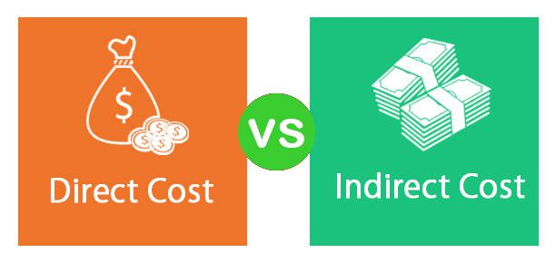

In today's dynamic financial landscape, understanding costs is crucial for businesses aiming to optimize their operations and enhance profitability. With the increasingly complex nature of modern markets, effective cost management becomes essential for maintaining a competitive edge. This article provides an in-depth exploration of the intricacies involved in managing variable and direct costs through the principles of cost accounting, particularly focusing on their applications in algorithmic trading.

Variable costs are those that vary directly with the level of production or business activity. These include expenses such as raw materials and labor that are directly linked to the production output. On the other hand, direct costs can be traced directly to a specific product or service, encompassing both fixed and variable components. Understanding the distinction between these costs is paramount for accurate financial reporting and strategic decision-making.



In traditional production settings, managing these cost structures effectively can lead to optimized resource allocation and enhanced profit margins. In algorithmic trading, the application of cost accounting principles presents unique challenges and opportunities as traders incorporate these cost factors into high-frequency trading models. This integration of cost considerations into financial strategies is vital as businesses navigate the complexities of both traditional and modern financial markets.

Additionally, the article explores a comparative analysis of different costing methods, such as variable costing and absorption costing, shedding light on their distinct applications and implications for financial outcomes. By understanding these methodologies, businesses can better align their cost management strategies with broader financial objectives, thus driving competitiveness and strategic advantage in volatile markets. Join us as we unravel the essential insights that can facilitate informed decision-making and pave the way for future financial innovation.

## Table of Contents

## Understanding Variable and Direct Costs

Variable costs are pivotal in understanding how expenses fluctuate directly with production output. These costs include raw materials and labor that are inherently linked to the manufacturing process. For instance, if the production level increases, the expenditure on raw materials rises accordingly, and vice versa. This correlation allows businesses to scale their strategies in tandem with output, ensuring that resource allocation remains efficient and dynamic.

Direct costs, on the other hand, are expenses that can be attributed directly to a specific product or service. These encompass direct labor and materials, which may consist of both fixed and variable components. Fixed elements of direct costs do not change with the level of production, such as salaries of the production staff assigned to a project, whereas variable components would include the materials used in the product creation which vary with production quantity.

Grasping the differences between variable and direct costs is fundamental for precise cost accounting, as it enables organizations to generate accurate financial reports. These reports are critical for stakeholders who rely on them for informed decision-making. By distinguishing between these cost types, businesses can identify areas where efficiencies can be improved, ultimately bolstering their profitability.

Variable costs afford businesses the flexibility to adjust their strategies in direct response to changes in production levels. This adaptability not only helps in maintaining competitive pricing but also in optimizing resource use. For example, a manufacturer can reduce waste and improve cost-efficiency by adjusting the purchase of raw materials in accordance with anticipated sales volumes.

In contrast, direct costs offer clarity in evaluating the overall cost of producing a product. Managers can use this information to assess product margins and set pricing strategies that reflect true production costs. This understanding aids in strategic planning and helps in identifying profitable product lines while phasing out those with lower returns.

Efficient management of variable and direct costs involves recognizing their unique characteristics and applying this knowledge to diverse business environments. For instance, in a high-[volume](/wiki/volume-trading-strategy) manufacturing setting, tracking variable costs can provide insights into potential economies of scale. Similarly, understanding direct costs can benefit a service-oriented business by identifying direct expenditures associated with delivering each service.

Effective cost management is essential across different industries to ensure robust financial health. By leveraging insights into variable and direct costs, businesses can refine their operations, improve financial outcomes, and enhance their strategic positioning in an increasingly competitive marketplace.

## Variable vs. Absorption Costing: A Comparative Analysis

Cost accounting provides various methodologies tailored to meet distinct business needs, among which variable costing and absorption costing are particularly noteworthy. Each method offers unique perspectives on product cost evaluation and financial strategy. 

Variable costing considers only variable costs when assessing the value of a product. These are costs that fluctuate directly with production volume, such as raw materials, direct labor, and certain utilities. In the context of variable costing, fixed costs—those static expenses like rent and salaries that do not change with output levels—are treated as period expenses. This approach is particularly beneficial for internal managerial decision-making and control because it provides clarity on how production levels directly affect costs. By identifying costs that fluctuate with output, businesses can adjust their operational strategies accordingly. This method facilitates break-even analysis and profit forecasting, assisting managers in planning and controlling day-to-day activities.

In contrast, absorption costing, sometimes known as full costing, allocates all production costs, both fixed and variable, to individual units of product. This means that the final product cost reflects a comprehensive aggregation of direct materials, direct labor, variable overheads, and a proportionate share of fixed overheads. Absorption costing is essential for external financial reporting and compliance with Generally Accepted Accounting Principles (GAAP). It ensures that all costs of production are captured and matched with revenues, offering a complete picture of profitability for stakeholders and regulatory bodies. This method can sometimes obscure the relationship between production volume and costs, making it less effective for internal cost management, yet crucial for external stakeholder transparency.

The principal difference between these methods lies in the treatment of fixed manufacturing overheads. Variable costing assigns fixed overheads to expenses in the period they are incurred, whereas absorption costing incorporates these overheads into the cost per unit and defers them as inventory until the product is sold. This fundamental distinction can significantly influence reported income levels and inventory valuation, affecting strategic financial decisions.

Understanding the advantages and limitations of each costing method helps align cost management strategies with broader business objectives. Variable costing facilitates a clearer understanding of cost behaviors in relation to production volumes, supporting dynamic operational adjustments and internal performance assessments. Meanwhile, absorption costing provides a comprehensive financial outlook, vital for external reporting, fulfilling regulatory requirements, and guiding long-term strategic planning.

In a business context where decision-makers balance internal efficiencies with stakeholder obligations, recognizing when and how to apply each method will enhance financial performance and ensure alignment with overarching business goals.

## Algorithmic Trading and the Role of Cost Accounting

As financial markets continue to advance, [algorithmic trading](/wiki/algorithmic-trading) remains a pivotal component, employing sophisticated models for precise trade execution. The integration of cost accounting principles within these algorithmic models offers substantial benefits, enhancing both financial insights and operational efficiency. 

Cost accounting, traditionally applied in product manufacturing and service delivery, provides a detailed view of cost structures. By leveraging these principles in algorithmic trading, traders can gain a clearer understanding of various cost components, including transaction fees, slippage, and other operational expenses. This knowledge is crucial for optimizing resource allocation and ensuring cost-efficient trading strategies. For instance, a well-integrated cost accounting approach can identify the most cost-effective execution venues and time slots, thus minimizing costs associated with trading and maximizing profitability.

The fusion of accounting with trading platforms ensures comprehensive cost structures are considered in every trading decision. Cost accounting tools can be programmed into trading algorithms to evaluate the cost implications of specific trading strategies in real-time. For example, an algorithm might adjust its strategy based on the transaction cost analysis (TCA) of recent trades, thereby refining its approach to minimize adverse cost impacts. This integration enables algorithmic traders to maintain a high degree of operational efficiency while managing risk effectively.

Several methodologies facilitate the union of cost accounting and algorithmic trading disciplines, offering a robust framework for improved trade execution and strategic planning. One such approach involves incorporating cost data into the [machine learning](/wiki/machine-learning) models used within algorithmic trading systems. Machine learning algorithms can be trained to recognize patterns that correlate with cost inefficiencies, thereby suggesting optimal trading conditions and strategies. Python, a favored language in algorithmic trading, allows for seamless integration of cost accounting data. With libraries like Pandas and NumPy, traders can perform real-time data analysis, integrating cost factors directly into predictive models.

Incorporating detailed cost structures into algorithmic trading models ultimately contributes to more informed decision-making, better alignment with market conditions, and sustained competitive advantages. As these methodologies continue to develop, their role in shaping financial strategies will become increasingly significant, driving enhanced trade execution and strategic market positioning. This fusion also signals a future where interdisciplinary skills are essential for navigating the complexities of global financial markets, challenging professionals to adapt and excel in this rapidly evolving landscape.

## Applying Costing Methods in Algorithmic Trading

Integrating variable and absorption costing methods into algorithmic trading systems offers significant advantages in managing costs and enhancing profitability. By leveraging these traditional cost accounting principles, trading algorithms can be designed to account for cost fluctuations and provide a clearer picture of financial performance.

Variable costing focuses on costs that change with the volume of trading activities, such as transaction fees, exchange fees, and variable infrastructure costs like computational resources during high-frequency trading. By incorporating variable costs into trading algorithms, traders can adjust their strategies in response to changing market conditions, potentially enhancing their profitability. This dynamic cost analysis can be executed as:

$$
\text{Profit} = \text{Revenue} - (\text{Variable Costs} + \text{Fixed Costs})
$$

Absorption costing, on the other hand, includes both variable and fixed costs in calculating the cost of trading. This approach might allocate a portion of fixed costs—such as software development, data feeds, and equipment depreciation—to individual trades. Incorporating absorption costing provides a more comprehensive understanding of the cost structure, which is beneficial for long-term strategic planning and external financial reporting. The cost per trade can be expressed as:

$$
\text{Cost per Trade} = \left( \frac{\text{Total Fixed Costs + Total Variable Costs}}{\text{Number of Trades}} \right)
$$

Cost insights gained from these methodologies play an instrumental role in refining trading strategies. For instance, an algorithm could dynamically adjust its trading volume or execution times based on real-time cost data, aligning its operations with current market conditions and organizational financial targets. 

Examples of algorithms leveraging cost data include adaptive trading models that utilize real-time analysis of cost inputs to make decisions on whether to enter or [exit](/wiki/exit-strategy) the market. Python scripts could automate these adjustments, assessing variables such as average transaction costs and using libraries like NumPy to facilitate complex calculations:

```python
import numpy as np

def calculate_profit(revenue, variable_costs, fixed_costs):
    return revenue - (variable_costs + fixed_costs)

def adaptive_trade_decision(current_market_conditions, cost_per_trade):
    if current_market_conditions['transaction_cost'] < cost_per_trade:
        return "Enter Trade"
    else:
        return "Hold"

# Example usage
revenue = 10000
variable_costs = 3000
fixed_costs = 2000
current_market_conditions = {'transaction_cost': 450}

profit = calculate_profit(revenue, variable_costs, fixed_costs)
decision = adaptive_trade_decision(current_market_conditions, cost_per_trade=50)

print("Profit:", profit)
print("Decision:", decision)
```

By embracing cost accounting methods, traders can better navigate the complexities of global markets. This approach not only improves success rates but also ensures more informed financial decisions, ultimately leading to enhanced financial outcomes. This strategic integration of cost data into trading algorithms can serve as a robust framework for navigating volatile markets, contributing to a sustained competitive edge.

## Conclusion

The intersection of cost accounting and algorithmic trading has transformed how financial efficiencies are realized in competitive markets. By employing variable and absorption costing methods, businesses gain vital insights for making informed decisions and aligning strategies with their financial goals. Variable costing, which considers only variable costs in product valuation, allows firms to precisely evaluate cost fluctuations and adjust strategies accordingly. Conversely, absorption costing, which incorporates both fixed and variable costs, provides a more comprehensive overview necessary for regulatory compliance and external reporting.

Professionals adept at integrating these accounting methodologies into trading systems are uniquely positioned to leverage market opportunities. The ability to analyze cost structures and adapt trading strategies dynamically is crucial in the volatile financial landscape. Expertise in these areas enhances resource allocation, optimizes cost efficiency, and ensures that financial strategies are robust and adaptable.

Looking to the future, innovations in financial technologies will continue to refine the synergy between cost accounting and algorithmic trading, expanding the horizons of financial analysis and strategic planning. The ongoing development in this field promises to further advance financial modeling and decision-making processes, thus ensuring preparedness for new market challenges and maintaining a competitive edge. As the integration of these disciplines deepens, the strategic importance of cost accounting's precision in algorithmic trading will likely accelerate, driving sustained competitive advantage in a globally interconnected market.

## References & Further Reading

Horngren, C. T., Datar, S. M., & Rajan, M. V. (2014). *Cost Accounting: A Managerial Emphasis*. Prentice Hall.

Kaplan, R. S., & Atkinson, A. A. (1998). *Advanced Management Accounting*. Prentice Hall.

Drury, C. (2018). *Management and Cost Accounting*. Cengage Learning.

De Prado, M. L. (2018). *Advances in Financial Machine Learning*. Wiley.

Chan, E. (2009). *Quantitative Trading: How to Build Your Own Algorithmic Trading Business*. Wiley.

