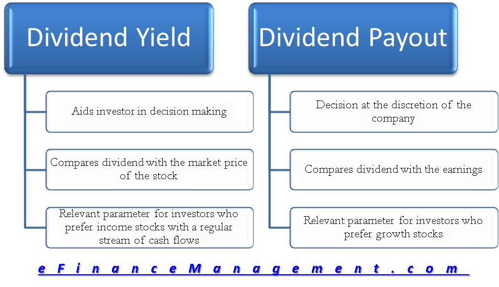

## Table of Contents

## What is a dividend?

A dividend is a payment that a company gives to its shareholders. It's like a reward for owning part of the company. When a company makes a profit, it can choose to share some of that profit with its shareholders. This payment usually comes from the company's earnings or profits and is often paid out in cash.

Dividends are usually paid out regularly, like every three months or once a year. Some companies even offer their shareholders the option to receive more shares instead of cash. This can be a good way for investors to earn some extra money without selling their shares. However, not all companies pay dividends. Some, especially newer or fast-growing companies, might choose to reinvest all their profits back into the business to help it grow even more.

## What is dividend yield?

Dividend yield is a way to measure how much a company pays out in dividends each year compared to its stock price. It's like figuring out how much money you get back from your investment just from the dividends. To find the dividend yield, you take the yearly dividend per share and divide it by the price of the stock. Then, you multiply that number by 100 to get a percentage.

For example, if a company pays a yearly dividend of $2 per share and the stock price is $40, the dividend yield would be 5%. This means for every $40 you invest in the stock, you get $2 back each year in dividends. Dividend yield is important because it helps investors see how much they can earn from dividends alone, which can be especially useful for people looking for steady income from their investments.

## How is dividend yield calculated?

Dividend yield is a way to figure out how much money you get back from a company's dividends compared to what you paid for the stock. To calculate it, you take the total dividends a company pays out each year for one share and divide that by the current price of the stock. Then, you multiply the result by 100 to turn it into a percentage.

For example, if a company pays $2 in dividends per share every year and the stock costs $50, you would do this: $2 divided by $50 equals 0.04. Multiply 0.04 by 100, and you get a dividend yield of 4%. This means for every $50 you spend on the stock, you earn $2 back each year just from the dividends.

## What is dividend payout ratio?

The dividend payout ratio tells us how much of a company's profit is given back to its shareholders as dividends. It's like figuring out what part of the earnings the company shares with people who own its stock. To find this ratio, you take the total dividends paid out and divide it by the company's net income. Then, you multiply by 100 to get a percentage. For example, if a company makes $100 in profit and pays out $30 in dividends, the payout ratio is 30%.

This ratio is important because it shows how much money a company is keeping to grow the business and how much it's giving back to investors. A high payout ratio might mean the company is giving most of its profits to shareholders, which could be good for people looking for regular income. But it might also mean less money is left to invest in new projects or expand the business. On the other hand, a low payout ratio means the company is keeping more of its earnings, which could be used for future growth or to weather tough times.

## How is dividend payout ratio calculated?

The dividend payout ratio is a way to see how much of a company's profit is given to shareholders as dividends. To find this ratio, you take the total dividends the company paid out and divide it by the company's net income. Then, you multiply the result by 100 to turn it into a percentage. For example, if a company earned $100 in profit and paid out $30 in dividends, the payout ratio would be 30%.

This ratio helps investors understand how a company manages its earnings. A high payout ratio means the company is giving a big part of its profits to shareholders, which can be good for people who want regular income from their investments. But it also means less money is left for the company to grow or save for tough times. A low payout ratio shows the company is keeping more of its earnings, which could be used for future growth or to handle unexpected challenges.

## Why are dividend yield and dividend payout ratio important for investors?

Dividend yield and dividend payout ratio are important for investors because they help understand how much money they can get back from their investments. Dividend yield shows how much money you earn from dividends each year compared to the price you paid for the stock. This is useful if you want to know how much income you can get from your investment without selling the stock. A high dividend yield might mean you get more money back, which can be good if you're looking for regular income.

The dividend payout ratio tells you how much of the company's profit is given to shareholders as dividends. This ratio helps investors see if the company is keeping enough money to grow or if it's giving too much away. If the payout ratio is high, the company is sharing a lot of its profits, which might be good for income-focused investors. But it could also mean less money for the company to use for new projects or to handle tough times. If the payout ratio is low, the company is keeping more of its earnings, which could be used for future growth or to save for unexpected challenges.

## How do dividend yield and dividend payout ratio differ?

Dividend yield and dividend payout ratio are two different ways to look at how much money you get back from a company's dividends. Dividend yield tells you how much money you earn from dividends each year compared to the price you paid for the stock. It's like figuring out how much income you can get from your investment without selling the stock. You find the dividend yield by dividing the yearly dividend per share by the stock's price and then multiplying by 100 to get a percentage. For example, if a stock costs $50 and pays $2 in dividends each year, the dividend yield is 4%.

On the other hand, the dividend payout ratio shows how much of the company's profit is given to shareholders as dividends. This ratio helps you see if the company is keeping enough money to grow or if it's giving too much away. You calculate the payout ratio by dividing the total dividends paid out by the company's net income and then multiplying by 100 to get a percentage. For instance, if a company makes $100 in profit and pays out $30 in dividends, the payout ratio is 30%. While dividend yield focuses on the return on your investment, the payout ratio focuses on how the company manages its earnings.

## Can a company have a high dividend yield but a low payout ratio? Why?

Yes, a company can have a high dividend yield but a low payout ratio. This happens when the company's stock price is low compared to the dividend it pays out. For example, if a company pays a yearly dividend of $2 per share and the stock price is only $20, the dividend yield is 10%, which is high. But if the company's net income is very high, say $100 per share, and it only pays out $2 in dividends, the payout ratio is just 2%, which is low.

This situation can occur for a few reasons. The stock price might be low because investors think the company isn't doing well, even though it's making a lot of profit. Or the company might be keeping most of its earnings to invest in new projects or save for the future, which keeps the payout ratio low. So, a high dividend yield with a low payout ratio can tell investors that the company is profitable but the stock price is low, and it's not giving much of its profit back to shareholders.

## What factors can affect a company's dividend yield and payout ratio?

A company's dividend yield and payout ratio can change because of many things. For dividend yield, the stock price is a big [factor](/wiki/factor-investing). If the stock price goes down but the dividend stays the same, the dividend yield goes up. This can happen if people think the company is not doing well. Also, if the company decides to pay more dividends, the yield goes up too. But if the company's profits go down and it cuts the dividend, the yield goes down.

The payout ratio is affected by how much profit the company makes and how much it decides to give back to shareholders. If the company makes more money, it might pay out more dividends, which would raise the payout ratio. But if it keeps more of its earnings to grow the business or save for tough times, the payout ratio goes down. The company's plans for the future can also change the payout ratio. If it wants to invest in new projects, it might keep more earnings and pay less in dividends.

Both the dividend yield and payout ratio can tell investors a lot about a company. They show how the company is doing and what it plans to do with its money. Investors use these numbers to decide if they want to buy or sell the company's stock, and if the company is a good fit for their investment goals.

## How can investors use dividend yield and payout ratio to assess a company's financial health?

Investors can use dividend yield and payout ratio to get a good idea of a company's financial health. Dividend yield tells investors how much money they get back from their investment in dividends compared to the stock's price. If the yield is high, it might mean the stock price is low, which could be a sign that people think the company isn't doing well. But a high yield can also be good for people looking for steady income from their investments. On the other hand, a low yield might mean the stock price is high or the company isn't paying much in dividends, which could suggest the company is doing well and growing.

The payout ratio shows how much of the company's profit is given back to shareholders as dividends. A high payout ratio can mean the company is giving most of its earnings to investors, which is good if you want regular income. But it might also mean the company isn't keeping enough money to grow or handle tough times. A low payout ratio means the company is keeping more of its earnings, which could be used for new projects or to save for the future. By looking at both the dividend yield and the payout ratio, investors can see if the company is balancing its growth with giving money back to shareholders, which helps them understand the company's overall financial health.

## What are the limitations of using dividend yield and payout ratio as investment metrics?

Using dividend yield and payout ratio can help investors learn about a company, but these numbers have some limits. Dividend yield can be tricky because a high yield might not always be a good thing. It could mean the stock price is low because people think the company is in trouble. Also, a high yield today might not last if the company cuts its dividends later. So, just looking at the yield might not tell you everything about how safe your investment is or if it will keep paying good dividends.

The payout ratio has its own problems too. A high payout ratio might look good if you want regular income, but it can also mean the company is not keeping enough money to grow or handle tough times. And a low payout ratio might seem bad if you want dividends, but it could mean the company is smart about saving for the future. Plus, both these numbers don't tell you about other important things like how much debt the company has or if it's making money in its main business. So, while dividend yield and payout ratio are helpful, they're just part of the story and shouldn't be the only things you look at when deciding to invest.

## How do dividend policies and corporate strategies influence dividend yield and payout ratio over time?

Dividend policies and corporate strategies play a big role in how a company's dividend yield and payout ratio change over time. If a company decides to keep its dividend the same or raise it, the dividend yield can go up if the stock price stays the same or goes down. But if the company cuts its dividend, the yield will drop. Companies might choose to pay more dividends to attract investors who want regular income, or they might keep dividends low to save money for new projects or to grow the business. These decisions can make the dividend yield go up or down depending on what the company thinks is best for its future.

Corporate strategies also affect the payout ratio. If a company makes more profit and decides to give more of it back to shareholders, the payout ratio will go up. But if the company wants to keep more of its earnings to invest in new ideas or save for tough times, the payout ratio will be lower. Over time, as the company's plans change, so can its payout ratio. For example, a company might start with a low payout ratio to grow quickly, but later, it might raise it to reward its shareholders. So, the choices a company makes about its dividends and how it wants to grow can really change both the dividend yield and the payout ratio.

## What is the Understanding of Dividend Payout Ratio?

The dividend payout ratio is a key financial metric that serves as an indicator of the proportion of a company's earnings distributed as dividends to its shareholders. This ratio is calculated using the following formula:

$$
\text{Dividend Payout Ratio (\%)} = \left( \frac{\text{Dividends per Share}}{\text{Earnings per Share}} \right) \times 100
$$

A high dividend payout ratio could signify that a company is mature, possessing stable and predictable cash flows, which allows it to return a significant portion of its earnings to shareholders. However, such a high ratio might also point to limited opportunities for growth, as the company may not be reinvesting enough earnings into future projects or innovations.

On the other hand, a low dividend payout ratio often suggests that the company is reinvesting a larger share of its earnings back into the business to finance expansion, research and development, or other growth initiatives. These companies might prioritize growth over immediate shareholder returns, attracting investors who are focused on potential capital appreciation rather than current income.

For investors seeking consistent dividend income, particularly those in retirement or looking for a steady cash flow, evaluating the dividend payout ratio is crucial. It helps in assessing whether a company can maintain or potentially increase its dividend distributions over time without resorting to excess borrowing or compromising financial stability. Understanding this balance allows investors to mitigate the risks of overleveraging while pursuing dividend-focused investment strategies.

## What is Exploring Dividend Yield?

The dividend yield is an essential metric for investors as it indicates the annual dividend income relative to the stock's market price. This metric, expressed as a percentage, helps investors gauge the return on investment from dividend payments alone, excluding any capital gains from stock price appreciation. The formula to calculate the dividend yield is:

$$
\text{Dividend Yield} = \left( \frac{\text{Annual Dividends per Share}}{\text{Price per Share}} \right) \times 100\%
$$

This calculation provides a straightforward comparison of income generation across different investments, enabling investors to identify potentially lucrative opportunities. However, a high dividend yield, while initially attractive, may also signal underlying risks. A yield that significantly outpaces market averages might suggest that the stock price has fallen due to negative company performance or broader market issues, raising concerns about the sustainability of the dividend payments.

To effectively manage risk and optimize returns, investors must balance the dividend yield with the dividend payout ratio. A comprehensive evaluation of both metrics allows investors to assess not only the immediate income potential but also the long-term viability of dividend payments. This balance is crucial for making informed decisions, as a low payout ratio coupled with a reasonable yield may indicate a healthy company with room to sustain or increase dividends, whereas a high yield with a high payout ratio might reflect financial strain or reduced growth prospects.

By considering the interplay between these financial indicators, investors can better position their portfolios to align with their income and growth objectives, ensuring that dividend investments contribute positively to their overall financial strategy.

## What is the difference between Dividend Payout Ratio and Dividend Yield?

While both the dividend payout ratio and dividend yield provide essential insights into a company's dividend policies, they cater to distinct aspects of investment analysis.

The dividend payout ratio is a metric that focuses on the proportion of a company’s net earnings that are distributed to shareholders in the form of dividends. It is crucial for assessing how much of the earnings are being paid out versus retained for other uses, such as reinvestment in the business. The formula for calculating the dividend payout ratio is:

$$
\text{Dividend Payout Ratio} = \left( \frac{\text{Dividends per Share}}{\text{Earnings per Share}} \right) \times 100
$$

This ratio helps investors evaluate the sustainability and policy of a company’s dividend distribution. A high payout ratio might indicate a mature company with less room for expansion and more focus on returning profits to shareholders. Conversely, a low payout ratio suggests that a company is reinvesting more of its earnings to drive future growth, potentially appealing to investors with a focus on capital appreciation.

On the other hand, the dividend yield represents the annual return an investor can expect to earn from holding a stock, based solely on the dividends received, relative to its current share price. It provides a snapshot of income generated relative to the investment cost.

$$
\text{Dividend Yield} = \left( \frac{\text{Annual Dividends per Share}}{\text{Price per Share}} \right) \times 100\%
$$

The dividend yield is particularly useful for investors who prioritize immediate income from their investments. A higher yield can be attractive, but it may flag potential risks, such as the company's ability to maintain such a yield in the long term. Investors should be cautious of yields that seem disproportionately high compared to industry norms, as they could indicate financial instability or a temporarily depressed stock price.

Investors may choose to prioritize one metric over the other based on their financial goals. For instance, income-focused investors might place more emphasis on dividend yield, while those interested in long-term growth might find the dividend payout ratio more informative. However, a balanced analysis considering both metrics is crucial for comprehensive investment decision-making. Together, they offer a detailed view of a company's financial health and its strategic approach to rewarding shareholders. Understanding these metrics can help investors align their investment choices with their specific financial goals, be it income generation or growth potential.

## References & Further Reading

[1]: Understanding Dividends and How They Work in Big-Cap Companies: This reference provides an in-depth exploration of dividends, focusing on how they function within large-cap corporations. It examines the financial mechanisms employed by such companies to sustain dividend payments and the impact these have on investor confidence and market stability.

[2]: The Role of Dividends in Stock Performance in Market Studies: This source discusses the influence of dividends on stock performance, supported by empirical data from various market studies. It highlights the correlation between consistent dividend payments and share price stability, as well as the potential for dividends to serve as indicators of a company's long-term financial health.

[3]: Algorithmic Trading and the Benefits of Tailored Strategies: This reference offers insights into how algorithmic trading can be customized to optimize dividend-focused investment strategies. It investigates into the use of quantitative analysis and machine learning to develop algorithms capable of processing large volumes of financial data, identifying profitable patterns, and executing trades with precision.

[4]: Case Studies on Dividend Strategies in Various Industries: This source provides a collection of case studies examining dividend strategies across different sectors. It analyzes how companies tailor their dividend policies based on industry characteristics and market conditions, offering lessons on the adaptability and effectiveness of various approaches.

[5]: Maximizing Returns with Dividend-Focused Algorithmic Trading: This reference outlines strategies for enhancing returns through the integration of algorithmic trading with dividend-focused investments. It discusses the potential benefits of using advanced algorithms to monitor market trends, predict dividend sustainability, and adjust investment strategies in real time to maximize yields while minimizing risks.

