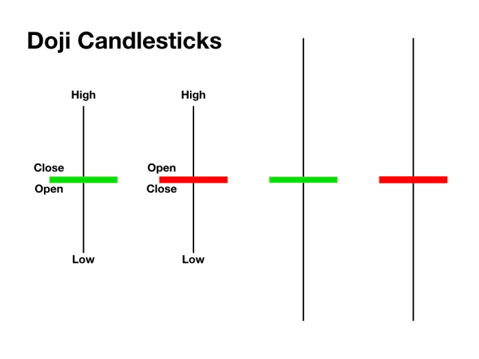

## Table of Contents

## What is a Doji candlestick pattern?

A Doji candlestick pattern is a special kind of candle on a price chart that shows when the opening and closing prices of a stock or other financial asset are very close to each other. It looks like a cross or plus sign because the body of the candle is very small or almost non-existent. This pattern often indicates that the market is unsure about the next move, as neither buyers nor sellers could take control during the trading period.

Doji patterns can appear in different forms, such as the standard Doji, long-legged Doji, dragonfly Doji, and gravestone Doji. Each type can give traders different signals about potential future price movements. For example, a dragonfly Doji, which has a long lower shadow and no upper shadow, might suggest that the price could start to rise after hitting a low point. On the other hand, a gravestone Doji, with a long upper shadow and no lower shadow, might indicate that the price could fall after reaching a high point. Traders often look at these patterns along with other indicators to make better trading decisions.

## What is a Spinning Top candlestick pattern?

A Spinning Top candlestick pattern is a type of candle on a price chart that shows when the opening and closing prices of a stock or other financial asset are close to each other, but not as close as a Doji. It looks like a small rectangle with long lines, called shadows, above and below it. These long shadows mean that the price moved a lot during the trading period, but ended up close to where it started. This pattern suggests that the market is unsure about the next move because neither buyers nor sellers could take strong control.

Traders watch for Spinning Tops because they can signal that a trend might be losing strength. For example, if a Spinning Top appears after a series of rising prices, it might mean that the upward trend is weakening and the price could start to fall. On the other hand, if it appears after falling prices, it could mean the downward trend is losing steam and the price might start to rise. Like with Doji patterns, traders often use Spinning Tops along with other chart patterns and indicators to make better trading decisions.

## How can you visually distinguish a Doji from a Spinning Top?

To tell a Doji apart from a Spinning Top, look at the size of the candle's body. A Doji has a very small or almost non-existent body, making it look like a cross or plus sign. This means the opening and closing prices are very close together. On the other hand, a Spinning Top has a small body but not as tiny as a Doji. The body of a Spinning Top is still visible and looks like a small rectangle.

Another way to spot the difference is by looking at the shadows. Both Doji and Spinning Top can have long shadows, showing that the price moved a lot during the trading period. But, the key is the body size. A Doji's body is so small it's almost a line, while a Spinning Top's body is bigger but still small compared to the shadows. This difference helps traders see the uncertainty in the market, but the Doji shows even more indecision because the opening and closing prices are almost the same.

## What does a Doji indicate about market sentiment?

A Doji shows that people in the market are not sure what will happen next. It means the price of a stock or asset started and ended at almost the same place, even though it moved a lot during the day. This tells us that buyers and sellers were fighting, but neither side won. It's like they were pushing and pulling, but ended up back where they started.

When you see a Doji, it's a sign that the market might be ready for a change. If prices were going up before the Doji, it could mean the up trend is getting tired and might start going down. If prices were falling before, the Doji could mean the down trend is losing strength and might start going up. Traders use this pattern to think about what might happen next and make their trading plans.

## What does a Spinning Top indicate about market sentiment?

A Spinning Top shows that people in the market are feeling unsure about what will happen next. It means the price moved a lot during the day, but ended up close to where it started. This tells us that buyers and sellers were trying hard to push the price in different directions, but neither side could take control. It's like they were both fighting, but ended up in a draw.

When you see a Spinning Top, it's a hint that the market might be ready for a change. If the price was going up before the Spinning Top, it could mean the up trend is getting weak and might start going down. If the price was falling before, the Spinning Top could mean the down trend is losing strength and might start going up. Traders look at this pattern to guess what might happen next and plan their trades accordingly.

## In what types of market conditions are Doji patterns typically seen?

Doji patterns are often seen when the market is unsure about what will happen next. This can happen at times when big news or events are expected, like company earnings reports or important economic announcements. When people don't know if the news will be good or bad, they might buy and sell a lot, but the price ends up close to where it started. This makes a Doji, which shows that the market is trying to figure out its next move.

Doji patterns can also appear at the end of strong trends, whether the prices have been going up or down. If prices have been going up for a while, a Doji might mean that the buyers are getting tired and the sellers might start to take over, possibly leading to a price drop. On the other hand, if prices have been falling, a Doji could mean that the sellers are losing steam and the buyers might start pushing the price up. In both cases, the Doji shows that the market is at a turning point and traders should pay close attention.

## In what types of market conditions are Spinning Top patterns typically seen?

Spinning Top patterns often show up when the market is feeling unsure about what will happen next. This can happen when important news or events are coming up, like when a company is about to share its earnings or when there's a big economic announcement. People might buy and sell a lot because they don't know if the news will be good or bad, but the price ends up close to where it started. This creates a Spinning Top, which tells us the market is trying to figure out its next move.

Spinning Tops can also appear at the end of strong trends, whether prices have been going up or down. If prices have been going up for a while, a Spinning Top might mean that the buyers are getting tired and the sellers might start to take over, possibly leading to a price drop. On the other hand, if prices have been falling, a Spinning Top could mean that the sellers are losing steam and the buyers might start pushing the price up. In both cases, the Spinning Top shows that the market is at a turning point, and traders should watch closely to see what happens next.

## How does the length of the wicks affect the interpretation of a Doji?

The length of the wicks, or shadows, on a Doji can tell you more about what the market is feeling. A Doji with long wicks means the price moved a lot during the day but ended up back where it started. This shows that there was a big fight between buyers and sellers, but they couldn't decide who would win. It's like they pushed the price up and down a lot, but in the end, it was a draw. This kind of Doji, called a long-legged Doji, can be a strong sign that the market is very unsure and might be ready for a big change.

Different types of Doji with different wick lengths can give you different hints about what might happen next. A dragonfly Doji has a long lower wick and no upper wick, which means the price dropped a lot during the day but came back up to close near the start. This can be a sign that the price might start going up because buyers stepped in to push it back up. On the other hand, a gravestone Doji has a long upper wick and no lower wick, showing that the price went up a lot but then fell back to close near the start. This can mean the price might start going down because sellers took over at the end. By looking at the wicks, traders can get a better idea of what the market might do next.

## How does the length of the wicks affect the interpretation of a Spinning Top?

The length of the wicks on a Spinning Top can give you more information about what the market is thinking. When a Spinning Top has long wicks, it means the price moved a lot during the day but ended up close to where it started. This shows that there was a big struggle between buyers and sellers, but neither side could take control. It's like they were pushing and pulling the price all over the place, but in the end, it was a draw. A Spinning Top with long wicks can be a strong sign that the market is very unsure and might be ready for a change in direction.

The length of the wicks can also help you guess what might happen next. If the lower wick is longer, it means the price dropped a lot during the day but came back up to close near the start. This can be a hint that the price might start going up because buyers stepped in to push it back up. On the other hand, if the upper wick is longer, it shows that the price went up a lot but then fell back to close near the start. This can mean the price might start going down because sellers took over at the end. By looking at the wicks, traders can get a better idea of what the market might do next.

## Can Doji and Spinning Top patterns be used as reliable reversal signals, and if so, under what conditions?

Doji and Spinning Top patterns can be used as reliable reversal signals, but they work best when you look at them with other signs from the market. If you see a Doji or a Spinning Top after prices have been going up or down for a while, it might mean the trend is getting weak. For example, if prices have been going up and then you see a Doji or Spinning Top, it could be a sign that the upward trend is running out of steam and the price might start to go down. The same thing can happen if prices have been falling and then you see one of these patterns; it might mean the downward trend is losing strength and the price could start to go up.

To make sure these patterns are good signals for a reversal, it's important to check other things too. Look at the trading [volume](/wiki/volume-trading-strategy), which is how many shares or contracts are being bought and sold. If the volume is high when you see a Doji or Spinning Top, it's a stronger sign that the market might be changing direction. Also, it helps to look at other chart patterns and technical indicators, like moving averages or the Relative Strength Index (RSI), to get a fuller picture of what the market is doing. By using Doji and Spinning Top patterns along with other tools, traders can make better guesses about when the market might turn around.

## What are the key differences in trading strategies when encountering a Doji versus a Spinning Top?

When you see a Doji in your trading, it's like the market is saying, "I'm not sure what to do next." A Doji has a very tiny body, showing that the opening and closing prices were almost the same. This means neither buyers nor sellers could take control. If you spot a Doji after a long time of prices going up or down, it might be a good time to think about changing your trading plan. You might want to wait for more signs, like high trading volume or other chart patterns, before deciding to sell if prices were going up, or buy if prices were going down. The Doji is a strong hint that the market might be ready for a big change, so keep an eye on other signals to confirm if it's time to act.

A Spinning Top looks a bit different because it has a small body but not as tiny as a Doji. It shows that the price moved a lot during the day but ended up close to where it started. This means there was a lot of fighting between buyers and sellers, but they couldn't decide who would win. When you see a Spinning Top after a trend, it's another sign that the trend might be getting weak. Your trading strategy might involve waiting for more signs, like a change in the trend direction or other technical indicators, before making a move. Like with a Doji, you want to see if other parts of the market agree that it's time for a change before you decide to buy or sell.

## How do advanced traders incorporate Doji and Spinning Top patterns into more complex technical analysis strategies?

Advanced traders use Doji and Spinning Top patterns as part of bigger, more detailed plans to understand the market better. They look at these patterns together with other chart patterns and technical indicators like moving averages, the Relative Strength Index (RSI), and the volume of trades. For example, if they see a Doji or Spinning Top after a long time of prices going up or down, they check if the trading volume is high. High volume can make the pattern a stronger sign that the market might be ready to change direction. They also look at other patterns, like support and resistance levels, to see if the Doji or Spinning Top fits with what these other signs are saying.

These traders don't just rely on one Doji or Spinning Top to make decisions. They use these patterns to help them figure out the overall mood of the market. For instance, if they see a series of Doji or Spinning Tops over a few days, it might mean the market is really unsure and a big change could be coming. They might then use this information along with other tools, like trend lines or Fibonacci retracement levels, to plan their trades. By combining Doji and Spinning Top patterns with a lot of other information, advanced traders can make smarter guesses about when to buy or sell, and they can be more confident in their trading decisions.

## References & Further Reading

[1]: [Nison, S. (1991). "Japanese Candlestick Charting Techniques: A Contemporary Guide to the Ancient Investment Techniques of the Far East."](https://archive.org/details/japanesecandlest0000niso) 

[2]: Bulkowski, T. N. (2008). ["Encyclopedia of Candlestick Charts."](https://onlinelibrary.wiley.com/doi/book/10.1002/9781119202288) Wiley.

[3]: Morris, G. L. (2006). ["Candlestick Charting Explained: Timeless Techniques for Trading Stocks and Futures."](https://www.amazon.com/Candlestick-Charting-Explained-Timeless-Techniques/dp/007146154X) McGraw-Hill.

[4]: Murphy, J. J. (1999). ["Technical Analysis of the Financial Markets: A Comprehensive Guide to Trading Methods and Applications."](https://archive.org/details/technicalanalysi0000murp) New York Institute of Finance.

[5]: Elder, A. (2014). ["Trading for a Living: Psychology, Trading Tactics, Money Management."](https://www.amazon.com/Trading-Living-Psychology-Tactics-Management/dp/0471592242) Wiley.