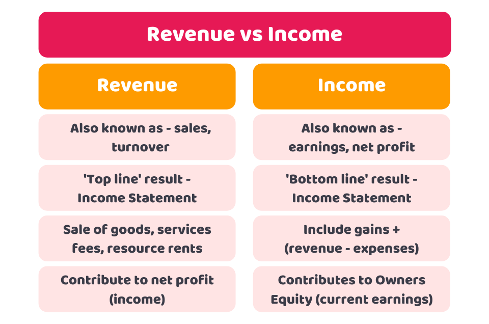

## Table of Contents

## What is earnings?

Earnings are the money a company makes after paying all its costs. It's like when you get your salary after taxes and other deductions. For a company, earnings show how well it's doing. If a company has high earnings, it means it's making more money than it's spending, which is good. If earnings are low or negative, it might mean the company is struggling.

Earnings are important because they tell investors if a company is a good place to put their money. If a company's earnings are growing, investors might want to buy its stock, hoping to make money as the company does well. On the other hand, if earnings are dropping, investors might sell the stock to avoid losing money. Earnings reports, which companies share every three months, help everyone see how the company is doing and make decisions based on that information.

## What is income?

Income is the money you get from different places. It can be from your job, where you get paid for working. It can also be from other things like renting out a house, selling things you made, or getting money from investments like stocks or savings accounts. When people talk about income, they usually mean how much money someone or a business gets in a certain time, like every month or year.

For a person, income is important because it's what they use to pay for things they need, like food, a place to live, and clothes. It's also what they use for things they want, like going on vacation or buying a new phone. For a business, income is the money it gets from selling its products or services. This money is used to pay for running the business, like paying workers, buying materials, and keeping the lights on. If a business's income is more than its costs, it makes a profit.

## How are earnings and income similar?

Earnings and income are similar because they both talk about money coming in. For a person, income is the money they get from their job or other places like investments. Earnings for a person would be what's left after they pay taxes and other costs. For a business, income is all the money it gets from selling things or services. Earnings for a business are what's left after it pays all its costs, like salaries and rent. So, both terms deal with money coming into someone's or a company's pocket.

The main similarity between earnings and income is that they both help us understand how well someone or a business is doing financially. If a person's income is high and their earnings after taxes are good, it means they can pay for what they need and maybe save some money. For a business, if its income is high and its earnings are strong, it means the business is doing well and making a profit. Both earnings and income are important numbers that show financial health and help with making decisions about money.

## How are earnings and income different?

Earnings and income are different because they talk about money at different points. Income is all the money that comes in, like what you get from your job or from selling things. It's the total amount before any costs are taken out. Earnings, on the other hand, are what's left after you take away all the costs. For a person, earnings are what's left after taxes and other bills. For a business, earnings are what's left after paying for things like salaries, rent, and materials.

The difference between earnings and income is important because it shows how much money is really available to use or save. Income gives you an idea of how much money is coming in, but it doesn't tell you if that money is enough to cover everything you need to pay for. Earnings, though, show you the real picture because they are what's left after all the bills are paid. This makes earnings a better way to see if someone or a business is doing well financially.

## Can you give examples of earnings?

Imagine you have a small bakery. Every month, you make $5,000 from selling cakes and cookies. That's your income. But to run the bakery, you have to pay for things like flour, sugar, rent, and your workers' salaries. These costs add up to $3,000 a month. So, after paying all these bills, you have $2,000 left. That $2,000 is your earnings. It shows how much money you really made after all the costs.

Now think about a big company like Apple. They sell millions of phones and computers every year. Let's say in one year, they make $200 billion from sales. That's their income. But to make all those products, Apple has to spend a lot on things like parts, factory workers, and advertising. These costs might be $150 billion for the year. So, after paying all those bills, Apple has $50 billion left. That $50 billion is their earnings. It tells everyone how much profit Apple made after all the costs.

## Can you give examples of income?

Imagine you work at a store. Every month, you get paid $2,000 for your work. That $2,000 is your income. It's all the money you get before you have to pay taxes or other bills. If you also get $100 a month from renting out a room in your house, that money is part of your income too. So, your total income for the month would be $2,100.

Now think about a small business that sells handmade jewelry. Every month, they make $3,000 from selling necklaces and bracelets. That $3,000 is their income. It's all the money they get from customers before they have to pay for things like beads, wire, and the cost of running their shop. If they also make $500 a month from selling their jewelry online, that money is added to their income too. So, their total income for the month would be $3,500.

## How is earnings reported on financial statements?

Earnings are reported on a company's financial statements, mainly in the income statement. The income statement shows how much money a company made and spent over a certain time, like a quarter or a year. It starts with the company's total income from selling things or services. Then it lists all the costs the company had to pay, like salaries, rent, and materials. After subtracting all these costs from the total income, what's left is the company's earnings. This number is also called net income or profit. It tells everyone if the company made money or lost money during that time.

Sometimes, companies also show earnings in another part of their financial statements called the statement of retained earnings. This statement shows how the company's earnings are used. Some of the earnings might be paid out to shareholders as dividends, and the rest might be kept by the company to use for things like growing the business or paying off debts. The statement of retained earnings helps people see how the company is managing its profits over time. Both the income statement and the statement of retained earnings give important information about a company's financial health and how well it's doing.

## How is income reported on tax returns?

On a tax return, income is the money you get from different places. This includes money from your job, which is called wages or salary. It also includes money from other things like renting out a house, selling things you made, or getting money from investments like stocks or savings accounts. When you fill out your tax return, you add up all this money to find your total income. This total income is important because it's what the government uses to figure out how much tax you owe.

The tax return form has different sections where you write down each type of income. For example, there's a section for wages, another for interest from savings, and another for money from renting out property. You fill in these sections with the amounts you got from each source. After you add up all these amounts, you have your total income. This total is used to calculate your taxable income, which is what's left after you take away any deductions or credits you're allowed. The government then uses this taxable income to figure out your tax bill.

## What role do earnings play in business analysis?

Earnings are really important when people want to understand how a business is doing. They show how much money a company makes after paying all its bills. If a company's earnings are going up, it means they're doing well and making more profit. This makes investors happy because it shows the company is growing and might be a good place to put their money. On the other hand, if earnings are going down, it might mean the company is having trouble. Investors might worry and think about taking their money out.

Earnings also help people inside the company make decisions. If earnings are good, the company might decide to spend more money on new projects or give more money back to shareholders. If earnings are not so good, the company might need to cut costs or find new ways to make money. By looking at earnings over time, people can see if the company is getting better or worse at making money. This helps everyone from the CEO to regular workers understand where the business stands and what they need to do next.

## How does income affect personal financial planning?

Income is a big part of personal financial planning because it's the money you have to spend and save. When you know how much money you're getting each month, you can make a plan for how to use it. This plan might include paying for things you need, like food and rent, and saving some money for the future. If your income goes up, you might be able to save more or spend on things you want, like a vacation. But if your income goes down, you might need to cut back on spending or find other ways to make money.

Your income also helps you decide how much risk you can take with your money. If you have a steady job with a good income, you might feel more comfortable investing in things like stocks or starting your own business. But if your income is not so steady, you might want to be more careful and keep your money in safer places like a savings account. Knowing your income helps you make smart choices about spending, saving, and investing, so you can reach your financial goals.

## What are the advanced accounting treatments for earnings?

Advanced accounting treatments for earnings involve different ways to show how much money a company makes after paying all its costs. One way is using earnings before interest and taxes (EBIT). This shows how much money the company makes from its main business before paying interest on loans or taxes. Another way is earnings before interest, taxes, depreciation, and amortization (EBITDA). This number shows the company's earnings without counting the costs of things like equipment wearing out or spreading out the cost of big purchases over time. These methods help people see how well the company is doing without being distracted by some costs that might not be related to the main business.

Another important advanced accounting treatment is dealing with non-recurring items. These are one-time costs or gains that don't happen every year, like selling a big piece of land or paying for a lawsuit. Companies often show their earnings both with and without these non-recurring items. This helps people see what the company's normal earnings are without being confused by these unusual events. Also, companies might use different ways to spread out the costs of things like employee stock options or pension plans. These methods can change how much earnings are reported, so it's important to understand them to get a clear picture of the company's financial health.

## How do economic theories differentiate between earnings and income?

Economic theories look at earnings and income as different but related ideas. Income is the total money that comes in from things like working, renting out property, or getting money from investments. It's the full amount before any costs or taxes are taken out. Earnings, on the other hand, are what's left after you pay all the costs. For a person, earnings are what's left after taxes and other bills. For a business, earnings are what's left after paying for things like salaries, rent, and materials. So, income is the starting point, and earnings are the end result after all the bills are paid.

In economic theories, income is important because it shows how much money someone or a business has to work with. It's used to understand how much people can spend and save, and it helps figure out things like how much tax they should pay. Earnings, though, tell a different story. They show how well someone or a business is doing after all the costs are taken care of. If earnings are high, it means they're making more money than they're spending, which is good. If earnings are low or negative, it might mean they're struggling. So, both income and earnings are important numbers that help economists understand the financial health of people and businesses.

## What is the understanding of earnings and income?

Earnings and income are pivotal concepts in financial analysis, each providing unique insights into a company's financial health and operational efficiency. Although often used interchangeably, they differ markedly in their scope and applications. 

Earnings, commonly referred to as net income, represent the residual profit a company earns after all operating expenses, taxes, interest, and costs have been subtracted from total revenue. This metric is a direct indicator of a company's profitability and is typically reported in the income statement. To calculate earnings, the formula used is:

$$
\text{Earnings (Net Income)} = \text{Total Revenue} - \text{Total Expenses}
$$

Earnings are crucial for understanding a company's ability to generate profit from its operational activities. Investors and analysts closely examine earnings to assess the effectiveness of management strategies and the potential for future growth and dividends. While positive earnings indicate profitability, negative earnings signal financial distress, warranting further investigation into the underlying causes.

Income, on the other hand, encompasses the total revenue generated by a company from its core business operations, without deducting any expenses. It offers a broader perspective on a company's overall revenue-generation capacity. For example, a retailer's income would include the total sales revenue from its stores. Income is sometimes referred to as gross income or gross revenue and is essential for evaluating a company's market presence and growth trajectory. The basic representation is:

$$
\text{Income (Revenue)} = \text{Unit Price} \times \text{Quantity Sold}
$$

Understanding these distinctions is fundamental for analyzing a company's financial statements. By examining both earnings and income, one can gain a comprehensive view of a company's financial standing. Earnings highlight profitability, while income provides clarity on the scale and scope of revenue generation. These metrics serve as critical benchmarks for making informed investment decisions and predicting future financial performance.

In financial analysis, focusing solely on income without considering earnings can be misleading. A company might exhibit high revenue levels but still operate at a loss due to excessive expenses. Thus, a balanced analysis incorporating both earnings and income is necessary for accurate forecasting and strategic planning. This dual approach facilitates a deeper understanding of a company's operational efficiency and its potential for sustainable growth.

## References & Further Reading

[1]: Bergstra, J., Bardenet, R., Bengio, Y., & Kégl, B. (2011). ["Algorithms for Hyper-Parameter Optimization."](https://dl.acm.org/doi/10.5555/2986459.2986743) Advances in Neural Information Processing Systems 24.

[2]: ["Advances in Financial Machine Learning"](https://www.amazon.com/Advances-Financial-Machine-Learning-Marcos/dp/1119482089) by Marcos Lopez de Prado

[3]: ["Evidence-Based Technical Analysis: Applying the Scientific Method and Statistical Inference to Trading Signals"](https://www.amazon.com/Evidence-Based-Technical-Analysis-Scientific-Statistical/dp/0470008741) by David Aronson

[4]: ["Machine Learning for Algorithmic Trading"](https://github.com/stefan-jansen/machine-learning-for-trading) by Stefan Jansen

[5]: ["Quantitative Trading: How to Build Your Own Algorithmic Trading Business"](https://www.amazon.com/Quantitative-Trading-Build-Algorithmic-Business/dp/1119800064) by Ernest P. Chan