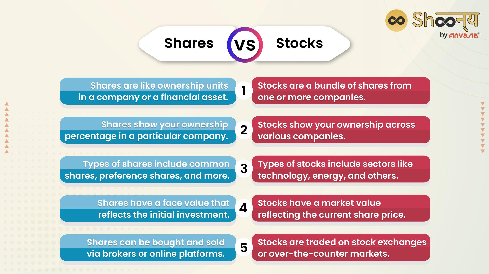

## Table of Contents

## What is the equity market?

The equity market, also known as the stock market, is a place where people buy and sell shares of companies. When you buy a share, you own a small part of that company. This market helps companies raise money by selling pieces of their business to the public. People who buy these shares hope that the company will do well and the value of their shares will go up.

The equity market is important because it lets everyday people invest in big companies. It also helps companies grow by giving them money to expand their business. The price of shares can go up and down based on how well the company is doing and what is happening in the economy. If a company does well, its share price usually goes up, and if it does poorly, the price can go down. This makes the equity market a place where there can be both big rewards and big risks.

## What is the stock market?

The stock market is a place where people can buy and sell pieces of companies, called stocks or shares. When you buy a stock, you own a small part of that company. The stock market helps companies get money they need to grow by selling these pieces to the public. People who buy stocks hope that the company will do well, which can make the value of their stocks go up.

The stock market is important because it lets regular people invest in big companies. It also helps the economy by giving companies money to expand their business. The price of stocks can change every day based on how well the company is doing and what's happening in the world. If a company does well, its stock price usually goes up. But if it does poorly, the price can go down. This means the stock market can be a place of big wins and big losses.

## Are the equity market and stock market the same?

The equity market and the stock market are basically the same thing. They are places where people can buy and sell pieces of companies. These pieces are called stocks or shares. When you buy a stock, you own a little bit of that company. This helps companies get money to grow their business by selling these pieces to the public.

People who buy stocks hope that the company will do well, making their stocks worth more money. The stock market is important because it lets regular people invest in big companies. It also helps the economy by giving companies money to expand. The price of stocks can change every day based on how the company is doing and what's happening in the world. If a company does well, its stock price usually goes up, but if it does poorly, the price can go down. This means the stock market can be a place of big wins and big losses.

## What types of securities are traded in the equity market?

In the equity market, the main type of security traded is stocks, also known as shares. When you buy a stock, you own a small piece of a company. Companies sell these stocks to raise money they need to grow their business. People buy stocks hoping that the company will do well, which can make the value of their stocks go up.

There are also other types of securities traded in the equity market, like preferred stocks and equity derivatives. Preferred stocks are different from regular stocks because they usually pay a fixed dividend and have priority over common stocks if the company goes bankrupt. Equity derivatives, like options and futures, are contracts that get their value from the price of the underlying stock. These securities can be more complex and are used for different investment strategies.

## What types of securities are traded in the stock market?

In the stock market, the main type of security traded is stocks, which are also called shares. When you buy a stock, you own a small piece of a company. Companies sell these stocks to get money they need to grow their business. People buy stocks hoping that the company will do well, making the value of their stocks go up. The stock market is important because it lets regular people invest in big companies and helps the economy by giving companies money to expand.

There are also other types of securities traded in the stock market, like preferred stocks and equity derivatives. Preferred stocks are different from regular stocks because they usually pay a fixed dividend and have priority over common stocks if the company goes bankrupt. Equity derivatives, like options and futures, are contracts that get their value from the price of the underlying stock. These securities can be more complex and are used for different investment strategies.

## How do the trading mechanisms differ between the equity and stock markets?

The trading mechanisms in the equity market and the stock market are the same because they are essentially the same thing. When people talk about trading in the equity market, they are talking about buying and selling stocks. The main way this happens is through stock exchanges like the New York Stock Exchange (NYSE) or the NASDAQ. These exchanges act like big marketplaces where buyers and sellers come together to trade stocks. When you want to buy or sell a stock, you usually do it through a broker, who helps you make the trade on the exchange.

The process of trading stocks involves placing orders. There are different types of orders, like market orders, where you buy or sell a stock at the current market price, and limit orders, where you set a specific price at which you want to buy or sell. Once your order is placed, it goes to the exchange where it matches with another order. If you're buying, your order will match with someone who is selling, and if you're selling, it will match with someone who is buying. This all happens very quickly, often in seconds, thanks to computers that handle the trading. So, whether you call it the equity market or the stock market, the way trading happens is the same.

## What are the key differences in market participants between equity and stock markets?

The participants in the equity market and the stock market are the same because these markets are the same thing. They include individual investors, who are regular people buying and selling stocks, and institutional investors, like big companies and funds that manage a lot of money. Brokers help these investors by making the trades for them on the stock exchanges. Companies also participate because they sell their stocks to raise money.

There are also market makers, who help keep the market running smoothly by always being ready to buy and sell stocks. Regulators, like the Securities and Exchange Commission (SEC) in the U.S., make sure that everyone follows the rules and that the market is fair. So, whether you're talking about the equity market or the stock market, the people involved are the same, and they all play important roles in how the market works.

## How do regulations vary between the equity and stock markets?

The regulations for the equity market and the stock market are the same because they are the same thing. In the U.S., the main group that makes the rules is the Securities and Exchange Commission (SEC). The SEC makes sure that companies tell the truth about their business when they sell stocks. They also make rules to stop people from cheating or doing bad things in the market. This helps keep the market fair for everyone.

Different countries have their own groups that make rules for their stock markets. For example, in the U.K., it's the Financial Conduct Authority (FCA). These groups all work to make sure that the market is safe and fair. They check that companies follow the rules and that people who buy and sell stocks are treated fairly. So, no matter if you call it the equity market or the stock market, the rules are there to protect everyone involved.

## What are the historical origins of the equity and stock markets?

The history of the equity and stock markets goes back a long time. The first stock exchange started in Amsterdam in the early 1600s. It was set up by the Dutch East India Company, which sold shares to raise money for their trading trips. This was a big deal because it let regular people own a part of a big company. Over time, more stock exchanges were created in other places like London and New York. These early markets helped companies grow and let people invest their money in businesses.

In the United States, the New York Stock Exchange (NYSE) was started in 1792. A group of traders met under a buttonwood tree on Wall Street and agreed to trade stocks with each other. This was the start of the NYSE, which became one of the biggest stock exchanges in the world. Over the years, technology changed how the stock market worked. Computers made trading faster and easier. Today, people can buy and sell stocks online from anywhere in the world. The stock market has grown a lot since it began, but it still helps companies and investors in the same way.

## How do global economic factors impact the equity and stock markets differently?

Global economic factors impact the equity and stock markets in the same way because they are the same thing. When the world economy is doing well, companies usually make more money, which makes their stocks go up. For example, if countries are trading a lot with each other, companies that sell things to other countries can do better. This can make people feel good about buying stocks, pushing stock prices higher. On the other hand, if there's a big problem in the world economy, like a financial crisis, people might worry and sell their stocks. This can make stock prices go down.

Interest rates set by big banks around the world can also affect the stock market. When interest rates are low, borrowing money is cheaper, so companies might borrow to grow their business, which can make their stock prices go up. But if interest rates go up, borrowing gets more expensive, and companies might not grow as fast, which can make stock prices go down. So, whether you call it the equity market or the stock market, global economic factors like trade, financial crises, and interest rates all play a big role in how the market moves.

## What are the advanced investment strategies specific to the equity market?

Advanced investment strategies in the equity market often involve using more complex tools and methods to try to make more money. One common strategy is called "value investing." This is when investors look for companies that they think are undervalued, meaning their stock price is lower than what the company is really worth. They buy these stocks and hope that other people will realize the company's true value, making the stock price go up. Another strategy is "growth investing," where investors look for companies that are growing fast and might keep growing. They think these companies will make more money in the future, so their stock prices will go up.

Another advanced strategy is using "options and derivatives." These are special kinds of investments that get their value from the price of stocks. Investors use them to try to make money from small changes in stock prices. For example, they might buy an option that lets them buy a stock at a certain price in the future. If the stock price goes up, they can buy it at the lower price and sell it for a profit. But these strategies can be risky because they can also lose money if the stock price doesn't move the way they expect. So, while these advanced strategies can help investors make more money, they also need to be careful and understand the risks.

## What are the advanced investment strategies specific to the stock market?

Advanced investment strategies in the stock market often involve looking for special opportunities to make more money. One popular strategy is called "value investing." This is when investors find companies that they think are worth more than their current stock price. They buy these stocks, hoping that other people will see the true value of the company, and the stock price will go up. Another strategy is "growth investing," where investors look for companies that are growing quickly and might keep growing. They think these companies will make more money in the future, so their stock prices will go up too.

Another advanced strategy is using "options and derivatives." These are special kinds of investments that depend on the price of stocks. Investors use them to try to make money from small changes in stock prices. For example, they might buy an option that lets them buy a stock at a certain price in the future. If the stock price goes up, they can buy it at the lower price and sell it for a profit. But these strategies can be risky because they can also lose money if the stock price doesn't move the way they expect. So, while these advanced strategies can help investors make more money, they also need to be careful and understand the risks.

## References & Further Reading

[1]: Bergstra, J., Bardenet, R., Bengio, Y., & Kégl, B. (2011). ["Algorithms for Hyper-Parameter Optimization."](https://dl.acm.org/doi/10.5555/2986459.2986743) Advances in Neural Information Processing Systems 24.

[2]: ["Advances in Financial Machine Learning"](https://www.amazon.com/Advances-Financial-Machine-Learning-Marcos/dp/1119482089) by Marcos Lopez de Prado

[3]: ["Evidence-Based Technical Analysis: Applying the Scientific Method and Statistical Inference to Trading Signals"](https://www.wiley.com/en-us/Evidence+Based+Technical+Analysis%3A+Applying+the+Scientific+Method+and+Statistical+Inference+to+Trading+Signals-p-9780470008744) by David Aronson

[4]: ["Machine Learning for Algorithmic Trading"](https://github.com/PacktPublishing/Machine-Learning-for-Algorithmic-Trading-Second-Edition) by Stefan Jansen

[5]: ["Quantitative Trading: How to Build Your Own Algorithmic Trading Business"](https://books.google.com/books/about/Quantitative_Trading.html?id=j70yEAAAQBAJ) by Ernest P. Chan