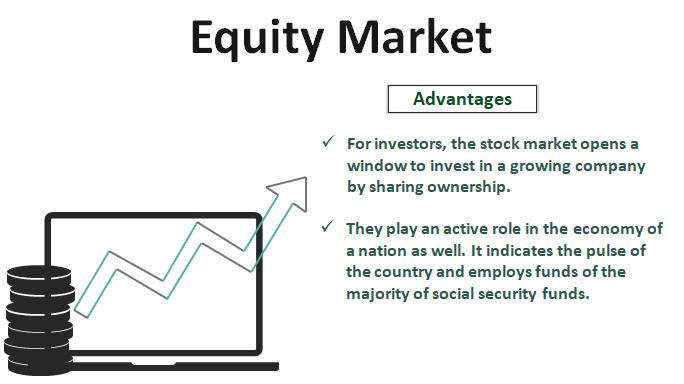

In today's interconnected global economy, financial markets are integral to shaping the economic landscape. These markets facilitate the exchange of financial instruments, thereby influencing global economic trends. Among the various sectors within financial markets, the stock market and the equity market are pivotal, offering both opportunities and challenges for investors. The stock market serves as a platform where company shares are traded, and it functions as a means for companies to raise capital. The equity market, encompassing stock trading, represents ownership in companies and is vital for capital allocation and economic growth.

Technological advancements have profoundly transformed financial transactions, particularly through the emergence of algorithmic trading. This method leverages complex algorithms and mathematical models to execute trades at speeds and efficiencies beyond human capabilities. Algorithmic trading has not only increased the liquidity and efficiency of financial markets but has also introduced new dimensions of market volatility and regulatory challenges.

This article provides a comprehensive examination of financial markets, with a particular focus on the stock and equity markets. Additionally, it investigates the growing influence of algorithmic trading, highlighting its implications for market behavior and investor strategies. A thorough understanding of these components is essential for navigating the modern financial environment effectively and making informed investment decisions. As financial markets continue to evolve, staying informed and adaptable remains crucial for investors seeking to optimize their financial ventures.

## Table of Contents

## Understanding Financial Markets

Financial markets are essential structures within the global economy where various financial instruments, such as stocks, bonds, currencies, and derivatives, are exchanged. These markets facilitate the efficient allocation of resources and risk, thereby playing a critical role in the stability and growth of economies worldwide. 

**Segments of Financial Markets**

Financial markets comprise several segments, each serving distinct purposes:

1. **Stock Markets**: Platforms where shares of public companies are traded, allowing companies to raise capital and investors to gain ownership stakes.

2. **Bond Markets**: Venues for the issuance and trading of debt securities, enabling governments, municipalities, and corporations to finance projects and operations.

3. **Forex Markets**: Platforms for exchanging currencies, vital for international trade and investment activities.

4. **Derivatives Markets**: Markets where derivatives such as futures and options are traded, providing tools for hedging and speculation.

**Functions of Financial Markets**

The primary function of financial markets is to channel funds from savers to borrowers, facilitating capital formation. They enable price discovery, reflecting the perceived value of assets based on supply and demand dynamics. Furthermore, financial markets facilitate risk management through instruments like futures and options, allowing participants to hedge against various risks.

**Participants in Financial Markets**

The participants in financial markets range from individual retail investors to large institutional entities. Individual investors contribute to market [liquidity](/wiki/liquidity-risk-premium) and diversity, while institutional players, such as mutual funds, hedge funds, banks, and insurance companies, bring significant capital and expertise. Each participant category plays a role in the efficiency and dynamism of the markets.

**Key Components: Transparency, Liquidity, and Regulation**

1. **Transparency**: Financial markets thrive on transparency, as it builds trust among participants. Transparent markets provide readily accessible information on prices, transaction volumes, and market conditions, ensuring informed decision-making.

2. **Liquidity**: A key indicator of a healthy financial market is liquidity, which refers to the ease with which assets can be bought or sold without significantly affecting prices. High liquidity ensures that market participants can enter or exit positions with minimal friction.

3. **Regulation**: Regulatory frameworks are essential for maintaining order and protecting market participants. Regulations ensure that markets operate fairly and efficiently, preventing fraud and systemic risks. Bodies like the U.S. Securities and Exchange Commission (SEC) and the Financial Conduct Authority (FCA) are examples of regulators overseeing financial markets to enforce compliance and safeguard investor interests.

In summary, financial markets are complex ecosystems that support the allocation of capital and risk across the economy. Their efficiency and stability hinge on effective regulation, adequate liquidity, and transparency, which combined, foster investor confidence and robust economic outcomes.

## Overview of the Stock Market

The stock market is an essential component of financial markets, primarily involved in the buying and selling of company shares. It serves as a vital platform enabling companies to raise capital from the public by issuing shares, which can be purchased by investors. This capital is typically used by companies for growth, expansion, and operational purposes, thereby contributing to economic development.

The stock market consists of two main segments: the primary market and the secondary market. The primary market is where new securities are issued and sold to investors, allowing firms to obtain fresh capital. This is commonly facilitated through an Initial Public Offering (IPO), wherein a company offers its stock to the public for the first time. In contrast, the secondary market is where previously issued securities are traded among investors. Stock exchanges such as the New York Stock Exchange (NYSE) and the NASDAQ provide regulated venues for this trading activity, ensuring transparency, liquidity, and fair pricing.

Stock exchanges are essential to the functioning of the stock market as they provide a structured environment where buying and selling stocks can occur. They establish rules and regulations to protect investors and maintain orderly markets. Additionally, these exchanges offer electronic platforms that allow rapid and efficient trading, catering to both institutional and individual investors globally.

Participating in the stock market offers investors various benefits, including capital appreciation, dividend income, and portfolio diversification. Capital appreciation refers to the increase in the value of stock holdings over time, potentially leading to substantial returns for long-term investors. Dividend income is derived from a company’s distribution of a portion of its earnings to shareholders, providing a steady income stream. Furthermore, by diversifying investments across different companies and sectors, investors can mitigate risk and enhance the stability of their portfolios.

In summary, the stock market plays a crucial role in the economy by enabling capital flow from investors to businesses and offering a platform for trading existing financial securities. It is driven by both individual and institutional investors, who engage in the market for various financial objectives, including wealth accumulation and risk management.

## Insights into the Equity Market

The equity market involves the trading of shares, which represent partial ownership in companies. These markets serve as a critical platform for businesses to acquire the capital necessary for expansion, operational efficiency, and innovation. By enabling companies to issue shares to a wide range of investors, equity markets facilitate the transfer of capital from investors to enterprises that require funding for growth and development.

Equity markets are integral to economic development, as they help allocate resources effectively across different industries. This allocation process stimulates growth by directing investments towards sectors with the highest potential for returns, enhancing productivity and fostering advancements in various fields. The ability of equity markets to channel funds to burgeoning businesses contributes significantly to a nation's economic dynamism and overall competitiveness.

Equity markets are generally classified into two categories: public and private equities. Public equity refers to the shares of companies that are traded on public stock exchanges, which are accessible to a broad range of investors, including individuals and institutions. Public equities provide liquidity and transparency, as shares can be easily bought and sold, and companies are mandated to disclose financial information regularly. In contrast, private equity involves investments in non-publicly traded companies. These investments are typically less liquid and are often limited to accredited investors or large institutional players, offering potentially higher returns due to associated risks.

Several factors influence fluctuations in equity markets, including market valuations, investor sentiment, and economic indicators. Market valuation is determined through metrics such as price-to-earnings (P/E) ratios, which compare a company’s current share price to its earnings per share. This metric aids in assessing whether a stock is over or undervalued. Investor sentiment, reflective of the market's collective outlook on economic conditions, corporate performance, and geopolitical events, can cause significant shifts in market [momentum](/wiki/momentum) and trends. Economic indicators such as GDP growth rates, unemployment figures, and inflation rates also play a pivotal role in shaping investor expectations and, consequently, market behavior.

The interaction between these elements results in the dynamic nature of equity markets, where prices are subject to continual change based on the flow of information and shifts in economic landscapes. Understanding these dynamics is crucial for investors seeking to capitalize on opportunities within the equity market while managing associated risks effectively.

## The Rise of Algorithmic Trading

Algorithmic trading employs advanced algorithms and mathematical models to automate and expedite trading operations. These algorithms efficiently process vast amounts of market data and execute trades at speeds that far exceed human capabilities. This method leverages statistical and quantitative analysis to predict market movements and determine optimal trade strategies.

The primary advantage of [algorithmic trading](/wiki/algorithmic-trading) is its ability to execute orders with minimal latency, ensuring trades are conducted swiftly and efficiently. This rapid execution aids in enhancing market liquidity, as it allows for a higher [volume](/wiki/volume-trading-strategy) of transactions in a short period, benefiting both traders and market stability. Additionally, algorithmic trading significantly reduces transaction costs by automating trading processes, minimizing the need for manual intervention, and exploiting momentary market inefficiencies.

Despite these benefits, algorithmic trading is not without its risks. One significant concern is the potential for flash crashes—sudden, severe market drops typically caused by algorithms reacting to erroneous data or unforeseen market conditions. Such events can result in substantial financial losses and erode investor confidence. Additionally, the presence of numerous competing algorithms in the market can lead to increased [volatility](/wiki/volatility-trading-strategies), as high-frequency trading ([HFT](/wiki/high-frequency-trading-strategies)) systems may cause rapid fluctuations in asset prices.

Regulatory bodies around the world strive to address these challenges. They enforce stringent guidelines to ensure that algorithmic trading practices do not compromise market integrity or stability. For example, regulatory measures may include mandating robust risk management systems, implementing circuit breakers to curb excessive volatility, and conducting thorough audits of algorithmic trading firms. These efforts aim to balance the innovative potential of algorithmic trading with the necessity of safeguarding fair and orderly markets.

## Impact of Algorithmic Trading on Financial Markets

Algorithmic trading has dramatically transformed financial markets, bringing both benefits and challenges. At its core, algorithmic trading relies on advanced algorithms and high-speed data analysis, allowing it to process large volumes of transactions with remarkable speed and precision. This capability enhances market efficiency by reducing the time lag between order placement and execution. Investors and institutional players can exploit tiny market anomalies that occur in fractions of a second, leading to more efficient price discovery and tighter bid-ask spreads.

Despite these benefits, algorithmic trading introduces certain complexities into the financial markets. High-frequency trading (HFT), a subset of algorithmic trading, exemplifies this by executing numerous transactions in milliseconds. While HFT can increase market liquidity, it also has the potential to cause transient market inefficiencies. Competing algorithms constantly reacting to market signals can amplify volatility and, in some cases, trigger market events like flash crashes. The 2010 Flash Crash, during which the Dow Jones Industrial Average dropped nearly 1,000 points in mere minutes, is a pivotal example of such risks.

Implementing algorithmic trading effectively necessitates robust technological infrastructure and comprehensive regulatory oversight. Financial institutions must invest in high-performance computing systems and data analytics platforms to support algorithmic trading strategies. Furthermore, regulatory frameworks need to be continually adapted to address the rapid technological advancements in this domain. Regulatory bodies like the U.S. Securities and Exchange Commission (SEC) and the Commodity Futures Trading Commission (CFTC) are tasked with ensuring that these technologies operate fairly and transparently, thereby safeguarding market integrity.

The influence of algorithmic trading extends beyond infrastructure to alter trading strategies and investor behavior. Traditional approaches are being adapted to incorporate algorithmic elements, blending human judgment with data-driven decision-making. The increased liquidity provision by algorithmic trading enables more flexible trading strategies, allowing investors to enter and [exit](/wiki/exit-strategy) positions with greater ease. However, the rapid evolution of these technologies demands that investors remain vigilant, as algorithmic trading can quickly shift market dynamics, impacting strategy effectiveness.

In conclusion, the impact of algorithmic trading on financial markets is profound, enhancing efficiency and liquidity while also posing new challenges related to volatility and regulatory compliance. As such, participants in these markets must stay informed about technological advancements and regulatory updates to navigate its complexities effectively.

## Conclusion

Financial markets, especially the stock and equity markets, hold a critical position in the global economy by facilitating resource allocation and providing investment opportunities. Their dynamics have been profoundly influenced by the introduction of algorithmic trading, which employs advanced computational algorithms to execute trades at high speeds and volumes. This evolution in trading methodology has presented investors with both opportunities and challenges.

For modern investors, a deep understanding of these markets and the impact of algorithmic trading is indispensable. This trading method contributes to market efficiency by quickly processing and executing trades, thus improving liquidity and reducing transaction costs. However, it also introduces new risks, such as increased market volatility and the potential for events like flash crashes. These complexities underline the importance of integrating a balanced approach that combines algorithmic techniques with traditional investment strategies to achieve optimal outcomes.

As financial markets continue to evolve, investors must remain informed and adaptable. The rapid pace of technological advancement and regulatory changes necessitates a proactive approach to investment. By staying current with market trends and developments, investors can better navigate the complexities of the financial landscape and capitalize on emerging opportunities.

## References & Further Reading

[1]: Bergstra, J., Bardenet, R., Bengio, Y., & Kégl, B. (2011). ["Algorithms for Hyper-Parameter Optimization."](https://dl.acm.org/doi/10.5555/2986459.2986743) Advances in Neural Information Processing Systems 24.

[2]: ["Advances in Financial Machine Learning"](https://www.amazon.com/Advances-Financial-Machine-Learning-Marcos/dp/1119482089) by Marcos Lopez de Prado

[3]: ["Evidence-Based Technical Analysis: Applying the Scientific Method and Statistical Inference to Trading Signals"](https://www.wiley.com/en-us/Evidence+Based+Technical+Analysis%3A+Applying+the+Scientific+Method+and+Statistical+Inference+to+Trading+Signals-p-9780470008744) by David Aronson

[4]: ["Machine Learning for Algorithmic Trading"](https://github.com/PacktPublishing/Machine-Learning-for-Algorithmic-Trading-Second-Edition) by Stefan Jansen

[5]: ["Quantitative Trading: How to Build Your Own Algorithmic Trading Business"](https://books.google.com/books/about/Quantitative_Trading.html?id=j70yEAAAQBAJ) by Ernest P. Chan