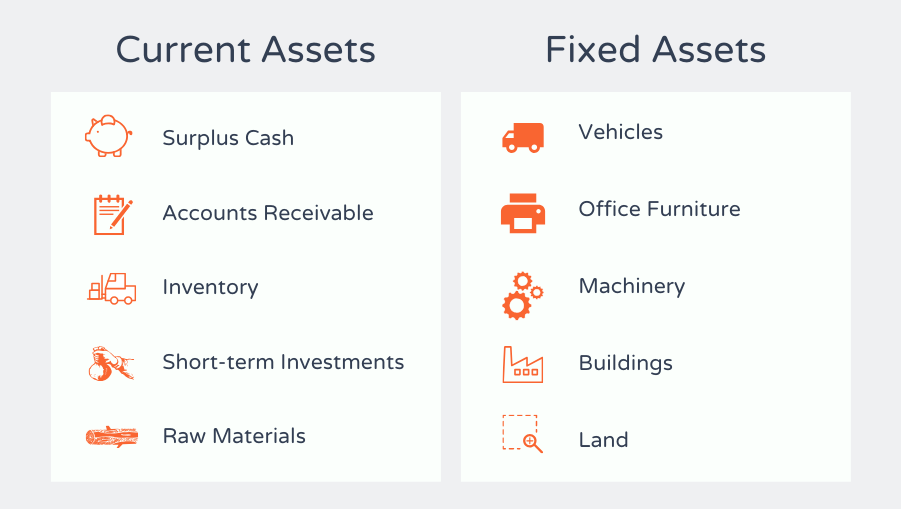

## Table of Contents

## What are fixed assets?

Fixed assets are things a business owns that it uses for a long time to help make money. These can be things like buildings, machines, vehicles, or computers. They are not meant to be sold quickly but are used in the business to produce goods or services.

When a business buys a fixed asset, it doesn't count the whole cost as an expense right away. Instead, the cost is spread out over the years the asset will be used. This process is called depreciation. It helps show a more accurate picture of the business's financial health over time.

## What are current assets?

Current assets are things a business owns that can be turned into cash or used up within a year. They are important because they help a business pay its short-term bills and keep running smoothly. Examples of current assets include cash, money in the bank, inventory (things a business has to sell), and accounts receivable (money that customers owe the business).

These assets are listed on a company's balance sheet and are a key part of understanding how well a business can manage its day-to-day operations. If a business has enough current assets, it can easily cover its short-term debts, like paying suppliers or employees. Keeping a good balance of current assets is crucial for the financial health of a business.

## Can you give examples of fixed assets?

Fixed assets are things a business owns and uses for a long time to help make money. Some examples are buildings and land. A company might own an office building where its employees work, or it might own a factory where it makes its products. Land is another fixed asset, like a piece of property where a business might plan to build a new store or warehouse in the future.

Another type of fixed asset is machinery and equipment. This can include big machines used in manufacturing, like a printing press or a conveyor belt system. It also includes smaller equipment like computers and office furniture that help employees do their jobs. These items are important for the day-to-day operations of the business.

Vehicles are also fixed assets. A delivery company might own a fleet of trucks that it uses to transport goods. A construction company might have bulldozers and cranes that it uses on job sites. These vehicles are essential for the business to [carry](/wiki/carry-trading) out its work and are expected to last for several years.

## Can you give examples of current assets?

Current assets are things a business owns that can be turned into cash or used up within a year. One example is cash, which is money the business has in its bank accounts or as physical currency. Another example is accounts receivable, which is money that customers owe the business for goods or services they have already received. If a business sells something to a customer on credit, the amount the customer owes becomes part of the business's current assets until it is paid.

Inventory is another type of current asset. This is the stock of goods a business has on hand to sell to customers. For example, a clothing store's inventory would include all the clothes it has in stock, ready to be sold. Prepaid expenses are also current assets. These are payments a business makes in advance for things like rent or insurance. Until the service is used up, the payment remains a current asset.

These examples show how current assets help a business manage its day-to-day operations. Having enough current assets means a business can pay its short-term bills, like salaries and supplier invoices, without trouble. Keeping a good balance of current assets is important for the financial health of a business.

## How do fixed assets differ from current assets in terms of liquidity?

Fixed assets and current assets differ a lot when it comes to how quickly they can be turned into cash, which is called [liquidity](/wiki/liquidity-risk-premium). Fixed assets, like buildings, machines, and vehicles, are not meant to be sold quickly. They are used in the business over many years to help make money. Because of this, fixed assets are not very liquid. It can take a long time to sell a building or a big machine, and you might not get as much money as you paid for it.

On the other hand, current assets are much more liquid. They can be turned into cash or used up within a year. Cash itself is the most liquid asset because it's already money. Other current assets, like inventory and accounts receivable, can also be turned into cash pretty quickly. A business can sell its inventory to customers or collect money from customers who owe it. This makes current assets very important for paying short-term bills and keeping the business running smoothly.

## What is the typical lifespan of fixed assets compared to current assets?

Fixed assets have a much longer lifespan compared to current assets. Fixed assets like buildings, machines, and vehicles are expected to last for several years, often between 5 to 30 years or even longer. Because they are used over a long period to help the business make money, their cost is spread out over their useful life through a process called depreciation. This means that each year, a portion of the cost is recorded as an expense, reflecting the asset's gradual wear and tear.

Current assets, on the other hand, have a much shorter lifespan. They are expected to be turned into cash or used up within a year. For example, cash is immediately available, inventory is sold within the business cycle, and accounts receivable are collected within a short period. Because of their short lifespan, current assets are not depreciated but are instead used to help the business manage its day-to-day operations and pay short-term bills.

## How are fixed assets and current assets treated differently on a balance sheet?

On a balance sheet, fixed assets and current assets are shown in different sections because they serve different purposes in a business. Fixed assets are listed under the "non-current assets" or "long-term assets" section. This section shows things like buildings, machines, and vehicles that the business will use for a long time. The value of these assets is not expected to be turned into cash quickly, so they are not meant for short-term use. Instead, their cost is spread out over many years through a process called depreciation, which shows how their value goes down over time.

Current assets, on the other hand, are listed at the top of the balance sheet under the "current assets" section. This section includes things like cash, inventory, and accounts receivable, which are expected to be turned into cash or used up within a year. These assets are important for the day-to-day running of the business and help pay short-term bills. Because they are used up or turned into cash quickly, current assets are not depreciated but are shown at their current value on the balance sheet.

The way fixed assets and current assets are treated on a balance sheet helps people understand the financial health of a business. By looking at the current assets, you can see if the business has enough money to pay its short-term debts. By looking at the fixed assets, you can see what the business owns that will help it make money over the long term. Both types of assets are important, but they are managed and shown differently on the balance sheet to give a clear picture of the business's financial situation.

## What are the depreciation methods used for fixed assets?

Depreciation is how businesses spread out the cost of fixed assets over the time they use them. There are a few main ways to do this. One way is called the straight-line method. This is the simplest way. You take the total cost of the asset and subtract how much you think it will be worth at the end, called the salvage value. Then you divide that number by how many years you expect to use the asset. Each year, you take off the same amount from the asset's value.

Another way is the declining balance method. This method takes off more of the cost in the early years and less as time goes on. It's like saying the asset loses value faster when it's new. You start with a fixed rate, often double the straight-line rate, and you apply this rate to the asset's remaining value each year. This method is good for things like computers or cars that lose value quickly at first.

There's also the units of production method. This one is different because it looks at how much the asset is used, not just time. You figure out how many units the asset can make or how many hours it can work over its life. Then you take the total cost minus the salvage value and divide it by the total units or hours. Each year, you take off an amount based on how many units were made or hours worked that year. This method is useful for machines that might be used more or less from year to year.

## How do changes in fixed and current assets affect a company's financial ratios?

Changes in fixed and current assets can really affect a company's financial ratios, which are numbers that help people understand how well a business is doing. One important ratio is the current ratio, which looks at how well a company can pay its short-term bills. If a company has more current assets, like cash or inventory, its current ratio goes up. This makes the company look healthier because it can easily pay what it owes in the short term. But if the company uses up its current assets or turns them into fixed assets, like buying a new building, the current ratio might go down. This could make the company look less able to pay its short-term bills.

Another ratio that changes with fixed and current assets is the debt-to-equity ratio. This ratio shows how much of the company is paid for with borrowed money versus money from owners. If a company buys a lot of fixed assets using loans, the debt part of the ratio goes up. This might make the company look riskier because it owes more money. On the other hand, if the company sells some fixed assets and uses the money to pay off loans, the debt part goes down, making the company look less risky. So, the way a company manages its fixed and current assets can really change how investors and others see its financial health.

## What are the tax implications of fixed versus current assets?

When it comes to taxes, fixed assets and current assets are treated differently. Fixed assets, like buildings or machines, are things a business uses for a long time. Because they last a while, their cost is spread out over many years through something called depreciation. This means a business can take a bit of the cost as a tax deduction each year, instead of all at once. This can help lower the business's taxable income over time, making its tax bill smaller each year.

Current assets, like cash or inventory, are things a business can turn into cash or use up within a year. They don't get depreciated because they're not meant to last long. When a business sells inventory, it can count the cost of that inventory as a tax deduction right away. This can help lower the business's taxable income for that year. But, if the business holds onto a lot of cash or other current assets, it might have to pay more in taxes because it has more money to be taxed on.

## How do companies manage and optimize their fixed and current assets?

Companies manage and optimize their fixed assets by keeping track of them and making sure they are used well. They do regular checks to see if machines or buildings need repairs or if they should be replaced. This helps keep everything working smoothly and saves money in the long run. Companies also think about how to use their fixed assets to make more money. For example, they might rent out part of a building they own or sell old equipment that they don't need anymore. By doing this, they can get more value from their fixed assets and keep their business running efficiently.

For current assets, companies focus on having the right amount of cash, inventory, and other things they can turn into cash quickly. They try to keep enough cash to pay bills and run the business, but not so much that it's just sitting around not earning anything. They also manage inventory carefully, making sure they have enough to meet customer demand but not so much that it takes up too much space or money. Companies might use tools like just-in-time inventory systems to get goods just when they need them, which helps save money and keep things moving smoothly. By managing current assets well, companies can make sure they have the money they need to keep going and grow.

## What strategic considerations should businesses take into account when deciding between investing in fixed or current assets?

When a business thinks about whether to invest in fixed assets or current assets, it needs to look at its long-term goals and short-term needs. Fixed assets, like buildings or machines, are good for the long run because they help the business make money over many years. But they cost a lot of money upfront and can't be turned into cash quickly. So, if a business wants to grow and has the money to spend, buying fixed assets might be a smart move. It can help the business do more and make more money in the future. But if the business is not sure about its future or needs money soon, it might be better to wait on big fixed asset investments.

On the other hand, current assets, like cash or inventory, are important for keeping the business running day to day. They can be turned into cash quickly, which helps the business pay its bills and keep going. If a business is worried about having enough money to cover short-term costs, it should focus on having enough current assets. This means keeping enough cash on hand and managing inventory well so it's not too much or too little. By balancing the need for fixed assets to grow and current assets to stay stable, a business can make smart choices about where to put its money.

## What is the understanding of fixed assets?

Fixed assets, also known as tangible or long-term assets, are resources utilized by companies to generate income over periods exceeding one fiscal year. These assets form a critical part of a company's infrastructure and are integral to its production and service delivery capabilities. 

Examples of fixed assets include property (land and buildings), machinery, vehicles, and equipment. These assets are tangible, which means they have physical substance and can be seen and touched, distinguishing them from intangible assets like patents or trademarks. The primary characteristic of fixed assets is their longevity, serving the business over multiple financial periods and contributing to [earning](/wiki/earning-announcement) revenue over their operational lifespan.

One significant aspect of managing fixed assets is the process of depreciation. Depreciation is an accounting method used to allocate the cost of a tangible asset over its useful life. This calculation allows companies to expense part of the asset's cost to match it against the revenue it generates, thus providing a more accurate picture of a company's profitability. Depreciation can be accounted for using various methods, such as straight-line or declining balance, each providing a systematic approach to spreading an asset's cost. The straight-line depreciation method, for instance, divides the cost of an asset, minus its salvage value, equally over its useful life:

$$
\text{Annual Depreciation} = \frac{\text{Cost of Asset} - \text{Salvage Value}}{\text{Useful Life}}
$$

This ensures that the expense is matched against revenues over time, underlining the principle of matching in accounting practices.

By capitalizing fixed asset purchases and depreciating them accordingly, businesses can better manage tax liabilities and reflect the true cost of utilizing physical resources. Recognizing fixed assets and properly accounting for them is essential for financial reporting, providing vital insights into a company's investment in long-term resources and its operational dependence on them. This insight is crucial for stakeholders to evaluate a company's infrastructure and investment efficiency, ultimately informing strategic business decisions.

## References & Further Reading

[1]: ["Essentials of Financial Accounting"](https://books.google.com/books/about/ESSENTIALS_OF_FINANCIAL_ACCOUNTING.html?id=PcAjDwAAQBAJ) by Ashish K. Bhattacharyya.

[2]: ["Corporate Finance: A Focused Approach"](https://www.cengage.com/c/corporate-finance-a-focused-approach-7e-ehrhardt-brigham/9781337909747/?searchIsbn=9781337909747) by Michael Ehrhardt and Eugene Brigham.

[3]: ["International Financial Reporting Standards (IFRS)"](https://en.wikipedia.org/wiki/International_Financial_Reporting_Standards) - Official standards that guide asset classification in financial statements. 

[4]: ["Algorithmic Trading and DMA: An Introduction to Direct Access Trading Strategies"](https://www.amazon.com/Algorithmic-Trading-DMA-introduction-strategies/dp/0956399207) by Barry Johnson.

[5]: ["Depreciation: Methods and Concepts"](https://www.indeed.com/career-advice/career-development/depreciation-methods) - Investopedia, explaining various depreciation methods and principles in accounting.

[6]: ["Liquidity: Meaning, Importance and Unprecedented Change"](https://www.businessinsider.com/personal-finance/investing/what-is-liquidity) - Research discussing liquidity and its importance in financial markets.

[7]: ["FASB Codification"](https://asc.fasb.org/) - Financial Accounting Standards Board resources for GAAP-based asset classification. 

[8]: ["Understanding Asset Allocation"](https://www.investopedia.com/terms/a/assetallocation.asp) - A paper by the CFA Institute, covering strategies in asset allocation and management.