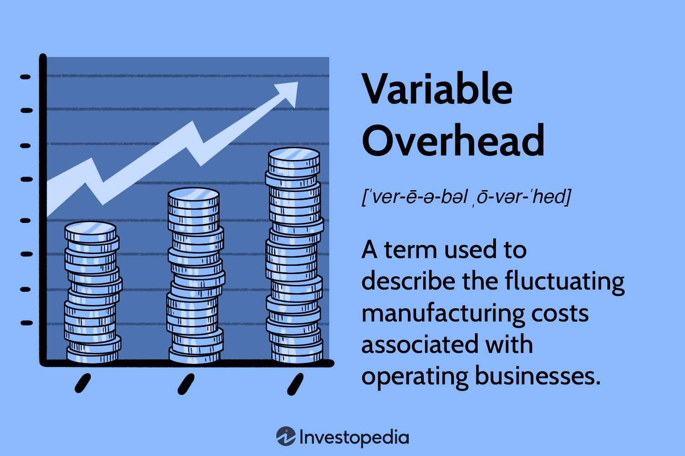

In the competitive landscape of algorithmic trading, effective cost management is vital for ensuring both sustainability and profitability. Algorithmic trading firms, from large hedge funds to small independent operators, face a myriad of expenses that require careful scrutiny and management. These expenses are broadly categorized into fixed and variable overhead costs, each having distinct impacts on trading operations and outcomes.

Understanding the nuances of these costs is fundamental. Fixed overhead costs are the regular, unchanging expenses essential to maintaining the baseline operations of a trading firm. Examples include software subscriptions, data feed services, and hardware maintenance. These costs do not fluctuate with the volume of trades or market conditions, providing a stable financial framework upon which trading strategies can be developed and implemented.



Conversely, variable overhead costs are dynamic and fluctuate with trading activity. These include transaction fees, brokerage commissions, and regulatory charges. As they vary directly with the volume of trades executed, they have a significant impact on the profitability of each transaction. Effective management of variable costs is crucial, as they can erode net returns if not properly controlled.

This article explores the implications of both cost types on trading strategies and provides insights into optimizing them for better financial performance. Recognizing these cost structures is crucial for maintaining a competitive edge, as they directly influence a firm's ability to deploy capital efficiently and achieve target returns. By understanding fixed and variable costs, trading firms can better strategize and align their operations with financial goals, ensuring long-term success in a highly competitive market.

## Table of Contents

## Understanding Fixed Overhead Costs

Fixed overhead costs in algorithmic trading refer to recurring expenses that remain constant irrespective of trading activity levels. These costs are essential for maintaining an infrastructure that supports trading operations but do not fluctuate with the volume of trades. Typical examples of fixed overhead costs in this context include software subscriptions, data feed services, and hardware maintenance.

Software subscriptions are crucial as they provide access to trading platforms, analytical tools, and algorithm development environments. These platforms often require continual subscription payments irrespective of the number of trades executed, ensuring traders always have the necessary tools at their disposal.

Data feed services are another significant component of fixed costs. They provide real-time market data essential for making informed trading decisions and [backtesting](/wiki/backtesting) strategies. Reliable data feeds are crucial for both the development and execution of trading algorithms, requiring consistent financial commitment to maintain their quality and speed.

Hardware maintenance entails the upkeep of physical and cloud-based servers where trading algorithms are hosted. Proper maintenance ensures these servers operate efficiently, without downtime that could disrupt trading activities. This includes regular updates, hardware repairs, or replacement, and security enhancements.

Effectively managing fixed overhead costs involves accurate budgeting and financial forecasting. Traders need to ensure that these expenses are covered under all circumstances, as these services and tools form the backbone of their trading strategy. Balancing between cost-cutting and investing in more sophisticated tools can be a strategic decision—one that involves weighing the benefits of advanced technology against its cost.

An example of managing fixed overhead is making strategic decisions about technology upgrades. Investing in advanced tools and high-quality data feeds may lead to better market insights and optimized trading strategies, potentially offsetting their higher initial costs through improved performance.

Understanding and planning for fixed overhead costs are crucial for establishing a baseline for profitability in [algorithmic trading](/wiki/algorithmic-trading). By ensuring that these expenses are predictable and manageable, traders can focus on optimizing other aspects of their operations that directly impact profitability. This stability also enables traders to better manage their cash flow, providing a clearer picture of financial health and risk exposure.

## The Nature of Variable Overhead Costs

Variable overhead costs in algorithmic trading are those expenses that vary in direct proportion to trading activity. Unlike fixed costs, which remain constant, variable costs are dynamic and can fluctuate significantly based on the [volume](/wiki/volume-trading-strategy) and frequency of trades executed. This variability necessitates careful management to ensure they do not erode profitability.

Key components of variable overhead in algo trading include transaction fees, brokerage commissions, and regulatory charges. Transaction fees are incurred each time a trade is executed, while brokerage commissions are payments made to brokers for facilitating trades. Regulatory charges are imposed by financial markets and authorities to maintain compliance and market integrity. Together, these costs directly influence the net returns of trading operations.

Effective management of variable overhead costs is essential to enhance profit margins. One strategy is to select brokerage firms that offer competitive fee structures, which could substantially reduce the overall cost per trade. Traders should also consider trading frequency; while high-frequency trading might reduce per-trade costs due to larger trade volumes, it might also lead to increased cumulative expenses if not carefully optimized.

Optimization of trading volume and frequency can be approached through algorithms and simulation models. For example, the use of Python to create scripts that simulate different trading scenarios can help traders assess the impact of variable costs on potential profit margins. By adjusting parameters like trading frequency and trade size in these models, traders can identify optimal strategies that minimize variable costs while maintaining effective trading operations.

Continual assessment and adaptation are crucial as market conditions and trading activities change. Traders must regularly review their cost structures and strategy implementations to ensure they align with their financial objectives. This proactive approach helps minimize variable expenses without compromising the effectiveness of trading strategies, ultimately supporting sustainable profitability. 

Overall, a strategic focus on managing variable overhead costs allows traders to refine their operational efficiency and maximize the financial performance of their algorithmic trading ventures.

## Cost Comparison: Fixed vs. Variable Overhead

Differentiating between fixed and variable overhead is crucial in understanding their financial implications on algorithmic trading strategies. High-frequency trading ([HFT](/wiki/high-frequency-trading-strategies)) strategies, characterized by executing a large number of trades in short time frames, typically incur high fixed costs but benefit from relatively lower per-trade variable costs. These fixed costs may include expenses related to sophisticated algorithms, premium data feeds, and high-speed internet connections required to maintain competitiveness. However, the marginal cost per trade diminishes due to the high volume of transactions, allowing these strategies to capitalize on small price inefficiencies in the market.

In contrast, lower-frequency trading strategies incur a different cost structure. While they may not require as extensive high-end technology (leading to potentially lower fixed costs), variable costs such as brokerage fees and transaction costs consume a more significant portion of their profits. These strategies might focus on longer-term trends, resulting in fewer trades but higher profitability per trade, assuming variable costs are managed efficiently.

Real-world examples illustrate how traders manage these costs to align with their financial goals. For instance, an HFT firm might invest heavily in low-latency technology to minimize execution times, viewing this high fixed cost as essential for maintaining competitive edges. On the other hand, a swing trader might prioritize optimizing execution costs and scale using brokers with favorable terms per execution, reflecting a strategic decision to emphasize lower variable overhead.

Choosing the right cost model involves careful consideration of a trader's operational and strategic requirements. Traders must balance between investments in technology and tools or optimizing per-trade costs. Those engaging in a large number of trades with small margins might lean towards higher fixed costs to ensure flawless execution. Conversely, traders with a smaller volume at higher margins might focus on reducing variable costs to maximize individual trade profitability.

Utilizing tools such as Python scripts or spreadsheet models can assist in simulating different cost scenarios and optimizing strategies accordingly. Python, with its robust libraries for data analysis and financial computation, allows traders to model future performance under various cost conditions effectively. For example:

```python
import numpy as np

# Example function to calculate total cost
def calculate_trading_costs(fixed_costs, variable_cost_per_trade, number_of_trades):
    variable_costs = variable_cost_per_trade * number_of_trades
    total_costs = fixed_costs + variable_costs
    return total_costs

fixed_costs = 10000  # Example fixed cost
variable_cost_per_trade = 5  # Variable cost per trade
number_of_trades_high = 1000
number_of_trades_low = 100

# High-frequency trading costs
total_cost_high = calculate_trading_costs(fixed_costs, variable_cost_per_trade, number_of_trades_high)

# Low-frequency trading costs
total_cost_low = calculate_trading_costs(fixed_costs, variable_cost_per_trade, number_of_trades_low)

print(f"Total cost for high-frequency trading: ${total_cost_high}")
print(f"Total cost for low-frequency trading: ${total_cost_low}")
```

Through such simulations, traders can evaluate the implications of different cost structures on potential profitability, assisting in strategic planning to achieve better financial outcomes.

## Strategies for Optimizing Costs in Algo Trading

In algorithmic trading, efficient cost management is central to optimizing both fixed and variable expenses. Leveraging cutting-edge technologies and embracing automation provide meaningful pathways for reducing overall expenditure. By utilizing cloud computing and engaging with specialized service providers, trading firms can significantly minimize infrastructure and server maintenance costs. These solutions are scalable, allowing for dynamic adjustments according to trading activity, thereby optimizing computational resource usage.

Automation in algorithmic trading not only elevates operational efficiency but also significantly reduces the likelihood of errors and the necessity for human oversight. This ensures processes are precise and swift, enhancing the speed and accuracy of trades. By automating routine tasks, traders can focus on strategic decision-making and innovation, further enhancing performance outcomes.

Balancing cost management with trading performance requires consistent evaluative processes such as regular reviews and strategic negotiations with service providers. This ensures the optimal allocation of resources, aligning cost structures with trading objectives. Cost analysis involving fixed and variable overheads can be modeled effectively using Python scripts. For instance:

```python
# Example of Python code to simulate cost scenarios
def calculate_total_cost(fixed_costs, variable_costs, trade_volume):
    total_fixed_costs = sum(fixed_costs)
    total_variable_costs = sum([cost * trade_volume for cost in variable_costs])
    return total_fixed_costs + total_variable_costs

fixed_costs = [1000, 500]  # Example: data feed, software subscriptions
variable_costs = [0.1, 0.05]  # Example: per trade transaction fees

trade_volume = 1000
total_costs = calculate_total_cost(fixed_costs, variable_costs, trade_volume)
print(f"Total Trading Costs: ${total_costs}")
```

This code provides a simplified framework for understanding and projecting trading costs based on varying trade volumes.

Furthermore, maintaining competitiveness requires firms to stay abreast of technological advancements, continually refining their cost strategies to harness new efficiencies. Firms that adeptly integrate technology into their operations often experience streamlined processes, reduced costs, and enhanced profitability. By remaining agile and responsive to innovation, they can safeguard their market positions and optimize their trade execution capabilities in an ever-evolving industry landscape.

## Conclusion

In algorithmic trading, effective management of both fixed and variable overhead costs is essential for profitability and long-term success. Fixed costs, such as data subscriptions and hardware maintenance, provide the foundation necessary for trading activities. In contrast, variable costs, including transaction fees and commissions, directly influence the net returns of each trade. Strategic cost management involves a detailed understanding of these expenses, enabling traders to optimize operations and focus on maximizing trading efficiency.

An ongoing assessment and adaptation of cost strategies are critical in this dynamic industry. Regularly revisiting fixed and variable expenses ensures that resource allocation aligns with the ever-evolving market conditions. This adaptability helps maintain a competitive edge as technology and market structures change.

Traders who skillfully manage both types of overhead can develop strategies that maximize profitability. This involves using tools like Python for modeling and simulation to test different cost scenarios and strategize accordingly. By making informed decisions based on a comprehensive understanding of cost structures, traders position themselves favorably in a continuously evolving market landscape, ultimately driving sustained competitive advantage and financial success.

## References & Further Reading

[1]: Bergstra, J., Bardenet, R., Bengio, Y., & Kégl, B. (2011). ["Algorithms for Hyper-Parameter Optimization."](https://dl.acm.org/doi/10.5555/2986459.2986743) Advances in Neural Information Processing Systems 24.

[2]: ["Advances in Financial Machine Learning"](https://www.amazon.com/Advances-Financial-Machine-Learning-Marcos/dp/1119482089) by Marcos Lopez de Prado

[3]: ["Evidence-Based Technical Analysis: Applying the Scientific Method and Statistical Inference to Trading Signals"](https://www.amazon.com/Evidence-Based-Technical-Analysis-Scientific-Statistical/dp/0470008741) by David Aronson

[4]: ["Machine Learning for Algorithmic Trading"](https://github.com/stefan-jansen/machine-learning-for-trading) by Stefan Jansen

[5]: ["Quantitative Trading: How to Build Your Own Algorithmic Trading Business"](https://github.com/LucindaYa/quant-resources/blob/master/Quantitative%20Trading%20How%20to%20Build%20Your%20Own%20Algorithmic%20Trading%20Business.pdf) by Ernest P. Chan