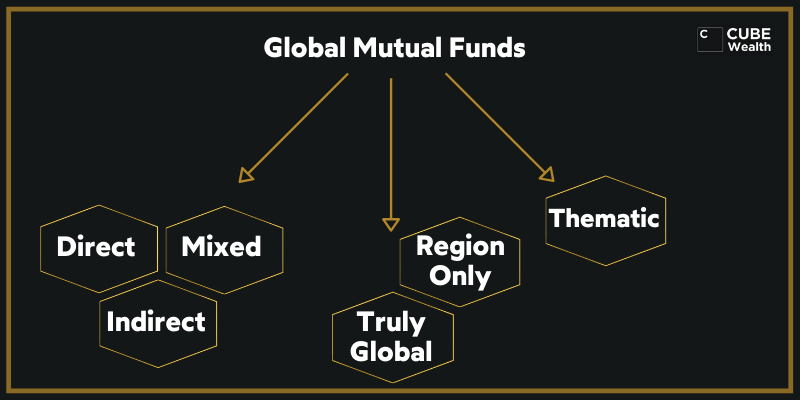

## Table of Contents

## What is a global fund?

A global fund is a type of investment fund that pools money from investors all around the world. These funds are managed by professional fund managers who invest the money in various assets like stocks, bonds, and other securities. The goal is to grow the investors' money over time by making smart investment choices in different markets around the globe.

Global funds are popular because they offer diversification. This means they spread the investment across many different countries and types of assets, which can reduce risk. If one market or asset does poorly, the impact on the overall fund can be less severe because other parts of the fund might be doing well. This makes global funds an attractive option for people who want to invest internationally without having to manage their investments themselves.

## What is an international fund?

An international fund is a type of investment fund that invests in companies and assets outside of the investor's home country. These funds focus on markets in other countries, which can be anywhere in the world except the investor's own country. For example, if you live in the United States, an international fund would invest in companies in Europe, Asia, or other regions, but not in the U.S.

International funds are a good way for people to diversify their investments. By putting money into different countries, they can spread out their risk. If the economy in one country is not doing well, the fund might still do okay because it also has investments in other countries that are doing better. This can help protect the investor's money from big losses in any single market.

## How do global funds differ from international funds in terms of geographic scope?

Global funds and international funds are similar because they both invest in companies and assets from around the world. But they have a key difference in their geographic scope. A global fund can invest anywhere in the world, including the investor's home country. This means that if you live in the United States, a global fund might have investments in U.S. companies as well as companies in other countries.

On the other hand, an international fund focuses only on investments outside of the investor's home country. Using the same example, if you are from the United States, an international fund would invest in companies in Europe, Asia, or other places, but it would not include any U.S. companies. This difference in geographic scope is important because it affects how much of your investment is exposed to your home market versus foreign markets.

## Can you invest in your home country with a global fund?

Yes, you can invest in your home country with a global fund. A global fund is like a big basket that holds investments from all over the world, including your own country. So, if you live in the United States, a global fund might have some of its money invested in American companies, along with companies from other countries.

This is different from an international fund, which only invests in companies outside of your home country. With a global fund, you get a mix of both local and foreign investments. This can be a good way to spread out your risk because your money is not just in one place but spread across many different countries, including your own.

## Can you invest in your home country with an international fund?

No, you cannot invest in your home country with an international fund. An international fund only invests in companies and assets that are outside of your home country. For example, if you live in the United States, an international fund will put your money into companies in places like Europe, Asia, or other regions, but not in the U.S.

This is different from a global fund, which can invest in your home country as well as other countries. If you want to keep some of your investment in your own country, a global fund might be a better choice for you. An international fund is good if you want to focus only on foreign markets and not invest any money back home.

## What are the typical investment strategies for global funds?

Global funds use different ways to grow the money that people put into them. One common way is to spread the money across many different countries and types of businesses. This is called diversification. By doing this, the fund can lower the risk because if one country or business does badly, the other parts of the fund might still do well. Another strategy is to focus on growth. This means the fund managers look for companies that are expected to grow a lot in the future. They might pick companies that are new or in industries that are growing fast.

Another strategy is to look for value. This means the fund managers try to find companies that they think are a good deal. They look for companies that are not very expensive but have good potential to make money in the future. Some global funds also use a mix of these strategies. They might put some money into growth companies and some into value companies. This mix can help balance the risk and reward of the fund. By using these strategies, global funds try to make the most money for the people who invest in them.

## What are the typical investment strategies for international funds?

International funds use different ways to grow the money that people put into them. One common way is to spread the money across many different countries and types of businesses. This is called diversification. By doing this, the fund can lower the risk because if one country or business does badly, the other parts of the fund might still do well. Another strategy is to focus on growth. This means the fund managers look for companies that are expected to grow a lot in the future. They might pick companies that are new or in industries that are growing fast.

Another strategy is to look for value. This means the fund managers try to find companies that they think are a good deal. They look for companies that are not very expensive but have good potential to make money in the future. Some international funds also use a mix of these strategies. They might put some money into growth companies and some into value companies. This mix can help balance the risk and reward of the fund. By using these strategies, international funds try to make the most money for the people who invest in them.

## How do the risk profiles of global and international funds compare?

Global funds and international funds have different risk profiles because of where they invest. A global fund can invest in your home country and other countries around the world. This means it can be less risky because it spreads the money across many places, including your own country. If something bad happens in one country, the fund might still do okay because it has money in other places. But, it also means the fund's performance can be affected by what happens in your home country.

An international fund, on the other hand, only invests in countries outside of your home country. This can make it riskier because if something bad happens in the countries where the fund is invested, there's no cushion from your home country's market. But, it also means that if those foreign markets do well, the fund can do really well too. So, international funds can be more volatile, meaning their value can go up and down more than global funds.

Both types of funds try to manage risk by spreading investments across different countries and types of businesses. But, global funds might feel safer for some people because they include investments in their home country, while international funds might appeal to those who want to focus only on foreign markets and are okay with potentially bigger swings in value.

## What are the tax implications of investing in global versus international funds?

When you invest in global or international funds, you need to think about taxes. Global funds can invest in your home country and other countries. This means you might have to pay taxes in your home country on the money you make from the fund. But if the fund also makes money in other countries, you might have to pay taxes in those countries too. This can be tricky because you might end up paying taxes twice, which is called double taxation. But many countries have agreements to help avoid this, so it's good to check with a tax expert.

International funds only invest in countries outside of your home country. This means the money you make from these funds might be taxed in the countries where the fund invests. You might also have to pay taxes in your home country on the money you get from the fund. Just like with global funds, you could face double taxation. But again, there are often agreements between countries to help with this. It's always a good idea to talk to a tax expert to understand how these taxes will affect your investments in both global and international funds.

## How do currency fluctuations affect global and international funds differently?

Currency fluctuations can affect both global and international funds, but in slightly different ways. For global funds, which invest in companies both in your home country and other countries, changes in currency values can impact the value of the foreign parts of the fund. If the currency of a country where the fund is invested gets weaker compared to your home currency, the value of those investments might go down when you convert them back to your home currency. But, since global funds also invest in your home country, the overall impact might be less because not all of the fund's money is exposed to foreign currency changes.

For international funds, which only invest in companies outside of your home country, currency fluctuations can have a bigger impact. If the currencies of the countries where the fund invests get weaker compared to your home currency, the value of the entire fund could go down when you convert it back to your home currency. This means international funds can be more sensitive to changes in currency values because all of their investments are in foreign currencies. Both types of funds try to manage this risk, but international funds might feel the effects of currency changes more strongly.

## What are the performance differences between global and international funds over the last decade?

Over the last decade, global funds have generally shown more stable performance compared to international funds. This is because global funds invest in both the investor's home country and other countries around the world. For example, if you're from the United States, a global fund might have some money in U.S. companies, which can help balance out any ups and downs in foreign markets. This mix of investments can lead to more consistent returns because if one part of the world is doing badly, the fund might still do okay because of its investments in other places, including the home market.

On the other hand, international funds, which only invest in companies outside of the investor's home country, can be more volatile. Over the last ten years, these funds have had bigger swings in performance because they are fully exposed to foreign markets. If the economies of the countries where the fund is invested do well, the fund can do really well too. But if those economies struggle, the fund can see bigger drops in value. This means that while international funds can offer the chance for higher returns, they also come with more risk compared to global funds.

## How should an investor choose between a global fund and an international fund based on their investment goals?

When choosing between a global fund and an international fund, an investor should think about what they want to achieve with their money. If they want to spread their risk and have a more stable investment, a global fund might be the better choice. Global funds invest in both the investor's home country and other countries around the world. This mix can help balance out the ups and downs in different markets. So, if you live in the United States and want some of your money to stay in the U.S. while still investing abroad, a global fund could be a good fit.

On the other hand, if an investor is looking for the chance to make bigger gains and is okay with more risk, an international fund could be the way to go. International funds only invest in companies outside of the investor's home country. This means they can be more affected by what happens in foreign markets. If those markets do well, the fund can do really well too. But if they struggle, the fund might see bigger drops in value. So, if you're from the U.S. and want to focus only on foreign markets, an international fund might be what you need.

## References & Further Reading

[1]: ["Global Funds Versus International Funds: What's the Difference?"](https://www.investopedia.com/ask/answers/03/071103.asp) - Investopedia

[2]: ["International and Global Equity Funds"](https://www.investopedia.com/ask/answers/03/071103.asp) - Morningstar

[3]: Lopez de Prado, M. (2018). ["Advances in Financial Machine Learning."](https://www.amazon.com/Advances-Financial-Machine-Learning-Marcos/dp/1119482089) Wiley.

[4]: Chan, E. P. (2008). ["Quantitative Trading: How to Build Your Own Algorithmic Trading Business."](https://github.com/egorpe/EPChan-QuantitativeTrading/blob/master/example7_6.m) Wiley.

[5]: Jansen, S. (2018). ["Machine Learning for Algorithmic Trading: Predictive Models to Extract Signals from Market and Alternative Data for Systematic Trading Strategies with Python."](https://www.amazon.com/Machine-Learning-Algorithmic-Trading-alternative/dp/1839217715) Packt Publishing.