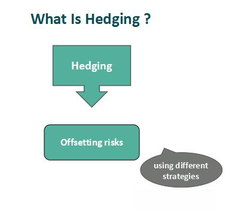

## Table of Contents

## What is hedging in financial markets?

Hedging in financial markets is like buying insurance for your investments. It's a way to protect against potential losses by making another investment that will gain value if your main investment loses value. For example, if you own a stock that you think might go down in price, you can hedge by buying an option that will increase in value if the stock price falls. This way, even if you lose money on the stock, you can make some of it back with the option.

Hedging is used by investors and companies to manage risk. It doesn't eliminate the risk entirely, but it can make it more manageable. For instance, a farmer might hedge against the risk of falling crop prices by entering into a futures contract. If crop prices do fall, the farmer can still sell the crops at the higher price agreed upon in the futures contract. While hedging can help protect against losses, it also comes with costs, like the price of the options or futures contracts, which can reduce potential profits.

## What is speculation in financial markets?

Speculation in financial markets is like betting on future price movements of assets. People who speculate, called speculators, buy and sell stocks, commodities, currencies, or other financial instruments hoping to make a profit from short-term price changes. They don't plan to keep these assets for a long time; instead, they aim to sell them quickly for a higher price than they paid. Speculators often use borrowed money to increase their potential gains, which also increases their risk.

Speculation can be risky because it's hard to predict the future. If the price of an asset goes up as expected, speculators can make a lot of money. But if the price goes down, they can lose a lot, especially if they used borrowed money. Speculation can also affect the market. When many people speculate on an asset, it can cause big price swings, which can be good or bad for the market. While speculation can lead to big profits, it's important for speculators to understand the risks involved.

## How do the objectives of hedging and speculation differ?

The main goal of hedging is to reduce risk. People who hedge want to protect their investments from losing value. They do this by making another investment that will gain value if their main investment loses value. For example, if you own a stock and you're worried it might go down in price, you can hedge by buying an option that will increase in value if the stock price falls. This way, even if you lose money on the stock, you can make some of it back with the option. Hedging is like buying insurance; it doesn't make you rich, but it helps you avoid big losses.

On the other hand, the main goal of speculation is to make a profit from short-term price changes. Speculators buy and sell assets hoping to sell them for more than they paid. They don't plan to hold onto these assets for a long time. Speculation is like betting on the future price of an asset. If the price goes up as they expect, they can make a lot of money. But if the price goes down, they can lose a lot, especially if they used borrowed money to make their bets bigger. Speculation is riskier than hedging because it's hard to predict the future.

## Can you provide examples of hedging strategies?

One common hedging strategy is buying put options. Imagine you own shares in a company, and you're worried the stock price might go down. To protect yourself, you can buy a put option, which gives you the right to sell your shares at a set price, even if the market price drops below that. If the stock price does fall, you can use the put option to sell your shares at the higher set price, limiting your losses. It's like having insurance for your stock.

Another hedging strategy is using futures contracts. Let's say you're a farmer who grows wheat, and you're concerned about the price of wheat dropping before you can sell your crop. You can enter into a futures contract, which is an agreement to sell your wheat at a set price at a future date. If the price of wheat falls, you're still guaranteed to sell your wheat at the higher price agreed upon in the futures contract. This way, you protect yourself from price drops and ensure a stable income.

A third example of hedging is currency hedging, which is often used by companies that do business in different countries. If a company expects to receive payment in a foreign currency, it might be worried about changes in exchange rates. To hedge against this risk, the company can use a forward contract, which locks in the exchange rate for a future date. This means the company knows exactly how much it will get in its home currency, no matter what happens to the exchange rate. It's a way to avoid surprises and plan finances more accurately.

## Can you provide examples of speculation strategies?

One common speculation strategy is day trading. Day traders buy and sell stocks, currencies, or other assets within the same day, hoping to make quick profits from small price changes. They might use technical analysis, which involves looking at charts and patterns, to predict where prices are going. Day trading can be exciting, but it's also very risky because it relies on short-term market movements that are hard to predict. If the market moves against them, day traders can lose a lot of money, especially if they use borrowed money to make their trades bigger.

Another speculation strategy is investing in cryptocurrencies like Bitcoin. People who speculate on cryptocurrencies hope to buy them at a low price and sell them at a higher price later. The price of cryptocurrencies can go up and down a lot, which makes them very risky but also potentially very profitable. Some speculators use news and social media to try to predict where the price is going, while others just hope to get lucky. Because cryptocurrencies are new and not well understood, speculating on them can be like gambling, with the chance of big wins but also big losses.

A third example of speculation is short selling. In short selling, a speculator borrows shares of a stock and sells them, hoping the price will go down. If the price does drop, the speculator can buy the shares back at the lower price, return them to the lender, and keep the difference as profit. But if the price goes up instead, the speculator has to buy the shares back at the higher price, which can lead to big losses. Short selling is a way to bet against a stock, but it's very risky because there's no limit to how high the stock price can go.

## What are the typical instruments used for hedging?

Hedging often uses options and futures contracts. Options give you the right, but not the obligation, to buy or sell an asset at a set price before a certain date. If you own a stock and you're worried it might go down, you can buy a put option. This lets you sell your stock at a set price, even if the market price drops below that. It's like having insurance for your stock. Futures contracts are agreements to buy or sell an asset at a set price on a future date. Farmers use them to lock in prices for their crops, so they know how much they'll get even if the market price falls.

Another common hedging instrument is forward contracts. These are similar to futures contracts but are usually customized and traded over the counter instead of on an exchange. Companies that do business in different countries use forward contracts to lock in exchange rates for future transactions. This helps them avoid surprises from currency fluctuations and plan their finances better. For example, if a company expects to receive payment in a foreign currency, it can use a forward contract to know exactly how much it will get in its home currency, no matter what happens to the exchange rate.

Swaps are also used for hedging, especially for managing interest rate and currency risks. An interest rate swap lets two parties exchange interest payments, usually one fixed rate for one floating rate. This can help a company protect against rising interest rates. A currency swap involves exchanging principal and interest payments in one currency for those in another currency. This helps companies hedge against currency risks when they have operations in multiple countries. Swaps are complex but can be very effective for managing certain types of financial risk.

## What are the typical instruments used for speculation?

People who speculate often use stocks and currencies. They buy and sell these quickly, hoping to make a profit from small price changes. Stocks are shares in companies, and speculators might use day trading to buy and sell them within the same day. They look at charts and patterns to guess where prices are going. Currencies are another big one. Speculators trade different currencies, like the US dollar and the euro, trying to make money from changes in exchange rates. Both stocks and currencies can go up and down a lot, which makes them exciting but also risky.

Another common instrument for speculation is cryptocurrencies, like Bitcoin. These are digital currencies that people buy and sell online. The prices can change a lot, so speculators hope to buy low and sell high. They might use news and social media to try to predict where the prices are going. Options and futures are also used for speculation. Options give you the right to buy or sell an asset at a set price, and speculators use them to bet on price movements. Futures are agreements to buy or sell an asset at a set price in the future, and speculators use them to make big bets on things like oil prices or stock indexes. All these instruments can lead to big profits, but they also come with big risks.

## How does risk management differ between hedging and speculation?

Risk management in hedging is all about protecting against losses. People who hedge want to make sure they don't lose too much money if things go wrong. They use tools like options and futures to create a safety net. For example, if you own a stock and you're worried it might go down, you can buy a put option. This option lets you sell your stock at a set price, even if the market price drops. Hedging doesn't make you rich, but it helps you sleep better at night knowing you won't lose everything. The goal is to reduce risk, not to make big profits.

In speculation, risk management is about trying to make money while understanding the risks. Speculators are like gamblers; they bet on price changes hoping to win big. They might use tools like stocks, currencies, or cryptocurrencies to make quick profits. But they know they can lose a lot too. To manage risk, speculators might set limits on how much they're willing to lose or use stop-loss orders to automatically sell if the price goes against them. The goal is to make as much money as possible, but they have to be ready for the possibility of big losses.

## What are the potential financial impacts of hedging versus speculation?

Hedging can help protect your money but it also has costs. When you hedge, you're trying to avoid big losses if something goes wrong with your main investment. For example, if you own a stock and you buy a put option to protect it, you have to pay for that option. This cost can eat into your profits, even if the stock price stays the same or goes up. But if the stock price does drop, the put option can save you from losing too much money. So, hedging can make your investments safer, but it might also mean you make less money overall because of the costs involved.

Speculation can lead to big wins or big losses. When you speculate, you're betting on short-term price changes hoping to make a quick profit. If you guess right and the price goes up, you can make a lot of money. But if you guess wrong and the price goes down, you can lose a lot, especially if you used borrowed money to make your bet bigger. Speculation is like gambling; it's exciting and can be very rewarding, but it's also very risky. The potential financial impact can be huge, either way, depending on whether your bets pay off or not.

## How do market participants' time horizons differ in hedging versus speculation?

People who hedge usually think about the long term. They want to protect their investments from losing value over time. For example, a farmer might use a futures contract to lock in a good price for their crops next year. They're not worried about what happens to the price of crops tomorrow or next week; they just want to make sure they get a fair price when it's time to sell. Hedging is like planning ahead to avoid big problems in the future.

On the other hand, people who speculate focus on the short term. They want to make quick profits from small changes in prices. For example, a day trader might buy and sell stocks within the same day, trying to make money from tiny price movements. They don't care about what happens to the stock price in a month or a year; they're only interested in what happens right now. Speculation is like trying to win a bet in a short time.

## What role do market views and predictions play in hedging and speculation?

In hedging, market views and predictions help people decide how to protect their investments. If someone thinks the price of something they own might go down, they can use tools like options or futures to hedge against that risk. For example, if you own a stock and you think it might drop in price next month, you can buy a put option to sell it at a set price. You're not trying to predict the future perfectly; you just want to be safe if things go wrong. Hedging is about using your view of the market to avoid big losses, not to make big gains.

In speculation, market views and predictions are everything. Speculators try to guess where prices are going and make bets based on those guesses. If they think the price of a stock or a cryptocurrency will go up soon, they might buy it hoping to sell it for more money later. They use all kinds of information, like news and charts, to make their predictions. Speculation is risky because it's hard to predict the future, but if speculators guess right, they can make a lot of money. It's all about trying to be right about what the market will do next.

## How do regulatory considerations affect hedging and speculation practices?

Regulatory considerations can affect hedging by setting rules on what kinds of hedging tools people can use and how they can use them. For example, some countries have strict rules about who can trade options and futures. These rules are meant to protect investors from losing too much money. Companies that want to hedge might have to follow special accounting rules too. These rules make sure that the company's financial reports show the true value of their hedges. So, while hedging helps manage risk, the rules can make it a bit harder to do.

Regulatory considerations also impact speculation by trying to keep the market fair and safe. Governments might set limits on how much people can speculate or what kinds of bets they can make. For example, there might be rules against using too much borrowed money to speculate, because that can lead to big losses. Regulators also watch for things like insider trading, where people use secret information to make money. These rules are meant to stop speculators from cheating and to keep the market stable. But they can also make speculation more complicated and less profitable.

## What are some financial strategies for effective investment?

A robust financial strategy is essential for achieving specific investment goals and managing risks efficiently. Central to formulating an effective financial strategy are the concepts of portfolio diversification, asset allocation, and risk assessment. These components are critical in enhancing the stability and potential returns of an investment portfolio.

Portfolio diversification is a method of reducing risk by allocating investments across various financial instruments, industries, and geographic regions. The principle behind diversification is that a variety of investments will, on average, yield higher returns and pose a lower risk than any single investment within the portfolio. This is because the positive performance of some investments can offset the negative performance of others.

$$

\text{Expected Portfolio Return} = \sum_{i=1}^{n} w_i \cdot r_i 
$$

Where $w_i$ is the weight of the $i$-th asset in the portfolio, and $r_i$ is the expected return of the $i$-th asset.

Asset allocation involves distributing investments among different asset categories such as stocks, bonds, and cash. The process aims to balance risk and reward by apportioning a portfolio's assets according to an individual's goals, risk tolerance, and investment horizon. Strategic asset allocation maintains a long-term perspective with set percentage allocations for each asset category, while tactical asset allocation allows for adjustments in the short term to capitalize on market conditions.

Risk assessment is crucial in tailoring financial strategies to individual investor profiles. It involves evaluating the likelihood and potential impact of adverse market events on an investment portfolio. Investors must consider market risk, credit risk, and [liquidity](/wiki/liquidity-risk-premium) risk, among others. Tools like the Sharpe Ratio or Value at Risk (VaR) can assist in quantifying these risks:

$$

\text{Sharpe Ratio} = \frac{R_p - R_f}{\sigma_p} 
$$

Where $R_p$ is the portfolio return, $R_f$ is the risk-free rate, and $\sigma_p$ is the standard deviation of the portfolio's excess return.

Case studies and expert opinions offer valuable insights into the successful implementation of financial strategies in different market conditions. For example, during economic downturns, portfolios emphasizing bond investments might outperform those with a heavier weight in equities due to bonds' lower volatility and stable returns. Conversely, in bullish markets, equity-heavy portfolios may yield higher returns due to higher market growth prospects.

Key takeaways for investors include the importance of aligning investment strategies with personal financial goals and risk tolerance. A well-considered strategy should not only preserve wealth during volatile market conditions but also enhance it over time. By understanding and applying these financial strategies, investors can create a balanced and robust investment portfolio that aligns with their long-term financial aspirations.

## References & Further Reading

[1]: Jarrow, R. A., & Chatterjea, A. (2019). ["Derivatives Markets"](https://www.amazon.com/Introduction-Derivative-Securities-Financial-Management/dp/9811291640). Pearson; 3rd edition.

[2]: Hull, J. C. (2017). ["Options, Futures, and Other Derivatives"](https://www.semanticscholar.org/paper/Options%2C-Futures%2C-and-Other-Derivatives-Hull/89bdee500c8623864fc9eb7a471546aa713acc44). Pearson; 10th edition.

[3]: Chance, D. M., & Brooks, R. (2015). ["An Introduction to Derivatives and Risk Management"](https://books.google.com/books/about/Introduction_to_Derivatives_and_Risk_Man.html?id=b8PgBQAAQBAJ). Cengage Learning; 10th edition.

[4]: Lopez de Prado, M. (2018). ["Advances in Financial Machine Learning"](https://www.amazon.com/Advances-Financial-Machine-Learning-Marcos/dp/1119482089). Wiley.

[5]: Chan, E. P. (2013). ["Algorithmic Trading: Winning Strategies and Their Rationale"](https://github.com/ftvision/quant_trading_echan_book). Wiley.