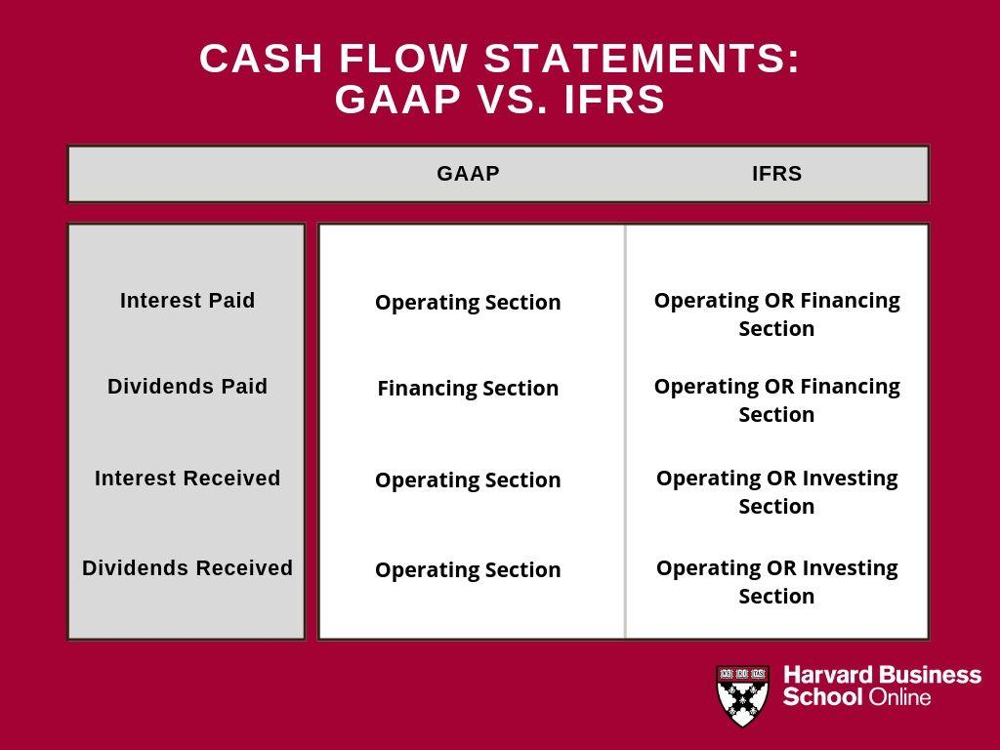

Understanding accounting standards like U.S. GAAP (Generally Accepted Accounting Principles) and IFRS (International Financial Reporting Standards) is crucial for financial professionals. These frameworks define the guidelines and rules under which financial transactions are recorded and reported, ensuring consistency, transparency, and comparability of financial statements across different entities. Financial professionals rely on these standards to analyze and interpret financial data, make informed decisions, and uphold the integrity of financial markets.

U.S. GAAP is typically characterized as a rules-based approach, providing detailed instructions and specific criteria for financial reporting. This detail-oriented nature tends to prioritize uniformity, aiming to minimize ambiguity and divergence in financial reporting practices. Conversely, IFRS adopts a principles-based methodology, emphasizing the spirit and intention behind financial statements to better reflect economic realities. This often allows for more interpretative flexibility, requiring professional judgment in applying broad principles to diverse financial circumstances.



Algorithmic trading, known as algo trading, introduces a layer of complexity to the financial landscape due to its high-speed, automated execution of trading orders. This form of trading exploits sophisticated mathematical models and algorithms to make quick decisions, often in fractions of a second, without human intervention. The urgency and volume of transactions conducted in algorithmic trading elevate challenges in traditional financial reporting, primarily those governed by U.S. GAAP and IFRS.

This article explores the intersection of accounting standards and algorithmic trading, highlighting the implications and challenges that arise when these domains interact. It is essential to understand how GAAP and IFRS impact algo trading operations, affecting issues like inventory valuation, revenue recognition, and the treatment of financial instruments. Similarly, the rapid, automated nature of algo trading necessitates adaptations in accounting practices to accurately capture and report its financial aspects.

Through this exploration, the article aims to provide insights into the bidirectional impacts between accounting standards and algorithmic trading. Understanding the nuances of these interactions is critical for financial professionals tasked with ensuring accurate financial reporting in an increasingly automated and fast-paced trading environment.

## Table of Contents

## Understanding U.S. GAAP and IFRS

U.S. GAAP (Generally Accepted Accounting Principles) and IFRS (International Financial Reporting Standards) are two prominent frameworks guiding financial accounting and reporting on a global scale. U.S. GAAP is predominantly rules-based, offering detailed instructions for the recording and reporting of financial transactions. This approach provides a high level of clarity and consistency, making it easier for companies and auditors to apply the standards uniformly.

Conversely, IFRS is principles-based, focusing on the broader objectives of financial reporting with the aim of more accurately reflecting economic reality. This flexibility allows entities to apply judgment in financial reporting, adapting to a variety of contexts and economic conditions. Consequently, IFRS may lead to more varied interpretations and applications than the more rigid guidelines of U.S. GAAP.

One major area of divergence between U.S. GAAP and IFRS is inventory accounting. U.S. GAAP permits the Last-In, First-Out (LIFO) method for inventory valuation. This method assumes that the most recently acquired items are sold first, which can help manage tax liabilities during periods of inflation. In contrast, IFRS prohibits LIFO, allowing only the First-In, First-Out (FIFO) or the weighted average cost methods. As a result, companies operating under different jurisdictions may report different inventory values, affecting financial analysis and comparability.

Revenue recognition is another critical distinction. Under U.S. GAAP, the focus is on a comprehensive set of specific guidelines across various industries, whereas IFRS mandates a more general revenue recognition framework. This framework under IFRS involves identifying distinct performance obligations in contracts with customers and recognizing revenue when these obligations are satisfied, which can vary based on the contractual terms and the nature of the goods or services provided.

The treatment of financial instruments also reflects the differences in these accounting standards. U.S. GAAP often prescribes detailed rules, especially regarding the classification and measurement of financial instruments. IFRS, however, tends to adopt a principles-based approach, emphasizing the economic substance of transactions. IFRS 9 introduces a model based on both the business model and the characteristics of the contractual cash flows for determining the classification and measurement of financial assets.

For companies operating internationally or engaging in cross-border activities, understanding these differences is essential. It affects how they prepare their financial statements, which could influence financial decision-making, stakeholder communication, and compliance with local regulations. Harmonizing the practical applications of these standards is crucial for ensuring consistency, transparency, and comparability in financial reporting globally.

## Impact of Algorithmic Trading on Accounting Standards

Algorithmic trading, characterized by high-speed, automated execution of trades, presents unique challenges to accounting standards such as U.S. GAAP (Generally Accepted Accounting Principles) and IFRS (International Financial Reporting Standards). The crux of these challenges lies in how transactions are recorded, necessitating precise, real-time data accuracy and processing.

### Real-time Data Accuracy and Accounting Systems

Traditional accounting systems are primarily designed for periodic reporting. They must evolve to accommodate the continuous and high-frequency nature of [algorithmic trading](/wiki/algorithmic-trading). These systems require significant advancements to handle the velocity, [volume](/wiki/volume-trading-strategy), and variety of data produced by algo-trading strategies. The need for real-time data processing demands a robust technological infrastructure, as traditional systems are often inadequate for capturing the swift market movements and executing necessary accounting adjustments promptly.

### Impact on Inventory Valuations

Under both GAAP and IFRS, inventory valuation can be significantly influenced by algorithmic trading activities. The rapid change in trading volumes and values can lead to frequent fluctuations in inventory prices. GAAP permits the use of Last-In, First-Out (LIFO) inventory accounting, which may cause variations in reported financial outcomes compared to IFRS, which disallows LIFO. Algorithmic trading exacerbates these differences as it results in frequent and substantial inventory turnover.

For example, consider a simple formula for inventory valuation under different accounting methods. Suppose a company trades securities and uses the following basic Python code snippet for calculating inventory values using the LIFO method:

```python
def calculate_inventory_LIFO(purchases, sales):
    inventory = []
    for item in purchases:
        inventory.append(item)
    for sale in sales:
        if inventory:
            inventory.pop()
    return inventory
```

This code highlights the simplicity with which inventory management is affected by successive transactions, stressing the necessity for real-time updates in rapidly changing environments such as algo trading.

### Adapting Strategies for Accurate Financial Reporting

Accountants must adopt innovative strategies to ensure the accuracy of financial reporting amid the complexities introduced by algorithmic trading. This might include leveraging technology advancements such as [artificial intelligence](/wiki/ai-artificial-intelligence) and [machine learning](/wiki/machine-learning) for predictive analytics and real-time reporting. Enhanced data analytics capabilities are critical in reconciling the fast-paced trading data with the requirements of standardized accounting frameworks.

In essence, accounting professionals need to collaborate closely with IT specialists to design systems that can accommodate the influx of real-time data, ensuring that financial statements remain accurate and compliant with existing accounting standards, while also preparing for future developments.

## Key Differences and Challenges

Integrating the real-time pace of algorithmic trading with the periodic nature of financial reporting according to U.S. GAAP and IFRS presents considerable challenges. Financial statements under these standards are typically prepared on a periodic basis, such as quarterly or annually, whereas algorithmic trading operates in a fraction of a second, executing numerous trades within short periods. This discrepancy in timing necessitates advanced accounting strategies to ensure that the rapid sequence of transactions is accurately captured within the constraints of established reporting cycles.

Differences in financial reporting standards, such as those seen in the reporting of discontinued operations, asset recognition, and reversals of previous write-downs, significantly impact how financial professionals approach these challenges. For example, U.S. GAAP requires the presentation of discontinued operations on the face of the income statement, which can affect a company's financial performance metrics if an algo trading unit ceases operations. Conversely, IFRS provides more discretion, allowing elements to be disclosed in the notes rather than prominently on the income statement, potentially altering the perception of a company’s financial health.

Asset recognition under the two frameworks also diverges, influencing strategic decision-making. U.S. GAAP follows a more rigid guideline for asset classification and valuation, often not reflecting real-time market conditions accurately. IFRS, being principles-based, allows more interpretation, which might better align with fluctuating asset values due to the fast-paced trading environment.

Furthermore, algorithmic trading's substantial reliance on accurate data places robust demands on financial reporting consistency. The volatile nature of trading values can create substantial changes in inventory and asset values that need timely and precise reflection in financial reports. Inaccuracies in data collection or processing could lead to significant discrepancies in financial statements, affecting stakeholder decisions.

Accounting professionals face the task of reconciling these real-time fluctuations with the relatively static snapshot that periodic financial statements provide. Enhanced data analytics tools and integrated accounting software solutions become vital in addressing these challenges, ensuring that financial information is accurate, timely, and reflective of algorithmic trading impacts. This integration is crucial for maintaining the integrity and reliability of financial reports in an era where high-frequency trading activities increasingly influence market dynamics and corporate financial health.

## Future Trends and Convergence Efforts

Efforts are underway to harmonize accounting standards globally, aiming to narrow the differences between U.S. GAAP (Generally Accepted Accounting Principles) and IFRS (International Financial Reporting Standards). This convergence seeks to streamline financial reporting for multinational corporations and investors by reducing complexity and increasing comparability across borders (Lambert & Leuz, 2006). 

A significant [factor](/wiki/factor-investing) driving these convergence efforts is the rapid advancement of technology in financial markets. Technologies like blockchain and artificial intelligence (AI) have the potential to transform accounting practices by offering enhanced accuracy, efficiency, and consistency in financial reporting. Blockchain, with its secure and immutable ledger, can provide a transparent audit trail, reduce fraud, and ensure data integrity in financial transactions. AI can automate routine accounting tasks and extract valuable insights from large datasets, thereby allowing accountants to focus on more strategic activities. 

```python
# Example: Using Python to simulate an AI-driven financial analysis

import pandas as pd
import numpy as np

# Assuming 'financial_data.csv' contains time-series data for various financial metrics
data = pd.read_csv('financial_data.csv')

# Implementing a simple trend analysis using moving averages
data['Moving_Average'] = data['metric'].rolling(window=5).mean()

# Display trends
data.plot(x='Date', y='Moving_Average', title='Financial Metric Trends')
```

As markets become more interconnected through globalization and technological integration, it is crucial for financial professionals to understand and adapt accounting practices to accommodate algorithmic trading. Algo trading, characterized by high-speed, automated transactions, requires accounting systems capable of processing real-time data to ensure accurate financial reporting. The convergence of standards along with technological enhancements supports the creation of accounting systems that can handle the complexities associated with algo trading. This alignment helps mitigate the risks associated with data inconsistencies and reporting errors that could arise from the fast-paced nature of modern financial markets.

Overall, by harmonizing standards and embracing technological innovations, the accounting landscape is poised for significant evolution. These changes will likely enhance the alignment of financial reporting practices globally, paving the way for more integrated and efficient financial markets.

## Conclusion

The interplay between accounting standards and algorithmic trading is evolving, as it transforms traditional financial practices by imposing new demands on accuracy, speed, and adaptability in financial reporting. Understanding the implications of U.S. Generally Accepted Accounting Principles (GAAP) and International Financial Reporting Standards (IFRS) within the context of algorithmic trading is essential for financial professionals. These standards affect not only how transactions are recorded but also how financial health and performance are presented, both critical for stakeholders and strategic decision-making processes.

Algorithmic trading introduces complexities such as the real-time processing of large volumes of transactions and the need for rapid adjustments in financial records. This can challenge the periodic nature of traditional financial reporting under GAAP and IFRS. More so, as algo trading relies heavily on data accuracy, any misalignment in accounting standards can lead to significant discrepancies in reported figures, affecting investor perceptions and market stability.

Moreover, adopting integrated technological solutions is pivotal to enhancing the accuracy of financial reporting. Technologies like AI and blockchain can facilitate real-time data processing, ensuring that financial records keep pace with the rapid transaction speeds typical of algorithmic trading. These technologies also contribute to maintaining consistency in application and interpretation of accounting standards, thereby supporting strategic decision-making and potentially aiding in the global convergence of accounting standards.

In conclusion, as financial markets continue to integrate and evolve with technological advancements, the intertwined relationship between accounting standards and algorithmic trading will increasingly shape the landscape of financial reporting. Financial professionals must thus remain adept at navigating these changes to ensure the integrity and reliability of financial information.

## References & Further Reading

Lambert, B., & Leuz, C. (2006). International Differences in Accounting Standards and Profitability Measurements. *Management Science.* This study explores how differing accounting standards across countries can lead to variations in reported profitability. It provides insights into how U.S. GAAP and IFRS affect financial statements, which is crucial for understanding their implications on algorithmic trading.

Park, C., & Park, J. (2002). The Stock-Bond Correlation and Its Implications on the Cost of Capital. *Financial Review.* This article discusses the relationship between stock and bond markets and its influence on the cost of capital. Understanding these correlations is essential for algorithmic trading, which often relies on such relationships for developing trading strategies.

Robinson, T. R., Henry, E., Pirie, W. L., & Broihahn, M. A. (International Financial Statement Analysis, 4th Edition). This textbook provides comprehensive coverage of financial statement analysis, with a focus on international standards. It is a valuable resource for professionals navigating the complexities of accounting standards in the context of global algorithmic trading.

