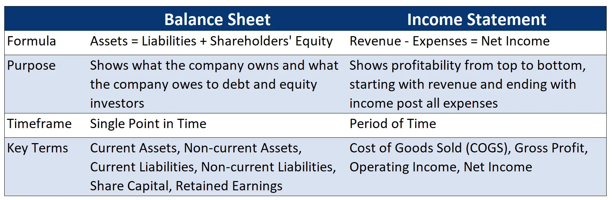

## Table of Contents

## What is an income statement?

An income statement is a financial document that shows how much money a company made and spent over a certain period, usually a year or a quarter. It tells you if the company made a profit or a loss by listing all the money coming in from sales and other sources, and all the money going out for expenses like salaries, rent, and supplies.

The top part of the income statement shows the company's revenue, which is all the money earned from selling products or services. Then, it subtracts the costs of goods sold, which are the direct costs of making those products or services. The result is the gross profit. After that, the statement lists all other operating expenses, like marketing and administrative costs. If you subtract these from the gross profit, you get the operating profit. Finally, the statement includes any other income or expenses, like interest or taxes, to show the net profit or loss, which is the bottom line of how much money the company really made or lost.

## What is a balance sheet?

A balance sheet is a financial statement that shows what a company owns and owes at a specific time. It's like a snapshot of the company's financial health. On one side, it lists all the things the company owns, called assets. These can be things like cash, buildings, or equipment. On the other side, it shows what the company owes, called liabilities. This includes things like loans or money owed to suppliers. The difference between what the company owns and what it owes is called equity, which is the owner's stake in the company.

The balance sheet is important because it helps people see if the company is financially stable. If the company has a lot more assets than liabilities, it's usually in good shape. But if it has a lot of debt, it might be risky. The balance sheet always has to balance, meaning the total assets must equal the total liabilities plus equity. This is why it's called a balance sheet. It's a useful tool for investors, managers, and anyone interested in understanding the company's financial position.

## What are the main components of an income statement?

An income statement shows how much money a company made and spent during a certain time. It starts with the company's revenue, which is all the money from selling things. Then, it takes away the cost of goods sold, which is what it cost to make those things. What's left is called gross profit. This part is important because it shows how well the company is doing at making and selling its products.

Next, the income statement lists all the other costs of running the business, like paying for offices, advertising, and employee salaries. These are called operating expenses. When you take these away from the gross profit, you get the operating profit. This tells you how much money the company is making from its main business activities. Finally, the statement includes any other income or expenses, like interest on loans or taxes. After adding or subtracting these, you get the net profit or loss, which shows if the company made or lost money overall during that time.

## What are the main components of a balance sheet?

A balance sheet is a picture of what a company owns and owes at a specific time. It has three main parts: assets, liabilities, and equity. Assets are all the things the company owns that have value, like cash, buildings, or equipment. Liabilities are what the company owes to others, like loans or money owed to suppliers. Equity is the difference between the assets and liabilities, and it shows the owner's stake in the company.

The balance sheet always has to balance, which means the total assets must equal the total liabilities plus equity. This is important because it helps people see if the company is financially stable. If a company has a lot more assets than liabilities, it's usually in good shape. But if it has a lot of debt, it might be risky. The balance sheet is a useful tool for investors, managers, and anyone interested in understanding the company's financial position.

## How does the income statement reflect a company's performance over a period?

The income statement shows how a company did over a certain time, like a year or a quarter. It starts with all the money the company made from selling things, which is called revenue. Then, it takes away the cost of making those things, which is the cost of goods sold. What's left is the gross profit. This part tells you if the company is good at making and selling its products. If the gross profit is high, it means the company is doing well in its main business.

Next, the income statement lists all the other costs of running the business, like paying for offices, advertising, and employee salaries. These are called operating expenses. When you take these away from the gross profit, you get the operating profit. This shows how much money the company makes from its main activities. Finally, the statement adds or subtracts any other income or expenses, like interest on loans or taxes. The end result is the net profit or loss, which tells you if the company made or lost money overall during that time. This is important because it shows the company's overall performance and financial health.

## How does the balance sheet show a company's financial position at a specific point in time?

A balance sheet is like a picture of a company's money situation at a specific time. It shows what the company owns, called assets, and what it owes, called liabilities. Assets can be things like cash, buildings, or equipment. Liabilities are things like loans or money the company needs to pay back to others. The difference between what the company owns and what it owes is called equity, which is the owner's share in the company.

The balance sheet always has to balance, meaning the total assets must equal the total liabilities plus equity. This is important because it helps people see if the company is financially stable. If the company has a lot more assets than liabilities, it's usually in good shape. But if it has a lot of debt, it might be risky. The balance sheet is a useful tool for investors, managers, and anyone interested in understanding the company's financial position at that moment.

## Can you explain the difference between revenues and assets?

Revenues are the money a company gets from selling things or services during a certain time. It's like the total sales the company makes. When you see a company's income statement, the first thing you'll see is its revenues. This number tells you how much money came into the company from its main business activities over that period.

Assets, on the other hand, are all the things a company owns that have value at a specific time. These can be things like cash, buildings, or equipment. You'll find assets listed on the balance sheet, which shows a snapshot of the company's financial health at a certain moment. While revenues show how much money the company made over time, assets show what the company has right now that it can use or sell.

## How do expenses differ from liabilities?

Expenses are the costs a company has to pay to run its business over a certain time. These can be things like salaries for employees, rent for office space, or money spent on advertising. Expenses show up on the income statement, which tells you how much money the company made and spent during that period. When you subtract expenses from the money the company made, you can see if the company made a profit or a loss.

Liabilities, on the other hand, are what the company owes to others at a specific time. This can include loans the company has to pay back, money owed to suppliers, or any other debts. Liabilities are listed on the balance sheet, which gives a snapshot of the company's financial health at that moment. While expenses are about the money going out during a period, liabilities are about the money the company still needs to pay in the future.

## Why is the income statement sometimes called a profit and loss statement?

The income statement is sometimes called a profit and loss statement because it shows if a company made money or lost money over a certain time. It lists all the money the company made from selling things, which is called revenue, and then it takes away all the costs of running the business, like salaries, rent, and supplies. These costs are called expenses. If the revenue is more than the expenses, the company made a profit. If the expenses are more than the revenue, the company had a loss.

This statement is really important because it helps people see how well the company is doing at making and selling its products or services. By looking at the profit and loss statement, investors, managers, and others can tell if the company is good at managing its money and if it's growing or shrinking. It's like a report card for the company's financial performance over time.

## How are the income statement and balance sheet interconnected?

The income statement and balance sheet are connected because they both help show a company's financial health, but in different ways. The income statement shows how much money a company made and spent over a certain time, like a year or a quarter. It starts with the company's revenue, which is all the money from selling things, and then takes away all the costs, like salaries and rent, to see if the company made a profit or a loss. This statement tells you how well the company is doing at making and selling its products or services during that time.

The balance sheet, on the other hand, is like a snapshot of what the company owns and owes at a specific time. It lists the company's assets, which are things like cash and buildings, and its liabilities, which are things like loans and money owed to others. The difference between what the company owns and what it owes is called equity, which shows the owner's stake in the company. The income statement and balance sheet are connected because the net profit or loss from the income statement affects the equity on the balance sheet. If a company makes a profit, it increases the equity, and if it has a loss, it decreases the equity.

## What role do these financial statements play in financial analysis and decision-making?

Financial statements like the income statement and balance sheet are very important for understanding how a company is doing. The income statement shows how much money a company made and spent over a certain time. It helps people see if the company made a profit or a loss by listing all the money from sales and all the costs like salaries and rent. This information is useful for figuring out if the company is good at making and selling its products or services. Investors and managers use this to decide if the company is growing or if it needs to change something to do better.

The balance sheet is also important because it shows what a company owns and owes at a specific time. It lists all the things the company has, like cash and buildings, and all the things it owes, like loans and money to suppliers. The difference between what the company owns and what it owes is called equity, which shows the owner's stake in the company. By looking at the balance sheet, people can see if the company is financially stable. If a company has a lot more assets than liabilities, it's usually in good shape. Both the income statement and balance sheet help people make smart decisions about investing in or managing the company.

## How do advanced accounting principles like accrual accounting affect the preparation and interpretation of income statements and balance sheets?

Accrual accounting is a way of recording money that a company earns or spends when it happens, not when the money actually changes hands. This method affects how income statements and balance sheets are prepared and understood. For the income statement, accrual accounting means that revenues are recorded when they are earned, even if the payment hasn't been received yet. Expenses are recorded when they are incurred, even if the bill hasn't been paid yet. This gives a more accurate picture of the company's performance over time because it matches the revenues with the expenses that helped create them. For example, if a company does work in December but doesn't get paid until January, the income statement for December will still show that revenue.

Accrual accounting also changes how the balance sheet looks. On the balance sheet, you'll see accounts like accounts receivable, which is money owed to the company, and accounts payable, which is money the company owes. These accounts appear because of accrual accounting. If a company has done work but hasn't been paid yet, that money is listed as an asset on the balance sheet. If the company has received goods or services but hasn't paid for them yet, that's listed as a liability. This method helps show a more complete picture of the company's financial health at a specific time, making it easier for people to understand if the company is stable or if it's taking on too much debt.

## What is a Balance Sheet: A Snapshot of Financial Position?

The balance sheet is a financial statement that provides a snapshot of a company’s financial position at a specific point in time by listing its assets, liabilities, and shareholders' equity. It adheres to the fundamental accounting equation: 

$$
\text{Assets} = \text{Liabilities} + \text{Shareholders' Equity}
$$

This equation ensures that the balance sheet is balanced, reflecting the company's comprehensive financial standing. Assets represent what a company owns, liabilities represent what it owes, and shareholders’ equity represents the residual interest in the assets after deducting liabilities.

The balance sheet is pivotal in evaluating a firm’s capital structure and financial stability. By analyzing the components of the balance sheet, stakeholders can gauge how well resources are managed and funded. For instance, a high level of assets relative to liabilities suggests a strong capital base, while an appropriate mix of debt and equity indicates prudent financial management.

In [algorithmic trading](/wiki/algorithmic-trading), balance sheet data is instrumental in refining trading algorithms. Traders utilize specific financial metrics derived from the balance sheet, such as the debt-to-equity ratio, to assess a company's financial health. The debt-to-equity ratio, calculated as:

$$
\text{Debt-to-Equity Ratio} = \frac{\text{Total Liabilities}}{\text{Shareholders' Equity}}
$$

is a crucial indicator of financial leverage and risk. A high ratio may signal potential financial distress, while a low ratio could indicate a conservative approach to leveraging capital.

By integrating balance sheet metrics into their algorithms, traders enhance their ability to make informed decisions. The insights gleaned from these statements enable the development of sophisticated trading strategies that can adapt to market changes based on the financial health of companies being traded. Understanding these financial indicators and incorporating them into algorithmic models can significantly improve the precision and efficacy of trading executions.

## References & Further Reading

[1]: Bergstra, J., Bardenet, R., Bengio, Y., & Kégl, B. (2011). ["Algorithms for Hyper-Parameter Optimization."](https://dl.acm.org/doi/10.5555/2986459.2986743) Advances in Neural Information Processing Systems 24.

[2]: ["Advances in Financial Machine Learning"](https://www.amazon.com/Advances-Financial-Machine-Learning-Marcos/dp/1119482089) by Marcos Lopez de Prado

[3]: ["Evidence-Based Technical Analysis: Applying the Scientific Method and Statistical Inference to Trading Signals"](https://www.amazon.com/Evidence-Based-Technical-Analysis-Scientific-Statistical/dp/0470008741) by David Aronson

[4]: ["Machine Learning for Algorithmic Trading"](https://github.com/stefan-jansen/machine-learning-for-trading) by Stefan Jansen

[5]: ["Quantitative Trading: How to Build Your Own Algorithmic Trading Business"](https://www.amazon.com/Quantitative-Trading-Build-Algorithmic-Business/dp/1119800064) by Ernest P. Chan

[6]: Penman, S. H. (2012). ["Financial Statement Analysis and Security Valuation."](https://archive.org/details/financialstateme0000penm_r9u4) McGraw-Hill Education.

[7]: Graham, B., & Dodd, D. (2009). ["Security Analysis: Sixth Edition, Foreword by Warren Buffett."](https://www.amazon.com/Security-Analysis-Foreword-Buffett-Editions/dp/0071592539) McGraw-Hill Education.

[8]: DeFusco, R. A., McLeavey, D. W., Pinto, J. E., & Runkle, D. E. (2015). ["Quantitative Investment Analysis."](https://books.google.com/books/about/Quantitative_Investment_Analysis.html?id=0S_dCQAAQBAJ) CFA Institute.