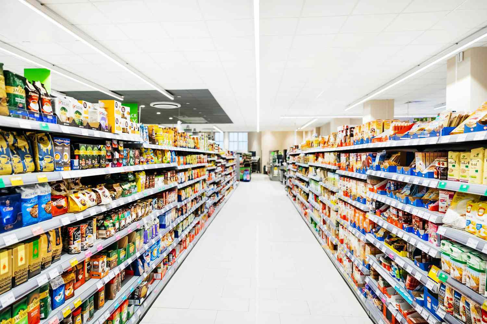

Consumer and industrial goods represent two fundamental categories within the world of commerce, each holding a significant role in market dynamics and economic structures. Consumer goods are items bought by individuals for personal use, such as clothing, electronics, and food. These goods are further categorized into durable goods, which have a longer life span like cars and appliances, and nondurable goods, which are consumed quickly, such as food and cleaning products. Industrial goods, on the other hand, are used by businesses during the production of other goods or services. These include machinery, raw materials, and components that are significant for manufacturing processes.

Understanding and categorizing these goods is critical for business strategy. Categorization allows businesses to tailor their operations, marketing, and sales efforts appropriately. It influences supply chain management, pricing strategies, and customer engagement models. For example, consumer goods often require extensive marketing and brand management to drive sales through customer appeal, whereas industrial goods businesses may focus on relationships and contracts with other businesses requiring these items for production.

Algorithmic trading has emerged as a revolutionary process in financial markets, utilizing computer algorithms to execute trading strategies at speeds and efficiencies impossible for human traders. In the context of consumer and industrial goods, algorithmic trading provides substantial opportunities for businesses to enhance their market strategies by analyzing patterns and predicting market movements more effectively. The integration of algorithmic trading into goods markets offers the potential to transform how trading decisions are made, from traditional approaches to more data-driven methods.

The purpose of this article is to explore the intersection of consumer and industrial goods with algorithmic trading. It will cover essential aspects of consumer and industrial goods, examine how algorithmic trading can analyze and predict market trends for these goods, and consider the future trajectory of such technologies in goods trading. By understanding the connection between product types and trading strategies, businesses can gain insights to optimize their approaches in highly competitive markets.

This article aims to provide a comprehensive overview of how different product types relate to specific trading strategies and how technological advancements are shaping the future of trading in consumer and industrial goods markets.

## Table of Contents

## Understanding Consumer Goods

Consumer goods, often referred to as final goods, are products and services purchased by individuals for personal use. These goods play a critical role in the economy as they contribute directly to the gross domestic product (GDP) through consumer spending. Examples of consumer goods include everyday items such as food, clothing, and electronics, as well as services like haircuts and car repairs.

Consumer goods are typically categorized into three distinct groups: durable goods, nondurable goods, and services. Durable goods have a prolonged use life and include products like cars, furniture, and appliances. These goods generally last for more than three years and represent a significant investment by consumers. Nondurable goods are consumed or worn out quickly, usually within a year, and include items like food, beverages, and toiletries. Services, on the other hand, are intangible products such as healthcare, entertainment, and education that fulfill consumer needs through performance rather than ownership.

Consumer preferences significantly influence demand in the consumer goods sector. Preferences are guided by a multitude of factors including cultural trends, technological advancements, and personal tastes. Changes in consumer preferences can lead to shifts in demand patterns, prompting companies to adapt their offerings. For instance, an increasing preference for sustainable and eco-friendly products has encouraged businesses to develop greener and more ethical alternatives.

Marketing and branding are pivotal in the consumer goods industry. They help companies differentiate their products and connect with target audiences. Brands invest heavily in advertising campaigns, social media marketing, and promotional strategies to build a loyal customer base and enhance the perceived value of their products. Effective branding can create a competitive edge, enabling businesses to command premium pricing and foster customer loyalty.

However, consumer goods businesses face several challenges. Market saturation poses a significant hurdle, especially in developed economies where most consumers already possess essential goods. Companies also contend with rapidly changing consumer preferences and technological disruptions. Economic downturns can affect consumer spending, while regulatory changes related to health and safety standards may impact production processes. Additionally, supply chain complexities and rising material costs can squeeze profit margins, necessitating agile and innovative approaches to maintain competitiveness.

Consumer goods represent a cornerstone of economic activity and consumer behavior. Understanding the dynamics of this sector, including its categories, the impact of consumer preferences, and the crucial role of marketing, can help businesses navigate challenges and seize opportunities in a constantly evolving marketplace.

## Exploring Industrial Goods

Industrial goods, also known as producer goods, play a pivotal role in global economic systems as they are essential components or tools used in the production of consumer goods. Unlike consumer goods, industrial goods are not directly consumed by the end user, but rather serve to aid in the creation or enhancement of consumer products.

### Definition and Examples of Industrial Goods

Industrial goods are classified as products used in the production process of other goods and services. Examples include machinery, raw materials, and building infrastructure. These goods are typically purchased for manufacturing, construction, or business operations and are crucial to maintaining productivity and economic efficiency.

### Types of Industrial Goods

Industrial goods can be categorized into several types, including but not limited to:

1. **Intermediate Goods**: These are goods that have undergone processing and are used in the production of final goods. An example includes steel, which can be used in the manufacture of automobiles.

2. **Capital Goods**: These goods are used to produce other goods and services over time rather than being consumed or converted into final products. Examples include machinery, equipment, and buildings.

3. **Raw Materials**: Unprocessed natural products used in production. Examples include oil, wood, or minerals.

4. **Supplies and Business Services**: Supporting goods and services that facilitate the production process, such as office supplies or maintenance services.

### Significance of Industrial Goods in Business Operations

Industrial goods are fundamental to business operations as they serve as the backbone of production and are critical in the manufacturing process. They are essential for converting raw inputs into finished products, thus enabling companies to meet market demands and expand their businesses. The efficiency and capacity of production directly correlate with the quality and availability of industrial goods.

### Factors Influencing the Production and Supply of Industrial Goods

Several factors impact the production and supply of industrial goods:

- **Technological Advancements**: Innovations and improvements in technology can lead to more efficient production processes and the development of new industrial goods.

- **Economic Conditions**: The demand and supply for industrial goods are heavily influenced by economic cycles. High economic growth periods often result in increased demand for industrial goods.

- **Resource Availability**: Natural resource availability can affect the supply chain of industrial goods, as these resources are often integral components.

- **Regulatory Environment**: Regulations concerning safety, environmental standards, and trade policies can influence production methods and the supply chain dynamics of industrial goods.

### Impact of Technological Advancements on Industrial Goods

Technology has revolutionized the landscape of industrial goods, significantly impacting their production and functionality. Advances have led to improved production techniques, such as automation and [artificial intelligence](/wiki/ai-artificial-intelligence), which increase efficiency and reduce cost. Technologies like 3D printing have enabled the rapid prototyping and customization of industrial goods, offering numerous advantages in manufacturing. Additionally, innovations in logistics and supply chain management have optimized the distribution process, ensuring timely delivery and reducing costs.

In conclusion, industrial goods serve as a cornerstone in the production of consumer products, driving economic growth and technological progress. Understanding their classifications and the dynamics affecting their supply is crucial for businesses and economies to thrive in today's competitive market environment.

## Algorithmic Trading Overview

Algorithmic trading, often known as algo trading, refers to the use of computer algorithms to automate the process of trading financial instruments. By employing complex mathematical models and statistical techniques, these algorithms make trading decisions at speeds and frequencies that surpass human capabilities. The introduction of [algorithmic trading](/wiki/algorithmic-trading) marked a significant evolution in financial markets, initially gaining traction in the 1970s with the deployment of program trading on the New York Stock Exchange. Over time, its adoption has expanded, driven by advances in computing technology and data analysis.

One of the key benefits of algorithmic trading is its ability to increase trading efficiency. Algorithms can process massive volumes of data at high speeds, identifying market trends and executing orders with precision, thereby reducing transaction costs. Additionally, the use of algorithms minimizes human error and emotional biases, enhancing the robustness and consistency of trading strategies. However, algo trading also presents certain risks. These include the potential for significant market disruptions caused by erroneous algorithms, as highlighted by incidents such as the 2010 Flash Crash. Furthermore, the dependence on technology introduces vulnerability to system failures and cybersecurity threats.

Algorithms analyze and predict market trends by employing various techniques, including statistical analysis, data mining, and [machine learning](/wiki/machine-learning). For instance, algorithms may look for patterns in historical price data to forecast future price movements. One common approach is the use of moving averages, a technique that helps smooth out price data to identify trends. Consider a simple moving average (SMA), which can be calculated using the formula:

$$
\text{SMA} = \frac{P_1 + P_2 + \ldots + P_n}{n}
$$

where $P$ represents the price of the asset over $n$ days. Algorithms can execute trades when particular conditions are met, such as the crossing of short-term and long-term moving averages, indicating potential buy or sell signals.

The use of technology and predictive analytics is integral to modern algorithmic trading. High-frequency trading ([HFT](/wiki/high-frequency-trading-strategies)) is a prominent example, characterized by extremely high speeds and volumes of trade. Technologies such as co-location, which places traders' servers near exchange servers to reduce latency, play a crucial role in HFT. Moreover, predictive analytics, often fueled by advances in artificial intelligence (AI) and big data, allows for the development of models that can anticipate market movements with increasing accuracy. Machine learning techniques, including neural networks and support vector machines, are employed to refine and adapt trading strategies based on new data.

There are several platforms available for implementing algorithmic trading strategies. MetaTrader 4 (MT4) and MetaTrader 5 (MT5) are widely used for [forex](/wiki/forex-system) trading, offering built-in programming languages (MQL4 and MQL5) for developing custom trading algorithms. For equities and other asset classes, the [Interactive Brokers](/wiki/interactive-brokers-api) platform provides APIs in multiple programming languages, including Python and C++, enabling traders to design and test their algorithms. Other platforms, such as QuantConnect and Alpaca, have gained popularity for providing cloud-based environments where traders can backtest and deploy their algorithms using real-time data.

In conclusion, algorithmic trading has revolutionized the way financial markets operate, offering significant improvements in efficiency and decision-making. Despite its advantages, it requires careful management of associated risks to prevent adverse market impacts. As technology continues to advance, algorithmic trading is expected to further evolve, increasingly relying on AI and big data to refine trading strategies and predictive capabilities.

## Consumer and Industrial Goods in Algo Trading

Analyzing market trends for consumer goods through algorithmic trading involves leveraging data-driven strategies to make informed predictions and investment decisions. Algorithms can process vast amounts of information, including consumer behavior, purchase patterns, and economic indicators, to identify potential market movements. By integrating machine learning and natural language processing, these algorithms effectively discern sentiments from social media, reviews, and news articles, translating qualitative data into quantitative signals.

Algorithmic trading in industrial goods focuses more on the supply chain dynamics, production data, and macroeconomic factors. Unlike consumer goods, where trends may be heavily influenced by consumer sentiment and preferences, industrial goods require a deep understanding of production capacities, logistics, and technological advancements. Algorithms in this sector typically incorporate data from industrial output reports, raw material costs, and global trade [statistics](/wiki/bayesian-statistics) to forecast price movements and optimize stock portfolios.

Trading signals and technical indicators form the backbone of any algorithmic trading strategy. For consumer goods, these indicators might include moving averages, trend lines, and [momentum](/wiki/momentum) indicators such as the Relative Strength Index (RSI) to gauge overbought or oversold conditions. In contrast, industrial goods might rely on indicators like Economic Production Indicators (EPI) and Purchasing Managers' Index (PMI) to assess production health and economic growth.

Case studies highlighting successful algorithmic trading in these markets often feature companies that leverage proprietary algorithms to gain competitive advantages. For instance, a firm might use machine learning models trained on historical sales data to predict future consumer demand, aligning their portfolios accordingly. In the industrial sector, a trading firm could develop algorithms that capitalize on supply chain inefficiencies or unexpected geopolitical shifts, capturing gains from rapidly changing market conditions.

Trading based on goods data also presents challenges. Consumer behavior can be unpredictable and affected by sudden shifts in preferences or economic downturns, which could lead algorithms astray. Additionally, industrial goods trading faces the hurdle of rapidly advancing technology which could disrupt long-standing market dynamics. Moreover, both sectors must contend with the quality and reliability of data, where inaccuracies could lead to unfavorable trading outcomes. Thus, continuous refinement and adaptation of algorithms are crucial to address these challenges effectively.

## The Future of Algorithmic Trading in Goods Markets

Algorithmic trading is undergoing significant transformation, driven by innovations in technology and methodologies. Key emerging trends in this field include the integration of big data analytics and artificial intelligence (AI), both of which are reshaping the landscape of trading strategies in goods markets.

Big data and AI are pivotal in refining algorithmic trading. The vast [volume](/wiki/volume-trading-strategy) of data now available—from consumer behaviors to industrial output—enables the development of sophisticated algorithms capable of processing and analyzing this information for better market predictions. AI, particularly machine learning, enhances the ability to identify patterns and trends. For instance, algorithms leverage natural language processing to analyze news articles, social media sentiment, and economic reports, leading to more informed decision-making. Python libraries such as TensorFlow and PyTorch are commonly used for building AI models that learn from large datasets.

Global economic shifts, such as trade policies, geopolitical tensions, and changes in consumer preferences, significantly impact the trading of consumer and industrial goods. Algorithms need to adapt swiftly to these changes to maintain effectiveness. The ability to incorporate global economic indicators into trading models is crucial for anticipating market movements. This requires algorithms to be not only data-driven but also context-aware, integrating economic forecasts with market analysis.

As for predictions, algorithmic trading in goods markets is expected to become more autonomous. With ongoing advancements in AI, future trading systems will likely exhibit higher levels of decision-making independence, adjusting portfolios in real-time with minimal human intervention. This evolution towards greater autonomy will necessitate robust ethical and regulatory frameworks to ensure accountability and transparency.

For businesses looking to capitalize on algorithmic trading, adaptability is key. Companies must invest in technology infrastructure that supports high-frequency data processing and storage, such as cloud computing platforms like AWS and Google Cloud. Additionally, developing in-house expertise or partnerships to harness AI and big data effectively will be vital. Businesses should also consider diversifying trading algorithms to mitigate risks associated with sudden market shifts.

In summary, the future of algorithmic trading in goods markets is poised for rapid evolution, with significant opportunities and challenges. The fusion of advanced analytics with strategic adaptability will be essential for businesses aiming to thrive in this dynamic environment.

## Conclusion

In conclusion, the intricate relationship between consumer and industrial goods and algorithmic trading has become increasingly significant in the dynamic world of commerce and finance. Understanding this interplay is vital for businesses aiming to develop effective strategies that capitalize on market trends and consumer behavior. By categorizing goods into consumer and industrial segments, businesses can craft targeted trading approaches that leverage algorithmic insights, thereby maximizing their potential returns and minimizing risks.

Algorithmic trading holds immense potential for the consumer and industrial goods sectors. It offers a systematic approach to analyzing market data and executing trades efficiently. As we've explored, these algorithms can significantly enhance decision-making processes by predicting market trends based on historical data and other relevant indicators. This capability is particularly crucial in today’s fast-paced and data-driven marketplace.

Furthermore, the intersection of big data and artificial intelligence presents new opportunities for innovation and growth within algorithmic trading. The continuous evolution of these technologies promises to reshape how businesses approach trading in goods markets, providing more accurate, timely, and comprehensive insights. As such, companies need to stay abreast of these technological advancements to remain competitive and take full advantage of the emerging tools and strategies.

The field of algorithmic trading, especially concerning consumer and industrial goods, is ripe for further research and exploration. Continued study into how these algorithms can be optimized for various market conditions will drive the next wave of development in trading strategies. Additionally, engaging with industry experts, leveraging feedback from stakeholders, and experimenting with innovative technologies will foster growth and enhance understanding of this complex domain.

We invite readers to engage with this topic further, offering insights or sharing experiences related to algorithmic trading in goods markets. Your feedback and participation will contribute to a deeper collective understanding and help shape the future of trading strategies in consumer and industrial goods.

## References & Further Reading

[1]: Bergstra, J., Bardenet, R., Bengio, Y., & Kégl, B. (2011). ["Algorithms for Hyper-Parameter Optimization."](https://papers.nips.cc/paper/4443-algorithms-for-hyper-parameter-optimization) Advances in Neural Information Processing Systems 24.

[2]: ["Advances in Financial Machine Learning"](https://www.amazon.com/Advances-Financial-Machine-Learning-Marcos/dp/1119482089) by Marcos Lopez de Prado

[3]: ["Evidence-Based Technical Analysis: Applying the Scientific Method and Statistical Inference to Trading Signals"](https://www.amazon.com/Evidence-Based-Technical-Analysis-Scientific-Statistical/dp/0470008741) by David Aronson

[4]: ["Machine Learning for Algorithmic Trading"](https://github.com/stefan-jansen/machine-learning-for-trading) by Stefan Jansen

[5]: ["Quantitative Trading: How to Build Your Own Algorithmic Trading Business"](https://www.amazon.com/Quantitative-Trading-Build-Algorithmic-Business/dp/1119800064) by Ernest P. Chan