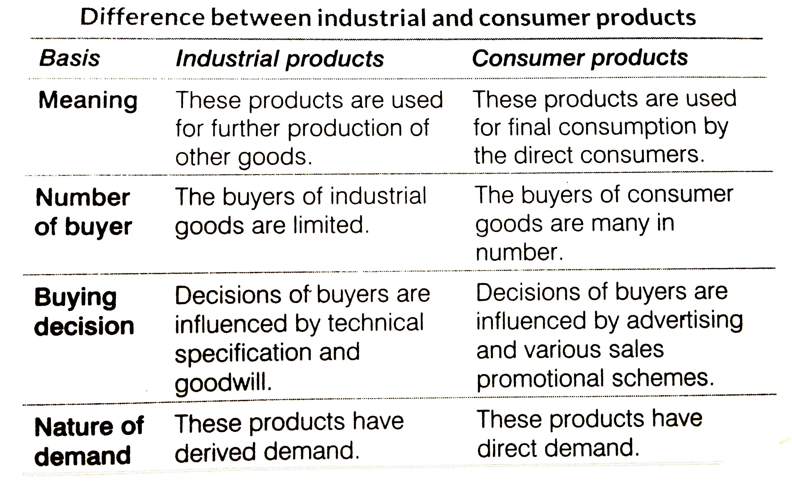

## Table of Contents

## What are industrial goods?

Industrial goods are products that businesses use to make other products or to help them run their operations. These goods are not usually sold to regular people but to other companies. Examples include machinery, raw materials like steel or plastic, and parts that go into making things like cars or electronics.

These goods are important because they help businesses produce things more efficiently. For instance, a factory might use a big machine to make thousands of parts quickly, which would take a long time to do by hand. Industrial goods can be very specific, designed for certain tasks, and they often need to be strong and reliable because businesses depend on them to keep working smoothly.

## What are consumer goods?

Consumer goods are products that people buy for their own use. These are things like food, clothes, and toys. People buy these goods to meet their daily needs or just for fun. Consumer goods are different from industrial goods because they are meant for regular people, not businesses.

There are different kinds of consumer goods. Some are used up quickly, like food or soap. These are called fast-moving consumer goods. Other consumer goods last longer, like a washing machine or a car. These are called durable goods. No matter what type they are, consumer goods are important because they make our lives easier and more enjoyable.

## How do the target markets for industrial and consumer goods differ?

The target market for industrial goods is made up of businesses and organizations that use these products to make other things or to help them run their operations. For example, a car manufacturer might buy steel and machinery to build cars. These buyers are looking for products that are reliable, efficient, and can help them make their own products better or faster. The relationships between industrial goods sellers and their buyers are often long-term and based on trust and technical specifications.

On the other hand, the target market for consumer goods is everyday people who buy things for their own use. This includes everyone from kids buying toys to adults buying groceries or electronics. Consumer goods companies focus on making their products appealing to a wide range of people. They use advertising and marketing to make people want to buy their products, and they often compete on price, quality, and brand recognition.

In summary, while industrial goods target businesses with a focus on functionality and reliability, consumer goods target individual consumers with an emphasis on appeal and accessibility. The strategies for selling these two types of goods are very different because of who is buying them and what they need.

## What are some examples of industrial goods?

Industrial goods are things that businesses use to make other products or to help them work better. For example, a factory might use big machines to make car parts. These machines are industrial goods because they help the factory do its job. Another example is raw materials like steel or plastic. A company might buy steel to make tools or plastic to make toys. These raw materials are also industrial goods.

Other examples of industrial goods include things like engines, which a bus company might buy to keep their buses running, or computer chips that go into making smartphones. A tech company would buy these chips to put in their phones. Even things like office supplies, like printers and paper, can be industrial goods if a business buys them to help with their work. All these things are important because they help businesses make things or do their jobs more easily.

## What are some examples of consumer goods?

Consumer goods are things that people buy for themselves to use every day. These can be things like food and drinks, which people need to stay healthy and happy. For example, someone might buy bread, milk, and apples at the grocery store. Clothes are also consumer goods. People buy shirts, pants, and shoes to wear. Toys are another kind of consumer good that kids love to play with, like dolls, action figures, and board games.

Some consumer goods last a long time, like furniture and electronics. A family might buy a couch to sit on or a TV to watch shows. Cars are also consumer goods that people use to get around. Other consumer goods don't last as long, like cleaning supplies and beauty products. People use soap, shampoo, and toothpaste every day, but they need to buy more when they run out. All these things make life easier and more fun for people.

## How do the purchasing processes for industrial and consumer goods vary?

The way businesses buy industrial goods is different from how people buy consumer goods. When a business wants to buy industrial goods, like machines or raw materials, they usually think a lot about what they need. They might talk to the seller to make sure the goods will work well for them. This can take a long time because they want to make sure everything is right. They also might buy a lot of the same thing at once, and they often keep buying from the same seller if they like what they get.

On the other hand, when people buy consumer goods, like food or clothes, they usually don't spend as much time thinking about it. They might see something they like in a store or online and just buy it. They often buy just what they need for now, not a lot at once. People also like to try different brands and might not always buy from the same place. The way they buy things can be quick and easy, and they might be influenced by ads or sales.

Overall, buying industrial goods is more about planning and making sure the goods fit the business's needs, while buying consumer goods is more about what people want right away and can be more spontaneous.

## What role does branding play in industrial versus consumer goods?

Branding is very important for consumer goods. It helps people know and trust a product. When someone sees a brand they like, they might choose that product over others because they think it will be good. Companies use logos, ads, and packaging to make their brand stand out. They want people to remember their brand and feel good about it. This can make people want to buy the product again and again. So, branding for consumer goods is all about making a good impression and building trust with customers.

For industrial goods, branding is different. Businesses that buy industrial goods care more about how well the product works and if it's reliable. But branding still matters. A strong brand can show that a company knows what they're doing and can be trusted. It can make businesses feel more confident about buying from that brand. Even though the focus is more on the product itself, a good brand can help a company stand out from others and build long-term relationships with other businesses. So, while branding is less about ads and more about trust and quality for industrial goods, it's still important.

## How do pricing strategies differ between industrial and consumer goods?

Pricing strategies for industrial goods are different from those for consumer goods. For industrial goods, businesses often focus on the cost of making the product and how much value it adds to their operations. They might use a pricing strategy called "cost-plus pricing," where they add a certain amount to the cost of making the product to make a profit. They also might use "value-based pricing," where they set the price based on how much the product helps the buyer's business. Because industrial goods are often bought in large amounts, businesses might negotiate prices and get discounts for buying more.

For consumer goods, pricing strategies are more about what people are willing to pay. Companies might use "psychological pricing," like setting a price at $9.99 instead of $10 to make it seem cheaper. They also use "competitive pricing," where they set their prices based on what other companies charge for similar products. Sometimes, they use "promotional pricing" to offer special deals and sales to attract more buyers. Consumer goods pricing is often about making the product seem like a good deal and encouraging people to buy it right away.

## What are the typical distribution channels for industrial goods compared to consumer goods?

Industrial goods usually go through special distribution channels. Businesses often buy these goods directly from the maker or through special sellers called distributors. These distributors know a lot about the products and can help businesses find exactly what they need. Sometimes, industrial goods are sold through agents who help connect buyers and sellers. This way, businesses can get the right goods quickly and easily, and they can also get help if they have problems with the products.

Consumer goods have different distribution channels. These goods often go from the maker to a wholesaler, who then sells them to stores or shops. People can then buy the goods from these stores. Sometimes, consumer goods are also sold directly to people through the internet or through special stores like those of the brand itself. The idea is to make it easy for people to find and buy the goods they want, wherever they shop.

## How do the product life cycles of industrial and consumer goods compare?

The product life cycle for industrial goods is usually longer than for consumer goods. Industrial goods, like big machines or special materials, take a long time to develop and make. Once they are out, businesses might use them for many years. This means industrial goods stay in the market longer before they need to be changed or replaced. Because of this, the stages of the life cycle—introduction, growth, maturity, and decline—can each last a long time. Companies that make industrial goods need to keep improving their products slowly to keep up with what businesses need.

Consumer goods have a shorter product life cycle. Things like food, clothes, and electronics can come and go quickly. They might be popular for a little while and then people want something new. This means the stages of the life cycle happen faster. Companies that make consumer goods need to keep coming up with new ideas and trends to keep people interested. They might change their products often to stay exciting and fresh. This is why you see new versions of phones or new fashion styles every year.

## What are the key factors influencing demand for industrial versus consumer goods?

The demand for industrial goods depends a lot on how well businesses are doing. When companies need to make more things or want to work better, they buy more industrial goods like machines or raw materials. The economy also plays a big role. If the economy is good, businesses feel confident and spend more on industrial goods. But if the economy is bad, they might cut back on buying these goods. Another important factor is technology. New technology can make businesses want to buy new kinds of industrial goods to stay ahead. So, the demand for industrial goods is closely tied to business needs, the economy, and new technology.

The demand for consumer goods is influenced by different things. People's income is a big factor. When people have more money, they buy more things like clothes, food, and electronics. Trends and fashion also affect what people want to buy. If something becomes popular, like a new toy or a certain style of clothes, demand for those consumer goods goes up. Marketing and ads can make people want to buy things they see on TV or online. The economy matters here too, but in a different way. When the economy is good, people feel more comfortable spending money on consumer goods. When it's bad, they might spend less. So, the demand for consumer goods depends a lot on people's money, what's popular, and how they feel about spending.

## How do technological advancements impact the development and marketing of industrial and consumer goods differently?

Technological advancements have a big impact on industrial goods. They help companies make better and more efficient machines and tools. For example, new technology can make a machine work faster or use less energy. This means businesses that use industrial goods can make their products better and cheaper. When a new technology comes out, companies that make industrial goods need to learn about it and figure out how to use it in their products. They might spend a lot of time and money on research to make sure their goods are up to date. Marketing industrial goods with new technology focuses on showing businesses how these goods can save them money or make them more competitive. It's all about proving the value of the technology to the businesses that will buy it.

For consumer goods, technological advancements can make products more exciting and useful for people. New technology can make things like phones or TVs do more cool stuff, like having better cameras or bigger screens. This makes people want to buy the latest gadgets. Companies that make consumer goods use new technology to make their products stand out and attract more buyers. They often spend a lot on advertising to show off these new features and make people think their product is the best. Marketing for consumer goods with new technology is all about making people want the latest and greatest, often by showing how the technology can make their lives easier or more fun.

## What is an Overview of Algorithmic Trading?

Algorithmic trading, often known as algo trading, refers to the use of computer algorithms to automate the process of trading financial instruments. By employing complex mathematical models and statistical techniques, these algorithms make trading decisions at speeds and frequencies that surpass human capabilities. The introduction of [algorithmic trading](/wiki/algorithmic-trading) marked a significant evolution in financial markets, initially gaining traction in the 1970s with the deployment of program trading on the New York Stock Exchange. Over time, its adoption has expanded, driven by advances in computing technology and data analysis.

One of the key benefits of algorithmic trading is its ability to increase trading efficiency. Algorithms can process massive volumes of data at high speeds, identifying market trends and executing orders with precision, thereby reducing transaction costs. Additionally, the use of algorithms minimizes human error and emotional biases, enhancing the robustness and consistency of trading strategies. However, algo trading also presents certain risks. These include the potential for significant market disruptions caused by erroneous algorithms, as highlighted by incidents such as the 2010 Flash Crash. Furthermore, the dependence on technology introduces vulnerability to system failures and cybersecurity threats.

Algorithms analyze and predict market trends by employing various techniques, including statistical analysis, data mining, and [machine learning](/wiki/machine-learning). For instance, algorithms may look for patterns in historical price data to forecast future price movements. One common approach is the use of moving averages, a technique that helps smooth out price data to identify trends. Consider a simple moving average (SMA), which can be calculated using the formula:

$$
\text{SMA} = \frac{P_1 + P_2 + \ldots + P_n}{n}
$$

where $P$ represents the price of the asset over $n$ days. Algorithms can execute trades when particular conditions are met, such as the crossing of short-term and long-term moving averages, indicating potential buy or sell signals.

The use of technology and predictive analytics is integral to modern algorithmic trading. High-frequency trading ([HFT](/wiki/high-frequency-trading-strategies)) is a prominent example, characterized by extremely high speeds and volumes of trade. Technologies such as co-location, which places traders' servers near exchange servers to reduce latency, play a crucial role in HFT. Moreover, predictive analytics, often fueled by advances in artificial intelligence (AI) and big data, allows for the development of models that can anticipate market movements with increasing accuracy. Machine learning techniques, including neural networks and support vector machines, are employed to refine and adapt trading strategies based on new data.

There are several platforms available for implementing algorithmic trading strategies. MetaTrader 4 (MT4) and MetaTrader 5 (MT5) are widely used for [forex](/wiki/forex-system) trading, offering built-in programming languages (MQL4 and MQL5) for developing custom trading algorithms. For equities and other asset classes, the [Interactive Brokers](/wiki/interactive-brokers-api) platform provides APIs in multiple programming languages, including Python and C++, enabling traders to design and test their algorithms. Other platforms, such as QuantConnect and Alpaca, have gained popularity for providing cloud-based environments where traders can backtest and deploy their algorithms using real-time data.

In conclusion, algorithmic trading has revolutionized the way financial markets operate, offering significant improvements in efficiency and decision-making. Despite its advantages, it requires careful management of associated risks to prevent adverse market impacts. As technology continues to advance, algorithmic trading is expected to further evolve, increasingly relying on AI and big data to refine trading strategies and predictive capabilities.

## References & Further Reading

[1]: Bergstra, J., Bardenet, R., Bengio, Y., & Kégl, B. (2011). ["Algorithms for Hyper-Parameter Optimization."](https://papers.nips.cc/paper/4443-algorithms-for-hyper-parameter-optimization) Advances in Neural Information Processing Systems 24.

[2]: ["Advances in Financial Machine Learning"](https://www.amazon.com/Advances-Financial-Machine-Learning-Marcos/dp/1119482089) by Marcos Lopez de Prado

[3]: ["Evidence-Based Technical Analysis: Applying the Scientific Method and Statistical Inference to Trading Signals"](https://www.amazon.com/Evidence-Based-Technical-Analysis-Scientific-Statistical/dp/0470008741) by David Aronson

[4]: ["Machine Learning for Algorithmic Trading"](https://github.com/stefan-jansen/machine-learning-for-trading) by Stefan Jansen

[5]: ["Quantitative Trading: How to Build Your Own Algorithmic Trading Business"](https://www.amazon.com/Quantitative-Trading-Build-Algorithmic-Business/dp/1119800064) by Ernest P. Chan