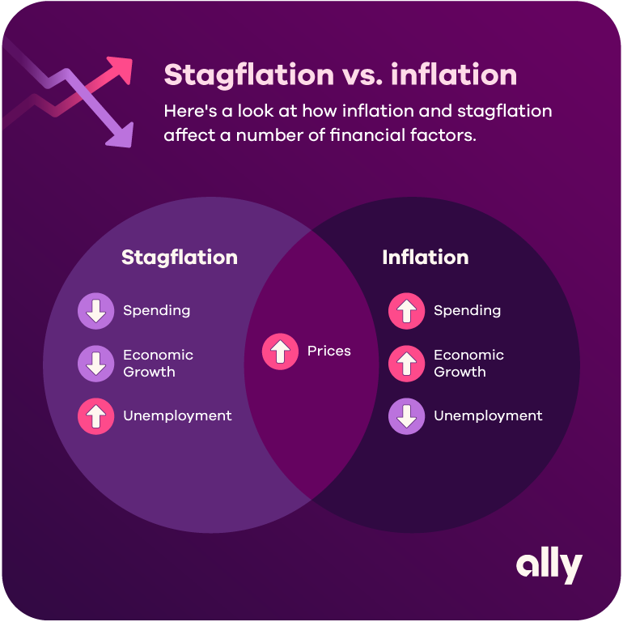

## Table of Contents

## What is inflation?

Inflation is when the prices of things we buy, like food and toys, go up over time. It means that the money we have can buy less than it used to. For example, if a candy bar cost $1 last year and now it costs $1.10, that's inflation. It happens because the amount of money in the economy grows faster than the number of goods and services available.

There are different reasons why inflation happens. Sometimes, it's because companies need to pay more for things like oil or labor, so they raise their prices. Other times, it's because the government prints more money, which makes each dollar worth a little less. Inflation is normal and happens in every country, but if it gets too high, it can make life harder for people because their money doesn't go as far.

## What is stagflation?

Stagflation is when a country has high inflation, high unemployment, and slow economic growth all at the same time. It's a tricky situation because usually, when prices go up, people might expect more jobs and a growing economy, but with stagflation, that doesn't happen.

This situation is tough for governments and economists because the usual ways to fix one problem can make the others worse. For example, if they try to lower inflation by raising interest rates, it might slow the economy even more and cause more people to lose their jobs. Stagflation happened in the United States in the 1970s, and it was a big challenge to get things back on track.

## How does inflation affect the economy?

Inflation affects the economy in many ways. When prices go up, the value of money goes down. This means people can buy less with the same amount of money. If inflation is too high, it can make life harder for people, especially those on fixed incomes like retirees, because their money doesn't go as far. Businesses might also struggle because they have to pay more for materials and labor, which can lead to higher prices for their products. If people feel like prices are going up too fast, they might start saving their money instead of spending it, which can slow down the economy.

On the other hand, a little bit of inflation can be good for the economy. It encourages people to spend and invest their money now rather than later, because they know prices will be higher in the future. This can help keep the economy growing. Also, if wages go up along with prices, people might not feel the pinch of inflation as much. But it's a delicate balance, and too much inflation can cause problems like stagflation, where prices go up but the economy doesn't grow and unemployment stays high.

## How does stagflation impact the economy?

Stagflation is bad for the economy because it mixes high inflation, high unemployment, and slow growth all at once. When prices go up fast, people's money can buy less, making it hard for them to pay for things they need. At the same time, if a lot of people are out of work, they can't earn money to spend, which makes the economy grow even slower. This is a tough spot because when people are not buying things, businesses don't do well, and they might have to let more people go, making unemployment even worse.

It's also hard for the government to fix stagflation. If they try to stop inflation by making borrowing money more expensive, it might make the economy grow even slower and cause more people to lose their jobs. On the other hand, if they try to help the economy grow by making borrowing easier, it might make inflation even worse. So, stagflation can make the economy feel stuck, with no easy way out, and it can take a long time to get things back to normal.

## What are the main causes of inflation?

Inflation happens for a few main reasons. One big reason is when there's too much money chasing too few goods. This can happen if the government prints more money or if people have more money to spend because of things like tax cuts or low interest rates. When everyone is trying to buy the same things, prices go up because sellers can charge more.

Another reason for inflation is when the cost of making things goes up. This can be because the price of raw materials like oil goes up, or because workers want higher wages. When it costs more to make things, companies often raise their prices to cover these costs. Sometimes, inflation can also start because people expect prices to go up, so they buy things now before they get more expensive, which can make prices go up even more.

Inflation can also be caused by big events that mess up the supply of goods. For example, if there's a natural disaster or a war that stops things from being made or moved around, there might not be enough stuff to go around. When this happens, prices can go up because people are still trying to buy the same amount of goods, but there's less to buy.

## What are the primary causes of stagflation?

Stagflation happens when a few big things go wrong at the same time. One main cause is when there's a sudden increase in the cost of important things like oil. When oil prices go up, it costs more to make and move things around, so companies raise their prices. But at the same time, if people have to pay more for everything, they might not have money to buy as much, which can slow down the economy and lead to more people losing their jobs.

Another reason for stagflation is when there are big problems with how well the economy is working. This can happen if there are rules that make it hard for businesses to grow or if there's not enough competition. When businesses can't grow easily, they might not hire as many people, which can lead to high unemployment. At the same time, if the government tries to help the economy by printing more money, it can cause prices to go up, making inflation worse. So, stagflation is a tough mix of high prices, lots of people out of work, and an economy that's not growing.

## Can inflation and stagflation occur simultaneously?

Yes, inflation and stagflation can happen at the same time. Stagflation is actually a special kind of situation where you have high inflation, but also high unemployment and slow economic growth. So, if a country is going through stagflation, it means they are already dealing with inflation, but it's making life harder because the economy isn't growing and a lot of people can't find jobs.

When both inflation and stagflation are happening, it can be really tough for everyone. Prices are going up, so people's money doesn't go as far, and at the same time, they might not have jobs or the economy isn't doing well. This can make it hard for the government to fix things because the usual ways to fight inflation, like raising interest rates, might make the economy grow even slower and cause more people to lose their jobs.

## How do governments and central banks typically respond to inflation?

Governments and central banks usually try to control inflation by making it harder for people and businesses to borrow money. They do this by raising interest rates. When interest rates go up, it costs more to borrow money, so people might spend less and save more. This can help slow down how fast prices are going up. Also, the government might try to cut back on spending or raise taxes to take some money out of the economy, which can also help lower inflation.

Sometimes, if inflation is caused by problems with getting goods or making things, the government might try to fix those problems directly. They might change rules to make it easier for businesses to grow or help with things like supply chains. But it's tricky because they have to balance fighting inflation without making the economy grow too slowly. If they go too far, they might cause a recession, where a lot of people lose their jobs and the economy shrinks.

## What are the policy measures used to combat stagflation?

When a country faces stagflation, the government and the central bank need to use special tricks to fix the problems of high inflation, high unemployment, and slow growth all at the same time. One way they might try to fight inflation is by raising interest rates. This makes it more expensive for people and businesses to borrow money, which can slow down how fast prices are going up. But they have to be careful because raising interest rates too much can make the economy grow even slower and cause more people to lose their jobs.

To help with unemployment and slow growth, the government might try to spend more money on things like building roads or helping businesses. This can create jobs and get the economy moving again. But if they spend too much money, it might make inflation even worse. So, they might also try to make it easier for businesses to grow by changing rules or helping with supply chains. It's a tricky balance because they need to fight all three problems at the same time without making any of them worse.

## How do inflation and stagflation affect different sectors of the economy?

Inflation and stagflation can hit different parts of the economy in different ways. When inflation is high, it can make things tougher for businesses that need to buy a lot of stuff to make their products. For example, if a company makes cars, and the price of steel goes up, they might have to charge more for their cars. This can be hard for them if people don't want to pay the higher prices. But some businesses, like those that sell things people always need, like food or medicine, might not feel as much of a pinch because people will still buy their products even if prices go up.

Stagflation makes things even harder because it mixes high inflation with high unemployment and slow growth. During stagflation, businesses might have a hard time because they have to pay more for what they need to make their products, but at the same time, fewer people have jobs and can't afford to buy as much. This can be really tough for industries like construction or manufacturing, where a lot of people might lose their jobs. On the other hand, some sectors, like healthcare or government services, might not feel the impact as much because people still need those services no matter what's happening in the economy.

Overall, inflation and stagflation can shake up the economy in big ways. Some sectors might be able to handle the changes better than others, depending on what they sell and how much people need their products or services. But when these problems happen, it can make life harder for everyone, and it takes smart planning from the government and businesses to get things back on track.

## What historical examples illustrate the differences between inflation and stagflation?

In the 1970s, the United States went through a tough time called stagflation. Prices were going up fast, which is inflation, but at the same time, a lot of people were out of work and the economy wasn't growing. This was a big problem because usually, when prices go up, it means the economy is doing well and more people have jobs. But during stagflation, that wasn't happening. The government tried to fix things by raising interest rates to slow down inflation, but it made the economy grow even slower and caused more people to lose their jobs. It took a long time and a lot of hard work to get the economy back on track.

Another example is Germany after World War I. They had really bad inflation, but it wasn't stagflation because the economy was still growing and people had jobs. The German government printed a lot of money to pay for the war and to help the economy, but it made prices go up super fast. People had to [carry](/wiki/carry-trading) around wheelbarrows full of money just to buy a loaf of bread. This kind of inflation is called hyperinflation, and it's much worse than regular inflation. The difference between this and stagflation is that in Germany, even though prices were going crazy, the economy was still moving, and people were working. But in the 1970s in the U.S., the economy was stuck, and that made stagflation a much harder problem to solve.

## How do economic theories explain the mechanisms of inflation versus stagflation?

Economic theories explain inflation as a situation where too much money is chasing too few goods. This can happen when the government prints more money or when people have more money to spend because of things like tax cuts or low interest rates. When everyone wants to buy the same things, sellers can charge more, and prices go up. Another theory is that inflation can start because the cost of making things goes up. For example, if the price of oil goes up, it costs more to make and move things, so companies raise their prices to cover these costs. Economists also talk about "demand-pull" inflation, where people want to buy more than what's available, and "cost-push" inflation, where the costs of production go up.

Stagflation, on the other hand, is explained by theories that mix high inflation with high unemployment and slow growth. One theory says stagflation can happen when there's a sudden increase in the cost of important things like oil. This makes it more expensive for companies to make things, so they raise prices, but at the same time, people have less money to spend, which slows down the economy and leads to more unemployment. Another theory focuses on how well the economy is working. If there are too many rules that make it hard for businesses to grow or if there's not enough competition, businesses might not hire as many people, leading to high unemployment. At the same time, if the government tries to help the economy by printing more money, it can make inflation worse. So, stagflation is a tricky mix of problems that are hard to fix because the usual solutions can make things worse.

## References & Further Reading

Blanchard, O. (2008). "The State of Macro." Journal of Economic Perspectives. This paper offers foundational insights into macroeconomic theory and policy, particularly relevant for understanding the broader economic conditions of inflation and stagflation. Blanchard discusses the evolution of macroeconomic thought and provides critical perspectives on policy tools that inform current economic analysis.

Lopez de Prado, M. (2018). "Advances in Financial Machine Learning." Wiley. This book is a comprehensive resource on the application of [machine learning](/wiki/machine-learning) techniques in quantitative finance. It covers methodologies that enhance the performance of [algorithmic trading](/wiki/algorithmic-trading) systems, particularly in times of economic [volatility](/wiki/volatility-trading-strategies).

Aronson, D. R. (2006). "Evidence-Based Technical Analysis." Wiley. Aronson's work focuses on the scientific approach to technical analysis, offering insights into developing strategies based on empirical evidence. This resource is vital for understanding how reliable trading algorithms can be constructed to respond to changing market conditions.

Jansen, S. (2020). "Machine Learning for Algorithmic Trading." Packt Publishing. Jansen's publication provides practical guidance on implementing machine learning models in trading algorithms. It addresses various techniques and tools for algorithmic trading, which can be adapted to anticipate and respond to inflationary pressures or stagflationary conditions.

Additional references from academic journals and financial market analyses. It is crucial to consult various academic papers and market reports that explore the intersection of macroeconomic conditions and algorithmic trading. These sources frequently offer empirical studies, case analyses, and theoretical models that enhance our understanding of how automated trading systems operate within complex economic landscapes.

