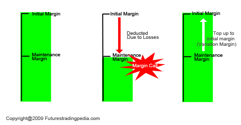

## Table of Contents

## What is initial margin?

Initial margin is the amount of money or collateral that a trader must deposit with their broker when they open a new futures or options position. It acts like a security deposit, ensuring that the trader has enough funds to cover potential losses. This requirement helps reduce the risk for both the trader and the broker, as it provides a cushion against market fluctuations.

The amount of initial margin is set by the exchange and can vary based on the volatility and risk associated with the specific contract being traded. If the market moves against the trader's position, the broker may issue a margin call, requiring the trader to deposit additional funds to maintain the position. This system helps maintain stability in the financial markets by ensuring that traders have the financial capacity to honor their trades.

## What is maintenance margin?

Maintenance margin is the minimum amount of money you need to keep in your account to keep your futures or options trade open. It's like a smaller version of the initial margin, which is what you need to start the trade. If the money in your account falls below the maintenance margin, you'll get a margin call. This means you need to add more money to your account to keep your trade going.

The maintenance margin is set by the exchange and can change depending on how risky the trade is. It's there to make sure you can cover any losses if the market moves against you. If you don't meet the margin call and add more money, your broker might close your position to limit their risk. This helps keep the market stable by making sure traders can handle their losses.

## How do initial margin and maintenance margin differ in purpose?

Initial margin and maintenance margin both help keep trading safe, but they have different jobs. Initial margin is like a security deposit you pay when you start a new trade in futures or options. It's there to make sure you have enough money to cover any big losses right from the start. This helps your broker feel safe that you can handle the trade without them losing money.

Maintenance margin, on the other hand, is the minimum amount of money you need to keep in your account while your trade is open. If your account balance drops below this level, you'll get a margin call, which means you need to add more money to keep your trade going. It's there to make sure you can still cover losses if the market moves against you as your trade continues. Both margins work together to keep the market stable and protect both you and your broker from big losses.

## What are the typical percentages or amounts set for initial margin?

The amount of initial margin can change a lot depending on what you're trading and how risky it is. For example, if you're trading something that moves a lot in price, like certain stocks or commodities, the initial margin might be higher. Usually, it's set as a percentage of the total value of the trade. For futures, this might be around 5% to 15% of the contract's value. For stocks, if you're using margin to buy them, the initial margin requirement is often around 50% of the purchase price, but this can vary.

Exchanges and brokers decide these percentages to make sure there's enough money to cover possible losses. If you're trading something less risky, the initial margin might be lower. But if it's something that can change a lot in price quickly, the margin will be higher to protect everyone involved. It's important to check with your broker or the exchange to know the exact amount you need for the trade you want to make.

## What are the typical percentages or amounts set for maintenance margin?

Maintenance margin is usually set at a lower percentage than the initial margin. For futures, it might be around 75% of the initial margin requirement. This means if the initial margin is 10% of the contract's value, the maintenance margin could be about 7.5%. For stocks bought on margin, the maintenance margin is typically around 25% to 30% of the total value of the securities in the account. These percentages can vary based on the broker and the specific trade, so it's good to check with your broker to know the exact numbers.

The purpose of the maintenance margin is to make sure you have enough money in your account to cover any losses while your trade is open. If the value of your account drops below this maintenance level, you'll get a margin call. This means you need to add more money to your account to keep your trade going. If you don't meet the margin call, your broker might close your position to limit their risk. This helps keep the market stable by making sure traders can handle their losses as the market moves.

## How does the initial margin requirement affect the buying power of an investor?

The initial margin requirement can limit how much an investor can buy. When you want to trade futures or options, you need to put down a certain amount of money as a security deposit. This is called the initial margin. If this amount is high, it means you can't use as much of your money to open new trades. So, if you have $10,000 and the initial margin for a trade is $2,000, you can only open up to 5 trades with that money. If the initial margin goes up, you'll be able to open fewer trades, which means less buying power.

This also means that the initial margin requirement can affect how much risk an investor can take. If the margin is high, you might not be able to spread your money across many different trades, which can be a way to manage risk. On the other hand, if the initial margin is low, you can open more trades with the same amount of money. This can give you more buying power, but it also means you might be taking on more risk because you're using more leverage. So, the initial margin requirement is a big factor in deciding how much and what you can invest in.

## What happens when the account balance falls below the maintenance margin?

When your account balance falls below the maintenance margin, you will get a margin call from your broker. A margin call is a warning that you need to put more money into your account right away. This is important because it helps make sure you can cover any losses from your trade. If you don't add more money, your broker might close your trade to limit their risk. This is done to keep the market stable and protect both you and the broker from big losses.

The amount you need to add to meet the margin call depends on how far your account balance is below the maintenance margin. It's like getting a bill that you need to pay quickly. If you can't add the money, your broker will take action to close your position. This can be stressful, but it's a way to make sure everyone is protected from big financial losses. So, it's important to keep an eye on your account balance and be ready to add more money if the market moves against your trade.

## Can you explain a margin call and its relation to maintenance margin?

A margin call happens when the money in your trading account drops below the maintenance margin level. The maintenance margin is the smallest amount of money you need to keep in your account to keep your trade open. If your account balance goes below this level, your broker will send you a margin call. This is like a warning that says you need to add more money to your account right away to keep your trade going.

If you get a margin call, you need to add money to your account to meet the maintenance margin requirement. If you don't add the money, your broker might close your trade to limit their risk. This is done to make sure you can cover any losses and to keep the market stable. So, a margin call is closely tied to the maintenance margin because it's a signal that your account balance is too low and you need to act quickly to fix it.

## How do different brokers set their initial and maintenance margin requirements?

Different brokers set their initial and maintenance margin requirements based on rules from the exchange and their own risk management policies. The exchange sets a minimum level for both initial and maintenance margins, but brokers can choose to set theirs higher if they want to be more careful. This means that the amount you need to put down to start a trade or keep it going can be different from one broker to another. Brokers look at how risky the trade is, how much the price of what you're trading might change, and their own financial safety to decide on these numbers.

Brokers also think about how much money they want to keep safe from losses. If a broker thinks a trade is very risky, they might ask for a bigger initial margin to make sure they are protected. The same goes for maintenance margins; a higher maintenance margin means the broker wants to make sure you can cover losses if the market goes against you. So, it's a good idea to check with different brokers to see what their margin requirements are before you start trading, because it can affect how much you can trade and how much risk you're taking on.

## What are the regulatory requirements for initial and maintenance margins?

Regulators set rules for initial and maintenance margins to make sure trading stays safe and fair. In the United States, the Commodity Futures Trading Commission (CFTC) and the Securities and Exchange Commission (SEC) are the main groups that make these rules. The CFTC sets the minimum initial and maintenance margins for futures and options trades. The SEC does the same for stocks bought on margin. These rules are there to make sure that traders have enough money to cover possible losses, which helps keep the market stable.

Brokers have to follow these minimum rules, but they can choose to set higher margins if they want to be extra careful. For example, the Federal Reserve's Regulation T says that the initial margin for buying stocks on margin must be at least 50% of the purchase price, and the maintenance margin must be at least 25% of the total value of the securities. But a broker might ask for more than this to protect themselves better. So, while regulators set the lowest amount that brokers can ask for, the actual amount you need to put down can be different from one broker to another.

## How do initial and maintenance margins impact risk management in trading?

Initial and maintenance margins are important for managing risk in trading. The initial margin is like a safety deposit you need to put down when you start a trade. It makes sure you have enough money to cover big losses right from the start. This helps your broker feel safe because they know you can handle the trade without them losing money. If the initial margin is high, you can't open as many trades, which means you can't take on as much risk. This helps you and your broker manage risk better by making sure you don't bite off more than you can chew.

The maintenance margin is the smallest amount of money you need to keep in your account while your trade is open. If your account balance drops below this level, you'll get a margin call, which is a warning to add more money to your account. This helps make sure you can still cover losses if the market moves against you. If you don't add more money, your broker might close your trade to limit their risk. So, both margins work together to keep your trading safe and stable by making sure you can handle any losses that come up during your trade.

## What are advanced strategies traders use involving initial and maintenance margins?

Traders sometimes use advanced strategies to make the most out of initial and maintenance margins. One common strategy is called "margin optimization." This means traders try to use their money as smartly as possible. They might open trades that have lower initial margin requirements so they can start more trades with the same amount of money. By doing this, they can spread their risk across different trades and maybe make more money. But it's a careful balance because if the market moves against them, they might get margin calls and need to add more money quickly.

Another strategy is called "margin monitoring." Traders keep a close eye on their account balance to make sure it stays above the maintenance margin. They might use special tools or software to watch their trades and the market. If they see their account balance getting close to the maintenance margin, they might close some trades or add more money before they get a margin call. This helps them avoid the stress of a margin call and keeps their trades safe. Both of these strategies need a lot of attention and understanding of how margins work, but they can help traders manage their risk better and maybe make more money.

## What is Initial Margin: An Overview?

The initial margin is a critical component of margin trading, representing the minimum equity a trader must deposit to open a leveraged position. This requirement serves as a security deposit, safeguarding both the trader and the brokerage by ensuring the trader's commitment and mitigating potential risks associated with leveraged trading.

**Calculation of Initial Margin**

The initial margin is typically expressed as a percentage of the total trade value and varies based on several factors, including asset class, market [volatility](/wiki/volatility-trading-strategies), and broker policies. For example, if a stock has an initial margin requirement of 50%, and a trader wishes to purchase $10,000 worth of stock, they must have at least $5,000 in their margin account as equity. The calculation can be formally expressed as:

$$
\text{Initial Margin Requirement} = \text{Trade Value} \times \text{Margin Percentage}
$$

**Factors Influencing Initial Margin Requirements**

1. **Asset Class**: Different asset classes bear varying levels of inherent risk and liquidity, impacting margin requirements. Equities may have different margin requirements compared to futures or forex, with typically higher margin requirements for more volatile or less liquid assets.

2. **Market Volatility**: Greater market volatility raises the risk of significant price swings, thereby increasing the margin needed to cover potential losses. During times of high volatility, brokers may elevate initial margin requirements to account for this additional risk.

3. **Broker Policies**: Brokers set individual policies on margin requirements to manage their exposure and risk tolerance. These policies can be influenced by the broker's risk assessment models, regulatory guidelines, and the specific client relationship.

**Significance in Determining Leverage Potential**

The initial margin determines a trader's leverage potential—the capacity to control a larger position with a relatively smaller amount of capital. Higher initial margin requirements reduce leverage, as more of the trader's capital is tied up as collateral. Conversely, lower initial margin requirements permit higher leverage, enabling traders to take on larger positions with less personal capital.

**Practical Implications**

Understanding initial margin requirements is essential for traders looking to optimize their trading strategies. It allows them to leverage their capital effectively while maintaining sufficient risk management. By analyzing the influence of varying initial margins on different trading scenarios, traders can make informed decisions that align with their risk tolerance and market outlook.

For instance, in a highly volatile market, a trader might choose to avoid positions with low initial margins to mitigate the risk of a margin call. Conversely, in a stable market environment, they might take advantage of lower initial margin requirements to maximize leverage and potential returns.

**Case Studies and Scenarios**

Consider a volatile commodity market where the initial margin requirement is set at 20%. If a trader plans to enter a position worth $50,000, they need to have at least $10,000 in their margin account. If market volatility decreases and the broker lowers the margin requirement to 10%, the same trader could increase their position size to $100,000 without needing additional capital. This flexibility can significantly impact trading decisions and potential profitability across different market conditions.

By understanding these aspects of initial margins, traders can better navigate the complexities of margin trading and employ strategies that enhance their risk management practices.

## References & Further Reading

[1]: ["Algorithmic Trading: Winning Strategies and Their Rationale"](https://www.wiley.com/en-us/Algorithmic+Trading%3A+Winning+Strategies+and+Their+Rationale-p-9781118460146) by Ernest P. Chan

[2]: Chincarini, L. B., & Kim, D. (2006). ["Quantitative Equity Portfolio Management: An Active Approach to Portfolio Construction and Management."](https://www.mhebooklibrary.com/doi/book/10.1036/9781264268931) McGraw Hill Professional.

[3]: Hull, J. C. (2014). ["Options, Futures, and Other Derivatives"](https://www.pearson.com/en-us/subject-catalog/p/options-futures-and-other-derivatives/P200000005938/9780136939917) (9th ed.). Pearson.

[4]: Krollner, B., Vanstone, B., & Finnie, G. (2010). ["Financial Time Series Forecasting with Machine Learning Techniques: A Survey."](https://www.semanticscholar.org/paper/Financial-time-series-forecasting-with-machine-a-Krollner-Vanstone/6772f7ffccc5d320ef6f067c62c8e63083072892) IEEE International Conference on Computational Intelligence for Financial Engineering.

[5]: ["High-Frequency Trading: A Practical Guide to Algorithmic Strategies and Trading Systems"](https://www.amazon.com/High-Frequency-Trading-Practical-Algorithmic-Strategies/dp/1118343506) by Irene Aldridge