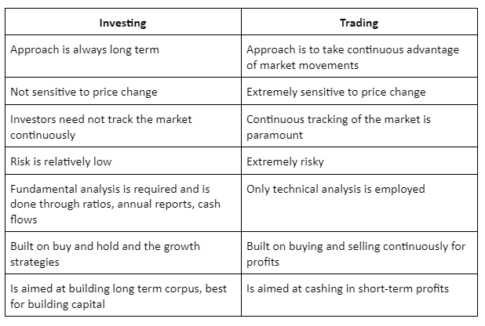

## Table of Contents

## What is investing and how does it differ from trading?

Investing is when you put your money into something like stocks, bonds, or real estate, hoping it will grow over time. It's like planting a seed and waiting for it to become a big tree. People usually invest for the long term, meaning they might keep their money in an investment for years or even decades. The goal is to build wealth slowly and steadily, often for big future goals like retirement or buying a house.

Trading, on the other hand, is more like buying and selling things quickly to make a profit. Traders might buy a stock in the morning and sell it by the afternoon if they think its price will go up in that short time. Trading is more about short-term gains and can be riskier because prices can change a lot in a short time. While investors are patient and look at the big picture, traders need to watch the market closely and make quick decisions.

## What are the primary goals of investing versus trading?

The main goal of investing is to grow your money over a long period of time. When you invest, you are thinking about the future, maybe saving for retirement or buying a house. You pick things like stocks or real estate that you believe will increase in value over many years. Investors are patient and focus on steady growth, not quick wins. They usually don't worry too much about small ups and downs in the market because they're in it for the long haul.

Trading, on the other hand, aims to make money in a shorter time frame. Traders buy and sell things quickly, hoping to profit from small changes in price. Their goal is to make gains in days, weeks, or months, not years. Because of this, trading can be more exciting but also riskier. Traders need to pay close attention to the market and be ready to act fast, as they're looking to take advantage of short-term opportunities.

## How does the time horizon differ between investing and trading?

The time horizon for investing is usually long. This means investors plan to keep their money in things like stocks or real estate for many years, sometimes even decades. They are not in a hurry and are okay with waiting for their investments to grow slowly over time. For example, someone might invest in a retirement fund when they're young and not touch it until they're old.

On the other hand, the time horizon for trading is short. Traders want to make money quickly, so they might buy and sell within days, weeks, or a few months. They look for quick changes in price to make a profit. For instance, a trader might buy a stock in the morning and sell it in the afternoon if they think the price will go up during that time.

## What types of assets are typically involved in investing compared to trading?

When people invest, they usually put their money into things that they think will grow in value over a long time. Common assets for investing include stocks, which are shares in a company, bonds, which are like loans to a government or company, and real estate, like houses or buildings. Some people also invest in mutual funds or exchange-traded funds (ETFs), which are collections of different stocks or bonds. The idea is to pick assets that will increase in value over many years, helping you reach big goals like retirement or buying a home.

Trading, on the other hand, often involves assets that can change in price quickly. Traders might focus on stocks, but they also trade things like currencies (forex), commodities like gold or oil, and even cryptocurrencies like Bitcoin. These assets can go up or down in price within short periods, which is what traders are looking for. They want to buy low and sell high in a short time, so they pay close attention to things that can move prices fast, like news or market trends.

## How do risk levels vary between investing and trading strategies?

Investing usually has less risk than trading because it's about the long term. When you invest, you're okay with waiting for your money to grow slowly over many years. This means you can ride out the ups and downs of the market. For example, if the stock market goes down one year, an investor might not worry too much because they know it will likely go back up over time. So, while there is still some risk, like the chance that a company might not do well, the overall risk is lower because you're not trying to time the market perfectly.

Trading, on the other hand, is riskier because it's all about the short term. Traders try to make money quickly by buying and selling things like stocks or currencies in a short time. This means they need to be right about when prices will go up or down, and even small mistakes can lead to big losses. For example, if a trader buys a stock and the price drops suddenly, they might lose money fast. So, trading can be exciting, but it comes with a lot more risk because you're always trying to guess what will happen in the market in the next few hours or days.

## What are the common strategies used in investing and how do they differ from trading strategies?

When people invest, they often use strategies that help them grow their money over a long time. One common strategy is "buy and hold," where you buy stocks or other assets and keep them for many years. Investors believe that over time, good companies will do well and their stock prices will go up. Another strategy is "diversification," where you spread your money across different types of investments, like stocks, bonds, and real estate. This way, if one investment does badly, the others might do well and balance it out. Investing is about being patient and focusing on steady growth, not quick wins.

Trading, on the other hand, uses strategies that aim to make money quickly. A popular trading strategy is "day trading," where you buy and sell stocks within the same day to make a profit from small price changes. Another strategy is "swing trading," where you hold onto an asset for a few days or weeks, trying to catch bigger price swings. Traders also use "technical analysis," where they look at charts and patterns to predict where prices might go next. Trading is more about making fast decisions and taking advantage of short-term opportunities, which makes it riskier but potentially more exciting.

## How does the frequency of decision-making differ between investors and traders?

Investors make decisions less often than traders. They might buy stocks or other investments and then not think about them for months or even years. Their goal is to grow their money over a long time, so they don't need to check their investments every day. They might look at their investments once a year or when something big changes, like if they get a new job or are close to retiring.

Traders, on the other hand, make decisions all the time. They might buy and sell stocks or other things every day, sometimes even many times a day. They are always watching the market, trying to find the best times to buy low and sell high. This means they need to be ready to act fast and make choices quickly to make money in a short time.

## What role does market analysis play in investing versus trading?

Market analysis is important for both investors and traders, but they use it in different ways. For investors, market analysis helps them pick good investments that will grow over a long time. They might look at a company's financial health, how the economy is doing, and trends in the industry. This helps them decide which stocks or other investments to buy and hold for many years. They don't need to check the market every day because they are thinking about the big picture and the future.

For traders, market analysis is all about finding quick opportunities to make money. They use it to guess where prices might go in the next few hours or days. Traders often look at charts and patterns to see how prices have moved in the past and try to predict what will happen next. They need to watch the market closely and be ready to make fast decisions. This means they might check the market many times a day to find the best times to buy and sell.

## How do taxes and fees impact the returns from investing versus trading?

When you invest, taxes and fees can take a little bit out of your returns, but it's usually not too bad because you're thinking long term. If you hold onto your investments for more than a year, you might pay a lower tax rate on your profits, called long-term capital gains tax. This can help you keep more of your money. Also, the fees for investing, like management fees for mutual funds or ETFs, are usually pretty small. Over many years, these small fees don't hurt your returns as much because your investments have time to grow.

Trading is different because taxes and fees can really add up and eat into your profits. When you trade a lot, you might have to pay short-term capital gains tax, which is usually higher than the long-term rate. This means you could lose a bigger chunk of your money to taxes. Plus, trading often comes with more fees, like transaction fees every time you buy or sell something. These fees can add up quickly, especially if you're making lots of trades. So, while trading can be exciting, you need to be careful about how taxes and fees can affect your returns.

## What psychological traits are beneficial for success in investing as opposed to trading?

For success in investing, patience is really important. Investors need to be okay with waiting a long time for their money to grow. They shouldn't get too excited or scared when the market goes up and down because they know it's all about the long term. Being calm and not making quick decisions based on feelings helps investors stick to their plan and reach their big goals, like saving for retirement.

Trading, on the other hand, needs a different kind of mindset. Traders have to be quick and ready to make decisions fast. They need to be good at handling stress because the market can change a lot in a short time. Being able to stay focused and not let emotions like fear or excitement take over is key. Traders also need to be okay with taking risks and dealing with the ups and downs that come with trying to make money quickly.

## How can technology and tools be utilized differently by investors and traders?

Investors use technology to keep track of their investments over a long time. They might use apps or websites to check how their stocks or funds are doing once in a while. Tools like robo-advisors can help them pick good investments and manage their money without too much work. These tools often use computer programs to make decisions based on the investor's goals and how much risk they want to take. Investors also use technology to learn about the companies they invest in, like reading news or financial reports online.

Traders use technology in a more hands-on way. They need tools that give them real-time information about the market, like stock prices and news that could affect those prices. Trading platforms and apps help them buy and sell quickly, often with just a few clicks. Traders might use software for technical analysis, which looks at charts and patterns to guess where prices might go next. They need fast and reliable technology because they make a lot of decisions every day and can't afford to miss out on quick opportunities.

## What are advanced techniques used by expert investors and traders to enhance their performance?

Expert investors often use a technique called "value investing," where they look for companies that they think are undervalued by the market. They study a lot of financial data to find these hidden gems, believing that over time, the market will recognize the true value of these companies and their stock prices will go up. Another technique is "dollar-cost averaging," where they invest a fixed amount of money at regular intervals, no matter what the market is doing. This helps them buy more shares when prices are low and fewer when prices are high, smoothing out the ups and downs of the market. These methods help expert investors make smart choices and grow their money steadily over the long term.

Expert traders, on the other hand, use techniques like "algorithmic trading," where they use computer programs to make trades based on set rules and patterns. These programs can analyze huge amounts of data very quickly, helping traders find the best times to buy and sell. Another technique is "scalping," where traders make lots of small trades to catch tiny price changes. This requires fast thinking and quick action, but it can add up to big profits if done right. Expert traders also use "hedging" to protect themselves from big losses, like buying and selling different assets at the same time to balance out their risks. These advanced methods help traders make money in the short term, but they need to be careful and always ready to act fast.

## References & Further Reading

[1]: ["Advances in Financial Machine Learning"](https://www.amazon.com/Advances-Financial-Machine-Learning-Marcos/dp/1119482089) by Marcos Lopez de Prado

[2]: Bergstra, J., Bardenet, R., Bengio, Y., & Kégl, B. (2011). ["Algorithms for Hyper-Parameter Optimization."](https://dl.acm.org/doi/10.5555/2986459.2986743) Advances in Neural Information Processing Systems 24.

[3]: ["Evidence-Based Technical Analysis: Applying the Scientific Method and Statistical Inference to Trading Signals"](https://www.amazon.com/Evidence-Based-Technical-Analysis-Scientific-Statistical/dp/0470008741) by David Aronson

[4]: ["Machine Learning for Algorithmic Trading"](https://github.com/stefan-jansen/machine-learning-for-trading) by Stefan Jansen

[5]: ["Quantitative Trading: How to Build Your Own Algorithmic Trading Business"](https://www.amazon.com/Quantitative-Trading-Build-Algorithmic-Business/dp/1119800064) by Ernest P. Chan