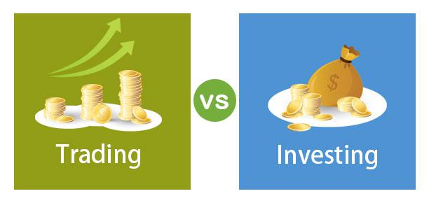

Financial strategies serve as the foundation for successful investment and trading activities. They encompass a broad range of activities, including analyzing market trends, managing risks, and optimizing asset allocation, all aimed at maximizing returns and achieving financial goals. Historically, investors and traders have relied on fundamental and technical analyses to inform their decisions. Fundamental analysis involves evaluating intrinsic value by examining economic indicators, financial statements, and industry conditions, while technical analysis focuses on price patterns and market data. Together, these strategies help in understanding market dynamics and making informed investment choices.

In recent years, algorithmic trading has emerged as a major force in financial markets, driven by significant advancements in technology and computing power. Algorithmic trading uses pre-defined rules and sophisticated algorithms to execute trades at speeds and frequencies beyond human capability. This approach minimizes human error and emotion, ensuring more consistent and efficient trading processes. As a result, algorithmic trading has gained prominence, playing a crucial role in how modern financial markets operate.

The integration of traditional investing principles with modern technology is critical in today's highly competitive financial landscape. While algorithms and automated systems can process data with great speed and precision, the insights derived from fundamental and technical analyses remain pivotal. Combining the strengths of both approaches allows for strategic decision-making, improved risk management, and enhanced returns.

This article will explore various aspects of financial strategies and their application in both traditional and algorithmic trading contexts. Topics include the core financial strategies of fundamental and technical analysis, the nuances of different trading forms such as stocks, forex, and commodities, and the significant role of algorithmic trading in current markets. Additionally, it will cover the development of algorithmic trading strategies, highlighting the importance of backtesting, machine learning, and regulatory considerations. The integration of financial strategies with algorithmic trading, drawing on real-world examples and forward-looking trends, will conclude the discussion.

## Table of Contents

## Understanding Financial Strategies

Financial strategies are crucial to effective investment and trading, providing a structured approach to decision-making in various market environments. Two predominant forms of analysis utilized in developing financial strategies are fundamental and technical analysis. 

**Fundamental Analysis** aims to evaluate an asset's intrinsic value by examining related economic and financial factors. This includes qualitative factors like company management and brand value, as well as quantitative aspects such as revenue, earnings, and profit margins. Fundamental analysis seeks to determine whether an asset is undervalued or overvalued compared to its current market price based on these parameters.

**Technical Analysis**, on the other hand, focuses on statistical trends derived from trading activity, such as price movement and volume. It involves chart patterns, technical indicators, and other analysis tools to predict future market direction. Unlike fundamental analysis, technical analysis does not consider an asset's intrinsic value but instead relies on historical price and volume data.

**Diversification and Risk Management** are pivotal components of a robust financial strategy. Diversification involves spreading investments across various asset classes, such as stocks, bonds, and real estate, to mitigate risk. By holding a diversified portfolio, investors can reduce the impact of a single asset's poor performance on the overall portfolio. Risk management entails evaluating potential risks and implementing strategies to minimize their impact, potentially through hedging or asset allocation adjustments.

Setting clear **financial goals and creating a strategic plan** are essential steps for investors. Financial goals should be specific, measurable, achievable, relevant, and time-bound (SMART). A strategic plan then outlines the steps needed to achieve these goals, providing a roadmap that guides investment decisions and helps maintain discipline during market [volatility](/wiki/volatility-trading-strategies).

Finally, it's important to **adapt financial strategies to different market conditions**. Market environments can shift due to economic cycles, geopolitical events, or changes in investor sentiment, necessitating adjustments in strategies. For instance, in a bullish market, an aggressive growth strategy might be appropriate, whereas in a bearish market, a defensive or value-oriented approach may be more suitable.

In summary, the successful implementation of financial strategies involves the integration of comprehensive analysis techniques, effective risk management, clear goal-setting, and strategic adaptability to changing market conditions. These elements are fundamental to maximizing investment returns while managing risks.

## Basics of Trading

Trading is a fundamental activity in financial markets, acting as a primary mechanism for price discovery and [liquidity](/wiki/liquidity-risk-premium) provision. Various forms of trading exist, including in stocks, foreign exchange ([forex](/wiki/forex-system)), and commodities. Each form has its unique characteristics and has attracted different types of participants with varying objectives and strategies.

**Forms of Trading**

Trading in stocks involves the buying and selling of shares of public companies on stock exchanges. This form of trading allows investors to own a portion of the company and potentially benefit from price appreciation and dividends. Forex trading involves exchanging one currency for another in a decentralized global market. It is characterized by high liquidity and operates 24 hours a day due to the global nature of the currencies involved. Commodities trading pertains to raw materials like oil, gold, and agricultural products and can be exchanged on specialized futures exchanges.

**Key Concepts in Trading**

1. **Market Orders and Limit Orders**: A market order is executed immediately at the current market price, ensuring execution but not price certainty. Meanwhile, a limit order sets a specific price at which an investor is willing to buy or sell. A buy limit order will be executed at the limit price or lower, and a sell limit order at the limit price or higher.

2. **Stop-Loss and Take-Profit Levels**: Stop-loss orders are designed to limit an investor’s loss on a position by setting a specific exit price. Once the stop price is reached, the stop-loss order becomes a market order. Take-profit orders lock in profit by closing a position when a security reaches a certain price.

3. **Timing, Volume, and Market Sentiment**: Timing plays a crucial role in trading success, with traders seeking to buy at lows and sell at highs. Volume, or the number of shares or contracts traded, provides insights into the strength or weakness of a price movement. Market sentiment reflects the overall attitude of investors towards a particular security or the market, influencing price movements and possibly creating opportunities.

**Role of Trading Psychology and Discipline**

Trading psychology and discipline are central to achieving consistent outcomes in trading. Emotional biases such as fear and greed can adversely affect decision-making, leading to irrational trades and significant losses. Successful traders cultivate a disciplined approach, adhering to their trading plans and strategies. They utilize self-control to manage emotions and maintain focus, which helps mitigate risks and enhance profitability.

Understanding these foundational elements is essential for anyone looking to engage in trading, as it combines both technical knowledge and psychological acumen. As traders become more advanced, they can explore more complex strategies and adapt to evolving market conditions, continuously developing their skills and methods.

 to Algorithmic Trading

Algorithmic trading, often referred to as algo trading, involves the use of computer algorithms to manage trading decisions and execute trades in financial markets. This form of trading leverages the power of technology to enhance the efficiency, speed, and accuracy of trading activities which might otherwise be hindered by human limitations.

The concept of [algorithmic trading](/wiki/algorithmic-trading) dates back several decades, but its widespread adoption began in the 1970s with the introduction of the New York Stock Exchange's "designated order turnaround" system, which automated order processing. By the late 1990s and early 2000s, with advancements in computing power and electronic trading platforms, algo trading became more prevalent. High-frequency trading ([HFT](/wiki/high-frequency-trading-strategies)), a subset of algorithmic trading characterized by the rapid execution of a large number of orders, became prominent during this period.

Technology drives efficiency and accuracy in trading by enabling the analysis of large datasets quickly and executing trades at the optimal moments based on predefined criteria. Algorithms can evaluate multiple indicators and market conditions simultaneously to determine the best potential outcomes. This computational ability reduces human bias and errors, thus facilitating more precise trading executions.

The key components of algorithmic trading include algorithms, sophisticated software, and data analysis tools. Algorithms are essentially a set of rules or instructions coded to perform specific tasks. For example, an algorithm might be designed to identify [arbitrage](/wiki/arbitrage) opportunities or to execute trades whenever a stock price hits a certain level. Software is the medium through which these algorithms operate, often requiring robust architectures capable of handling high volumes of market data. Data analysis tools are also essential as they enable traders to analyze historical data to predict future market movements, often through statistical models and [machine learning](/wiki/machine-learning) techniques.

Algorithmic trading offers several advantages over traditional manual trading methods. Speed is one of the most significant benefits, as algorithms can process data and execute orders much faster than a human trader. This quick execution minimizes latency and capitalizes on momentary market inefficiencies. Additionally, algorithmic trading can enhance market liquidity by increasing the frequency and number of transactions. By removing psychological biases that can influence human traders, it ensures a more consistent and disciplined approach to executing strategies. 

Moreover, algo trading allows for simultaneous management of multiple trading strategies across different markets and timeframes. This multi-tasking capability is particularly beneficial in complex markets and diverse portfolios.

Overall, algorithmic trading represents a significant evolution in the financial markets, merging traditional trading principles with cutting-edge technology to offer enhanced precision and capability in the fast-paced world of trading.

## Developing Algorithmic Trading Strategies

Algorithmic trading strategies rely on a precise blend of mathematical models, technology, and financial knowledge to achieve desired trading outcomes. The development of these strategies begins with [backtesting](/wiki/backtesting), a critical component that ensures the strategy's potential for profitability. Backtesting involves applying a trading strategy to historical market data to evaluate its effectiveness. By simulating trades using historical data, traders can identify potential issues, optimize strategy parameters, and improve risk management practices before risking capital in live markets. 

The process of backtesting typically involves the use of software tools capable of handling extensive datasets and testing numerous scenarios efficiently. These tools must accurately replicate trading costs, including slippage and commission, to produce realistic results. Furthermore, it's crucial to account for overfitting—a situation where a strategy performs well on historical data but fails in real-time due to excessive complexity or reliance on specific market conditions.

Incorporating machine learning and [artificial intelligence](/wiki/ai-artificial-intelligence) (AI) into trading algorithms enhances their adaptability and decision-making capabilities. These technologies enable algorithms to detect patterns and insights that are not immediately apparent through traditional statistical methods. Machine learning techniques, such as supervised learning, are used to predict future price movements based on historical data. Unsupervised learning helps in identifying market behavior and clustering similar trading patterns, while [reinforcement learning](/wiki/reinforcement-learning) models improve decision-making by interacting with dynamic market environments.

Despite the potential benefits, integrating machine learning and AI into trading algorithms presents several challenges. Market impact, for example, can significantly alter asset prices as a consequence of large trades, affecting the strategy's assumptions and performance. Ensuring data quality is another significant hurdle, as errors or inaccuracies in historical data can lead to flawed models and poor decision-making. High-frequency trading strategies are particularly sensitive to latency and information timing, requiring robust infrastructure to maintain competitiveness.

The regulatory landscape surrounding algorithmic trading is complex and continually evolving. Some of the major concerns include market manipulation, systemic risk, and transparency. Algorithmic traders must comply with regulations such as the European Union's Markets in Financial Instruments Directive (MiFID II) and the U.S. Securities and Exchange Commission's (SEC) rules, which mandate rigorous reporting and governance practices. These regulations are designed to mitigate risks and promote fair trading practices, ensuring that automated strategies do not destabilize financial markets.

In summary, developing algorithmic trading strategies involves meticulous backtesting, the incorporation of advanced technologies like machine learning, and a keen awareness of potential challenges such as market impact and data quality. Additionally, adhering to regulatory standards is essential to maintain market integrity and protect the interests of all market participants. As technology continues to evolve, the sophistication and precision of algorithmic trading strategies are expected to increase, offering new opportunities and challenges for traders worldwide.

## Integrating Financial Strategies with Algo Trading

Traditional financial strategies, rooted in fundamental and technical analysis, lay the groundwork for effective algorithmic trading models. These strategies provide the theoretical foundation for algorithms designed to execute trades based on quantitative data rather than human intuition alone. Financial experts have identified key patterns and indicators over the years, such as moving averages, RSI (Relative Strength Index), and Fibonacci retracements, which are now often incorporated into algorithmic models to predict market movements and optimize trade execution. 

The effectiveness of algorithmic trading lies in its ability to process vast datasets and identify trends at a scale that exceeds human capability. However, the integration of data-driven insights with human judgment remains crucial. While algorithms excel at parsing historical and real-time data, human expertise is necessary to interpret complex market dynamics that might not be encapsulated within existing datasets. For instance, sudden geopolitical events or shifts in economic policy may not be predictable through algorithms alone, necessitating the intervention of human analysts.

A case study exemplifying the successful combination of financial strategies and algorithmic trading is that of Renaissance Technologies, a [hedge fund](/wiki/hedge-fund-trading-strategies) that employs complex mathematical models to guide trading decisions. By harnessing both structured financial principles and cutting-edge algorithms, Renaissance has consistently outperformed traditional investment firms. Their approach underscores the importance of not only relying on algorithms but also integrating insights gleaned from the principles of diversification, risk management, and market sentiment into their trading strategies.

Looking to the future, the integration of financial strategies with algorithmic trading is poised to further evolve with advancements in machine learning and artificial intelligence. These developments will likely enhance an algorithm's ability to learn and adapt from new data, thus improving predictive accuracy. As these technologies advance, they are expected to drive more sophisticated models that blend quantitative data with qualitative financial insights. Additionally, the growing [volume](/wiki/volume-trading-strategy) and variety of available data sources, such as social media sentiment and real-time economic indicators, present opportunities for more nuanced trading strategies that account for a broader array of factors.

Regulatory challenges and the ethical use of proprietary data remain significant considerations in this evolving field. Algorithmic traders and firms must ensure compliance with financial markets' regulatory frameworks to avoid market manipulation and ensure transparency. As these technologies continue to develop, ongoing dialogue between traders, technologists, and regulators will be essential to foster a trading environment that balances innovation with stability and fairness. The future integration of financial strategies and algorithmic trading will likely see continuous refinement as both fields adapt, offering promising new possibilities for investors and traders alike.

## Conclusion

The interconnectedness of financial strategies, trading, and algorithmic methods is increasingly evident as the modern landscape of financial markets advances. Financial markets have always demanded a combination of strategic insight, accurate analysis, and precise execution. However, the evolution of these markets, driven by technological advancements, has significantly altered how these elements interact and function.

Traditional financial strategies, such as fundamental and technical analysis, continue to provide essential frameworks for understanding market behaviors and trends. However, the advent of algorithmic trading represents a paradigm shift by integrating these conventional principles with cutting-edge technology. Algorithmic methods leverage large volumes of data and complex algorithms to make precise and swift trading decisions. This fusion of human strategy and computational power has created a dynamic synergy that enhances both efficiency and performance in trading.

Technological advancements, particularly in the fields of artificial intelligence and machine learning, have further broadened the scope of what is achievable in trading and investing. These technologies allow for the processing and analysis of vast amounts of data at an unprecedented speed, delivering insights that were previously inaccessible. The increasing sophistication of data analysis tools enables traders and investors to identify patterns and correlations that improve decision-making processes.

The continuous learning and adaptation of strategies are imperative to navigate the ever-evolving financial landscape. As technology rapidly progresses, so too must market participants adjust their approaches. Embracing a mindset of lifelong learning is crucial for anyone looking to sustain and grow their presence in the financial markets. Experimentation and agility in incorporating new technologies and methodologies will determine success.

Finally, the encouragement for readers to explore and innovate in both traditional and algorithmic trading underscores the opportunities brought about by this integration. The boundaries between traditional investing principles and modern technological applications are becoming increasingly blurred. For those willing to embrace change, there is vast potential to drive innovation, optimize strategies, and capitalize on market opportunities. Thus, continuous exploration and innovation emerge as vital components for future success in trading and investing.

## References & Further Reading

[1]: ["Advances in Financial Machine Learning"](https://www.amazon.com/Advances-Financial-Machine-Learning-Marcos/dp/1119482089) by Marcos Lopez de Prado

[2]: Bergstra, J., Bardenet, R., Bengio, Y., & Kégl, B. (2011). ["Algorithms for Hyper-Parameter Optimization."](https://dl.acm.org/doi/10.5555/2986459.2986743) Advances in Neural Information Processing Systems 24.

[3]: ["Evidence-Based Technical Analysis: Applying the Scientific Method and Statistical Inference to Trading Signals"](https://www.amazon.com/Evidence-Based-Technical-Analysis-Scientific-Statistical/dp/0470008741) by David Aronson

[4]: ["Machine Learning for Algorithmic Trading"](https://github.com/stefan-jansen/machine-learning-for-trading) by Stefan Jansen

[5]: ["Quantitative Trading: How to Build Your Own Algorithmic Trading Business"](https://www.amazon.com/Quantitative-Trading-Build-Algorithmic-Business/dp/1119800064) by Ernest P. Chan