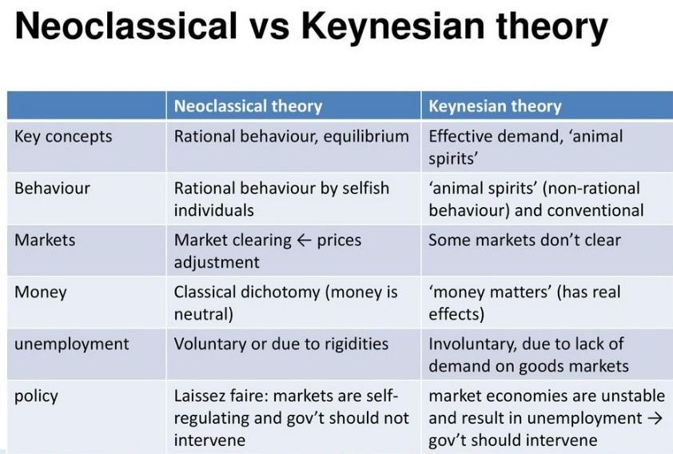

## Table of Contents

## What is Keynesian economics?

Keynesian economics is an economic theory that focuses on how government spending and taxes can influence the economy. It was developed by John Maynard Keynes during the Great Depression in the 1930s. Keynes believed that when the economy is not doing well, like during a recession, the government should spend more money and cut taxes. This would give people more money to spend, which would help businesses and create jobs. On the other hand, when the economy is doing too well and might overheat, the government should spend less and raise taxes to cool things down.

A key idea in Keynesian economics is the concept of "aggregate demand," which is the total demand for goods and services in an economy. Keynes argued that if aggregate demand is too low, it can lead to high unemployment and slow economic growth. To fix this, the government can increase its spending to boost demand. This approach contrasts with classical economics, which believes that markets will naturally correct themselves without government intervention. Keynesian economics has been influential in shaping economic policies around the world, especially during times of economic crisis.

## What is Neo-Keynesian economics?

Neo-Keynesian economics is a modern version of Keynesian economics. It builds on the ideas of John Maynard Keynes but adds new thoughts and ways to fix economic problems. Neo-Keynesians believe that the government should still play a big role in the economy, just like Keynes thought. But they also think that sometimes the government should work with businesses and use new tools to help the economy grow.

One big idea in Neo-Keynesian economics is that prices and wages can be slow to change. This means that if the economy is not doing well, it might take a long time for prices and wages to go down to help fix things. So, Neo-Keynesians say the government should step in faster to help the economy get back on track. They also believe in using things like interest rates to control how much people spend and save, which can help keep the economy stable.

## Who were the key figures in developing Keynesian economics?

John Maynard Keynes was the main person who started Keynesian economics. He wrote a famous book called "The General Theory of Employment, Interest, and Money" in 1936. This book came out during the Great Depression, a time when many people were out of work and the economy was doing badly. Keynes thought that the government should spend more money and cut taxes to help people have more money to spend. This would help businesses sell more and hire more workers. His ideas were different from what many economists thought at the time, who believed that the economy would fix itself without help.

After Keynes, other economists helped to grow and change his ideas. One important person was Alvin Hansen, who is sometimes called the "American Keynes." He helped bring Keynesian ideas to the United States and worked on how to use them in real life. Another key figure was Paul Samuelson, who wrote a very popular economics textbook that included Keynesian ideas. Samuelson helped make these ideas easier for students to understand and use. Over time, many other economists added to and changed Keynesian economics, making it a big part of how governments around the world think about managing their economies.

## Who were the key figures in developing Neo-Keynesian economics?

Neo-Keynesian economics was developed by economists who wanted to build on and update the ideas of John Maynard Keynes. One key figure was John Hicks, who came up with the IS-LM model. This model helped show how interest rates and spending affect the economy. Another important person was Franco Modigliani, who worked on how people save and spend money over their lifetimes. His ideas helped explain why the economy might not always fix itself quickly, and why the government might need to step in to help.

Paul Samuelson also played a big role in Neo-Keynesian economics. He wrote a famous textbook that included many Neo-Keynesian ideas, making them easier for students and other economists to understand. Robert Solow was another important figure. He focused on how technology and growth fit into Neo-Keynesian thinking. These economists and others worked together to create a more detailed and useful version of Keynesian economics, which governments around the world still use today to help manage their economies.

## What are the main principles of Keynesian economics?

Keynesian economics is all about how the government can help the economy when it's not doing well. The main idea is that when people aren't spending enough money, businesses don't make as much, and they might have to let workers go. This can lead to a lot of people being out of work and the economy slowing down. John Maynard Keynes thought that the government should step in during these times by spending more money and cutting taxes. This would give people more money to spend, which would help businesses sell more and hire more workers.

Another big part of Keynesian economics is the idea of "aggregate demand," which is the total amount of money people want to spend on goods and services. Keynes believed that if aggregate demand is too low, it can cause big problems like high unemployment and slow growth. To fix this, the government can increase its spending to boost demand. This is different from what some other economists thought at the time, who believed that the economy would fix itself without help. Keynesian economics has been very important in shaping how governments around the world manage their economies, especially during tough times.

## How do Neo-Keynesians modify or expand on these principles?

Neo-Keynesians build on the ideas of John Maynard Keynes but add new thoughts and tools to help the economy. They believe that prices and wages can be slow to change, which means that if the economy is not doing well, it might take a long time for things to get better on their own. Because of this, Neo-Keynesians think the government should step in faster to help. They also use interest rates to control how much people spend and save. By adjusting interest rates, the government can make borrowing money cheaper or more expensive, which can help keep the economy stable.

Another way Neo-Keynesians expand on Keynesian ideas is by working more closely with businesses. They think that the government should not just spend more money but also work with companies to help the economy grow. For example, they might support businesses with loans or other help to encourage them to invest and create jobs. Neo-Keynesians also look at how people save and spend money over their whole lives, not just in the short term. This helps them understand why the economy might not fix itself quickly and why the government might need to step in to help.

## How do Keynesian and Neo-Keynesian economics view the role of government in the economy?

Keynesian economics believes that the government should play a big role in the economy, especially when things are not going well. John Maynard Keynes thought that if people are not spending enough money, businesses will sell less and might have to let workers go. This can lead to a lot of people being out of work and the economy slowing down. To fix this, Keynes said the government should spend more money and cut taxes. This would give people more money to spend, which would help businesses sell more and hire more workers. Keynes believed that the government's actions could help boost the total demand for goods and services, which is called "aggregate demand," and get the economy moving again.

Neo-Keynesians agree with Keynes that the government should help the economy, but they add some new ideas. They think that prices and wages can be slow to change, so if the economy is not doing well, it might take a long time to get better on its own. Because of this, Neo-Keynesians believe the government should step in faster to help. They also use interest rates to control how much people spend and save. By making borrowing money cheaper or more expensive, the government can help keep the economy stable. Neo-Keynesians also think the government should work with businesses to help the economy grow, like giving loans or other support to encourage companies to invest and create jobs.

## What are the differences in their approaches to fiscal policy?

Keynesian economics says that the government should use fiscal policy to help the economy when it's not doing well. This means the government should spend more money and cut taxes. When people have more money to spend, they will buy more things from businesses. This helps businesses sell more and hire more workers. Keynes thought this was important because if people aren't spending enough, the economy can slow down and a lot of people might lose their jobs. So, the government's spending can boost what's called "aggregate demand," which is the total amount of money people want to spend on goods and services.

Neo-Keynesians agree that the government should use fiscal policy to help the economy, but they have some different ideas. They think that prices and wages can be slow to change, so if the economy is not doing well, it might take a long time to get better without help. Because of this, Neo-Keynesians believe the government should step in faster with fiscal policy. They also think the government should work with businesses, like giving them loans or other help, to encourage them to invest and create jobs. This way, the government can use fiscal policy not just to spend more money but also to support businesses and help the economy grow.

## How do they differ in their analysis of unemployment?

Keynesian economics says that unemployment can happen when people don't have enough money to spend. If people aren't buying things, businesses will sell less and might have to let workers go. This can make a lot of people lose their jobs. Keynes thought that the government should step in by spending more money and cutting taxes. This would give people more money to spend, which would help businesses sell more and hire more workers. So, Keynes believed that unemployment could be fixed by boosting what's called "aggregate demand," which is the total amount of money people want to spend on goods and services.

Neo-Keynesians agree with Keynes that unemployment can happen when people aren't spending enough, but they add some new ideas. They think that prices and wages can be slow to change, so if the economy is not doing well, it might take a long time for businesses to start hiring again without help. Because of this, Neo-Keynesians believe the government should act faster to help. They also think the government should work with businesses to help them invest and create jobs. This way, the government can help lower unemployment not just by spending more money but also by supporting businesses directly.

## What are the critiques of Keynesian economics and how do Neo-Keynesians respond to these critiques?

Critics of Keynesian economics say that it can lead to too much government spending and big debts. They think that if the government keeps spending more money to help the economy, it might borrow too much and have to pay back a lot later. Some also believe that too much government spending can make prices go up too fast, which is called inflation. They argue that the economy should fix itself without the government stepping in so much. Another critique is that Keynesian ideas might make people and businesses depend too much on the government, which could stop them from making their own decisions and taking risks.

Neo-Keynesians respond to these critiques by saying that they understand the risks of too much government spending and debt. They believe that the government should be careful and use other tools, like interest rates, to help control the economy. Neo-Keynesians also think that working with businesses can help the economy grow without making people too dependent on the government. They argue that their ideas are more flexible and can be adjusted to fit different situations. By using a mix of spending, taxes, and working with businesses, Neo-Keynesians believe they can help the economy without causing too many problems.

## Can you provide examples of economic policies that are influenced by Keynesian versus Neo-Keynesian theories?

Keynesian economics has influenced many economic policies around the world, especially during tough times like the Great Depression and the 2008 financial crisis. One example is the New Deal in the United States during the 1930s. President Franklin D. Roosevelt used Keynesian ideas to create jobs and help the economy by spending a lot of money on things like building roads, bridges, and public buildings. Another example is the American Recovery and Reinvestment Act of 2009, which was a big spending plan to help the economy recover from the 2008 financial crisis. The government spent money on things like schools, roads, and helping people who lost their jobs, all to boost spending and get the economy moving again.

Neo-Keynesian economics has also shaped many policies, but it often includes working with businesses and using interest rates to help the economy. For example, during the 1990s and early 2000s, many countries used Neo-Keynesian ideas to keep their economies stable. Central banks, like the Federal Reserve in the U.S., would change interest rates to make borrowing money cheaper or more expensive. This helped control how much people spent and saved, which kept the economy from growing too fast or too slow. Another example is the European Union's response to the 2008 financial crisis, where they not only spent money to help the economy but also worked with businesses to encourage them to invest and create jobs. This mix of spending, adjusting interest rates, and supporting businesses is a key part of Neo-Keynesian policy.

## How have Keynesian and Neo-Keynesian theories evolved in response to recent economic crises?

Keynesian and Neo-Keynesian theories have changed a lot because of recent economic crises, like the 2008 financial crisis and the economic effects of the COVID-19 pandemic. During the 2008 crisis, many countries used Keynesian ideas by spending a lot of money to help their economies. Governments gave money to people who lost their jobs and spent on things like building roads and schools to create jobs. This was similar to what happened during the Great Depression. But after the 2008 crisis, some people worried that too much government spending could lead to big debts and inflation, so they started looking for other ways to help the economy.

Neo-Keynesians responded to these worries by using more tools than just spending money. They started using interest rates more to control how much people spend and save. For example, during the 2008 crisis and the COVID-19 pandemic, central banks like the Federal Reserve in the U.S. made borrowing money cheaper to help businesses and people. Neo-Keynesians also worked more with businesses to encourage them to invest and create jobs. During the COVID-19 crisis, many countries used a mix of spending, adjusting interest rates, and helping businesses to keep their economies going. This shows how Neo-Keynesian ideas have evolved to use different ways to help the economy during tough times.

## What is Keynesian Economics?

Keynesian economics, developed by John Maynard Keynes during the tumultuous period of the Great Depression in the 1930s, presents a paradigm shift from classical economic thought. At its core, Keynesian theory emphasizes the role of aggregate demand, or total spending in the economy, in determining output and inflation levels. Keynes argued that inadequate aggregate demand could lead to extended periods of high unemployment and economic stagnation, a phenomenon he observed during the Great Depression.

A fundamental element of Keynesian economics is its rejection of the market's self-regulating nature, a premise held by classical economists who believed that economies naturally adjust to full employment through price and wage flexibility. Keynes challenged this view, proposing that prices and wages are often sticky, meaning they do not adjust quickly to changes in economic conditions. This stickiness can result in prolonged periods of economic disequilibrium.

Keynesian theory advocates for active government intervention, particularly through fiscal policy, to manage economic cycles and mitigate recessions. According to Keynes, when private sector demand falls short, leading to unemployment and unused resources, public spending and tax cuts can stimulate economic activity and demand. This interventionist approach aims to boost consumption and investment, thereby increasing aggregate demand and moving the economy towards full employment.

Keynesian economics suggests using government budget deficits as a tool in downturns, where increased government spending might temporarily exceed tax revenues. This counter-cyclical fiscal policy aims to smooth out economic fluctuations. For example, employing government-funded programs to build infrastructure can create jobs and generate income, which in turn increases consumer spending, leading to higher demand for goods and services.

The theoretical foundations of Keynesian economics can be represented through the simple equation of aggregate demand:

$$
AD = C + I + G + (X - M)
$$

where:
- $AD$ represents aggregate demand,
- $C$ is consumption,
- $I$ is investment,
- $G$ is government spending,
- $X$ is exports, and
- $M$ is imports.

By influencing components such as government spending ($G$), policymakers can alter aggregate demand to stabilize the economy. Thus, Keynesian economics provides a framework for understanding how fiscal measures, such as public spending and tax policies, can be leveraged to achieve macroeconomic stability and growth.

## What is Neo-Keynesian Economics?

Neo-Keynesian economics emerged in the mid-20th century as an extension and refinement of Keynesian thought. Its primary advancement over classical Keynesian economics is the integration of both monetary and fiscal policies as mechanisms to influence economic performance, emphasizing the stabilization of both prices and output.

At its core, Neo-Keynesian economics acknowledges the limitations of self-regulating markets, highlighting instances of market failure where prices and wages do not adjust immediately to changes in supply or demand. This is attributed to the concept of "price and wage rigidity," a fundamental notion in Neo-Keynesian theory that helps explain persistent unemployment and inflationary trends. Wage rigidity, for example, can result from long-term contracts or minimum wage laws that prevent wages from adjusting downward during economic downturns. Similarly, price rigidity might occur due to menu costs or the costs to firms of changing prices.

The IS-LM model is a central analytical tool in Neo-Keynesian economics, illustrating the interaction between the goods market (equilibrium between investment and savings, IS) and the money market ([liquidity](/wiki/liquidity-risk-premium) preference and money supply, LM). This model describes how fiscal and monetary policies can influence national income and interest rates, thus providing a framework to analyze how policies can stabilize economic fluctuations.

Monetary policy within Neo-Keynesian economics is significant as it impacts aggregate demand by influencing interest rates and consequently investment spending. This complements fiscal policy, which affects aggregate demand primarily through changes in government spending and taxation. Neo-Keynesian economists argue for the strategic application of these tools, where monetary policy might be used for short-term cyclical adjustments, and fiscal policy is deployed for longer-term growth and employment objectives.

The effectiveness of combining fiscal and monetary policy can be further examined with equations to represent the IS-LM model, traditionally depicted as:

$$
IS: Y = C(Y - T) + I(r) + G
$$

$$
LM: M/P = L(r, Y)
$$

Where:
- $Y$ is the national income,
- $C$ is consumption,
- $T$ is taxes,
- $I$ is investment,
- $r$ is the interest rate,
- $G$ is government spending,
- $M$ stands for money supply,
- $P$ refers to price levels, and
- $L$ is the liquidity preference.

These equations show how changes in fiscal policy ($G$ and $T$) and monetary policy ($M$) can shift the IS and LM curves, respectively, thereby affecting $Y$ and $r$.

Furthermore, Neo-Keynesianism incorporates the Phillips Curve to analyze trade-offs between inflation and unemployment, positing that with some market adjustments, it is feasible to achieve a stable economic environment with moderate inflation and low unemployment. The theory advocates for cautious and coordinated policy responses to avert destabilizing inflationary pressures or prolonged unemployment.

In summary, Neo-Keynesian economics provides a comprehensive framework that integrates monetary and fiscal policy to address economic fluctuations effectively. Its focus on rigidity and the dual use of policy tools presents a pragmatic approach to managing an economy, maintaining equilibrium in an often unpredictable macroeconomic landscape.

## References & Further Reading

[1]: Keynes, J. M. (1936). ["The General Theory of Employment, Interest, and Money."](https://www.files.ethz.ch/isn/125515/1366_KeynesTheoryofEmployment.pdf) Palgrave Macmillan.

[2]: Hicks, J. R. (1937). ["Mr. Keynes and the 'Classics'; A Suggested Interpretation."](https://www.jstor.org/stable/1907242) Econometrica, 5(2), 147-159.

[3]: ["Keynes: A Very Short Introduction"](https://academic.oup.com/book/383) by Robert Skidelsky

[4]: Mankiw, N. G., & Romer, D. (1991). ["New Keynesian Economics."](https://mitpress.mit.edu/9780262631334/new-keynesian-economics/) MIT Press.

[5]: Blanchard, O. J., & Fischer, S. (1989). ["Lectures on Macroeconomics."](https://books.google.com/books/about/Lectures_on_Macroeconomics.html?id=j_zs7htz9moC) MIT Press.

[6]: ["Monetary Theory and Policy"](https://mitpress.mit.edu/9780262035811/monetary-theory-and-policy/) by Carl E. Walsh

[7]: Taylor, J. B. (1993). ["Discretion versus Policy Rules in Practice."](https://web.stanford.edu/~johntayl/Onlinepaperscombinedbyyear/1993/Discretion_versus_Policy_Rules_in_Practice.pdf) Carnegie-Rochester Conference Series on Public Policy, 39, 195-214.

[8]: ["Algorithmic Trading: Winning Strategies and Their Rationale"](https://onlinelibrary.wiley.com/doi/pdf/10.1002/9781118676998.fmatter) by Ernest P. Chan

[9]: Woodford, M. (2003). ["Interest and Prices: Foundations of a Theory of Monetary Policy."](https://www.jstor.org/stable/j.ctv30pnvmf) Princeton University Press.