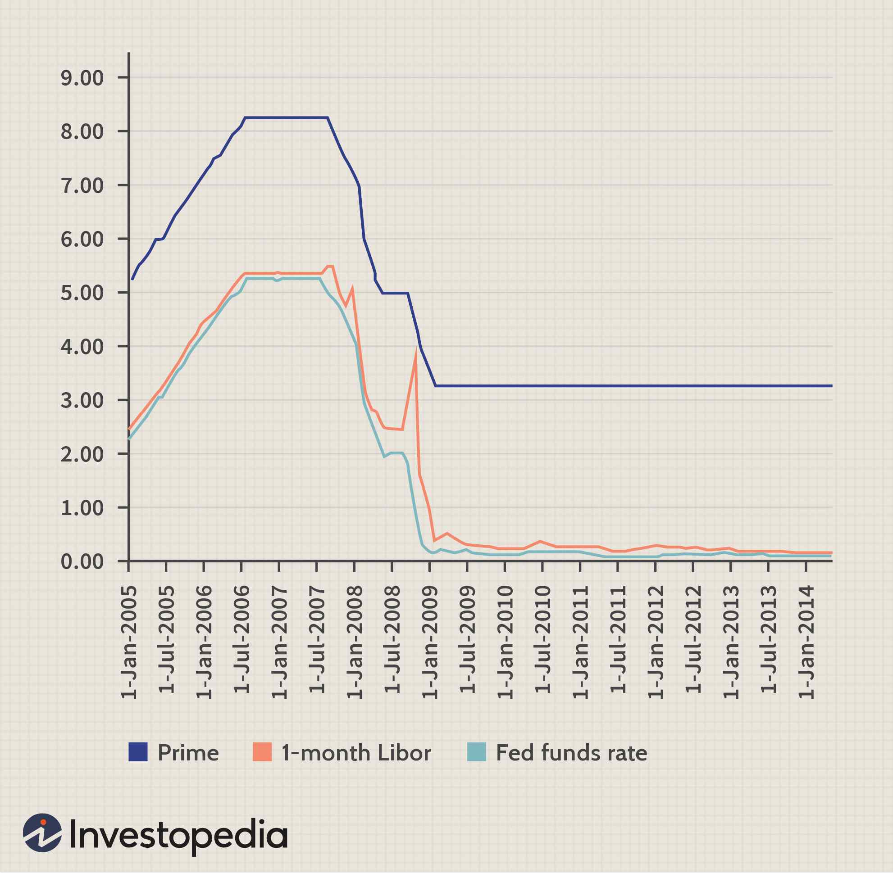

In the world of finance, understanding key interest rate benchmarks such as LIBOR and LIBID is essential for investors and financial professionals. These rates play a crucial role within the London interbank market, with far-reaching implications across various financial instruments, including those utilized in algorithmic trading.

LIBOR, or the London Interbank Offered Rate, reflects the average interest rate at which major banks are willing to lend to one another. It is a globally accepted benchmark that influences an extensive range of financial products, from retail loans to complex derivatives. The rate is calculated daily and serves as a fundamental base rate for a myriad of financial contracts worldwide.



Equally significant, albeit less known, is LIBID, the London Interbank Bid Rate. This rate signifies the interest rate at which banks are prepared to borrow funds from other banks. While LIBID might not receive as much attention as LIBOR, it remains integral to financial trading and risk assessment activities. LIBID is often used in conjunction with LIBOR to gauge the spread and liquidity in the interbank market, providing valuable insights into interbank borrowing activities.

This article aims to explore the details of LIBID and LIBOR, their relevance in the financial markets, and the ways they are integrated within algorithmic trading strategies. By understanding these benchmarks, financial professionals can better navigate the complexities of current and emerging market conditions.

## Table of Contents

## Understanding LIBID and LIBOR

Both LIBID and LIBOR serve as crucial reference rates in guiding financial transactions within the London interbank market. These rates play an important role in setting short-term interest rates for a variety of financial products on a global scale.

LIBOR, or the London Interbank Offered Rate, is the more widely recognized of the two. It represents the average interest rate at which major banks lend to one another. LIBOR influences a wide array of retail financial products, including mortgages and student loans. The rate is calculated daily by the Intercontinental Exchange (ICE) and is pivotal in both wholesale and retail banking. LIBOR is determined through a rigorous process where a selection of leading banks submit their perceived interest rates for lending unsecured funds to each other in various currencies and maturities. These submissions are then averaged, after discarding the highest and lowest quartiles, to establish LIBOR for different time durations.

Conversely, LIBID, or the London Interbank Bid Rate, represents the rate banks are willing to pay to borrow currency. Though less prominently discussed than LIBOR, LIBID is nevertheless essential in financial trading and risk assessment. It essentially reflects the inverse of the rate for funds offered, providing insights into [liquidity](/wiki/liquidity-risk-premium) conditions. While LIBOR is more publicly tracked and referenced, LIBID serves as an important backdrop, particularly for traders and risk management professionals who need to assess borrowing costs and market depth.

The conceptual difference between LIBOR and LIBID is fundamental to understanding interbank transactions. If 'Offer' represents the rate at which banks are willing to lend, then 'Bid' characterizes the borrowing intent, hence the naming conventions. The relationship can be expressed succinctly as:

$$
\text{LIBID} \leq \text{LIBOR}
$$

Given that banks typically demand higher rates for lending than they are willing to pay on borrowed funds. Understanding this rate dynamic is essential for anyone involved in interbank financial management or [algorithmic trading](/wiki/algorithmic-trading). These reference rates not only reflect market conditions but also underpin the pricing and valuation of various derivatives and financial instruments globally.

## LIBID and LIBOR in Algorithmic Trading

Algorithmic trading strategies heavily depend on precise and comprehensive financial data. Interest rates, particularly the London Interbank Offered Rate (LIBOR) and the London Interbank Bid Rate (LIBID), provide crucial input for these algorithms, influencing decision-making processes and trading outcomes.

LIBOR's role in algorithmic trading is particularly significant due to its widespread application in the construction of [interest rate](/wiki/interest-rate-trading-strategies) models, structuring derivatives, and facilitating [arbitrage](/wiki/arbitrage) activities across various financial instruments. LIBOR serves as a benchmark, reflecting the average interest rate at which major banks lend to each other, thus providing a critical layer of information for forecasting interest rate movements and pricing complex financial products.

Traders in algorithmic trading utilize sophisticated quantitative models to analyze fluctuations in LIBOR and LIBID. These models incorporate statistical techniques and [machine learning](/wiki/machine-learning) algorithms to detect patterns, predict market trends, and identify arbitrage opportunities. For instance, one might implement a simple mean-reversion strategy in Python to capitalize on temporary deviations from average pricing:

```python
import numpy as np
import pandas as pd

# Sample LIBOR rate data
libor_data = pd.Series([0.5, 0.55, 0.53, 0.57, 0.54])

def mean_reversion_strategy(series, threshold=0.01):
    mean = np.mean(series)
    signal = (series - mean) / mean
    trades = []

    for i in range(1, len(series)):
        if signal[i] > threshold:
            trades.append('Sell')
        elif signal[i] < -threshold:
            trades.append('Buy')
        else:
            trades.append('Hold')

    return trades

trade_signals = mean_reversion_strategy(libor_data)
print(trade_signals)
```

This simplistic strategy illustrates how algorithmic models can be devised to react to interest rate variations by generating buy, sell, or hold signals based on predefined thresholds.

Moreover, the fluctuations between LIBOR and LIBID are crucial for executing arbitrage opportunities. Arbitrage involves exploiting price differences between markets or instruments to achieve a risk-free profit. When the spread between LIBOR and LIBID widens, algorithmic traders can implement strategies to take advantage of these discrepancies, executing trades at optimal times to maximize gains.

For algorithmic traders, having access to precise data on LIBOR and LIBID and integrating it into their trading systems is vital. It ensures that their models are based on current and relevant market conditions, enhancing the chances of successful trades in dynamic financial environments. The ability to adapt and refine these models continually is critical as traders attempt to navigate and profit from the complexities of the financial markets.

## The Transition from LIBOR and Its Implications

The transition from the London Interbank Offered Rate (LIBOR) has become imperative due to its past susceptibility to manipulation. The benchmark was historically influenced by the estimation of interest rates from contributing banks rather than actual transaction data, making it vulnerable to fraudulent reporting. This realization led financial regulators worldwide to advocate for a more transparent and reliable system. Consequently, the cessation of LIBOR was planned, impacting numerous financial instruments and contracts that previously depended on it.

Alternative benchmarks have emerged to replace LIBOR, with the Sterling Overnight Index Average (SONIA) and the Secured Overnight Financing Rate (SOFR) at the forefront. Both rates reflect overnight borrowing costs rather than the multiple-day tenors previously characteristic of LIBOR. SONIA is largely employed for British pound transactions and is based on overnight unsecured transactions, while SOFR caters to the U.S. dollar and is grounded in transactions in the U.S. Treasury repo market.

From the perspective of algorithmic trading, this transition imposes substantial challenges. Given the reliance on accurate and timely data, algorithms that were tuned to LIBOR must be recalibrated to accommodate these new rates. This involves not just substituting the reference rates but also reevaluating the trading models to align with the distinct behaviors of SONIA and SOFR. Unlike LIBOR, which incorporated a risk and term premium, its successors are nearly risk-free, thus altering the dynamics within models that account for credit risk.

Algorithm developers and financial analysts must now adjust their strategies to reflect the characteristics of these new benchmarks. For instance, the historical credit spread embedded in LIBOR will no longer exist in SONIA or SOFR, necessitating adjustments to predictive models. Additionally, given the overnight nature of these rates, traders will need to enhance processing capabilities to handle potentially increased market [volatility](/wiki/volatility-trading-strategies) and the aggregation of more data points.

In essence, the transition away from LIBOR is not merely a change of rates. It demands a comprehensive overhaul of financial instruments, risk management processes, and algorithmic trading strategies to ensure compatibility and efficiency. Aligning with these new standards is crucial for maintaining the robustness and accuracy of trading operations in an evolving financial landscape.

## Impact on Financial Markets

LIBOR and LIBID have historically been pivotal in the financial markets, acting as crucial indicators of market sentiment and liquidity. These benchmarks have influenced a wide array of financial products, including global interest rate swaps and retail loan rates. Their movements provide insight into market conditions, aiding market participants in making informed decisions.

The transition away from LIBOR, driven by concerns over its susceptibility to manipulation, presents a new landscape for financial markets. As market participants adapt to alternative reference rates such as SONIA and SOFR, they face both challenges and opportunities. Understanding these shifts can enhance a trader's ability to predict market trends and optimize trading algorithms.

Financial models and algorithms that previously incorporated LIBOR will need adjustments. These adaptations involve recalibrating existing models to accommodate new benchmarks, which often have different qualities and behavior patterns than LIBOR. This process requires a comprehensive understanding of the new rates to mitigate risks and seize emerging trading opportunities.

For instance, traders might develop statistical models to assess the correlation between alternative rates and existing financial instruments. By doing so, they can anticipate changes in market conditions and adjust their strategies to maintain a competitive edge. Additionally, the use of machine learning algorithms can help in analyzing vast datasets to identify patterns associated with these new rates.

To illustrate, consider a simplified Python example for recalibrating a trading algorithm with a new reference rate:

```python
import numpy as np
from sklearn.linear_model import LinearRegression

# Sample historical data for LIBOR and the new rate, e.g., SONIA
libor_data = np.array([...])  # Historical LIBOR data
sonia_data = np.array([...])  # Historical SONIA data

# Linear regression model to find correlation
model = LinearRegression()
model.fit(libor_data.reshape(-1, 1), sonia_data)

# Coefficient for predicting SONIA based on LIBOR
libor_to_sonia_coefficient = model.coef_[0]

# Predicting new rate impact on a portfolio
portfolio_value = 1_000_000  # Example portfolio value
predicted_sonia_effect = portfolio_value * libor_to_sonia_coefficient

print(f"Potential impact on portfolio: {predicted_sonia_effect}")
```

This example demonstrates the kind of adjustments traders will need to perform in their algorithms, ensuring that their trading strategies remain relevant in a changing financial environment.

The phasing out of LIBOR undoubtedly requires significant modifications. Still, it also opens the door to innovation, as financial institutions experiment with new models and strategies to capitalize on the dynamics of alternative rates. Successfully navigating this transition will necessitate a deep understanding of both financial markets and advanced analytical techniques.

## Conclusion

Both LIBID and LIBOR have been integral to the fabric of global financial markets. However, with evolving regulatory environments and the demand for more robust financial benchmarks, these traditional reference rates are experiencing significant shifts. The Global Financial Crisis of 2008 exposed vulnerabilities in the LIBOR framework, leading to widespread recognition of its susceptibility to manipulation. Consequently, the financial industry has been moving toward alternative benchmarks that offer greater transparency and reliability, such as the Sterling Overnight Index Average (SONIA) and the Secured Overnight Financing Rate (SOFR).

As the financial world transitions to these new interest rate standards, traders and financial institutions face the imperative of adapting their strategies. This transition is not merely a matter of substituting one rate for another; it encompasses re-evaluating interest rate risk models, recalibrating financial instruments, and ensuring compliance with regulatory changes. Algorithmic trading strategies, heavily reliant on precise financial data, must be updated to accommodate these new benchmarks, demanding innovation and flexibility from market participants.

Staying informed about these changes is not just beneficial but essential for maintaining effective trading algorithms. The ability to anticipate and respond to shifts in interest rate benchmarks can significantly affect the success of algorithmic strategies, potentially creating opportunities for profit and risk mitigation. Ensuring that algorithms are updated to process new reference rates accurately will be a crucial [factor](/wiki/factor-investing) in navigating the complexities of this transition.

In conclusion, as global finance embraces these new standards, the adaptability of traders and their technological infrastructure will play a vital role in sustaining market efficiency and compliance. By remaining vigilant and responsive to regulatory changes, financial professionals can continue to leverage algorithmic trading effectively within this ever-evolving landscape.

## References & Further Reading

[1]: ["Interest Rate Markets: A Practical Approach to Fixed Income"](https://onlinelibrary.wiley.com/doi/book/10.1002/9781119200949) by Siddhartha Jha

[2]: ["The LIBOR Market Model in Practice"](https://onlinelibrary.wiley.com/doi/book/10.1002/9781118673348) by Dariusz Gatarek and Pietro Pallavicini

[3]: ["Algorithmic Trading: Winning Strategies and Their Rationale"](https://www.amazon.com/Algorithmic-Trading-Winning-Strategies-Rationale-ebook/dp/B00CY5HC0U) by Ernie Chan

[4]: ["The New York Times: A Financial Dispute, Ending in Guilt and Arrests"](https://www.nytimes.com/2014/05/04/magazine/only-one-top-banker-jail-financial-crisis.html) by Mark Scott and Ben Protess

[5]: ["Algorithmic and High-Frequency Trading"](https://www.amazon.com/Algorithmic-High-Frequency-Trading-Mathematics-Finance/dp/1107091144) by Álvaro Cartea, Sebastian Jaimungal, and José Penalva