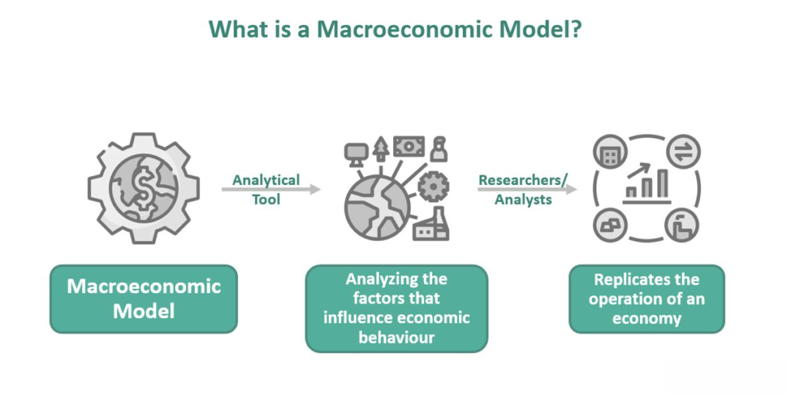

The intersection of finance, macroeconomics, and algorithmic trading plays a pivotal role in contemporary economic analysis and market strategies. As globalization and digitalization advance, understanding these elements becomes crucial for stakeholders ranging from policymakers to individual traders. This article aims to highlight the distinctions between finance and macroeconomics and their respective impacts on algorithmic trading strategies.

Finance and macroeconomics operate within distinct paradigms, each contributing unique insights into market behavior and economic trends. Finance primarily deals with the study and management of money, investments, and financial systems, often focusing on individual markets or sectors. It encompasses the behavior of financial instruments, institutions, and the valuation of assets and liabilities. In contrast, macroeconomics addresses broader economic phenomena such as inflation, national productivity, and collective economic growth, providing a comprehensive view of economies as interconnected entities. This juxtaposition between specific market focus and national economic oversight forms the foundation for the strategic deployment of algorithmic trading.



Algorithmic trading leverages financial theories and macroeconomic data to enhance the precision and execution speed of trades. At its core, it involves using pre-programmed instructions and computerized models to carry out high-frequency trades, analyzing vast datasets to identify optimal trading opportunities. The integration of finance and macroeconomic insights into these algorithms not only facilitates more efficient market participation but also aids in predicting future economic conditions and mitigating associated risks.

This article will explore how dissecting these components can transform economic knowledge into actionable trading strategies. By understanding the complex interactions between finance, macroeconomics, and algorithmic trading, stakeholders can optimize trading outcomes and better anticipate market movements. Through this examination, readers will gain insights into harnessing economic principles for enhanced decision-making in an increasingly dynamic and interconnected financial landscape.

## Table of Contents

## Defining Macroeconomics and Finance

Macroeconomics and finance represent two distinct spheres of economic study, each focusing on different aspects of the vast economic tapestry. Macroeconomics addresses large-scale economic phenomena, emphasizing variables and trends that affect entire economies. This discipline centers on key indicators such as national productivity, inflation, gross domestic product (GDP), unemployment rates, and overall economic growth. Macroeconomists examine how fiscal policies, monetary policies, and global economic changes impact these broad indicators, ultimately influencing a nation's economic health. One central goal of macroeconomics is to develop models that can predict and explain economic fluctuations and guide policy-making to stabilize and improve economic performance.

Conversely, finance is concerned with the creation, management, and study of money and investments, typically at a more granular level. It encompasses areas including personal finance, corporate finance, and public finance, focusing on how individuals, businesses, and governments manage their financial resources. Financial practitioners assess investment opportunities, manage risks, and optimize the allocation of resources to maximize return on investment. Within this field, principles such as the time value of money, risk-return tradeoffs, and capital budgeting play critical roles in financial decision-making processes.

Understanding the distinction between macroeconomics and finance is crucial for the formulation of effective economic policies and strategies. While macroeconomics provides a broad perspective on economic trends and policies that can shape financial markets, finance offers the tools and methodologies for analyzing specific investments and financial decisions. Together, they form a comprehensive framework for understanding economic dynamics and guiding decision-making at both the policy level and within financial markets. By integrating insights from both fields, policymakers and financial professionals can better navigate complex economic environments, leading to more effective and sustainable economic outcomes.

## Critical Differences Between Macroeconomics and Finance

Macroeconomics and finance are two disciplines that, while related, serve distinctly different functions in the examination and interpretation of economic data. Both fields are integral to understanding the broader economic landscape, yet they operate at different scales and focus on different dimensions of economic phenomena.

**Scope and Applications of Macroeconomics vs. Finance**

Macroeconomics encompasses large-scale economic activities and serves as a framework for analyzing aggregate indicators such as GDP, inflation rates, and national income. It provides insights into economic cycles, unemployment, and the overall health of an economy. Key questions addressed by macroeconomics include how national productivity impacts living standards and how policy decisions influence economic stability. For instance, fiscal and monetary policies are formulated based on macroeconomic theories to control inflation and stimulate economic growth.

Finance, on the other hand, is concerned with the management of money, investments, and financial instruments. It operates on a micro scale, scrutinizing the mechanics of markets and the behavior of entities within those markets, including individuals, corporations, and governments. Topics within finance include asset allocation, risk management, and the valuation of securities. Unlike macroeconomics, finance deals directly with numerical and quantitative analysis through models such as the Capital Asset Pricing Model (CAPM) or Black-Scholes for options pricing, which provide precise predictions and valuations.

**Macroeconomics Covers Economies as a Whole; Finance Focuses on Specific Markets**

While macroeconomics provides the bird’s eye view of economies, focusing on how policy and global events affect economic health, finance zeros in on particular markets and investments. Consider the impact of an [interest rate](/wiki/interest-rate-trading-strategies) change: a macroeconomic perspective would examine its influence on national savings and spending. Conversely, a financial perspective would consider the alteration in the bond market and its subsequent influence on portfolio management.

**Distinct but Complementary Roles**

Both fields are essential for robust economic policymaking and health. Macroeconomics informs central banks and governments on structuring policies that guide economic growth and stability. For instance, understanding inflation and unemployment interdependencies helps in formulating effective monetary policies. Finance complements this by optimizing resource allocation, thereby ensuring that financial resources are utilized efficiently in alignment with macroeconomic goals.

Finance adapts to the macroeconomic backdrop by interpreting data to mitigate risks and enhance returns. This symbiotic relationship provides a comprehensive outlook on both macroeconomic conditions for policymakers and microeconomic data analysis for investors and financial managers. The interplay between these fields is therefore crucial; macroeconomic stability provides the environment necessary for financial markets to operate effectively, while efficient financial markets can contribute to economic growth by ensuring optimal capital allocation.

In conclusion, macroeconomics and finance, though operating at different scales, are interdependent. Macroeconomics offers the contextual understanding of cyclical and structural economic phenomena, whereas finance provides the tools for quantitative analysis and decision-making within that context. Their integration is vital to grasping the full picture of economic dynamics and making informed economic decisions.

## Algorithmic Trading: A Financial Revolution

Algorithmic trading represents a transformative advancement in financial markets, harnessing the power of computer algorithms to facilitate the swift execution of trades. This technological innovation is rooted in the ability to process vast datasets and execute orders at speeds unattainable by human traders. Economic insights, derived from both macroeconomics and finance, significantly influence the construction and function of these trading algorithms.

At the core of [algorithmic trading](/wiki/algorithmic-trading) lies the application of sophisticated algorithms that can capitalize on minuscule price movements across different markets. These algorithms are designed using data-driven models that integrate various economic indicators. From a financial perspective, algorithms incorporate real-time data such as interest rates, stock quotes, and trade volumes, allowing for instantaneous analysis and execution. Financial models quantify relationships between these variables, optimizing buy and sell decisions based on existing market conditions.

Macroeconomic insights play a strategic role in shaping algorithmic trading algorithms. By incorporating macroeconomic indicators like GDP growth, inflation rates, and fiscal policies, algorithms can adjust trading strategies to accommodate broader economic trends. For instance, during periods of economic expansion, algorithms might weight trades favorably towards growth sectors, while during recessionary periods, they may tilt towards more stable investment assets. This adaptability is essential for managing risk and ensuring favorable outcomes across different market cycles.

The benefits of algorithmic trading are numerous, prominently featuring enhanced efficiency and speed. Algorithms can perform complex calculations and execute large volumes of trades in milliseconds, minimizing human error and emotional biases. This capability is especially advantageous in high-frequency trading ([HFT](/wiki/high-frequency-trading-strategies)), where the profit margins are often defined by the rapidity of execution.

Moreover, algorithmic trading systems are adept at analyzing extensive datasets. Leveraging techniques such as [machine learning](/wiki/machine-learning) and statistical analysis, these systems can uncover patterns and predict market movements with greater accuracy than traditional methods. The ability to process and react to developments in near real-time positions algorithmic traders to exploit fleeting market inefficiencies that are invisible to the naked eye.

Algorithmic trading's reliance on quantitative models means technical proficiency in programming is essential for its implementation. Python, with its powerful libraries like Pandas, NumPy, and scikit-learn, is frequently used for developing these models. Here is a simple example of a moving average crossover strategy implemented in Python:

```python
import pandas as pd

# Assuming 'data' is a DataFrame with 'Date' and 'Close' prices
data['SMA_50'] = data['Close'].rolling(window=50).mean()
data['SMA_200'] = data['Close'].rolling(window=200).mean()

# Generating signals
data['Signal'] = 0
data.loc[data['SMA_50'] > data['SMA_200'], 'Signal'] = 1  # Buy signal
data.loc[data['SMA_50'] < data['SMA_200'], 'Signal'] = -1  # Sell signal

# Trade positions
data['Position'] = data['Signal'].diff()
```

Overall, algorithmic trading has redefined financial markets, promoting more sophisticated trading strategies through the integration of economic insights, financial data, and technological innovation. Its continued evolution enhances market [liquidity](/wiki/liquidity-risk-premium), reduces transaction costs, and provides traders with cutting-edge tools to navigate the complexities of modern financial landscapes.

## Finance in Algorithmic Trading

Finance plays a pivotal role in the development and implementation of algorithmic trading strategies. The core principles of financial markets are translated into algorithms to facilitate automated decision-making processes, thereby enhancing trading efficiency and accuracy.

Financial data serves as the backbone of algorithmic trading models. Interest rates, for instance, are crucial for determining the cost of borrowing and the potential return on investments. Traders use interest rate data to gauge market sentiment and adjust their trading strategies accordingly. For example, a rise in interest rates might lead to a decrease in stock valuations, prompting sell signals in an algorithmic trading model. Conversely, a reduction in interest rates could stimulate buy signals as borrowing becomes cheaper and investment prospects improve.

Stock valuations also play an integral role in algorithmic trading. Algorithms assess market trends and historical data to derive stock price predictions and identify potential buy or sell opportunities. Techniques such as moving averages, regression analysis, and machine learning models like support vector machines or neural networks are often used to analyze and predict stock price movements.

Beyond individual financial data points, the influence of personal, corporate, and public finance on trading algorithms cannot be overstated. Personal finance affects consumer behavior and, consequently, market dynamics. Consumer spending and saving patterns, influenced by factors such as disposable income and consumer confidence, can be captured through datasets and integrated into trading algorithms to anticipate shifts in market demand.

Corporate finance considerations, such as company earnings, capital structure, and cash flow management, feed directly into algorithmic models that evaluate stock performance. Automated trading systems analyze quarterly earnings reports and other financial disclosures to adjust predictions on stock movements. For example, positive earnings surprises might trigger buy orders, while disappointing earnings results could prompt sell decisions.

Public finance, particularly government fiscal policies, tax rates, and government borrowing, can have significant implications for financial markets and trading activities. Fiscal stimuli, such as tax cuts or increased government spending, can drive economic growth and increase market liquidity, creating trading opportunities that algorithms can exploit. Similarly, changes in tax policies might affect corporate profitability and consumer spending, elements that algorithms can account for when recalibrating trading strategies.

Algorithmic trading leverages these financial components by incorporating complex mathematical models and coding practices. Below is a basic Python example demonstrating a simple trading algorithm based on moving averages:

```python
import pandas as pd
import numpy as np

# Load historical stock data
data = pd.read_csv('stock_data.csv')
data['MA50'] = data['Close'].rolling(window=50).mean()
data['MA200'] = data['Close'].rolling(window=200).mean()

# Generating trading signals
data['Signal'] = 0
data.loc[data['MA50'] > data['MA200'], 'Signal'] = 1
data.loc[data['MA50'] < data['MA200'], 'Signal'] = -1

# Generate buy/sell orders
data['Position'] = data['Signal'].diff()

# Print resulting dataframe with positions
print(data[['Close', 'MA50', 'MA200', 'Signal', 'Position']].tail())
```

This algorithm calculates the 50-day and 200-day moving averages of a stock's closing price and generates buy and sell signals based on their crossover points. A buy signal is issued when the 50-day moving average surpasses the 200-day moving average, while a sell signal is emitted when the opposite occurs. This simplistic model showcases how key financial indicators gleaned from market data are encapsulated in algorithmic formats, thereby automating the trading process.

## Macroeconomics in Algorithmic Trading

Macroeconomic indicators such as GDP growth, unemployment rates, and fiscal policies are fundamental elements that significantly influence long-term trading strategies within algorithmic trading. Algorithms leverage these indicators to make informed decisions, adapting to economic cycles and optimizing risk management and investment strategies to forecast market trends.

The Gross Domestic Product (GDP) is a critical measure of a country's economic performance, representing the total value of goods and services produced over a specific time period. Trading algorithms use GDP data to gauge overall economic health and potential growth opportunities. A nation with accelerating GDP growth suggests a strong economy, likely leading to higher corporate profits and stock market gains. Conversely, stagnant or declining GDP might signal economic issues, affecting market stability and potential investment risks.

Unemployment rates offer insights into labor market health, which impacts consumer spending and business confidence. High unemployment often indicates weaker economic conditions, potentially leading to reduced consumer expenditure and lower stock market performance. Conversely, low unemployment suggests robust economic activity, encouraging trading algorithms to adopt more aggressive investment strategies due to increased consumer spending potential.

Fiscal policies, encompassing government spending and taxation, also play a vital role in shaping algorithmic trading strategies. Expansionary fiscal policies, such as tax cuts and increased public expenditure, can stimulate economic growth, prompting algorithms to anticipate upward market movements. On the other hand, contractionary policies may suppress growth, prompting more conservative trading positions to mitigate risk.

Algorithmic trading systems are designed to adapt to these economic cycles by incorporating models that evaluate macroeconomic indicators dynamically. These systems use statistical methods and machine learning to understand trends and patterns, enabling them to adjust strategies based on current economic data. For instance, algorithms might decrease exposure to equities during an economic downturn while increasing it as recovery signs appear.

Python, a widely-used programming language in algorithmic trading, facilitates the integration of macroeconomic trends through libraries such as pandas and scikit-learn. Below is a simple demonstration of how Python can be used to analyze macroeconomic data in the context of trading strategies:

```python
import pandas as pd
from sklearn.linear_model import LinearRegression

# Example GDP and stock market data
data = {'GDP Growth': [2.5, 2.8, 2.6, 1.9, 3.1],
        'Market Return': [5.2, 5.8, 5.5, 4.0, 6.2]}

df = pd.DataFrame(data)

# Linear regression model to predict market return based on GDP growth
X = df[['GDP Growth']]
y = df['Market Return']

model = LinearRegression()
model.fit(X, y)

# Predicting market return for a GDP growth of 2.7%
predicted_return = model.predict([[2.7]])
print(f"Predicted Market Return: {predicted_return[0]:.2f}%")
```

This simple model illustrates how GDP growth can be used to predict potential market returns, serving as a foundational tool for constructing more complex trading algorithms that account for multiple macroeconomic indicators.

Integrating macroeconomic trends into trading algorithms provides a robust mechanism for anticipating market shifts and adjusting accordingly. This adaptive strategy enhances the capability of algorithms to make informed investment decisions, optimizing returns while mitigating risks associated with economic fluctuations.

## Conclusion

The integration of finance and macroeconomics within algorithmic trading represents a sophisticated interplay essential for optimizing trading strategies. Finance, with its focus on specific markets, provides the foundational data and methods necessary for designing algorithms capable of reacting swiftly to market changes. Key financial indicators like interest rates, stock valuations, and historical price data serve as catalysts for algorithmic models, facilitating instant decisions that aim to maximize returns and minimize risks.

On the other hand, macroeconomics offers a broader perspective, equipping traders with insights into national and global economic conditions that can affect markets over the long term. By analyzing macroeconomic indicators such as GDP growth, unemployment rates, and fiscal policies, trading algorithms can incorporate predictive analytics and adapt to economic cycles, improving risk management and investment strategies.

For traders to enhance the efficacy of algorithmic trading systems, a comprehensive understanding of both finance and macroeconomics is crucial. Analyzing how these fields converge allows for more robust forecasting models that can anticipate market shifts and adjust strategies accordingly. This understanding enables algorithms to process and analyze vast datasets, yielding insights that would be challenging to obtain manually.

Looking towards future trends, economic analysis and algorithmic trading are poised for further technological advancements. The emergence of [artificial intelligence](/wiki/ai-artificial-intelligence) and machine learning will enable even more sophisticated models, enhancing the precision of economic forecasts and investment strategies. Additionally, the increasing availability of big data will empower algorithms to perform deeper analyses, refine their predictions, and respond more effectively to market dynamics. As traders and economists continue to harness these innovations, the integration of finance and macroeconomics will play a pivotal role in shaping the next generation of trading strategies.

## References & Further Reading

### Books
1. **"Principles of Economics" by N. Gregory Mankiw**  
   A fundamental text for understanding economic principles, including macroeconomic theories essential for algorithmic trading.

2. **"Algorithmic Trading: Winning Strategies and Their Rationale" by Ernie Chan**  
   Offers insights into developing and evaluating algorithmic trading strategies, combining principles of finance and data analysis.

3. **"Macroeconomics" by Paul Krugman and Robin Wells**  
   Provides a comprehensive overview of macroeconomic concepts, essential for understanding the larger economic forces influencing trading algorithms.

### Articles and Papers
1. **"High-frequency Trading and Market Dynamics" by Albert J. Menkveld**  
   Explores the impact of high-frequency trading on financial markets, highlighting the interaction between finance and macroeconomic factors.

2. **"The Role of Macroeconomic Variables in Stock Market Predictions: A Survey"**  
   Surveys the impact of various macroeconomic indicators on stock market predictions, addressing algorithms' reliance on economic data.

3. **"The Efficient Market Hypothesis and Its Critics: A Survey" by Burton G. Malkiel**  
   Discusses varying perspectives on market efficiency critical to formulating algorithmic trading strategies based on financial data.

### Online Courses and Tools
1. **Coursera - "Financial Markets" by Yale University**  
   Offers a deep dive into the foundations of financial markets, essential for understanding the inputs to algorithmic trading systems.

2. **edX - "Macroeconomics for a Sustainable Planet" by the University of California, Berkeley**  
   Focuses on macroeconomic policies with sustainability in mind, providing insights useful for long-term trading models.

3. **Kaggle Datasets and Python Notebooks**  
   A rich resource for practicing data analysis and building trading algorithms with real-world financial and economic data.

4. **QuantConnect – Free Algorithm Backtesting**  
   A platform for algorithmic trading at your fingertips, allowing [backtesting](/wiki/backtesting) on historical financial data to refine trading strategies. 

These resources collectively provide a robust foundation for anyone interested in understanding the intricate dynamics of finance, macroeconomics, and their application to algorithmic trading strategies.

