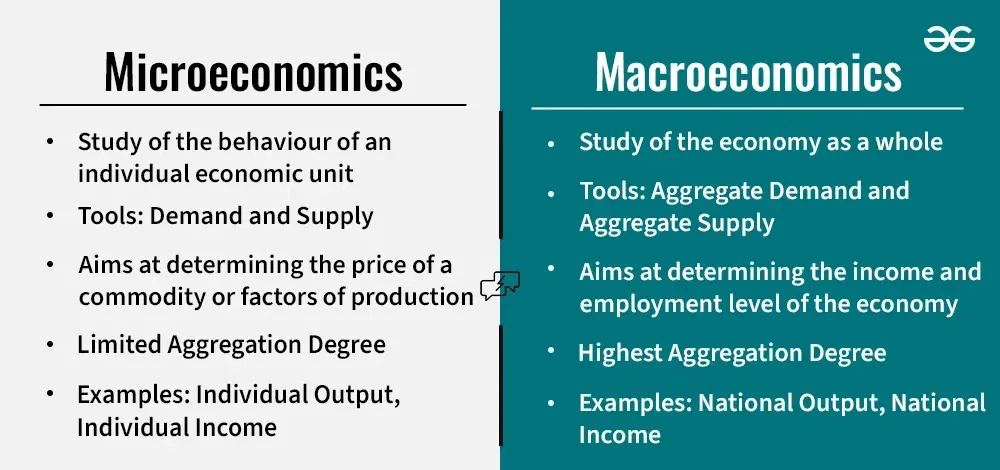

## Table of Contents

## What is macroeconomics?

Macroeconomics is a branch of economics that looks at the big picture of a country's economy. It focuses on things like total production, employment levels, and the overall price levels. Instead of looking at individual businesses or people, macroeconomics tries to understand how the whole economy works together. This helps governments and policymakers make decisions that can help the economy grow and keep people employed.

One of the main things macroeconomists study is the Gross Domestic Product (GDP), which measures the total value of all goods and services produced in a country. They also look at inflation, which is the rate at which prices for goods and services rise, and unemployment, which is the number of people who want to work but can't find a job. By understanding these factors, macroeconomists can suggest policies to control inflation, reduce unemployment, and promote economic stability.

Macroeconomics also deals with international trade and how it affects a country's economy. This includes looking at exchange rates, which are the values of one country's currency compared to another's, and trade balances, which show whether a country is exporting more than it imports or vice versa. Understanding these elements helps countries navigate the global market and make informed decisions about trade policies and economic strategies.

## What is finance?

Finance is all about managing money. It involves activities like saving, investing, borrowing, and spending. People, businesses, and governments all use finance to make sure they have enough money to do what they need to do. For example, a person might use finance to plan for retirement, while a business might use it to decide whether to buy new equipment.

Finance also includes studying how money moves around in the economy. This can help people understand things like interest rates, which is the cost of borrowing money, and stock markets, where people buy and sell shares of companies. By understanding finance, people can make better decisions about their money, like whether to save it in a bank or invest it in stocks.

## How do macroeconomics and finance differ in their primary focus?

Macroeconomics and finance both deal with money, but they look at it in different ways. Macroeconomics focuses on the whole economy of a country. It looks at big things like how much the country produces, how many people have jobs, and how prices change over time. Macroeconomists study things like GDP, inflation, and unemployment to understand how the economy works and to help make policies that keep it healthy.

Finance, on the other hand, is more about managing money for individuals, businesses, and governments. It's about making decisions like where to save money, whether to invest in stocks or bonds, and how to borrow money. Finance helps people figure out how to use their money wisely to meet their goals, like buying a house or starting a business. While macroeconomics looks at the big picture of the economy, finance focuses on the smaller, day-to-day decisions people make with their money.

## Can you explain the scope of macroeconomics versus finance?

Macroeconomics looks at the whole economy of a country. It's like taking a step back and seeing the big picture. Macroeconomists study things like how much stuff the country makes, how many people have jobs, and if prices are going up or down. They use big numbers like GDP to see if the economy is growing or shrinking. They also look at things like inflation, which is when prices go up, and unemployment, which is when people can't find jobs. By understanding these big things, macroeconomists can help the government make rules and policies to keep the economy healthy.

Finance, on the other hand, is all about managing money for individuals, businesses, and governments. It's more focused on the smaller, everyday decisions people make with their money. For example, finance helps people decide if they should save their money in a bank, invest it in stocks, or borrow money to buy a house. It's about figuring out how to use money wisely to reach goals like retiring comfortably or growing a business. While macroeconomics looks at the big picture of the whole economy, finance is more about the nitty-gritty of handling money day to day.

## What are the main tools used in macroeconomics?

Macroeconomists use a bunch of tools to understand and study the big picture of an economy. One of the main tools is Gross Domestic Product (GDP), which measures how much stuff a country makes in a year. It tells us if the economy is growing or shrinking. Another important tool is the unemployment rate, which shows how many people want to work but can't find a job. Macroeconomists also look at inflation, which is when prices go up. They use something called the Consumer Price Index (CPI) to measure it. These tools help them see if the economy is doing well or if it needs help.

Another set of tools macroeconomists use are economic models. These are like big math equations that help them predict what might happen in the economy. For example, the IS-LM model helps them understand how interest rates and spending affect the economy. Macroeconomists also use fiscal policy, which is when the government spends money or changes taxes to help the economy, and monetary policy, which is when the central bank changes interest rates to control inflation and growth. By using all these tools together, macroeconomists can give advice on how to keep the economy running smoothly.

## What are the key instruments in finance?

Finance uses different tools to help people, businesses, and governments manage their money. One important tool is a bank account, where people can save money and earn a little bit of interest. Another tool is a loan, which lets people borrow money to buy things like a house or a car. They have to pay back the loan with interest over time. Stocks and bonds are also key tools in finance. When people buy stocks, they own a little piece of a company and can make money if the company does well. Bonds are like loans to the government or a company, and they pay back the money with interest.

Another set of tools in finance are insurance and mutual funds. Insurance helps people protect themselves from big risks, like if their house burns down or if they get sick. They pay a small amount of money regularly, and the insurance company helps them if something bad happens. Mutual funds let people invest in a bunch of different stocks or bonds at once, which can be safer than putting all their money in one place. These tools help people manage their money better and reach their financial goals.

## How do macroeconomic policies influence financial markets?

Macroeconomic policies, like those set by the government or central bank, can really affect financial markets. When the government changes how much it spends or adjusts taxes, it's called fiscal policy. If the government spends more money, it can make the economy grow faster. This might make people feel more confident and want to invest in stocks or bonds. But if the government raises taxes, people might have less money to spend or invest, which could make stock prices go down.

Monetary policy, which is set by the central bank, also has a big impact on financial markets. When the central bank changes interest rates, it can influence how much people borrow and spend. If interest rates go down, borrowing money becomes cheaper, and people might take out more loans to buy things like houses or cars. This can make the stock market go up because companies sell more stuff. But if interest rates go up, borrowing gets more expensive, and people might spend less, which could make stock prices fall. So, both fiscal and monetary policies play a big role in how financial markets move.

## In what ways can financial decisions impact the macroeconomy?

Financial decisions made by people, businesses, and governments can really affect the whole economy. When people decide to save more money instead of spending it, it can slow down the economy. This is because businesses sell less stuff, and they might have to lay off workers. On the other hand, if people decide to borrow and spend more, it can help the economy grow. Businesses sell more, they hire more workers, and everyone feels more confident about the future.

Businesses also make financial decisions that impact the macroeconomy. When a company decides to invest in new equipment or start a new project, it can create jobs and boost economic growth. But if businesses are worried about the future and decide to cut back on spending, it can lead to less economic activity and higher unemployment. Governments play a big role too. If they decide to spend more on things like roads and schools, it can stimulate the economy. But if they raise taxes or cut spending, it might slow things down. So, all these financial choices add up to shape how the whole economy performs.

## What are some common career paths in macroeconomics and finance?

In macroeconomics, people often work as economists for the government or in think tanks. They study big things like how much a country produces, how many people have jobs, and if prices are going up or down. They use this information to help the government make rules and policies that keep the economy healthy. Some macroeconomists also work at big banks or international organizations like the World Bank, where they help make decisions about the world's economy. It's a job that involves a lot of research and using numbers to understand the big picture of how the economy works.

In finance, there are lots of different jobs people can do. One common path is to become a financial analyst, where you help companies or people figure out where to invest their money. Financial analysts look at things like stocks, bonds, and other investments to see if they're a good choice. Another path is to work as a financial advisor, helping people plan for things like retirement or buying a house. People in finance might also work as bankers, helping customers with loans and savings, or as traders, buying and selling things like stocks to make money. These jobs all involve working with money and helping people make smart financial decisions.

## How do macroeconomic indicators affect financial planning and investment strategies?

Macroeconomic indicators like GDP, inflation, and unemployment rates give us clues about how the whole economy is doing. When these numbers are good, it means the economy is growing, and people are spending more money. This can make investors feel confident, and they might decide to put more money into stocks or other investments. On the other hand, if the indicators show that the economy is slowing down, investors might get worried. They could decide to move their money into safer places, like bonds or savings accounts, to protect it.

These indicators also help people plan their finances better. For example, if inflation is high, the cost of things like food and gas goes up. People might need to save more money to keep up with these rising prices. If unemployment is low, it's easier to find a job, and people might feel more secure about spending or investing. By keeping an eye on these big economic numbers, people can make smarter choices about saving, spending, and investing their money to reach their financial goals.

## What are the advanced theories in macroeconomics that are relevant to finance?

One important theory in macroeconomics that's relevant to finance is the Efficient Market Hypothesis (EMH). This theory says that all the information about a company is already included in its stock price. So, it's hard to beat the market by trying to find undervalued stocks because the market is always adjusting to new information. This idea affects how people invest their money. If you believe in EMH, you might choose to invest in a broad range of stocks through something like an index fund, rather than trying to pick individual stocks.

Another theory is the Modern Monetary Theory (MMT). MMT says that countries that have their own currency can't really go broke because they can always print more money. This theory affects how governments spend and borrow money. If you believe in MMT, you might support the government spending more money to help the economy, even if it means running a bigger budget deficit. This can influence financial markets because more government spending can lead to more economic growth, which can be good for investments.

Lastly, the theory of Rational Expectations is also important. It says that people make predictions about the future based on all the information they have, and these predictions affect how they spend and invest their money. For example, if people expect inflation to go up, they might ask for higher wages or invest in things that will protect their money from losing value. This theory helps explain how people's beliefs about the economy can shape financial markets and influence their investment strategies.

## How do global economic trends influence both macroeconomics and finance?

Global economic trends can have a big impact on macroeconomics. When countries around the world are doing well, it can help a country's economy grow faster. For example, if other countries are buying more stuff from a country, it can make that country's GDP go up. But if there's a global economic slowdown, like during a recession, it can hurt a country's economy. This might mean less trade, higher unemployment, and slower growth. Macroeconomists look at these global trends to understand how they might affect their own country's economy and to help make policies that can protect it.

These global trends also affect finance. When the world economy is doing well, people and businesses might feel more confident about investing in stocks or starting new projects. This can make stock markets go up and help companies grow. But if the global economy is struggling, people might pull their money out of risky investments and put it into safer places like savings accounts or bonds. This can make stock prices fall and make it harder for businesses to borrow money. So, understanding global economic trends is important for making smart financial decisions and planning for the future.

## References & Further Reading

### Books
1. **"Principles of Economics" by N. Gregory Mankiw**  
   A fundamental text for understanding economic principles, including macroeconomic theories essential for [algorithmic trading](/wiki/algorithmic-trading).

2. **"Algorithmic Trading: Winning Strategies and Their Rationale" by Ernie Chan**  
   Offers insights into developing and evaluating algorithmic trading strategies, combining principles of finance and data analysis.

3. **"Macroeconomics" by Paul Krugman and Robin Wells**  
   Provides a comprehensive overview of macroeconomic concepts, essential for understanding the larger economic forces influencing trading algorithms.

### Articles and Papers
1. **"High-frequency Trading and Market Dynamics" by Albert J. Menkveld**  
   Explores the impact of high-frequency trading on financial markets, highlighting the interaction between finance and macroeconomic factors.

2. **"The Role of Macroeconomic Variables in Stock Market Predictions: A Survey"**  
   Surveys the impact of various macroeconomic indicators on stock market predictions, addressing algorithms' reliance on economic data.

3. **"The Efficient Market Hypothesis and Its Critics: A Survey" by Burton G. Malkiel**  
   Discusses varying perspectives on market efficiency critical to formulating algorithmic trading strategies based on financial data.

### Online Courses and Tools
1. **Coursera - "Financial Markets" by Yale University**  
   Offers a deep dive into the foundations of financial markets, essential for understanding the inputs to algorithmic trading systems.

2. **edX - "Macroeconomics for a Sustainable Planet" by the University of California, Berkeley**  
   Focuses on macroeconomic policies with sustainability in mind, providing insights useful for long-term trading models.

3. **Kaggle Datasets and Python Notebooks**  
   A rich resource for practicing data analysis and building trading algorithms with real-world financial and economic data.

4. **QuantConnect – Free Algorithm Backtesting**  
   A platform for algorithmic trading at your fingertips, allowing [backtesting](/wiki/backtesting) on historical financial data to refine trading strategies. 

These resources collectively provide a robust foundation for anyone interested in understanding the intricate dynamics of finance, macroeconomics, and their application to algorithmic trading strategies.

