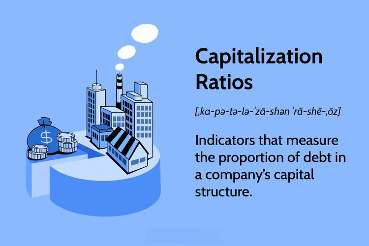

The modern financial landscape is characterized by rapid advancements and innovations, significantly influencing how markets operate and investors engage with them. Three pivotal elements in this evolving scenario are algorithmic trading, revenue financial metrics, and market capitalization. These components profoundly impact how companies are evaluated and traded, serving as essential tools for investors and financial analysts.

Revenue and market capitalization are fundamental to understanding a company's financial standing. Revenue, often referred to as the top line, measures the total income generated from business operations. It provides crucial insight into a company's ability to generate sales and sustain its business model. On the other hand, market capitalization, or market cap, signifies the total market value of a company's outstanding shares. Calculated by multiplying the current share price by the total number of outstanding shares, it reflects the public perception of a company's worth in the market.



Algorithmic trading has become a dominant force in modern trading environments. Utilizing pre-set algorithms and high-frequency trading techniques, it executes trades at speeds impossible for human traders. The integration of complex mathematical models enables traders to capitalize on market inefficiencies and optimize investment returns. However, while algorithmic trading enhances market efficiency, it adds layers of complexity regarding analyzing market metrics, particularly those related to market cap and revenue.

For investors aiming to navigate the intricate dynamics of contemporary markets, understanding these components is paramount. Algorithmic trading offers substantial advantages by increasing trade execution speed and efficiency. However, it also presents challenges, particularly concerning risk management and the accurate interpretation of market-related metrics such as revenue and market capitalization.

This article provides an in-depth examination of these elements, highlighting their significance in the investment landscape. By exploring the utility and implications of financial metrics and algorithmic trading, we offer insights crucial for making informed investment decisions. Conclusively, while these components are interdependent, they collectively shape investment strategies, demanding a nuanced understanding to optimize returns and minimize risks in a rapidly changing market environment.

## Table of Contents

## Understanding Financial Metrics: Revenue and Market Capitalization

Revenue and market capitalization are two fundamental financial metrics used to assess a company's value and potential for investment. Understanding these concepts is critical for investors seeking to evaluate a company's financial health and market position.

Market capitalization, commonly referred to as market cap, is calculated by multiplying the current share price by the total number of outstanding shares. It serves as an indicator of the company's total market value and provides insight into the size and stability of a company within the marketplace. For instance, large market cap companies are often seen as safer investments due to their established presence, whereas small cap companies may offer higher growth potential but come with increased risk. The formula for market capitalization is expressed as:

$$
\text{Market Capitalization} = \text{Share Price} \times \text{Total Outstanding Shares}
$$

Revenue, often known as the top line, represents the total income a company generates from its primary business activities without deducting any expenses. It is an essential measure that shows a company's ability to generate sales and grow over time. High revenue growth can be indicative of a company's successful product or service offering and its market penetration. Revenue is particularly significant when assessing the potential for future profitability and scaling operations. 

While market capitalization provides a snapshot of market value, revenue offers a glimpse into a company’s operational success and efficiency. The two metrics, though often confused, serve distinct roles—market cap reflects investor sentiment and valuation, whereas revenue provides tangible evidence of a company's business performance. These metrics together can reveal a company's standing and potential when analyzed in conjunction. For instance, a company with a high market cap but low revenue might be overvalued unless future growth justifies its valuation. Conversely, a company with strong revenue growth may not be reflected in its market cap, pinpointing a potential investment opportunity.

In summary, evaluating both market capitalization and revenue allows investors to gain a comprehensive understanding of a company's financial condition and its potential trajectory within the industry. Analyzing these metrics in detail provides valuable insights into operational efficiency and company performance, serving as a cornerstone for informed investment decisions.

## Difference Between Revenue and Market Capitalization

Market capitalization and revenue are distinct financial metrics that serve different purposes in assessing a company's financial standing. Market capitalization, or market cap, represents the total market value of a company's outstanding shares and is calculated by multiplying the current share price by the number of outstanding shares. This metric is commonly used to gauge the size of a company within the market context.

$$
\text{Market Capitalization} = \text{Share Price} \times \text{Outstanding Shares}
$$

Conversely, revenue refers to the total amount of money a company generates from its standard business operations, often described as the "top line" of the income statement. Revenue metrics provide insight into a company’s ability to generate sales and income through its products or services.

The differentiation between market cap and revenue is crucial. Market cap provides an overview of a company's relative size and market value, while revenue highlights the company’s operational performance and ability to produce income. For instance, a company might possess a high market cap due to strong investor sentiment or future growth potential, despite having lower revenue figures. This scenario could indicate that investors are factoring in potential growth and profitability that is not yet reflected in current revenues.

Conversely, a company could demonstrate substantial revenue with a relatively low market cap, possibly indicating undervaluation or market skepticism regarding future growth potential. This disparity in metrics suggests diverse market conditions or business strategies.

For investors, examining these distinctions is vital. It allows them to assess whether a company's market valuation is justified by its revenue-generating capabilities. By doing so, they can make informed decisions about the company's potential for continued growth and profitability. Comparing these metrics can reveal whether the market's valuation of the company aligns with its current and projected revenue streams, aiding investors in identifying investment opportunities or risks.

## Algorithmic Trading and Its Impact on Market Metrics

Algorithmic trading is a transformative tool in contemporary finance, distinguished by its reliance on high-frequency trading ([HFT](/wiki/high-frequency-trading-strategies)) and pre-programmed instructions. This sophisticated approach allows for the execution of trades at speeds and frequencies far beyond the capability of human traders. At the heart of [algorithmic trading](/wiki/algorithmic-trading) are mathematical models and complex algorithms designed to identify lucrative trading opportunities and execute trades automatically. This process relies on an extensive analysis of market data, from price movements and trading volumes to historical charts and real-time information.

The integration of algorithmic trading has notably enhanced market efficiency. By automating trades, it eliminates the delay associated with human decision-making, ensuring optimal execution and price improvements. Consequently, it has reduced the bid-ask spreads, thereby improving [liquidity](/wiki/liquidity-risk-premium) and decreasing transaction costs for investors. However, this increased efficiency comes with complexities in market metrics analysis. The automated and rapid nature of algorithmic trading can lead to significant fluctuations in market prices, often in milli- or microseconds, complicating the analysis of stock prices and market trends.

The impact of algorithmic trading on a company's stock price and market capitalization cannot be overstated. As algos react to news, earnings reports, and other market-moving events, they can drive significant price swings. Such movements, while often short-lived, can influence a company's market cap, especially if algo trading constitutes a significant portion of market activity.

A crucial aspect of algorithmic trading is balancing efficiency with risk management. Efficient trading operations aim to maximize returns by exploiting small price inefficiencies across different exchanges. Yet, the risks, including the potential for triggering flash crashes or exacerbating market [volatility](/wiki/volatility-trading-strategies), require robust management strategies. Continuous monitoring and dynamic adjustment of algorithms are vital to mitigating these risks. Key risk-management techniques involve placing constraints on trading frequencies, implementing stop-loss orders, and using circuit breakers to prevent runaway price changes.

In summary, while algorithmic trading represents a major advancement in trading operations, its impact on market metrics necessitates careful consideration. The challenge lies in leveraging its benefits—speed, efficiency, and precision—while ensuring that the underlying risks are contained to preserve market stability and integrity.

## Evaluating Algorithmic Trading Strategies

Performance evaluation in algorithmic trading strategies is crucial for optimizing return on investment and managing risk. The following key metrics are frequently used to assess the efficacy of these strategies: Sharpe Ratio, Maximum Drawdown, Win Rate, and Profit Factor.

**Sharpe Ratio**

The Sharpe Ratio is a measure of risk-adjusted return. It is calculated by subtracting the risk-free rate from the strategy's return, then dividing the result by the standard deviation of the strategy's excess return. Formally:

$$

\text{Sharpe Ratio} = \frac{R - R_f}{\sigma} 
$$

where $R$ is the average return of the strategy, $R_f$ is the risk-free rate, and $\sigma$ is the standard deviation of the excess returns. A higher Sharpe Ratio indicates a more attractive risk-adjusted return.

**Maximum Drawdown**

Maximum Drawdown quantifies the greatest peak-to-trough decline in a portfolio before a new peak is achieved. It is an indicator of potential loss in the worst-case scenario and is expressed as a percentage. Calculation involves determining the largest contiguous drop from a historical equity peak to a trough.

$$

\text{Maximum Drawdown} = \frac{\text{Trough Value} - \text{Peak Value}}{\text{Peak Value}} 
$$

This metric helps investors understand the risk of significant losses during downturns.

**Win Rate**

The Win Rate metric describes the proportion of profitable trades to the total number of trades executed. It is calculated as:

$$

\text{Win Rate} = \frac{\text{Number of Winning Trades}}{\text{Total Number of Trades}} \times 100 
$$

A high win rate alone doesn't guarantee profitability, as it must be considered alongside the average profit and loss per trade.

**Profit Factor**

Profit Factor is the ratio of gross profits to gross losses. It quantifies the amount earned for each dollar lost and is expressed as:

$$

\text{Profit Factor} = \frac{\text{Total Profits}}{\text{Total Losses}} 
$$

A Profit Factor greater than 1 indicates that the strategy is profitable, while a value less than 1 suggests losses.

To maintain a competitive edge in the evolving trading landscape, investors must integrate both robust performance metrics and adaptive strategies. These strategies should respond to changing market conditions, which may involve the use of [machine learning](/wiki/machine-learning) algorithms or [artificial intelligence](/wiki/ai-artificial-intelligence) to dynamically adjust trading parameters. 

Here's a basic Python snippet to calculate these metrics using historical trading data:

```python
import numpy as np

def calculate_sharpe_ratio(returns, risk_free_rate):
    excess_returns = returns - risk_free_rate
    return np.mean(excess_returns) / np.std(excess_returns)

def calculate_maximum_drawdown(values):
    drawdowns = np.maximum.accumulate(values) - values
    return np.max(drawdowns) / np.max(np.maximum.accumulate(values))

def calculate_win_rate(trades):
    winning_trades = len([t for t in trades if t > 0])
    return (winning_trades / len(trades)) * 100

def calculate_profit_factor(profits, losses):
    total_profits = np.sum([p for p in profits if p > 0])
    total_losses = abs(np.sum([l for l in losses if l < 0]))
    return total_profits / total_losses if total_losses != 0 else np.inf

# Example usage:
returns = np.array([0.01, 0.02, -0.01, 0.04])
risk_free_rate = 0.005
trades = np.array([10, -5, 20, -10, 15])

sharpe_ratio = calculate_sharpe_ratio(returns, risk_free_rate)
max_drawdown = calculate_maximum_drawdown(trades)
win_rate = calculate_win_rate(trades)
profit_factor = calculate_profit_factor(trades, trades)

print(f"Sharpe Ratio: {sharpe_ratio}")
print(f"Maximum Drawdown: {max_drawdown}")
print(f"Win Rate: {win_rate}%")
print(f"Profit Factor: {profit_factor}")
```

By thoroughly evaluating these metrics, investors can gain deeper insights into their algorithmic trading strategies and optimize their approaches for favorable outcomes in the financial markets.

## Adoption and Challenges of Algorithmic Trading

The adoption of algorithmic trading has been significantly accelerated by advancements in artificial intelligence (AI) and machine learning technologies. These technologies enable the processing of vast amounts of data at unprecedented speeds, allowing traders to execute decisions quicker than ever before. As a result, algorithmic trading systems are capable of scanning multiple markets, analyzing various indicators, and executing trades with minimal human intervention.

However, despite its numerous benefits, algorithmic trading also faces substantial challenges. One major concern is technological risk. The reliance on complex algorithms and sophisticated technology systems introduces vulnerabilities such as system failures, connectivity issues, and software bugs. These technical glitches can lead to significant financial losses and disrupt trading operations.

Regulatory issues also present a challenge. Financial markets are highly regulated environments, and algorithmic trading must comply with numerous legal and regulatory frameworks, which vary by jurisdiction. For example, rules around market manipulation and fair trading practices require rigorous compliance efforts, often resulting in substantial administrative burdens for firms employing algorithmic strategies.

Market volatility is another critical concern. Algorithmic trading can exacerbate market fluctuations or react unexpectedly to volatile conditions. For instance, during periods of extreme market stress, automated systems might contribute to rapid price movements, known as "flash crashes," which can destabilize markets.

The lack of appropriate risk valuation tools continues to be a significant issue for traders and financial institutions. While algorithmic trading strives for precision and efficiency, accurately valuing risks associated with strategies is challenging, especially as markets evolve and algorithms become more sophisticated. This lack of effective risk management tools can deter firms from fully leveraging algorithmic systems.

Despite these challenges, the strategic deployment of algorithmic trading tools can yield substantial benefits. Notably, the cost efficiencies gained from reduced human intervention and improved execution speeds can enhance trade profitability. Moreover, by facilitating the rapid computation of complex trading strategies, these systems can allow traders to exploit market opportunities that would be inaccessible through manual trading.

Looking forward, continued innovation and regulatory development are essential. Enhancements in AI and machine learning algorithms will likely improve system robustness and adaptability to market changes, while regulatory evolution can provide clearer guidelines to ensure fair and transparent trading. Addressing technological and regulatory challenges effectively will be key to unlocking the full potential of algorithmic trading, ensuring it continues to develop as a cornerstone of modern financial markets.

## Conclusion

Understanding revenue, market capitalization, and algorithmic trading is essential for anyone looking to gain a foothold in today’s financial markets. These components are interdependent and collectively influence investment strategies and decisions. Revenue metrics reflect a company's ability to generate sales, while market capitalization provides a snapshot of its perceived market value. Together, they offer insights into a company's operational health and market standing. Algorithmic trading, with its ability to enhance speed and efficiency, is reshaping how investors perceive traditional financial metrics. By automating the trading process and executing complex strategies at high speed, algorithmic trading has transformed the landscape of investment decisions and market analysis.

A firm grasp of revenue, market capitalization, and algorithmic trading can lead to more informed decisions, maximized returns, and minimized risks. Investors who effectively integrate these components into their analysis gain a competitive edge. Proper understanding and evaluation of these elements allow for strategic investment that aligns with both market conditions and technological advancements.

As markets evolve, staying informed about these trends will be imperative for ongoing investment success. Continuous learning and adaptation are crucial as technological advancements and market regulations develop. Investors should remain vigilant, recognizing how shifts in these dynamics could impact the valuation and trading strategies. By maintaining an informed perspective, market participants can better navigate the complexities of modern financial markets and optimize their portfolios for success.

## References & Further Reading

[1]: Bergstra, J., Bardenet, R., Bengio, Y., & Kégl, B. (2011). ["Algorithms for Hyper-Parameter Optimization."](https://dl.acm.org/doi/10.5555/2986459.2986743) Advances in Neural Information Processing Systems 24.

[2]: ["Advances in Financial Machine Learning"](https://www.amazon.com/Advances-Financial-Machine-Learning-Marcos/dp/1119482089) by Marcos Lopez de Prado

[3]: ["Evidence-Based Technical Analysis: Applying the Scientific Method and Statistical Inference to Trading Signals"](https://www.amazon.com/Evidence-Based-Technical-Analysis-Scientific-Statistical/dp/0470008741) by David Aronson

[4]: ["Machine Learning for Algorithmic Trading"](https://github.com/PacktPublishing/Machine-Learning-for-Algorithmic-Trading-Second-Edition) by Stefan Jansen

[5]: ["Quantitative Trading: How to Build Your Own Algorithmic Trading Business"](https://books.google.com/books/about/Quantitative_Trading.html?id=j70yEAAAQBAJ) by Ernest P. Chan