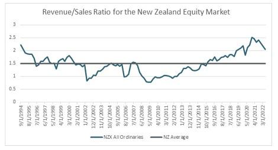

## Table of Contents

## What is market capitalization?

Market capitalization, often called market cap, is the total value of all the shares of a company. It is calculated by multiplying the current stock price by the total number of shares outstanding. This number gives investors an idea of the company's size and its value in the market. For example, if a company has 1 million shares and each share is worth $50, the market cap would be $50 million.

Market cap is important because it helps investors compare companies of different sizes. It can also show how the market views a company's future growth potential. Companies are often categorized by their market cap into groups like small-cap, mid-cap, and large-cap. Small-cap companies are usually newer or smaller businesses, while large-cap companies are well-established and bigger. Understanding market cap can help investors make better decisions about where to put their money.

## What is revenue?

Revenue is the total amount of money a company earns from its business activities, usually from selling goods or services. It's like the money coming into the company before any expenses are taken out. For example, if a bakery sells cakes and earns $1,000 in a day, that $1,000 is its revenue for that day.

Revenue is important because it shows how well a company is doing in terms of sales. It's the starting point for figuring out if a company is making a profit or not. If the revenue is higher than the costs of running the business, the company makes a profit. But if the costs are higher than the revenue, the company loses money. Keeping track of revenue helps business owners and investors understand the financial health of the company.

## How is market capitalization calculated?

Market capitalization, or market cap, is figured out by taking the total number of a company's shares and multiplying it by the price of one share. It's like finding out how much the whole company is worth in the stock market. For example, if a company has 1 million shares and each share costs $50, you multiply 1 million by $50 to get a market cap of $50 million.

This number is important because it shows how big a company is and how much people think it's worth. It's used to compare companies of different sizes. If a company's market cap is really high, it means the company is big and a lot of people want to buy its shares. If the market cap is lower, the company might be smaller or people might not think it's going to grow as much.

## How is revenue calculated?

Revenue is the total money a company makes from selling its stuff or services. To figure it out, you add up all the money from sales before taking away any costs. For example, if a shop sells 100 T-shirts at $10 each, the revenue is $1,000.

This number is important because it shows how well a company is doing at selling things. If a company's revenue goes up, it means more people are buying what they're selling. But, just looking at revenue isn't enough to know if a company is making money. You also need to look at the costs to see if the company is profitable.

## Can you explain market capitalization with an example?

Market capitalization, or market cap, is a way to figure out how much a whole company is worth in the stock market. You find it by taking the total number of shares a company has and multiplying it by the price of one share. For example, let's say there's a company called "TechFun" that has 2 million shares, and each share costs $25. To find TechFun's market cap, you multiply 2 million by $25, which gives you $50 million. So, TechFun's market cap is $50 million.

This number is important because it helps people understand how big a company is and how much people think it's worth. If a company's market cap is really high, it means the company is big and a lot of people want to buy its shares. For example, if another company, "BigCorp," has a market cap of $100 billion, it's much bigger than TechFun. People might think BigCorp will keep growing and making money, so they're willing to pay more for its shares.

## Can you explain revenue with an example?

Revenue is all the money a company makes from selling its products or services. It's like the total amount of cash coming into the company before any costs are taken out. For example, imagine a small bakery called "Sweet Treats" that sells cupcakes. If Sweet Treats sells 200 cupcakes in a day at $2 each, the revenue for that day is $400.

This number is important because it shows how well the bakery is doing at selling cupcakes. If Sweet Treats' revenue keeps going up, it means more people are buying their cupcakes. But, just looking at revenue isn't enough to know if Sweet Treats is making money. You also need to look at the costs, like the price of ingredients and rent, to see if the bakery is profitable.

## Why is market capitalization important for investors?

Market capitalization is important for investors because it helps them understand how big a company is and how much it's worth in the stock market. When investors know a company's market cap, they can compare it with other companies to see which one might be a better investment. For example, if one company has a market cap of $1 billion and another has a market cap of $10 billion, the second company is much bigger. Investors might think the bigger company is safer because it's more established, but they might also see more growth potential in the smaller company.

Also, market cap can tell investors about a company's growth potential and risk. Companies are often grouped into categories like small-cap, mid-cap, and large-cap based on their market cap. Small-cap companies usually have more room to grow but can be riskier. Large-cap companies are often more stable but might not grow as fast. By looking at market cap, investors can decide if they want to invest in a company that's likely to grow quickly or one that's more stable. This helps them make smarter choices about where to put their money.

## Why is revenue important for assessing a company's performance?

Revenue is really important for figuring out how well a company is doing. It's like the total money a company makes from selling its stuff or services. If a company's revenue is going up, it means more people are buying what they're selling, which is a good sign. It shows that the company is doing a good job at making things people want and getting them to buy it. For example, if a toy store's revenue goes up during the holiday season, it means they sold a lot of toys and had a good season.

But just looking at revenue isn't enough to know if a company is doing great. You also need to look at the costs to see if the company is making a profit. If a company's revenue is high but its costs are even higher, it's not making money. So, revenue is just one part of the puzzle. It's important to compare revenue with other numbers like costs and profits to really understand how well a company is performing. This helps people like investors and managers make smart decisions about the business.

## How do market capitalization and revenue differ in their use for evaluating a company?

Market capitalization and revenue are two different ways to look at a company, and they help people understand different things about it. Market capitalization, or market cap, tells you how much the whole company is worth in the stock market. You find it by multiplying the number of shares by the price of one share. It's important because it shows how big a company is and how much people think it's worth. Investors use market cap to compare companies and decide if they want to invest in a big, stable company or a smaller one that might grow a lot.

Revenue, on the other hand, is all the money a company makes from selling its stuff or services. It's like the total amount of cash coming into the company before any costs are taken out. Revenue is important because it shows how well a company is doing at selling things. If a company's revenue is going up, it means more people are buying what they're selling. But, just looking at revenue isn't enough to know if a company is making money. You also need to look at the costs to see if the company is profitable. So, while market cap gives a big picture of a company's value, revenue tells you about its sales performance.

## What are the limitations of using market capitalization as a measure of a company's value?

Market capitalization, or market cap, is a good way to see how much a company is worth in the stock market, but it has some limits. One big problem is that it only looks at the price of a company's shares and how many shares there are. It doesn't tell you about the company's debts or other financial problems. So, a company might have a high market cap but still be in a lot of debt, which means it's not as valuable as it seems.

Another limit is that market cap can change a lot because of things like news or rumors that don't really change how the company is doing. For example, if people start thinking a company will do better in the future, the share price might go up and so will the market cap, even if the company's actual business hasn't changed. This can make it hard to know the real value of a company just by looking at its market cap.

## What are the limitations of using revenue as a measure of a company's financial health?

Revenue is the total money a company makes from selling its stuff or services, but it doesn't tell the whole story about a company's financial health. One big problem is that revenue doesn't show if a company is making a profit. A company can have a lot of revenue, but if its costs are even higher, it's losing money. So, just looking at revenue isn't enough to know if a company is doing well. You need to look at other things like costs and profits to get the full picture.

Another limit of using revenue is that it can be affected by things that don't really show how well a company is doing. For example, a company might have a big sale and its revenue goes up, but that doesn't mean it's doing better in the long run. Also, revenue can be seasonal, meaning it might be high at certain times of the year and low at others. This can make it hard to understand the company's true financial health just by looking at its revenue.

## How do market capitalization and revenue correlate, and what does this indicate about a company's growth potential?

Market capitalization and revenue can be connected, but they show different things about a company. Market capitalization, or market cap, is how much the whole company is worth in the stock market. It's found by multiplying the number of shares by the price of one share. Revenue is all the money a company makes from selling its stuff or services. If a company's revenue goes up, it might make people think the company is doing better, so they might be willing to pay more for its shares. This can make the market cap go up too. But, just because revenue goes up doesn't always mean market cap will go up right away. It depends on what people think about the company's future.

The connection between market cap and revenue can tell us something about a company's growth potential. If a company's revenue is growing and its market cap is going up too, it might mean people think the company will keep growing and making more money. This can be a good sign for investors because it shows the company might have a bright future. But, if revenue is going up and market cap isn't changing much, it might mean people don't think the company will keep growing as fast as it is now. So, looking at both market cap and revenue together can help people understand if a company has good growth potential or not.

## What are Revenue and Market Capitalization in the context of understanding financial metrics?

Revenue and market capitalization are two fundamental financial metrics used to assess a company's value and potential for investment. Understanding these concepts is critical for investors seeking to evaluate a company's financial health and market position.

Market capitalization, commonly referred to as market cap, is calculated by multiplying the current share price by the total number of outstanding shares. It serves as an indicator of the company's total market value and provides insight into the size and stability of a company within the marketplace. For instance, large market cap companies are often seen as safer investments due to their established presence, whereas small cap companies may offer higher growth potential but come with increased risk. The formula for market capitalization is expressed as:

$$
\text{Market Capitalization} = \text{Share Price} \times \text{Total Outstanding Shares}
$$

Revenue, often known as the top line, represents the total income a company generates from its primary business activities without deducting any expenses. It is an essential measure that shows a company's ability to generate sales and grow over time. High revenue growth can be indicative of a company's successful product or service offering and its market penetration. Revenue is particularly significant when assessing the potential for future profitability and scaling operations. 

While market capitalization provides a snapshot of market value, revenue offers a glimpse into a company’s operational success and efficiency. The two metrics, though often confused, serve distinct roles—market cap reflects investor sentiment and valuation, whereas revenue provides tangible evidence of a company's business performance. These metrics together can reveal a company's standing and potential when analyzed in conjunction. For instance, a company with a high market cap but low revenue might be overvalued unless future growth justifies its valuation. Conversely, a company with strong revenue growth may not be reflected in its market cap, pinpointing a potential investment opportunity.

In summary, evaluating both market capitalization and revenue allows investors to gain a comprehensive understanding of a company's financial condition and its potential trajectory within the industry. Analyzing these metrics in detail provides valuable insights into operational efficiency and company performance, serving as a cornerstone for informed investment decisions.

## What is the difference between revenue and market capitalization?

Market capitalization and revenue are distinct financial metrics that serve different purposes in assessing a company's financial standing. Market capitalization, or market cap, represents the total market value of a company's outstanding shares and is calculated by multiplying the current share price by the number of outstanding shares. This metric is commonly used to gauge the size of a company within the market context.

$$
\text{Market Capitalization} = \text{Share Price} \times \text{Outstanding Shares}
$$

Conversely, revenue refers to the total amount of money a company generates from its standard business operations, often described as the "top line" of the income statement. Revenue metrics provide insight into a company’s ability to generate sales and income through its products or services.

The differentiation between market cap and revenue is crucial. Market cap provides an overview of a company's relative size and market value, while revenue highlights the company’s operational performance and ability to produce income. For instance, a company might possess a high market cap due to strong investor sentiment or future growth potential, despite having lower revenue figures. This scenario could indicate that investors are factoring in potential growth and profitability that is not yet reflected in current revenues.

Conversely, a company could demonstrate substantial revenue with a relatively low market cap, possibly indicating undervaluation or market skepticism regarding future growth potential. This disparity in metrics suggests diverse market conditions or business strategies.

For investors, examining these distinctions is vital. It allows them to assess whether a company's market valuation is justified by its revenue-generating capabilities. By doing so, they can make informed decisions about the company's potential for continued growth and profitability. Comparing these metrics can reveal whether the market's valuation of the company aligns with its current and projected revenue streams, aiding investors in identifying investment opportunities or risks.

## How can we evaluate algorithmic trading strategies?

Performance evaluation in [algorithmic trading](/wiki/algorithmic-trading) strategies is crucial for optimizing return on investment and managing risk. The following key metrics are frequently used to assess the efficacy of these strategies: Sharpe Ratio, Maximum Drawdown, Win Rate, and Profit Factor.

**Sharpe Ratio**

The Sharpe Ratio is a measure of risk-adjusted return. It is calculated by subtracting the risk-free rate from the strategy's return, then dividing the result by the standard deviation of the strategy's excess return. Formally:

$$

\text{Sharpe Ratio} = \frac{R - R_f}{\sigma} 
$$

where $R$ is the average return of the strategy, $R_f$ is the risk-free rate, and $\sigma$ is the standard deviation of the excess returns. A higher Sharpe Ratio indicates a more attractive risk-adjusted return.

**Maximum Drawdown**

Maximum Drawdown quantifies the greatest peak-to-trough decline in a portfolio before a new peak is achieved. It is an indicator of potential loss in the worst-case scenario and is expressed as a percentage. Calculation involves determining the largest contiguous drop from a historical equity peak to a trough.

$$

\text{Maximum Drawdown} = \frac{\text{Trough Value} - \text{Peak Value}}{\text{Peak Value}} 
$$

This metric helps investors understand the risk of significant losses during downturns.

**Win Rate**

The Win Rate metric describes the proportion of profitable trades to the total number of trades executed. It is calculated as:

$$

\text{Win Rate} = \frac{\text{Number of Winning Trades}}{\text{Total Number of Trades}} \times 100 
$$

A high win rate alone doesn't guarantee profitability, as it must be considered alongside the average profit and loss per trade.

**Profit Factor**

Profit Factor is the ratio of gross profits to gross losses. It quantifies the amount earned for each dollar lost and is expressed as:

$$

\text{Profit Factor} = \frac{\text{Total Profits}}{\text{Total Losses}} 
$$

A Profit Factor greater than 1 indicates that the strategy is profitable, while a value less than 1 suggests losses.

To maintain a competitive edge in the evolving trading landscape, investors must integrate both robust performance metrics and adaptive strategies. These strategies should respond to changing market conditions, which may involve the use of [machine learning](/wiki/machine-learning) algorithms or [artificial intelligence](/wiki/ai-artificial-intelligence) to dynamically adjust trading parameters. 

Here's a basic Python snippet to calculate these metrics using historical trading data:

```python
import numpy as np

def calculate_sharpe_ratio(returns, risk_free_rate):
    excess_returns = returns - risk_free_rate
    return np.mean(excess_returns) / np.std(excess_returns)

def calculate_maximum_drawdown(values):
    drawdowns = np.maximum.accumulate(values) - values
    return np.max(drawdowns) / np.max(np.maximum.accumulate(values))

def calculate_win_rate(trades):
    winning_trades = len([t for t in trades if t > 0])
    return (winning_trades / len(trades)) * 100

def calculate_profit_factor(profits, losses):
    total_profits = np.sum([p for p in profits if p > 0])
    total_losses = abs(np.sum([l for l in losses if l < 0]))
    return total_profits / total_losses if total_losses != 0 else np.inf

# Example usage:
returns = np.array([0.01, 0.02, -0.01, 0.04])
risk_free_rate = 0.005
trades = np.array([10, -5, 20, -10, 15])

sharpe_ratio = calculate_sharpe_ratio(returns, risk_free_rate)
max_drawdown = calculate_maximum_drawdown(trades)
win_rate = calculate_win_rate(trades)
profit_factor = calculate_profit_factor(trades, trades)

print(f"Sharpe Ratio: {sharpe_ratio}")
print(f"Maximum Drawdown: {max_drawdown}")
print(f"Win Rate: {win_rate}%")
print(f"Profit Factor: {profit_factor}")
```

By thoroughly evaluating these metrics, investors can gain deeper insights into their algorithmic trading strategies and optimize their approaches for favorable outcomes in the financial markets.

## References & Further Reading

[1]: Bergstra, J., Bardenet, R., Bengio, Y., & Kégl, B. (2011). ["Algorithms for Hyper-Parameter Optimization."](https://dl.acm.org/doi/10.5555/2986459.2986743) Advances in Neural Information Processing Systems 24.

[2]: ["Advances in Financial Machine Learning"](https://www.amazon.com/Advances-Financial-Machine-Learning-Marcos/dp/1119482089) by Marcos Lopez de Prado

[3]: ["Evidence-Based Technical Analysis: Applying the Scientific Method and Statistical Inference to Trading Signals"](https://www.amazon.com/Evidence-Based-Technical-Analysis-Scientific-Statistical/dp/0470008741) by David Aronson

[4]: ["Machine Learning for Algorithmic Trading"](https://github.com/PacktPublishing/Machine-Learning-for-Algorithmic-Trading-Second-Edition) by Stefan Jansen

[5]: ["Quantitative Trading: How to Build Your Own Algorithmic Trading Business"](https://books.google.com/books/about/Quantitative_Trading.html?id=j70yEAAAQBAJ) by Ernest P. Chan