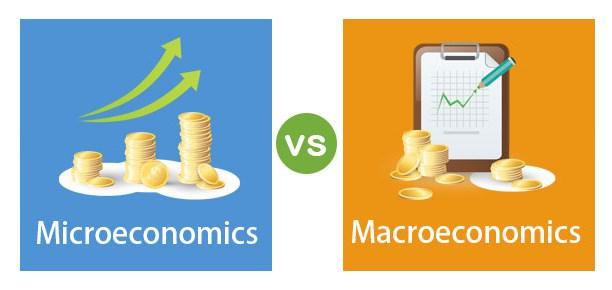

Understanding economic concepts is vital for effectively navigating the complexities of financial markets and national economies. At the core, economics is typically divided into two main categories: microeconomics and macroeconomics. Each focuses on different facets of economic activity and provides distinct insights for comprehending how economies function. Microeconomics examines the behaviors and decisions made by individuals and businesses, addressing how supply, demand, and resource allocation play out in specific markets. Conversely, macroeconomics looks at the broader economic picture, analyzing entire industries and economic systems. This includes assessing factors such as national fiscal policies, inflation rates, unemployment, and overall economic growth.

Furthermore, this article investigates the interaction between economics and algorithmic trading—a technology-driven approach to financial markets. Algorithmic trading employs mathematical models and computer programs to execute trades with speed and precision that surpasses human capability. Understanding both micro and macroeconomic factors becomes invaluable as they provide critical data and indicators that influence trading activity and strategy.



By exploring both the fundamental differences between microeconomics and macroeconomics and their modern-day relevance, combined with their integration into algorithmic trading, this article aims to equip readers with essential knowledge to better understand and participate in the financial world. Whether you're a trader, investor, or policymaker, grasping these economic principles can facilitate informed decisions and optimized outcomes in an increasingly complex economic landscape.

## Table of Contents

## Microeconomics Explained

Microeconomics examines the behaviors and decisions made by individuals and businesses, focusing on the mechanisms that drive their market interactions. It addresses how these entities make choices about resource allocation, pricing, and production, examining the intricate balance of supply and demand within individual markets.

One of the foundational principles of microeconomics is the theory of supply and demand. This theory posits that the price and quantity of goods in a market are determined by the interaction of supply, the amount of a good or service that producers are willing to sell at a given price, and demand, the amount that consumers are willing to purchase at a given price. The equilibrium is reached when supply equals demand, often illustrated by the equation:

$$
P(Q) = D(Q) = S(Q)
$$

where $P(Q)$ represents the price at equilibrium quantity $Q$, and $D(Q)$ and $S(Q)$ are the demand and supply functions, respectively.

Microeconomics also investigates consumer behavior, which seeks to understand how individuals make purchasing decisions. This includes the study of utility, a measure of the satisfaction or benefit derived from consuming goods and services. The concept of marginal utility, the additional satisfaction gained from consuming one more unit, is critical for understanding consumer choices. Rational consumers are expected to maximize their utility subject to their budget constraints.

Production theory is another key component, examining how businesses transform inputs into outputs. This includes understanding cost structures, economies of scale, and the efficiency of production processes. Firms aim to minimize costs for a given level of output or maximize output for a given level of costs.

Labor economics, an essential part of microeconomic study, focuses on the dynamics between employers and employees. It looks at how labor is supplied and demanded, wage determination, and employment patterns. Factors such as worker skills, labor regulations, and market competition influence these dynamics.

Overall, microeconomics uses a bottom-up approach to understand economic phenomena. By analyzing individual units—be it consumers, firms, or markets—it sheds light on the broader economic system's functioning. Through empirical and theoretical models, microeconomics provides insights into market behaviors and aids in the formulation of economic policies aimed at efficiency and welfare optimization.

## Macroeconomics Explained

Macroeconomics examines economies on a large scale, focusing on aggregate measures of economic activity and the interconnections between different economic sectors. It considers the performance, structure, and behavior of an economy as a whole rather than individual markets. By studying national and global economic trends, macroeconomics provides insight into the overarching health of an economy and is instrumental in policy formulation and economic strategy development.

One of the primary objectives of macroeconomics is to evaluate national fiscal policies, which involve government spending and taxation decisions aimed at influencing economic activity. Fiscal policy plays a crucial role in managing economic growth, controlling inflation, and reducing unemployment. For example, during economic downturns, governments might increase spending or reduce taxes to stimulate demand and generate employment (Mankiw, N. G., [2007]).

Inflation, representing the rate at which the general level of prices for goods and services rises, is another critical aspect of macroeconomic analysis. Macroeconomists analyze inflation trends to understand purchasing power dynamics and the effectiveness of monetary policy. Central banks often adjust interest rates to control inflation, ensuring economic stability.

Unemployment, defined as the number of people actively seeking work but unable to find jobs, is a significant macroeconomic concern. High unemployment levels indicate underutilization of labor resources, leading to decreased economic output and living standards. Macroeconomic policies aim to achieve full employment, thus maximizing productivity and economic welfare.

Overall economic growth, frequently measured by Gross Domestic Product (GDP), reflects the increase in the value of goods and services produced by an economy over time. Sustained economic growth is vital for improving living standards and advancing societal development. Macroeconomists analyze factors influencing growth, such as capital investments, technological advancements, and labor force changes.

Macroeconomics also examines the impact of government policies on economic health, studying how public interventions can either encourage or hinder economic progress. Globalization, the integration of national economies into a global economy, significantly affects macroeconomic policies and outcomes. It necessitates the study of international trade dynamics, cross-border investments, and currency fluctuations.

Comparative living standards across countries are assessed by macroeconomic indicators such as GDP per capita, Human Development Index (HDI), and Gini coefficient, providing insights into income distribution and quality of life.

The approach used in macroeconomics is predominantly top-down, where aggregate data from the broader economy is analyzed to draw conclusions about economic health and inform policy decisions. This perspective contrasts with the bottom-up approach of microeconomics, which studies individual market components. By employing econometric models and statistical analysis, macroeconomists can predict future trends and assess the impact of potential policies on economic growth and stability.

## Key Differences Between Microeconomics and Macroeconomics

Microeconomics and macroeconomics are two distinct branches of economics that, while interconnected, focus on different aspects of economic analysis and policy formulation. 

**Scale of Study:** The primary difference between microeconomics and macroeconomics lies in their scale of analysis. Microeconomics concentrates on the behavior of individual agents such as consumers, firms, and industries. It examines how these entities make decisions based on resource allocation, pricing, and consumption within specific markets. For instance, microeconomics might study how a particular company decides the price of its product based on supply and demand dynamics. In contrast, macroeconomics addresses the broader economy by analyzing aggregates and averages across industries and countries. It considers national and global economic activities, such as total national income, inflation rates, and policies that affect the economy as a whole. An example of macroeconomic analysis would include assessing the impact of a government fiscal policy on national unemployment rates.

**Analysis Techniques:** In microeconomics, both empirical and theoretical models are employed to study market behaviors at an individual level. These models help in understanding phenomena such as market structures, consumer choice theory, and production costs. Tools such as price elasticity and utility maximization are often used for analysis. On the other hand, macroeconomics typically employs aggregated data to understand overarching economic trends. Econometric models, which utilize statistical methods and time series data, are frequently used to predict and analyze economic conditions and policy impacts. For example, the Phillips Curve in macroeconomics relates inflation to unemployment, providing insights into economic cycles.

**Focus:** The focus of microeconomics is centered on achieving equilibrium in individual markets where supply meets demand, thereby dictating prices and quantities produced. Concepts like perfect competition and monopolistic practices are explored to understand how individual markets function efficiently or inefficiently. Macroeconomics, however, is focused on broad economic trends and cycles. It assesses factors like economic growth, business cycles, and the stability of national economies. Important macroeconomic indicators include Gross Domestic Product (GDP), Consumer Price Index (CPI), and the balance of trade, all of which help in understanding national economic health.

**Impact:** Microeconomics has a direct impact on certain market sectors by influencing pricing strategies, product availability, and consumer choice. Decisions at the micro level often affect optimization processes, competition, and innovation within industries. Conversely, macroeconomics influences entire economies, shaping policies that drive economic performance and stability. Macroeconomic policies, including monetary and fiscal measures, are designed to tackle issues such as unemployment, inflation, and national output. These policy decisions have far-reaching effects on economic growth and living standards.

While microeconomics and macroeconomics differ significantly in scope, methodology, and impact, they collectively provide a comprehensive understanding of economic processes. Both branches are essential for making informed economic decisions and formulating strategies across various levels of society and government.

## Algorithmic Trading and Economics

Algorithmic trading is a sophisticated approach to engaging with financial markets, leveraging advanced mathematical models and computer algorithms to execute trades with unprecedented speed and precision. This technologically driven method surpasses human capabilities, allowing traders to capitalize on fleeting market opportunities. At the heart of [algorithmic trading](/wiki/algorithmic-trading) lies the application of microeconomic principles, primarily revolving around supply and demand dynamics. By analyzing these factors, algorithms can make swift decisions, optimizing buying and selling strategies to enhance profitability.

Microeconomic concepts play a pivotal role in shaping algorithmic trading strategies. Supply and demand, the cornerstone of microeconomic theory, dictate price movements within markets. By crafting algorithms that react to changes in supply and demand curves, traders can automatically adjust their positions based on price fluctuations and market [liquidity](/wiki/liquidity-risk-premium). For example, an algorithm might use real-time data to identify an oversupplied market, triggering a sell order to capitalize on anticipated price drops.

Additionally, understanding macroeconomic indicators is essential for algorithmic traders. Macroeconomic data, such as GDP growth rates, inflation levels, and unemployment figures, influence overarching market trends and provide a broader context for trading decisions. Algorithms can be programmed to respond to these indicators, predicting the potential impact on currency, commodity, or stock markets. This allows algorithmic traders to position themselves advantageously, aligning their strategies with expected economic shifts.

The integration of economic principles into algorithmic trading enhances the decision-making process and bolsters risk management. By leveraging both micro and macroeconomic insights, traders can develop more robust trading models that anticipate market movements and mitigate potential losses. This holistic approach allows for the creation of dynamic algorithms that adapt to changing economic conditions, fostering resilient and adaptable trading strategies.

For instance, consider a simple algorithm designed to trade stocks based on economic indicators:

```python
def calculate_moving_average(prices, window_size):
    return sum(prices[-window_size:]) / window_size

def trade_based_on_gdp_change(gdp_growth_rate):
    if gdp_growth_rate > 0:
        print("Positive GDP growth detected, consider buying stocks.")
    else:
        print("Negative GDP growth detected, consider selling stocks.")

# Example usage
stock_prices = [100, 102, 104, 103, 105]
gdp_growth_rate = 2.5  # in percentage

moving_average = calculate_moving_average(stock_prices, 3)
trade_based_on_gdp_change(gdp_growth_rate)
```

This simplistic example outlines how macroeconomic data such as GDP growth can be incorporated into trading strategies. By automating responses to economic indicators, traders can achieve a systematic approach to managing investments, optimizing returns while controlling risk exposure. Understanding economics, both at the micro and macro level, is thus integral to crafting effective algorithmic trading systems, empowering traders to make well-informed and timely decisions.

## Conclusion

Both microeconomics and macroeconomics offer substantial insights critical to informing financial decisions across various tiers of economic engagement. Microeconomics, with its focus on the behavior and decisions of individuals and businesses, provides granular insights into supply and demand dynamics, pricing strategies, and resource allocation. These insights directly relate to how goods and services are valued in specific markets, influencing everyday business decisions and strategic planning.

Conversely, macroeconomics enables the analysis of larger economic aggregates, including national fiscal policies, inflation rates, and unemployment levels. By understanding these broad-scale economic indicators, stakeholders can assess economic health and predict future economic trends. This macro perspective is invaluable in formulating policies and strategies that cater to national and global economic objectives.

The intersection of both economic perspectives is essential in the context of financial markets, especially with the incorporation of technology-driven approaches like algorithmic trading. Algorithms can be programmed to execute trades based on complex models that consider real-time microeconomic data and macroeconomic indicators. By synthesizing this data, algorithmic trading systems can make quick and informed trading decisions, thereby enhancing the efficiency and effectiveness of these financial strategies.

Understanding economic principles equips traders, investors, and policymakers with the knowledge to navigate economic uncertainties and optimize their decision-making processes. By leveraging the insights derived from both micro and macroeconomic analyses, stakeholders can anticipate market movements, manage risks better, and capitalize on opportunities, ultimately leading to improved economic outcomes.

## References & Further Reading

[1]: Mankiw, N. G. (2007). "Principles of Economics" (5th ed.). South-Western College Pub.

[2]: ["Advances in Financial Machine Learning"](https://www.amazon.com/Advances-Financial-Machine-Learning-Marcos/dp/1119482089) by Marcos Lopez de Prado

[3]: ["Evidence-Based Technical Analysis: Applying the Scientific Method and Statistical Inference to Trading Signals"](https://www.amazon.com/Evidence-Based-Technical-Analysis-Scientific-Statistical/dp/0470008741) by David Aronson

[4]: ["Machine Learning for Algorithmic Trading"](https://github.com/PacktPublishing/Machine-Learning-for-Algorithmic-Trading-Second-Edition) by Stefan Jansen

[5]: ["Quantitative Trading: How to Build Your Own Algorithmic Trading Business"](https://books.google.com/books/about/Quantitative_Trading.html?id=j70yEAAAQBAJ) by Ernest P. Chan