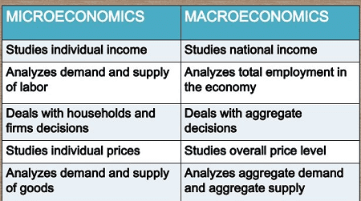

## Table of Contents

## What is microeconomics?

Microeconomics is a part of economics that looks at how individuals and small groups make choices about using limited resources. It focuses on things like how people decide what to buy, how businesses decide what to produce, and how much to charge for their products. The main idea is to understand how these small decisions affect the bigger picture of the economy.

One key concept in microeconomics is supply and demand. This idea helps explain how the price of goods and services is set. When there's a lot of something and not many people want it, the price goes down. But if a lot of people want something and there's not much of it, the price goes up. Microeconomics also studies how markets work and how different factors can change the way people behave in these markets.

## What is macroeconomics?

Macroeconomics is the part of economics that looks at the big picture of the economy. It studies things like how much a whole country produces, how many people have jobs, and how prices change over time. Instead of focusing on individual choices, macroeconomics looks at the overall trends and patterns that affect everyone in a country.

One important idea in macroeconomics is the business cycle, which is the ups and downs in the economy over time. Sometimes the economy grows and more people have jobs, but other times it can shrink and more people might lose their jobs. Macroeconomics tries to understand why these cycles happen and what governments can do to make the economy more stable. For example, they might change interest rates or spend more money to help the economy grow.

## How do the scopes of microeconomics and macroeconomics differ?

Microeconomics and macroeconomics look at different parts of the economy. Microeconomics focuses on small parts, like how people decide what to buy or how businesses decide what to sell. It's all about individual choices and how they affect things like prices and markets. For example, microeconomics might study why the price of apples goes up or down based on how many people want to buy them and how many are available.

On the other hand, macroeconomics looks at the big picture of the whole economy. It's about things like how much a country produces, how many people have jobs, and how prices change over time. Macroeconomics tries to understand big trends and what governments can do to help the economy. For instance, it might look at why the economy grows sometimes and shrinks at other times, and what can be done to keep it stable.

In simple terms, microeconomics is like looking at the trees in a forest, while macroeconomics is like looking at the forest as a whole. Both are important because they help us understand different parts of how the economy works.

## What are the main focuses of microeconomics?

Microeconomics focuses on how individuals and small groups make choices with limited resources. It looks at things like what people decide to buy, how much they are willing to pay, and how businesses decide what to produce and how much to charge. A big part of microeconomics is understanding how supply and demand work. When there's a lot of something and not many people want it, the price goes down. But if a lot of people want something and there's not much of it, the price goes up.

Another important focus of microeconomics is studying how markets work. This includes looking at how different factors can change the way people behave in these markets. For example, microeconomics might study how a change in taxes affects the price of goods or how competition between businesses can lead to lower prices for consumers. It's all about understanding the small decisions that people and businesses make and how these decisions affect the economy.

## What are the main focuses of macroeconomics?

Macroeconomics looks at the big picture of the economy. It focuses on things like how much a whole country produces, how many people have jobs, and how prices change over time. Instead of looking at individual choices, macroeconomics tries to understand the overall trends and patterns that affect everyone in a country. For example, it might study why the economy grows sometimes and shrinks at other times.

One important idea in macroeconomics is the business cycle. This is the ups and downs in the economy over time. Macroeconomics tries to figure out why these cycles happen and what governments can do to make the economy more stable. For instance, they might change interest rates or spend more money to help the economy grow. It's all about understanding the big trends and making sure the economy works well for everyone.

## Can you give examples of microeconomic issues?

One example of a microeconomic issue is the price of apples. If there are a lot of apples and not many people want to buy them, the price goes down. But if there are not many apples and a lot of people want them, the price goes up. This is all about supply and demand, which is a big part of microeconomics. It's about how the choices of individual people and businesses can change the price of things.

Another example is how a new tax on soda can affect its price. If the government puts a tax on soda, the price of soda goes up. This might make fewer people want to buy soda, so the businesses that sell soda might sell less. Microeconomics looks at how these changes in taxes can change what people buy and what businesses do. It's about understanding the small decisions and how they affect the economy.

A third example is competition between businesses. If two companies sell the same thing, they might try to lower their prices to get more customers. This can be good for people buying the product because they can get it for less money. Microeconomics studies how competition works and how it can change prices and what businesses do. It's all about the choices that individuals and small groups make and how those choices affect the market.

## Can you give examples of macroeconomic issues?

One example of a macroeconomic issue is unemployment. When a lot of people in a country don't have jobs, it's a big problem. Macroeconomics looks at why this happens and what the government can do to help more people find work. For example, the government might spend more money on building roads and schools to create jobs.

Another example is inflation, which is when prices for things like food and clothes go up over time. Macroeconomics tries to understand why prices go up and what can be done to keep them from rising too fast. If prices go up too much, people might not be able to buy what they need. The government might change interest rates to try to slow down inflation.

A third example is economic growth. This is when a country makes more things and more people have jobs. Macroeconomics looks at how to make the economy grow faster. For example, the government might make it easier for businesses to start and grow, which can help the economy get bigger. It's all about understanding the big picture and making sure the economy works well for everyone.

## How do microeconomic and macroeconomic policies influence each other?

Microeconomic and macroeconomic policies can affect each other because they both deal with different parts of the economy. Microeconomic policies focus on things like how much businesses charge for their products or how people decide what to buy. When these policies change, like if a new tax is put on a product, it can change how much people want to buy it and how much businesses want to sell. This can affect the overall economy, which is what macroeconomics looks at. For example, if a new tax makes things more expensive, fewer people might buy them, which could slow down the whole economy.

On the other hand, macroeconomic policies can also influence microeconomic decisions. These policies look at big things like how much the country produces, how many people have jobs, and how prices change over time. When the government changes interest rates or spends more money to help the economy grow, it can change how much money people have to spend. If people have more money, they might buy more things, which can help businesses grow. This shows how big changes in the economy can affect the small choices that people and businesses make every day.

## What tools do economists use in microeconomic analysis?

Economists use different tools to understand how people and businesses make choices. One important tool is the supply and demand model. This helps them see how the price of something changes based on how much people want it and how much is available. If a lot of people want something but there's not much of it, the price goes up. But if there's a lot of something and not many people want it, the price goes down. Economists also use graphs to show how supply and demand work, making it easier to see how prices change.

Another tool economists use is cost-benefit analysis. This helps them figure out if doing something is worth it by comparing what it costs to what it gives back. For example, a business might use this to decide if it should make more of a product. If the cost of making it is less than what people will pay for it, it makes sense to produce more. Economists also look at things like elasticity, which shows how much the amount people buy changes when the price changes. If a small change in price makes a big change in how much people buy, the product is said to be elastic.

## What tools do economists use in macroeconomic analysis?

Economists use different tools to understand how the whole economy works. One important tool is Gross Domestic Product (GDP), which measures how much a country produces in a year. It helps economists see if the economy is growing or shrinking. Another tool is the unemployment rate, which shows how many people don't have jobs. By looking at this, economists can understand how well the economy is doing and what the government might need to do to help more people find work.

Another tool economists use is the Consumer Price Index (CPI), which measures how prices for things like food and clothes change over time. This helps them understand inflation, which is when prices go up. If prices go up too fast, it can be a problem for people trying to buy what they need. Economists also use models like the Aggregate Demand and Aggregate Supply (AD-AS) model to see how big changes in the economy affect things like prices and how much people buy. These tools help economists make sense of the big picture and figure out what policies might help the economy work better for everyone.

## How do microeconomics and macroeconomics approach the concept of market equilibrium differently?

In microeconomics, market equilibrium is all about how the price of a single product or service balances out. It's when the amount of something people want to buy (demand) is the same as the amount businesses want to sell (supply). If the price is too high, not many people will buy it, so businesses will lower the price until it's just right. If the price is too low, a lot of people will want to buy it, but businesses might not want to sell as much because they're not making enough money. So they'll raise the price until it's just right. Microeconomics looks at how these small changes in price and quantity affect the market for one thing at a time.

In macroeconomics, market equilibrium is about the whole economy, not just one product. It's when the total amount of goods and services people want to buy is the same as the total amount businesses want to produce. This is called aggregate demand and aggregate supply. If people want to buy more than businesses are making, prices might go up and businesses might start making more. If people want to buy less than businesses are making, prices might go down and businesses might make less. Macroeconomics looks at how these big changes affect the whole economy, like how much the country produces, how many people have jobs, and how prices change over time.

## What are some advanced theories or models used exclusively in microeconomics or macroeconomics?

In microeconomics, one advanced theory is game theory. This theory helps economists understand how people make decisions when they have to think about what others might do. It's like a game where each player tries to guess what the other will do to make the best choice for themselves. Game theory is used to study things like how businesses compete with each other or how people decide to cooperate or not. Another important model in microeconomics is the consumer choice theory. This model looks at how people decide what to buy based on their income and the prices of things. It helps economists understand why people might choose one product over another and how changes in prices or income can affect these choices.

In macroeconomics, one advanced model is the IS-LM model. This model helps economists understand how interest rates and the total amount of goods and services produced in an economy (known as output) affect each other. It shows how changes in government spending or taxes can change interest rates and output. Another important theory in macroeconomics is the Phillips Curve, which looks at the relationship between unemployment and inflation. It suggests that when unemployment is low, inflation might go up because more people have money to spend, which can push prices higher. These theories and models help economists understand the big picture of the economy and how different factors can affect it.

## What is Microeconomics Explained?

Microeconomics examines the behaviors and decisions made by individuals and businesses, focusing on the mechanisms that drive their market interactions. It addresses how these entities make choices about resource allocation, pricing, and production, examining the intricate balance of supply and demand within individual markets.

One of the foundational principles of microeconomics is the theory of supply and demand. This theory posits that the price and quantity of goods in a market are determined by the interaction of supply, the amount of a good or service that producers are willing to sell at a given price, and demand, the amount that consumers are willing to purchase at a given price. The equilibrium is reached when supply equals demand, often illustrated by the equation:

$$
P(Q) = D(Q) = S(Q)
$$

where $P(Q)$ represents the price at equilibrium quantity $Q$, and $D(Q)$ and $S(Q)$ are the demand and supply functions, respectively.

Microeconomics also investigates consumer behavior, which seeks to understand how individuals make purchasing decisions. This includes the study of utility, a measure of the satisfaction or benefit derived from consuming goods and services. The concept of marginal utility, the additional satisfaction gained from consuming one more unit, is critical for understanding consumer choices. Rational consumers are expected to maximize their utility subject to their budget constraints.

Production theory is another key component, examining how businesses transform inputs into outputs. This includes understanding cost structures, economies of scale, and the efficiency of production processes. Firms aim to minimize costs for a given level of output or maximize output for a given level of costs.

Labor economics, an essential part of microeconomic study, focuses on the dynamics between employers and employees. It looks at how labor is supplied and demanded, wage determination, and employment patterns. Factors such as worker skills, labor regulations, and market competition influence these dynamics.

Overall, microeconomics uses a bottom-up approach to understand economic phenomena. By analyzing individual units—be it consumers, firms, or markets—it sheds light on the broader economic system's functioning. Through empirical and theoretical models, microeconomics provides insights into market behaviors and aids in the formulation of economic policies aimed at efficiency and welfare optimization.

## References & Further Reading

[1]: Mankiw, N. G. (2007). "Principles of Economics" (5th ed.). South-Western College Pub.

[2]: ["Advances in Financial Machine Learning"](https://www.amazon.com/Advances-Financial-Machine-Learning-Marcos/dp/1119482089) by Marcos Lopez de Prado

[3]: ["Evidence-Based Technical Analysis: Applying the Scientific Method and Statistical Inference to Trading Signals"](https://www.amazon.com/Evidence-Based-Technical-Analysis-Scientific-Statistical/dp/0470008741) by David Aronson

[4]: ["Machine Learning for Algorithmic Trading"](https://github.com/PacktPublishing/Machine-Learning-for-Algorithmic-Trading-Second-Edition) by Stefan Jansen

[5]: ["Quantitative Trading: How to Build Your Own Algorithmic Trading Business"](https://books.google.com/books/about/Quantitative_Trading.html?id=j70yEAAAQBAJ) by Ernest P. Chan