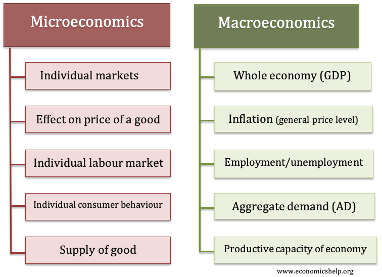

## Table of Contents

## What is microeconomics?

Microeconomics is a branch of economics that focuses on the behavior of individuals and firms in making decisions about the allocation of limited resources. It looks at how these decisions affect the supply and demand for goods and services, which in turn influences prices and the overall economy. Microeconomics helps us understand why people make certain choices and how these choices impact markets.

One key concept in microeconomics is the idea of scarcity, which means that there are not enough resources to satisfy everyone's wants and needs. Because of this, people have to make trade-offs and prioritize what is most important to them. Microeconomics also examines how different market structures, like perfect competition or monopolies, affect the way businesses operate and set prices. By studying these interactions, economists can better understand and predict economic behavior.

## What is macroeconomics?

Macroeconomics is a part of economics that looks at the big picture of the economy. It studies things like the total amount of goods and services produced in a country, the overall level of prices, and how many people have jobs. Macroeconomics helps us understand how the whole economy works and how different parts of it are connected.

One important idea in macroeconomics is the business cycle, which shows how the economy grows and shrinks over time. Economists use this to predict when the economy might be doing well or when it might be struggling. They also look at things like inflation, which is when prices go up, and unemployment, which is when people can't find jobs. By studying these big issues, macroeconomists can suggest ways to make the economy better for everyone.

## Can you give examples of microeconomic issues?

Microeconomic issues are about the choices that people and businesses make every day. One example is when a family decides how to spend their money. They might have to choose between buying food, paying for their house, or saving for the future. If the price of food goes up, they might have to cut back on other things. This shows how microeconomics looks at how small changes can affect a family's decisions.

Another example is when a business decides what to produce and how much to charge for it. A company that makes toys might need to figure out if they should make more toy cars or more dolls. They will look at what people want to buy and how much it costs to make each toy. If the cost of plastic goes up, they might decide to make fewer toy cars and charge more for them. This shows how businesses use microeconomics to make choices about what to sell and at what price.

## Can you give examples of macroeconomic issues?

One example of a macroeconomic issue is inflation. Inflation is when the prices of things we buy, like food and clothes, go up over time. If inflation is too high, it can make it hard for people to afford what they need. Governments and central banks try to keep inflation under control by changing interest rates or other policies. For example, if prices are going up too fast, they might raise interest rates to make borrowing money more expensive, which can slow down spending and help bring prices down.

Another example is unemployment. Unemployment happens when people who want to work can't find jobs. High unemployment can make the economy weaker because people have less money to spend. Governments often try to reduce unemployment by creating jobs through public projects or by helping businesses grow. For instance, they might invest in building new roads or schools, which can create jobs and help the economy grow.

A third example is economic growth. Economic growth is when a country makes more goods and services over time. It's important because it can lead to higher living standards for people. Governments encourage economic growth by making it easier for businesses to start and expand, or by investing in education and technology. If a country's economy is growing, it usually means more jobs and more money for people to spend, which can make everyone better off.

## How do microeconomics and macroeconomics interact with each other?

Microeconomics and macroeconomics are like two sides of the same coin. They both study economics, but they look at different parts of it. Microeconomics focuses on the choices that people and businesses make every day, like what to buy or what to sell. Macroeconomics looks at the bigger picture, like how the whole economy is doing. Even though they focus on different things, they are connected because the small choices people make can add up to big changes in the economy.

For example, if a lot of people decide to save more money instead of spending it, this is a microeconomic choice. But if everyone starts saving more, it can slow down the whole economy because businesses sell less stuff. This can lead to less economic growth, which is something macroeconomists study. On the other hand, if the government decides to lower taxes to boost the economy, that's a macroeconomic policy. But it affects people and businesses at the microeconomic level because they have more money to spend or invest. So, what happens in microeconomics can affect macroeconomics, and vice versa.

## What are the main tools used in microeconomic analysis?

One main tool used in microeconomic analysis is the supply and demand model. This model helps us understand how the price of things is decided. It shows that when there's a lot of something, the price usually goes down because people don't have to pay as much to get it. But when there's not much of something, the price goes up because people are willing to pay more to get it. This model is really useful for figuring out how changes in the market, like a new law or a change in what people want, can affect prices and how much stuff is bought and sold.

Another important tool is the concept of elasticity. Elasticity tells us how much people will change what they buy if the price changes. If something is elastic, it means that people will buy a lot less of it if the price goes up even a little bit. But if something is inelastic, people will keep buying it even if the price goes up a lot. This helps businesses decide what to charge for their products and helps the government understand how taxes might affect what people buy. By using these tools, economists can make better guesses about how people and businesses will act in different situations.

## What are the main tools used in macroeconomic analysis?

One main tool used in macroeconomic analysis is Gross Domestic Product, or GDP. GDP measures the total value of all the goods and services made in a country in a year. It helps economists see if the economy is growing or shrinking. If GDP goes up, it usually means the economy is doing well because people are making and buying more stuff. But if GDP goes down, it might mean the economy is struggling. Economists use GDP to compare how different countries are doing and to see how things like government policies or big events affect the economy.

Another important tool is the unemployment rate. This tells us the percentage of people who want to work but can't find a job. A high unemployment rate can mean the economy is not doing well because fewer people are working and making money to spend. Governments often try to lower unemployment by creating jobs or helping businesses grow. The unemployment rate helps economists understand how well the job market is doing and can give clues about what might happen next in the economy. By looking at both GDP and the unemployment rate, economists can get a good picture of how the whole economy is doing.

## How do the goals of microeconomics differ from those of macroeconomics?

The goals of microeconomics are to understand how people and businesses make choices every day. It looks at things like what to buy, what to sell, and how much to charge for things. Microeconomics helps us see how these small choices can affect the market. For example, if a family decides to buy less food because prices went up, that's a microeconomic decision. By studying these choices, economists can figure out how to make markets work better for everyone.

On the other hand, the goals of macroeconomics are to understand how the whole economy works. It looks at big things like how much a country makes in total, how many people have jobs, and how prices change over time. Macroeconomics helps us see how different parts of the economy are connected and how they affect each other. For example, if a lot of people lose their jobs, that can make the whole economy weaker. By studying these big issues, economists can suggest ways to make the economy stronger and help more people.

## What are some key theories in microeconomics?

One key theory in microeconomics is the theory of consumer behavior. This theory says that people try to get the most satisfaction they can from what they buy. They do this by comparing the benefits they get from something with how much it costs. For example, if you're deciding between buying a burger or a salad, you'll think about which one you like more and which one is cheaper. Economists use this theory to understand why people choose to buy certain things and how changes in prices can affect what they buy.

Another important theory is the theory of the firm. This theory looks at how businesses decide what to make and how much to charge for it. Businesses want to make as much money as they can, so they think about the costs of making things and what people are willing to pay. For example, a toy company might decide to make more toy cars if they can sell them for a lot more than it costs to make them. This theory helps economists see how businesses work and how they react to changes in the market, like new laws or changes in what people want to buy.

## What are some key theories in macroeconomics?

One key theory in macroeconomics is the Keynesian theory. This theory says that the government can help the economy by spending more money when things are not going well. For example, if a lot of people lose their jobs, the government can create new jobs by building roads or schools. This can help the economy grow because people who get these jobs will have more money to spend. Keynesian theory is important because it shows how the government can make a big difference in how the economy does.

Another important theory is the monetarist theory. This theory says that the amount of money in the economy is really important. If there's too much money, prices can go up a lot, which is called inflation. But if there's not enough money, the economy can slow down. Monetarists think that the central bank, like the Federal Reserve in the U.S., should control how much money is in the economy to keep things stable. This theory helps us understand how money affects the whole economy and what the central bank can do to help.

## How do policy decisions differ when approached from a microeconomic versus a macroeconomic perspective?

When policymakers make decisions from a microeconomic perspective, they focus on how those decisions will affect individual people and businesses. For example, if the government wants to help families save money, they might decide to lower taxes on things like food or medicine. This would make these things cheaper for families to buy, which is a microeconomic goal. Another example is if the government wants to help small businesses, they might give them tax breaks or loans to help them grow. These kinds of policies are all about making life better for individuals and small groups by changing prices or costs.

On the other hand, when policymakers take a macroeconomic perspective, they think about how their decisions will affect the whole economy. For instance, if the government sees that a lot of people are out of work, they might decide to spend more money on building roads or schools to create jobs. This would help the economy grow by getting more people working and spending money. Another example is if the government wants to stop prices from going up too fast, they might raise interest rates to make borrowing money more expensive, which can slow down spending. These kinds of policies are about making the economy stronger and more stable for everyone.

## What are the current trends and debates in microeconomics and macroeconomics?

In microeconomics, one big trend is the use of big data and new technology to study how people make choices. Economists are using computers and the internet to gather a lot of information about what people buy and why. This can help them understand things like how people react to changes in prices or new products. Another debate in microeconomics is about how much the government should get involved in markets. Some people think the government should do more to help people and businesses, like setting rules to make sure everyone is treated fairly. Others believe that the government should stay out of the way and let markets work on their own.

In macroeconomics, one current trend is the focus on global economic issues. Economists are looking at how things like trade between countries and big events around the world can affect the economy. For example, they study how a big change in one country's economy can cause problems in other countries too. Another big debate in macroeconomics is about how to handle things like inflation and unemployment. Some people think the government should spend more money to help the economy grow and create jobs. Others believe that the government should be careful not to spend too much, because that can make prices go up too fast. Both sides are trying to find the best way to keep the economy strong and stable.

## References & Further Reading

[1]: ["Microeconomic Theory"](https://ocw.mit.edu/courses/14-121-microeconomic-theory-i-fall-2015/) by Andreu Mas-Colell, Michael D. Whinston, and Jerry R. Green

[2]: ["Macroeconomics"](https://www.investopedia.com/terms/m/macroeconomics.asp) by Paul Krugman and Robin Wells

[3]: ["Algorithmic Trading and DMA: An Introduction to Direct Access Trading Strategies"](https://www.amazon.com/Algorithmic-Trading-DMA-introduction-strategies/dp/0956399207) by Barry Johnson

[4]: ["An Introduction to Algorithmic Trading: Basic to Advanced Strategies"](https://www.wiley.com/en-us/An+Introduction+to+Algorithmic+Trading%3A+Basic+to+Advanced+Strategies-p-9781119975090) by Edward Leshik and Jane Cralle 

[5]: Mishkin, F. S. (2007). ["The Economics of Money, Banking, and Financial Markets."](https://www.pearsonhighered.com/assets/preface/0/1/3/4/0134855388.pdf) Pearson Education.