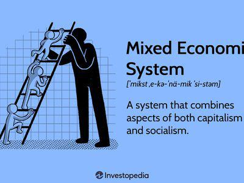

## Table of Contents

## What is a mixed economy?

A mixed economy is a type of economic system that combines elements of both capitalism and socialism. In this system, the government and private businesses both play important roles in the economy. The government might control some industries, like healthcare or education, while private companies are free to operate in other areas, like technology or retail. This blend allows for a balance between the efficiency and innovation of private businesses and the fairness and stability that government oversight can provide.

In a mixed economy, the government often sets rules and regulations to make sure businesses act fairly and to protect the environment. It also provides public goods and services, like roads and schools, which might not be profitable for private companies to offer. At the same time, private businesses are encouraged to compete and innovate, which can lead to new products and services that improve people's lives. This mix aims to take the best parts of both systems to create a strong and fair economy.

## What is capitalism?

Capitalism is an economic system where private people and businesses own things like factories, stores, and land. They can decide what to make, how much to charge, and who to sell to. The main idea is that everyone is trying to make money, and this competition helps the economy grow. People can start their own businesses, and if they do well, they can become rich. But if they don't do well, they might lose money or even go out of business.

In capitalism, the government's role is usually small. It might set some rules to make sure businesses don't cheat or harm people, but it doesn't control most of the economy. Instead, the market decides what gets made and sold based on what people want to buy. This can lead to new inventions and more choices for people. But it can also mean that some people get very rich while others struggle, and not everyone has the same chance to succeed.

## How do mixed economies and capitalism differ in terms of government involvement?

In a mixed economy, the government has a bigger role than in capitalism. The government might own and run some important services like schools, hospitals, or public transportation. It also makes rules to make sure businesses are fair and safe, and it helps take care of people who need it, like the poor or the elderly. The idea is to balance the freedom of businesses with the need to look after everyone in society.

In capitalism, the government's role is much smaller. It mostly stays out of the way and lets private people and businesses decide what to do. The government might set some basic rules to stop cheating or harm, but it doesn't own or run businesses. The focus is on letting the market work freely, where people can start their own companies and compete to make money. This can lead to more innovation and choices for consumers, but it can also mean less help for those who struggle.

## What role does the private sector play in a mixed economy versus capitalism?

In a mixed economy, the private sector is important but works alongside the government. Private companies can start businesses and make things like cars or computers. They can also decide what to make and how much to charge, but they have to follow the government's rules. These rules help make sure that businesses are fair and safe. The government might also step in to help people who need it, like by providing healthcare or education. So, in a mixed economy, the private sector has freedom to innovate and grow, but it shares the stage with the government.

In capitalism, the private sector has a lot more freedom. Private people and businesses can own everything from factories to stores. They decide what to make, how much to charge, and who to sell to without much government interference. The main goal is to make money, and businesses compete to do this. This can lead to new inventions and more choices for people. But because the government doesn't get involved much, there might be less help for people who struggle, and the rich might get richer while the poor stay poor.

## How do mixed economies and capitalism handle economic inequality?

In a mixed economy, the government tries to reduce economic inequality by helping people who need it. It might provide things like free healthcare, education, and social services to make sure everyone has a fair chance. The government can also set rules to make sure businesses pay workers fairly and don't harm the environment. By doing these things, a mixed economy aims to balance the wealth and power between rich and poor people.

In capitalism, there is less help for people who struggle. The focus is on letting businesses make money and grow, which can lead to big differences between rich and poor. Some people can become very rich by starting successful businesses, but others might not have the same chances. The government might step in a little bit to help, but mostly, it stays out of the way. This means that economic inequality can be a big problem in a capitalist system because there are fewer safety nets for people who need help.

## What are the key economic goals of a mixed economy compared to capitalism?

In a mixed economy, the main goals are to balance growth with fairness. The government wants businesses to do well and make new things, but it also wants to make sure everyone has a good life. So, it helps people by giving them things like free healthcare and education. The government also makes rules to keep businesses fair and safe. This way, the economy can grow, but people who need help can still get it.

In capitalism, the main goal is to let businesses make as much money as they can. People can start their own companies and try to get rich. The government doesn't get in the way much, so businesses can decide what to make and how much to charge. This can lead to new inventions and more choices for people. But because the government doesn't help much, some people might get very rich while others struggle.

## How do mixed economies and capitalism approach the regulation of businesses?

In a mixed economy, the government makes a lot of rules to make sure businesses act fairly and safely. They set up laws to stop businesses from cheating or harming people or the environment. The government might also control some important services like healthcare or education to make sure everyone can use them. This way, the government tries to balance the freedom of businesses with the need to protect people and keep the economy fair.

In capitalism, the government doesn't make as many rules for businesses. They mostly let companies decide what to do on their own. The government might set some basic rules to stop cheating or harm, but they don't control most of the businesses. The idea is that letting businesses work freely will help the economy grow and lead to new inventions. But this can also mean that some businesses might not act fairly or safely if there aren't enough rules to stop them.

## What are the historical origins of mixed economies and capitalism?

The idea of capitalism started a long time ago, but it really took off during the Industrial Revolution in the 18th and 19th centuries. This was a time when new machines and factories changed how things were made. People like Adam Smith, who wrote a book called "The Wealth of Nations," said that if people and businesses could make their own choices about what to make and sell, it would help the whole economy grow. This idea spread around the world, especially in places like the United States and the United Kingdom, where people started their own businesses and tried to make money. Capitalism became known for letting the market decide what gets made and sold, with little help from the government.

Mixed economies came about because people saw problems with pure capitalism. In the late 19th and early 20th centuries, many people were poor and didn't have the same chances as the rich. Some thought the government should step in to help. Countries like Sweden and Germany started to mix ideas from capitalism and socialism. They let businesses make money and grow, but the government also made rules to make sure businesses were fair and helped people who needed it. This way, mixed economies tried to take the good parts of capitalism, like growth and innovation, and mix them with the fairness and help that socialism could offer.

## Can you provide examples of countries that practice mixed economies and those that practice capitalism?

Countries like Sweden, Germany, and Canada are good examples of mixed economies. In Sweden, the government helps people by giving them free healthcare and education. In Germany, the government makes rules to make sure businesses are fair and safe, and they also help with things like unemployment benefits. Canada has a mix too, with the government running healthcare and setting rules for businesses, but private companies can still make money and grow. These countries try to balance the freedom of businesses with making sure everyone has a good life.

Countries like the United States and Singapore are often seen as examples of capitalism. In the United States, people can start their own businesses and try to get rich. The government doesn't control most businesses, so companies can decide what to make and how much to charge. In Singapore, the government also stays out of the way a lot, letting businesses work freely. Both countries focus on letting the market decide what gets made and sold, with less help from the government for people who struggle.

## How do mixed economies and capitalism impact innovation and economic growth?

In a mixed economy, the government and private businesses both help drive innovation and economic growth. The government can spend money on things like education and research, which can lead to new ideas and inventions. At the same time, private companies are free to start businesses and try new things. They can make money by coming up with new products or better ways to do things. This mix can help the economy grow because businesses can innovate, but the government makes sure everyone has a chance to learn and work.

In capitalism, the focus is on letting businesses innovate and grow without much help from the government. When businesses compete to make money, they come up with new ideas and products to attract customers. This competition can lead to a lot of innovation and make the economy grow fast. But because the government doesn't help as much, some people might not have the same chances to start businesses or get a good education. So, while capitalism can lead to a lot of growth and new inventions, it can also make it harder for everyone to benefit equally from that growth.

## What are the criticisms and advantages of mixed economies versus capitalism?

Mixed economies try to balance the good things about capitalism and socialism. One advantage is that the government can help people who need it, like by giving them free healthcare or education. This makes life fairer for everyone. Another advantage is that businesses can still make money and come up with new ideas, which helps the economy grow. But some people criticize mixed economies because they think too many rules from the government can slow down businesses. They also worry that if the government spends too much money helping people, it might not have enough money for other important things.

Capitalism lets businesses work freely and try to make money. This can lead to a lot of new inventions and make the economy grow fast. People can start their own businesses and get rich if they do well. But capitalism also has some big problems. Some people say it can make the rich get richer while the poor stay poor because there isn't enough help from the government. They also worry that without enough rules, businesses might not always act fairly or safely. So, while capitalism can lead to a lot of growth and innovation, it can also make life harder for people who struggle.

## How do mixed economies and capitalism address issues like public goods and externalities?

In a mixed economy, the government helps with public goods and externalities. Public goods are things like roads and parks that everyone can use, but private businesses might not want to pay for them because they can't make money from them. The government steps in to build and take care of these things so everyone can use them. Externalities are when businesses do something that affects other people, like pollution. The government makes rules to stop businesses from harming the environment or people. This way, the government tries to make sure everyone benefits from public goods and that businesses don't cause too many problems.

In capitalism, the government doesn't help as much with public goods and externalities. Private businesses might not want to pay for things like roads or parks because they can't make money from them. So, these things might not get built or taken care of as well. When it comes to externalities, like pollution, businesses might not have to follow as many rules. This can lead to more problems for people and the environment because businesses are focused on making money, not on taking care of everyone else. So, in capitalism, public goods and externalities can be bigger problems because the government doesn't step in as much.

## How do economic systems impact trading strategies?

The economic system within which trading strategies are developed and implemented significantly affects their design, performance, and adaptability. In capitalist systems, the emphasis on private ownership and minimal regulatory oversight creates an environment where algorithmic trading can flourish. The lack of stringent regulations allows for rapid innovation and the adoption of sophisticated trading algorithms. This environment is conducive to high-frequency trading ([HFT](/wiki/high-frequency-trading-strategies)) and other algorithmic strategies that rely on quick market movements and arbitrage opportunities. Traders are empowered to employ complex algorithms designed to exploit these rapid fluctuations, enhancing the overall efficiency and liquidity of the markets.

For instance, in a purely capitalist market, the absence of regulatory constraints allows algorithmic traders to operate with high leverage and execute large volumes of trades in milliseconds. This can be modeled mathematically by considering an algorithm that optimizes for profit, $P$, based on price fluctuations, $\Delta p$, and trading volume, $V$:

$$
P = f(\Delta p, V)
$$

Here, $f$ represents the function that algorithms optimize to maximize profit, capitalizing on the low latency and high-frequency nature of these systems.

Conversely, mixed economies, which embody both capitalist and socialist principles, impose a regulatory framework that governs trading practices, ensuring they align with wider economic goals and social objectives. Regulatory bodies in mixed economies are more likely to enforce rules that may limit certain high-risk trading behaviors associated with algorithmic strategies. This oversight can prevent market manipulation and the formation of monopolistic trading entities, promoting fairness and reducing systemic risks. 

In mixed economic systems, such as those found in many European countries, regulations may require algorithmic traders to adhere to specific guidelines that promote market stability and transparency. Regulatory constraints often necessitate algorithms to include risk management strategies, such as stop-loss orders or protective puts, ensuring that trading activities do not contravene the public interest.

In Python, a simplified risk management strategy can be implemented by setting a stop-loss threshold within an algorithm:

```python
def execute_trade(price, stop_loss_threshold):
    if price < stop_loss_threshold:
        # Execute stop-loss
        return "Stop-loss triggered. Trade executed."
    else:
        # Continue with the current trading strategy
        return "Trade continues."

# Example usage
current_price = 100.5
stop_loss_threshold = 95.0
trade_status = execute_trade(current_price, stop_loss_threshold)
print(trade_status)
```

This example demonstrates how regulatory guidelines in mixed economies can be programmatically incorporated into algorithmic trading strategies, ensuring compliance with economic policies while still enabling the utilization of sophisticated trading models.

Therefore, understanding the interplay between economic systems and trading practices is essential for traders. While capitalist systems offer a fertile ground for innovative trading strategies with their less restrictive environments, mixed economies provide a structured framework that balances private sector innovations with societal goals, ultimately shaping the landscape of algorithmic trading.

## References & Further Reading

Explore comprehensive studies and analyses on economic systems and algorithmic trading to gain deeper insights into these complex topics. Below are some key resources that can enhance your understanding:

1. **Academic Journals**: Delve into peer-reviewed articles such as those found in the Journal of Economic Perspectives and the Review of Financial Studies. These journals often publish cutting-edge research on economic theories, market dynamics, and technological innovations in trading.

2. **Government Economic Reports**: Consult reports from economic authorities such as the Federal Reserve, European Central Bank, and Bank of England. These documents provide valuable data and insights into how regulatory bodies view and manage the interaction of economic systems and trading technologies.

3. **Books on Financial Technologies**: Consider reading seminal texts such as "Flash Boys: A Wall Street Revolt" by Michael Lewis, which explores the world of high-frequency trading, or "Trading and Exchanges: Market Microstructure for Practitioners" by Larry Harris for a comprehensive understanding of market operations.

4. **Online Platforms and Portals**: Websites like JSTOR and Google Scholar host a wealth of research papers and articles. These platforms can be invaluable for accessing a wide array of studies on how different economic systems operate and how algorithmic trading is influencing modern financial markets.

5. **Expert Publications and Industry Reports**: Organizations such as McKinsey & Company and the World Economic Forum release industry reports that discuss the implications of financial technologies within various economic frameworks. These publications often include data-driven insights that can inform strategic decisions.

These resources collectively offer a robust foundation for understanding the intricacies of capitalism, mixed economies, and the technological shifts driven by algorithmic trading.

