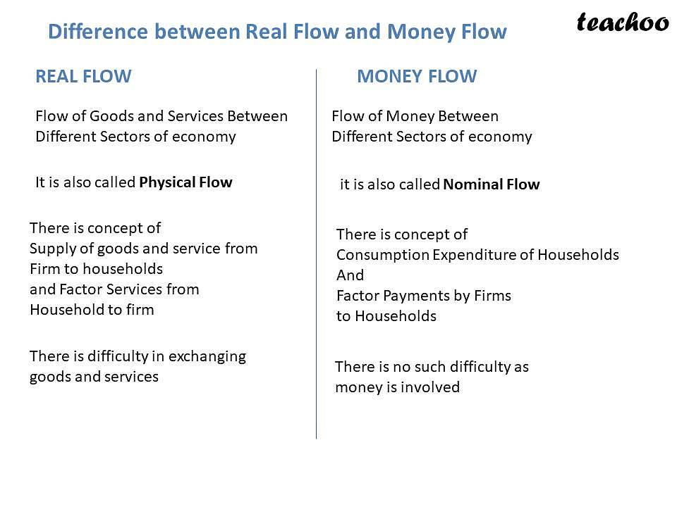

## Table of Contents

## What is money flow?

Money flow is a way to measure how money moves in and out of a stock or the whole stock market. It looks at the amount of money that people are spending to buy stocks and compares it to the amount of money they are getting back when they sell stocks. If more money is coming in than going out, it's called positive money flow, which can mean that people are feeling good about the stock or the market. If more money is going out than coming in, it's called negative money flow, which can mean that people are worried or want to sell their stocks.

Money flow can help investors understand how other people feel about a stock or the market. For example, if a stock has a lot of positive money flow, it might mean that many people believe the stock's price will go up. On the other hand, if a stock has a lot of negative money flow, it might mean that people think the stock's price will go down. By looking at money flow, investors can make better choices about when to buy or sell stocks.

## What is real flow?

Real flow is a term used in economics to describe the movement of goods and services between households and businesses. When households buy things like food, clothes, or services like haircuts, they are part of the real flow. Businesses produce these goods and services and sell them to households. This exchange is the heart of the economy because it shows how resources and products move around.

In the real flow, households also provide labor and other resources to businesses. For example, people work at companies, and in return, they get wages. This is another part of the real flow because it shows how work and resources move from households to businesses. Together, these flows of goods, services, labor, and resources keep the economy going and help everyone get what they need.

## How do money flow and real flow relate to each other?

Money flow and real flow are two sides of the same coin in the economy. Real flow is about the actual goods and services that move between households and businesses. When you buy a sandwich, that sandwich is part of the real flow. Money flow, on the other hand, is about the money that changes hands when you buy that sandwich. The money you pay for the sandwich is part of the money flow. So, when you buy something, the real flow is the sandwich moving from the business to you, and the money flow is the money moving from you to the business.

These two flows are closely connected because they happen at the same time. When you pay for a service, like a haircut, the real flow is the haircut you get, and the money flow is the money you give to the barber. If more people are buying sandwiches and getting haircuts, both the real flow and the money flow increase. This shows that the economy is doing well because more goods and services are moving around, and more money is being spent. Understanding how these flows work together helps us see how the economy functions and how money and goods keep moving in a cycle.

## Can you give an example of money flow in an economy?

Imagine a small town where there's a bakery called "Sweet Treats." Every morning, people from the town go to Sweet Treats to buy fresh bread and pastries. When they pay for these goodies, that's money flow. The money moves from the customers' wallets into the bakery's cash register. If more people start coming to Sweet Treats because they love the new chocolate croissants, the money flow into the bakery increases. This means more money is coming into the bakery than before.

On the other hand, if a new bakery opens across the street and starts taking customers away from Sweet Treats, the money flow might decrease. Now, less money is coming into Sweet Treats because people are spending their money at the new bakery instead. This change in where people spend their money is an example of how money flow can shift in an economy, affecting businesses and the overall economic activity in the town.

## Can you provide an example of real flow in an economy?

In a small town, there's a farmer named John who grows vegetables. Every week, John takes his fresh vegetables to the local market. People from the town come to the market and buy John's vegetables. This is an example of real flow. The vegetables move from John, the farmer, to the people in the town. They get the food they need, and John gets to share his harvest with the community.

But real flow isn't just about goods. It also includes services. For example, there's a local mechanic named Sarah in the same town. When people's cars break down, they go to Sarah's garage. Sarah fixes their cars, and the cars go back to the people, working well again. This is another part of real flow. The service of fixing cars moves from Sarah to the car owners, helping them get around town easily.

## What are the primary differences between money flow and real flow?

Money flow and real flow are two important parts of how an economy works, but they focus on different things. Money flow is all about the money that moves around when people buy and sell things. When you buy a toy, the money you pay for it is part of the money flow. It's like watching where the money goes when people spend it or get paid. If more money is coming into a business, that's positive money flow, and if more money is leaving, that's negative money flow.

Real flow, on the other hand, is about the actual things that move around in the economy. When you buy that toy, the toy itself moving from the store to your home is part of the real flow. It's about the goods like toys, food, and clothes, and services like haircuts or car repairs that people use every day. Real flow shows how these things move from businesses to people and how people's work and resources move to businesses. Both flows happen together, but they show different sides of the same economic activity.

## How does money flow affect the economy?

Money flow is really important for the economy because it shows how money moves around when people buy and sell things. When more money is coming into businesses, it's called positive money flow. This can mean that people feel good about the economy and are spending more. Businesses can use this money to grow, hire more people, and make more things. This can help the economy grow because more people have jobs and more things are being made and sold.

On the other hand, if more money is leaving businesses than coming in, it's called negative money flow. This can mean that people are worried about the economy and are spending less. When this happens, businesses might have to cut back, maybe by not hiring new people or even letting some go. This can slow down the economy because fewer people have jobs and less money is moving around. So, money flow can tell us a lot about how the economy is doing and what might happen next.

## How does real flow impact economic activities?

Real flow is all about the things that people use every day, like food, clothes, and services like haircuts. When people buy these things, they move from businesses to people. This helps the economy because it means businesses are making things that people want. When more goods and services are moving around, it shows that the economy is busy and working well. If a lot of people are buying things, businesses need to make more, and they might need to hire more workers to keep up. This can help more people find jobs and keep the economy growing.

On the other hand, real flow also includes the work and resources that people give to businesses. For example, when people work at a store, they are part of the real flow because their work helps the store run. If fewer people are buying things, businesses might not need as many workers, and they might have to let some go. This can slow down the economy because fewer people have jobs and less money is moving around. So, real flow is important because it shows how goods, services, work, and resources move around and help keep the economy going.

## What role do financial institutions play in money flow?

Financial institutions, like banks and credit unions, are really important for money flow. They help money move around by letting people keep their money safe in accounts. When people put money in the bank, the bank can then lend that money to other people or businesses who need it. This helps money flow because it means more people can spend money, even if they don't have it right away. For example, if a business needs money to buy new machines, they can borrow from the bank, and then use that money to buy what they need. This keeps the money flowing and helps the economy grow.

Also, financial institutions help with money flow by making it easier for people to pay for things. They offer services like credit cards, which let people buy things now and pay later. When someone uses a credit card to buy something, the money moves from the bank to the store right away, even though the person pays the bank back later. This keeps money moving smoothly in the economy. Without financial institutions, it would be harder for money to flow from one place to another, and the economy might not work as well.

## How do goods and services influence real flow?

Goods and services are the heart of real flow in the economy. When people buy things like food, clothes, or toys, those items move from businesses to people. This is the real flow of goods. For example, when you buy a sandwich from a deli, the sandwich goes from the deli to you. This movement of goods helps the economy because it means businesses are making things that people want and need. If more people are buying goods, businesses might need to make more, which can lead to hiring more workers and keeping the economy busy.

Services are also a big part of real flow. When you get a haircut or a car repair, those services move from the person providing them to you. For example, when you go to the barber, the haircut moves from the barber to you. This flow of services is important because it shows how people are using their skills to help others. If more people are using services, it means more people are working and providing for others, which keeps the economy going. Both goods and services together make up the real flow, showing how the economy works by moving things people need and want.

## What are the advanced economic theories that explain the interaction between money flow and real flow?

One advanced economic theory that explains the interaction between money flow and real flow is the Quantity Theory of Money. This theory says that the amount of money in the economy affects how much people spend and how much stuff they buy. If there's more money around, people might spend more, which increases the money flow. This can lead to more goods and services being bought, which is the real flow. But if there's too much money and not enough stuff to buy, prices might go up, which is called inflation. So, the Quantity Theory of Money helps us understand how changes in money flow can affect the real flow of goods and services in the economy.

Another theory is the Keynesian theory, which focuses on how spending affects the economy. According to this theory, when people spend more money, it can lead to more jobs and more stuff being made. This means that if the money flow increases because people are spending more, the real flow of goods and services also goes up. But if people start saving their money instead of spending it, the money flow can slow down, which can lead to less stuff being made and fewer jobs. Keynesian theory shows us that the way money moves around can have a big impact on how goods and services move around in the economy.

These theories help us see how money flow and real flow are connected. By understanding these connections, economists can make better guesses about what might happen in the economy and come up with ways to help it grow and stay healthy.

## How can policymakers use the understanding of money flow and real flow to influence economic policy?

Policymakers can use the understanding of money flow and real flow to make decisions that help the economy grow and stay healthy. For example, if they see that money flow is low because people are not spending much, they might decide to lower interest rates. Lower interest rates make it cheaper for people to borrow money, so they might spend more. This can increase the money flow, which can lead to more goods and services being bought, helping the real flow too. By keeping an eye on how money moves around, policymakers can find ways to get more money flowing into the economy and keep things moving smoothly.

Another way policymakers can use this understanding is by looking at the real flow of goods and services. If they see that businesses are not making enough things because they can't find enough workers, they might create programs to help people get the skills they need for jobs. This can increase the real flow by getting more goods and services moving around. By understanding how goods and services move, policymakers can make choices that help businesses make more things and help more people find jobs. This keeps the economy strong and helps everyone get what they need.

## What is Understanding Economic Flows?

Economic flows are integral to understanding how economies operate and are interconnected. Real flows involve the physical exchange of goods and services moving from producers to consumers. These tangible exchanges constitute the economic value delivered within markets and are evident in everyday transactions, such as consumers purchasing food, clothing, or technology products from retailers. In effect, real flows represent the supply side of the economic equation, where goods and services produced by firms fulfill consumer demand.

Conversely, money flows encompass the financial side of these exchanges. They represent the monetary transactions between various economic [agents](/wiki/agents), such as payments made by consumers to purchase goods and services. Money flows translate economic value into monetary terms, effectively regulating how resources are allocated and distributed across an economic system. These flows facilitate the functioning of markets, enabling individuals and firms to exchange a wide array of goods and services.

The circular flow of income model provides a comprehensive framework to visualize and comprehend these interactions within an economy. The model illustrates the continuous exchanges taking place between households and firms, depicting how income and output flow throughout the economic system. In this model, households supply factors of production, such as labor and capital, while firms utilize these resources to produce goods and services. In return, households receive income through wages, rent, dividends, and other forms of compensation, which they then spend on goods and services, perpetuating the cycle of economic activity.

Mathematically, the relationship between real flows and money flows can be expressed through the equation:

$$
GDP = C + I + G + (X - M)
$$

Where:
- $GDP$ denotes the Gross Domestic Product, representing the total monetary value of all goods and services produced within a country in a specific period.
- $C$ stands for consumption expenditure by households on goods and services.
- $I$ is the investment made by businesses in capital goods.
- $G$ indicates government spending on goods and services.
- $X$ represents exports, and $M$ represents imports, with $(X - M)$ accounting for the net exports.

This equation highlights how economic activities are interconnected, where real flows of goods and services are inherently tied to money flows through consumption, investment, government spending, and net exports. 

Understanding these economic flows is crucial, as they offer insights into the circulation of resources and income within an economic system. They form the backbone of economic theory, providing a foundation for more advanced models and analyses in economics, finance, and policy-making. As such, grasping the dynamics of real and money flows is essential for anyone seeking to comprehend the functionality and complexity of modern economies.

## What is the Circular Flow of Income Model?

The circular flow of income model serves as a fundamental framework in economics, illustrating the continuous interaction between different sectors of an economy. In its simplest form, the model describes the relationship between households and firms, capturing the exchange of goods, services, and money.

Households play a crucial role by providing factors of production, such as labor and capital, to firms. These contributions are compensated through wages, salaries, rent, interest, and dividends, forming the income stream for households. This flow of income enables households to consume goods and services produced by firms. In this sense, households are both providers of inputs and consumers of outputs, driving the flow of resources and money. This can be represented by the equation:

$$
\text{Income} = \text{Wages} + \text{Rent} + \text{Interest} + \text{Dividends}
$$

On the other side, firms utilize the factors of production provided by households to produce goods and services. When they sell these goods and services to households, a reciprocal flow of money occurs, which firms receive as revenue. This revenue covers production costs and contributes to profits, which are then reinvested or distributed back to households through dividends and dividends, ensuring the cycle continues:

$$
\text{Revenue} = \text{Sales of Goods and Services} - \text{Costs of Production}
$$

The interplay between these flows—real flows (goods and services) and money flows (income and expenditures)—ensures that the economy functions smoothly. It illustrates how money and resources circulate within an economic system, maintaining a balance between production and consumption.

Understanding this model is essential for comprehending basic economic interactions and resource allocation. It provides insights into how income distribution affects consumption, investment, and savings within an economy. The circular flow of income is not isolated; it interacts with external factors such as government and international sectors, which introduce taxes, government spending, exports, and imports into the model, further complicating the economic landscape.

Through this model, economists and policymakers can analyze the impacts of economic policies, such as taxation and government spending, on the overall economy. By fostering an understanding of these dynamics, the circular flow of income model aids in discerning the fundamental principles that drive economic systems.

## References & Further Reading

[1]: Bergstra, J., Bardenet, R., Bengio, Y., & Kégl, B. (2011). ["Algorithms for Hyper-Parameter Optimization."](https://dl.acm.org/doi/10.5555/2986459.2986743) Advances in Neural Information Processing Systems 24.

[2]: Marcos Lopez de Prado. (2018). ["Advances in Financial Machine Learning."](https://www.amazon.com/Advances-Financial-Machine-Learning-Marcos/dp/1119482089) Wiley.

[3]: David Aronson. (2006). ["Evidence-Based Technical Analysis: Applying the Scientific Method and Statistical Inference to Trading Signals."](https://www.amazon.com/Evidence-Based-Technical-Analysis-Scientific-Statistical/dp/0470008741) Wiley.

[4]: Stefan Jansen. (2020). ["Machine Learning for Algorithmic Trading."](https://github.com/stefan-jansen/machine-learning-for-trading) Packt Publishing.

[5]: Ernest P. Chan. (2008). ["Quantitative Trading: How to Build Your Own Algorithmic Trading Business."](https://www.amazon.com/Quantitative-Trading-Build-Algorithmic-Business/dp/0470284889) Wiley.