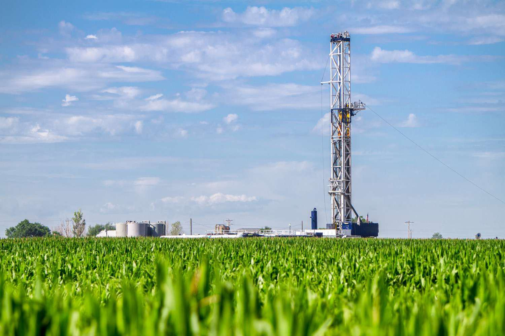

The energy sector is integral to the global economy, playing a decisive role in shaping geopolitical dynamics and influencing economic stability. Within this sector, oil maintains a pivotal position as a primary energy source. Recently, shale oil and oil shale have emerged as prominent topics within the industry. However, they are frequently misunderstood and used interchangeably, despite their distinct characteristics and extraction processes.

Shale oil refers to crude oil that is contained within shale rock formations. Extraction of this resource typically involves advanced methods such as hydraulic fracturing, commonly known as fracking, and horizontal drilling. These techniques have dramatically altered the landscape of oil production, especially in regions like North America, where vast reserves of shale oil have been unlocked, significantly impacting global oil supplies.



Conversely, oil shale is a type of sedimentary rock that contains kerogen, an organic compound that can be converted into synthetic crude oil through retorting, a process of destructive distillation. Unlike shale oil, the extraction and processing of oil shale are less economically viable and pose greater environmental challenges, leading to differing levels of commercial exploitation.

The nuances between shale oil and oil shale not only influence their extraction and utilization but also their economic implications and environmental considerations. Furthermore, as technology progresses, algorithmic trading in the commodities market has gained traction, offering enhanced capabilities for handling market volatility and price fluctuations associated with oil commodities.

This article will explain the distinctions between shale oil and oil shale, discuss their role within the energy sector, and address the growing influence of algorithmic trading on the market dynamics of energy resources. Understanding these aspects is crucial for comprehensively analyzing the decisions made by investors, policymakers, and industry stakeholders in the ever-evolving energy landscape.

## Table of Contents

## Understanding Shale Oil and Oil Shale

Shale oil is extracted from shale rock formations through a technique known as hydraulic fracturing, or fracking. This process involves injecting high-pressure fluid into the rock to create fractures, allowing oil to flow out more readily. Shale oil reservoirs, such as those found in the Bakken in North America, are typically located between layers of impermeable rock, requiring advanced technology to access the oil effectively. The development of hydraulic fracturing has made it economically feasible to tap into these resources, transforming shale oil into a substantial component of global oil production.

In contrast, oil shale is not actually a reservoir of [crude oil](/wiki/crude-oil). Instead, it is a type of sedimentary rock that contains significant amounts of kerogen, a solid organic material. When heated, kerogen decomposes to release liquid hydrocarbons, similar to crude oil. However, extracting oil from oil shale is more complex and less economically viable than extracting shale oil. The process typically involves mining the shale and then subjecting it to pyrolysis at high temperatures, where the kerogen is converted into shale oil.

The distinction lies primarily in the extraction and processing methods. Shale oil extraction has benefited from technological advancements, resulting in lower costs and higher efficiencies. On the other hand, the extraction of oil from oil shale remains experimental and costly, requiring additional steps, such as heating and mining, that substantially raise the costs. As a result, shale oil production tends to be more economically attractive and widely developed compared to oil shale, shaping its substantial role in the energy market today.

## Hydraulic Fracturing: A Game Changer

Hydraulic fracturing, commonly known as fracking, has significantly transformed the landscape of oil extraction, particularly in the context of shale oil. This innovative technique involves injecting a high-pressure fluid mixture composed of water, sand, and chemicals into subterranean rock formations to create small fractures. These fractures enable trapped hydrocarbons to flow more freely, enhancing the extraction process and making previously inaccessible oil and gas reserves economically viable.

The impact of hydraulic fracturing on global oil supplies cannot be overstated. By unlocking vast reserves of shale oil, fracking has bolstered the United States' position as a leading oil producer. According to the U.S. Energy Information Administration (EIA), the introduction and widespread adoption of hydraulic fracturing have enabled the U.S. to achieve energy independence, significantly reducing reliance on imported oil. This shift has also influenced global oil markets, helping to stabilize prices and increase supply security.

Despite its economic advantages, hydraulic fracturing has not been without controversy. Environmental concerns have been raised over potential groundwater contamination, increased seismic activity, and depletion of water resources. The process involves significant water use, raising concerns in areas where water scarcity is an issue. Additionally, the chemicals used in the fracking fluid have prompted public outcry due to potential health risks.

Major energy corporations, such as Halliburton and ExxonMobil, have embraced hydraulic fracturing to enhance their production capabilities and maintain competitive advantage. These companies have invested significantly in research and development to address environmental concerns and improve fracking efficiency. Technologies such as real-time monitoring and adaptive fracking techniques have been developed to minimize environmental impact and enhance resource recovery.

In summary, hydraulic fracturing has become a pivotal technology in the energy sector, revolutionizing oil production and altering global energy dynamics. While it offers substantial economic benefits, the technology continues to evolve to address environmental challenges. Industry stakeholders and regulators are working collaboratively to develop solutions that balance economic interests with the imperative of ecological stewardship.

## Economic Implications of Shale Oil and Oil Shale

Shale oil has demonstrated notable resilience amidst volatile market conditions, playing a significant role in influencing global oil prices. The advancement of extraction techniques, primarily hydraulic fracturing, has enabled the exploitation of shale oil reserves, thereby contributing to a more diversified and stable energy market. However, the economic implications of shale oil are multifaceted, influencing both extraction costs and broader market dynamics.

The extraction of shale oil generally incurs higher costs compared to conventional oil. These increased costs stem from the complex processes involved in hydraulic fracturing and horizontal drilling. According to a 2019 study by the US Energy Information Administration (EIA), the break-even price for new shale oil wells fluctuates between $30 to $50 per barrel, depending on the location and technology used. This range highlights the relatively higher cost structure when contrasted with conventional oil extraction methods, where break-even prices can dip below $20 per barrel in certain low-cost regions.

One of the critical economic implications is the susceptibility of shale oil production to crude price fluctuations. When global crude prices decline significantly, shale oil projects become less economically viable, potentially leading to reduced production. This vulnerability necessitates a careful evaluation of market conditions and future price trends by investors and policymakers. Additionally, the [volatility](/wiki/volatility-trading-strategies) in oil prices can influence investment decisions within the sector, where the prospect of rapid price changes might deter potential investors or shift capital to more stable resources.

Understanding these economic dynamics is crucial for investors and policymakers. For investors, recognizing the higher cost structure and price volatility associated with shale oil provides insight into potential risks and returns. For policymakers, this understanding informs strategic decisions, including the formulation of regulatory frameworks and the promotion of technology advancements to reduce extraction costs. Furthermore, the influence of shale oil on global oil prices underscores its importance in shaping energy policies and geopolitical strategies, especially for countries reliant on oil imports.

In conclusion, while shale oil offers a valuable resource for enhancing energy security and diversifying supply, its economic implications present challenges and opportunities that require informed decision-making by stakeholders across the energy landscape.

## Algorithmic Trading in the Energy Market

Algorithmic trading utilizes computer algorithms to execute trades at speeds and frequencies beyond the capacity of human traders. It hinges on pre-set criteria ranging from timing, price, and quantity, allowing for rapid responses to market movements. This form of trading is increasingly vital in the energy market, characterized by its high volatility and significant price fluctuations of commodities like oil.

In the energy sector, price determinants can include geopolitical events, natural disasters, supply-chain disruptions, and regulatory changes, all contributing to the challenge of predicting market behavior. Algorithmic trading addresses these challenges by using complex models and mathematical tools to analyze vast amounts of data. This data-driven approach allows traders to predict and exploit short-term market inefficiencies and trends.

One common technique used in [algorithmic trading](/wiki/algorithmic-trading) is statistical [arbitrage](/wiki/arbitrage), which involves using quantitative methods to identify pricing inefficiencies between related financial instruments. Traders construct algorithms that can continuously scan the market for these inefficiencies and execute trades accordingly. The following Python snippet illustrates a simplistic approach to identifying such opportunities by comparing historical returns of energy stocks or commodities:

```python
import pandas as pd
import numpy as np

# Example data: historical prices of two related energy stocks
data = pd.DataFrame({
    'Stock_A': [100, 102, 101, 105, 107],
    'Stock_B': [98, 99, 101, 104, 105]
})

# Calculate returns
data['Return_A'] = data['Stock_A'].pct_change()
data['Return_B'] = data['Stock_B'].pct_change()

# Calculate the spread
data['Spread'] = data['Return_A'] - data['Return_B']

# Define thresholds for arbitrage opportunity
upper_threshold = 0.02
lower_threshold = -0.02

# Identify and act on arbitrage opportunities
data['Arbitrage_Opportunity'] = np.where(data['Spread'] > upper_threshold, 'Short A, Long B',
                                         np.where(data['Spread'] < lower_threshold, 'Long A, Short B', 'No Action'))

print(data)
```

The volatile nature of commodities such as oil increases the necessity for speed and precision in trades, areas where algorithmic trading excels. This volatility arises from various factors, such as changes in supply and demand, economic indicators, and unexpected geopolitical factors, making oil prices notoriously unpredictable. Algorithms that can swiftly analyze vast datasets and execute trades within milliseconds provide a significant competitive advantage in such an environment.

Furthermore, algorithmic trading in the energy market aids in the efficient dissemination of market information and helps improve [liquidity](/wiki/liquidity-risk-premium), potentially leading to more stable prices over time. As technology progresses and data becomes more abundant, the reliance on algorithmic trading is set to grow, adding layers of sophistication to trading strategies and potentially reshaping market behaviors.

## The Future of Energy Resources

The future of energy resources, particularly shale oil and oil shale, is set to undergo significant transformation driven by technological advancements and exploratory initiatives. Continuous improvements in drilling techniques, such as horizontal drilling and hydraulic fracturing, have made it feasible to access previously unreachable resources. The integration of advanced technologies like [artificial intelligence](/wiki/ai-artificial-intelligence) and [machine learning](/wiki/machine-learning) is enhancing the efficiency of energy extraction and management processes, providing a nuanced understanding of geological formations and optimizing drilling operations.

Emerging markets are increasingly pivotal in the future landscape of shale oil and oil shale. Countries with untapped reserves are investing in infrastructure and technology to exploit these resources, potentially diversifying the global supply chain and reducing dependency on traditional oil-rich regions. Regulatory frameworks in these emerging markets will play a crucial role; governments need to strike a balance between encouraging economic growth through resource exploitation and imposing environmental safeguards.

Sustainability is becoming a central concern for the future development of shale oil and oil shale. The extraction and processing of these resources pose environmental challenges, including water usage, land disruption, and greenhouse gas emissions. To mitigate these effects, companies are investing in research to develop more sustainable extraction methods. For instance, the industry is exploring ways to reduce water consumption and minimize the carbon footprint of extraction processes. The adoption of cleaner technologies will be imperative to meet both regional and international environmental standards.

In addition to technological innovation, the future dynamics of shale oil and oil shale will be shaped by policy reforms and regulatory landscapes. As countries commit to reducing carbon emissions as part of international agreements like the Paris Accord, there will be increased pressure to innovate and transition towards more sustainable energy sources. Governments may impose carbon pricing or stricter emissions regulations, influencing how companies plan their long-term strategies.

In summary, the continuing evolution of technology and regulatory frameworks will define the trajectory of shale oil and oil shale resources. By addressing sustainability and environmental concerns, the energy sector can better position itself to meet the growing global demand while maintaining ecological integrity. Key stakeholders, including governments and energy companies, will need to collaborate to ensure that these resources contribute positively to the energy mix of the future.

## Conclusion

Understanding the nuances between shale oil and oil shale is vital for comprehending their impact on the energy sector. Shale oil, extracted through hydraulic fracturing, or fracking, has reshaped global energy markets by significantly increasing oil production. In contrast, oil shale—a sedimentary rock containing kerogen—requires extensive processing to derive usable oil, representing a distinct, albeit less developed, energy source.

Algorithmic trading provides a tool for navigating the complexities of the commodities market. It harnesses sophisticated computer algorithms to conduct trades at speeds and scales unfathomable with traditional methods. This technology is particularly valuable in the energy market, where the volatile nature of commodities such as oil presents opportunities and risks. By using algorithms to forecast price movements and manage vast datasets, investors can execute trades more efficiently and potentially maximize returns.

As the global demand for energy evolves, so too will the strategies implemented to balance economic and environmental priorities. Advancements in extraction technologies, market dynamics, and regulatory frameworks will continue to shape the role of shale oil and oil shale. Meanwhile, sustainability concerns and the push towards greener energy sources necessitate a prudent approach to resource development. Understanding these dynamics will be crucial for stakeholders aiming to navigate the complexities of the energy sector while fostering a harmonious balance between economic growth and environmental stewardship.

## References & Further Reading

[1]: Clark, C. (2009). ["Oil Shale and Tar Sands: Programmatic EIS Information Center"](https://libguides.mines.edu/TellErtlOilShale). U.S. Department of Energy.

[2]: Wang, Z., Lattanzio, R. K., & Ratner, M. (2016). ["U.S. Crude Oil and Natural Gas Production in Federal and Nonfederal Areas"](https://pubmed.ncbi.nlm.nih.gov/10648866/). Congressional Research Service.

[3]: Kerr, R. A. (2010). ["Natural Gas from Shale Bursts Onto the Scene"](https://www.science.org/doi/10.1126/science.328.5986.1624). Science, 328(5986), 1624-1626.

[4]: ["The Prize: The Epic Quest for Oil, Money & Power"](https://www.amazon.com/Prize-Epic-Quest-Money-Power/dp/1439110123) by Daniel Yergin.

[5]: ["Advanced Oil Well Drilling Engineering: Handbook"](https://www.osti.gov/biblio/6939049) by Program Committee of the 1981 Society of Petroleum Engineers.

[6]: Lefebvre, B. (2019). ["Algorithmic Trading in Commodities Markets"](https://www.researchgate.net/publication/378548435_Algorithmic_Trading_and_AI_A_Review_of_Strategies_and_Market_Impact). Wiley.

[7]: ["Shale Gas and Fracking: The Science Behind the Controversy"](https://www.sciencedirect.com/book/9780128016060/shale-gas-and-fracking) by Michael Stephenson.

[8]: U.S. Environmental Protection Agency (EPA). ["Assessment of the Potential Impacts of Hydraulic Fracturing for Oil and Gas on Drinking Water Resources"](https://www.epa.gov/sites/production/files/2016-02/documents/hydrofracking-assessment.pdf).

[9]: ["Trading and Exchanges: Market Microstructure for Practitioners"](https://wclc2018.iaslc.org/public/virtual-library/Documents/Trading_And_Exchanges_Market_Microstructure_For_Practitioners.pdf) by Larry Harris.