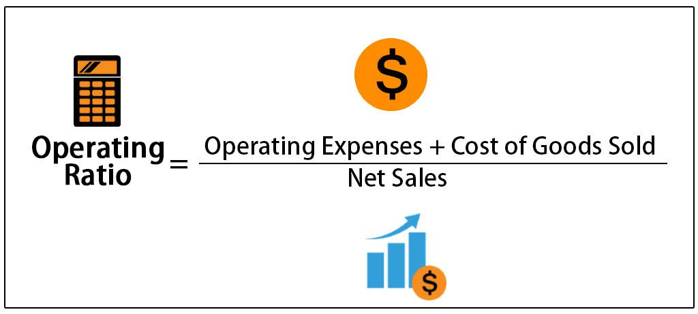

## Table of Contents

## What are operating expenses?

Operating expenses are the costs a business has to pay to keep running day-to-day. These costs include things like rent for the office, salaries for employees, utility bills, and the cost of supplies. These expenses are necessary for the business to function, but they don't directly contribute to making the product or service the business sells.

For example, if a company makes toys, the cost of the plastic and paint used to make the toys would not be an operating expense. Instead, those costs would be part of the cost of goods sold. Operating expenses are different because they are the costs of running the business itself, not the costs of making the product. Keeping track of operating expenses is important because it helps a business understand how much it costs to operate and how to manage its money better.

## What is the cost of goods sold?

The cost of goods sold, or COGS, is the total cost of making or buying the products that a business sells. This includes the cost of the materials used to make the product, like the plastic in a toy, and the labor costs to make it. If a business buys products to sell, like a store buying clothes, then COGS is what they paid for those clothes.

Knowing the cost of goods sold is important for a business because it helps them figure out how much profit they are making. To find out the profit, a business subtracts the COGS from the revenue, which is the money made from selling the products. If a toy company sells a toy for $20 and it cost them $10 to make, their profit is $10 per toy. This information helps businesses set prices and plan for the future.

## How do operating expenses and cost of goods sold appear on the income statement?

On an income statement, the cost of goods sold (COGS) is usually shown right after the revenue. It's subtracted from the revenue to find the gross profit. This shows how much money the business made from selling its products after paying for what it cost to make or buy them. For example, if a business made $100,000 from sales and it cost them $60,000 to make those products, the gross profit would be $40,000.

Operating expenses come next on the income statement, after the gross profit. They are subtracted from the gross profit to find the operating profit or earnings before interest and taxes (EBIT). Operating expenses include things like rent, salaries, and utilities. So, if the business had operating expenses of $20,000, the operating profit would be $20,000 ($40,000 gross profit minus $20,000 operating expenses). This shows how much money the business has left after paying for both the cost of goods sold and the costs of running the business.

## Can you give examples of operating expenses?

Operating expenses are the costs that a business has to pay to keep running every day. Some examples of operating expenses include the rent for the office or store where the business operates. If a business has a physical location, they need to pay rent to use that space. Another example is the salaries of employees. Businesses need to pay their workers to do their jobs, whether they are in sales, customer service, or management. Utility bills, like electricity, water, and internet, are also operating expenses. These are necessary to keep the business running smoothly.

Other operating expenses include the cost of office supplies, like paper, pens, and printer ink. Businesses use these supplies every day to do their work. Marketing and advertising costs are also operating expenses. These costs help the business reach more customers and sell more products. Finally, there are maintenance and repair costs. These are the costs to fix things that break or to keep equipment working well. All of these expenses are important for the day-to-day operations of a business, but they don't directly contribute to making the product or service the business sells.

## Can you provide examples of costs included in the cost of goods sold?

The cost of goods sold, or COGS, includes the costs that go into making the products a business sells. For example, if a company makes furniture, the cost of the wood and the screws they use to build the furniture would be part of COGS. The labor costs of the workers who actually make the furniture are also included. If the business buys the furniture from another company to sell, then the price they paid to buy it is part of COGS.

There are other costs that might be included in COGS too. For instance, if the business needs to store the furniture before selling it, the cost of that storage space could be part of COGS. Also, if the furniture needs to be shipped from the factory to the store, the shipping costs would be included. All these costs add up to what it takes to get the product ready to sell, and that's what COGS is all about.

## How do operating expenses affect a company's profitability?

Operating expenses directly affect a company's profitability because they are the costs of running the business every day. When a company has high operating expenses, it means they have less money left over after paying for these costs. This can make it harder for the company to make a profit. For example, if a company's revenue is $100,000 and their operating expenses are $80,000, they only have $20,000 left to cover other costs and make a profit. If they can lower their operating expenses to $60,000, they would have $40,000 left, which is a lot more to work with.

Managing operating expenses well can help a company be more profitable. If a company can find ways to reduce costs like rent, salaries, or utility bills, they can keep more of their revenue as profit. This might mean moving to a cheaper office, using energy-efficient equipment, or finding ways to work more efficiently. By keeping operating expenses low, a company can improve its bottom line and have more money to invest in growing the business or rewarding its shareholders.

## How does the cost of goods sold impact gross profit?

The cost of goods sold, or COGS, is how much it costs to make or buy the things a business sells. When a business sells something, they get money from the sale, which is called revenue. To find out the gross profit, you take the revenue and subtract the COGS. So, if a business sells a toy for $20 and it cost them $10 to make, their gross profit is $10. The gross profit shows how much money the business made just from selling their products, before paying for other costs like rent or salaries.

If the COGS goes up, the gross profit goes down. This means if it costs more to make or buy the products, there's less money left over after the sale. For example, if the cost to make the toy goes up to $15, then the gross profit from selling it for $20 would only be $5. Keeping the COGS low is important because it helps the business have a higher gross profit, which they can then use to pay for other expenses and hopefully make a good profit at the end of the day.

## What are the tax implications of operating expenses versus cost of goods sold?

When it comes to taxes, both operating expenses and the cost of goods sold can be subtracted from a business's income. This means they can lower the amount of money the business has to pay taxes on. But they are treated a little differently. The cost of goods sold is taken out of the business's revenue right away to find the gross profit. This means it directly affects how much taxable income the business has before other expenses are even considered.

Operating expenses are also subtracted from the business's income, but they come after the cost of goods sold on the income statement. They are taken out of the gross profit to find the operating profit. This means operating expenses still lower the business's taxable income, but they do it after the cost of goods sold has already been subtracted. Both help the business pay less in taxes, but the cost of goods sold has a more immediate impact on the taxable income because it's subtracted first.

## How do businesses categorize expenses between operating expenses and cost of goods sold?

Businesses categorize expenses between operating expenses and cost of goods sold based on what the expenses are for. Operating expenses are the costs needed to keep the business running day to day. These include things like rent for the office, salaries for employees, utility bills, and the cost of office supplies. These expenses are important for the business to operate, but they don't directly go into making the product or service the business sells.

On the other hand, the cost of goods sold, or COGS, includes the costs that are directly related to making or buying the products that the business sells. For example, if a company makes toys, the cost of the plastic and paint used to make the toys would be part of COGS. The labor costs of the workers who make the toys are also included. If the business buys products to sell, like a store buying clothes, then the price they paid for those clothes is part of COGS. This way, businesses can clearly see how much it costs to make or buy what they sell, separate from the costs of running the business.

## What strategies can businesses use to manage operating expenses?

Businesses can manage operating expenses by looking for ways to spend less money on the costs of running the business every day. One way to do this is by negotiating better deals with suppliers or service providers, like getting a lower rent for the office or cheaper utility rates. Another strategy is to use technology to make things more efficient. For example, using energy-efficient equipment can lower utility bills, and using software to automate tasks can reduce the need for as many employees, which can lower salary costs.

Another approach is to regularly review and cut unnecessary expenses. This might mean getting rid of subscriptions or services the business doesn't really need, or finding cheaper alternatives for things like office supplies. It's also important for businesses to keep an eye on their spending and make a budget to plan how much they will spend on operating expenses. By sticking to this budget, businesses can control their costs better and make sure they are not spending more than they need to.

## How can a company optimize its cost of goods sold?

A company can optimize its cost of goods sold by finding ways to make or buy their products for less money. One way to do this is by finding cheaper suppliers for the materials they need. For example, if a company makes toys and the plastic they use costs too much, they might look for a different supplier who can give them a better price. Another way is to make the production process more efficient. This could mean using machines to do the work faster or training workers to do their jobs better, so it takes less time and money to make each product.

It's also important for a company to keep track of how much it costs to make each product. By knowing these costs, they can see where they might be spending too much and find ways to save money. For instance, if a company notices that shipping costs are high, they might try to find a cheaper way to get their products from the factory to the store. By always looking for ways to lower the cost of goods sold, a company can make more money from each sale and have a higher profit.

## What are the advanced accounting treatments for operating expenses and cost of goods sold in different industries?

In different industries, the way businesses account for operating expenses and cost of goods sold can vary a lot. For example, in manufacturing, operating expenses might include costs like machine maintenance and quality control, which are crucial for keeping the factory running smoothly. These costs are usually recorded as they happen and are spread out over time if they benefit the business over a long period, like depreciation on equipment. On the other hand, the cost of goods sold in manufacturing includes the direct costs of making the product, like raw materials and direct labor. These costs are tracked carefully because they directly affect the price of each item produced, and they are matched with the revenue from selling those items to show the gross profit.

In the service industry, operating expenses can be quite different. They might include costs like employee training and software subscriptions, which are essential for delivering high-quality service. These costs are usually expensed as they occur because they don't create a long-term asset. The cost of goods sold in the service industry is less common, but when it exists, it might include the cost of materials used directly in providing the service, like cleaning supplies for a cleaning company. These costs are also matched with the revenue from the service to determine the gross profit, but the focus is more on managing operating expenses to maintain profitability.

In retail, operating expenses include costs like store rent and employee wages, which are essential for keeping the store open and serving customers. These costs are usually expensed as they are incurred. The cost of goods sold in retail is the cost of buying the products that are sold in the store. Retailers need to manage this cost carefully because it directly impacts their gross profit. They might use methods like inventory valuation techniques, such as FIFO (First In, First Out) or LIFO (Last In, First Out), to account for the cost of goods sold, which can affect their financial statements and tax liabilities. Each industry has its own way of handling these costs, but the goal is always the same: to manage expenses in a way that maximizes profitability.

## References & Further Reading

[1]: Bergstra, J., Bardenet, R., Bengio, Y., & Kégl, B. (2011). ["Algorithms for Hyper-Parameter Optimization."](https://dl.acm.org/doi/10.5555/2986459.2986743) Advances in Neural Information Processing Systems 24.

[2]: ["Advances in Financial Machine Learning"](https://www.amazon.com/Advances-Financial-Machine-Learning-Marcos/dp/1119482089) by Marcos Lopez de Prado

[3]: ["Evidence-Based Technical Analysis: Applying the Scientific Method and Statistical Inference to Trading Signals"](https://www.amazon.com/Evidence-Based-Technical-Analysis-Scientific-Statistical/dp/0470008741) by David Aronson

[4]: ["Machine Learning for Algorithmic Trading"](https://github.com/stefan-jansen/machine-learning-for-trading) by Stefan Jansen

[5]: ["Quantitative Trading: How to Build Your Own Algorithmic Trading Business"](https://www.amazon.com/Quantitative-Trading-Build-Algorithmic-Business/dp/1119800064) by Ernest P. Chan